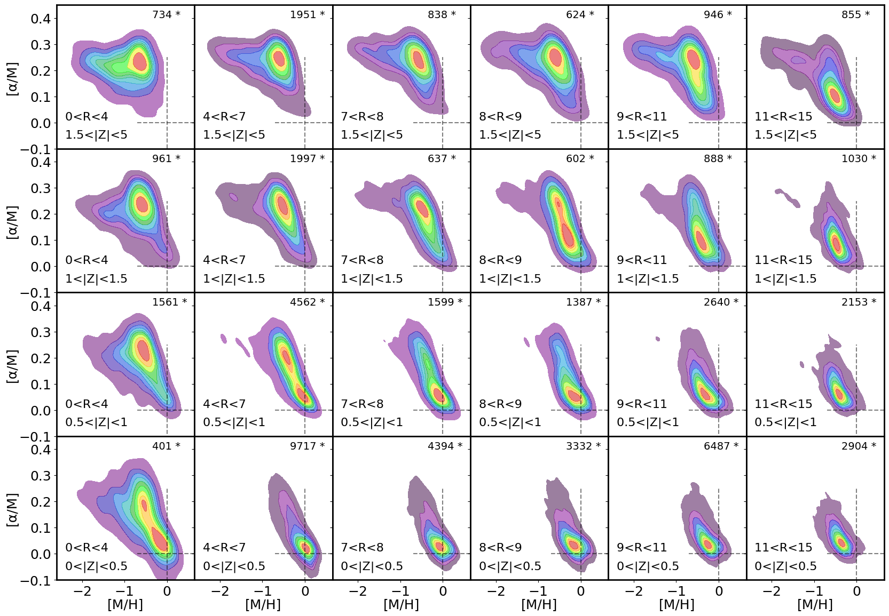

$\newcommand{\ensuremath}{}$
$\newcommand{\xspace}{}$
$\newcommand{\object}[1]{\texttt{#1}}$
$\newcommand{\farcs}{{.}''}$
$\newcommand{\farcm}{{.}'}$
$\newcommand{\arcsec}{''}$
$\newcommand{\arcmin}{'}$
$\newcommand{\ion}[2]{#1#2}$
$\newcommand{\textsc}[1]{\textrm{#1}}$
$\newcommand{\hl}[1]{\textrm{#1}}$
$\newcommand{\footnote}[1]{}$
$\newcommand{\feh}{[Fe/H]}$
$\newcommand{\zmax}{\langle Z_{\rm{max}} \rangle}$
$\newcommand{\eccentricity}{\langle e \rangle}$
$\newcommand{\aj}{AJ}$
$\newcommand{\araa}{ARA\&A}$
$\newcommand{\apj}{ApJ}$
$\newcommand{\apjl}{ApJ}$
$\newcommand{\apjs}{ApJS}$
$\newcommand{\apss}{Ap\&SS}$
$\newcommand{\aap}{A\&A}$
$\newcommand{\aapr}{A\&A~Rev.}$
$\newcommand{\aaps}{A\&AS}$
$\newcommand{\mnras}{MNRAS}$
$\newcommand{\pasp}{PASP}$
$\newcommand{\pasj}{PASJ}$
$\newcommand{\qjras}{QJRAS}$
$\newcommand{\nat}{Nature}$
$\newcommand{\aplett}{Astrophys.~Lett.}$
$\newcommand{\aas}{AAS}$
$\newcommand{\eprint}{e--print}$

# Realising the potential of largespectroscopic surveys with machine-learning

<mark>Appeared on: 2025-03-12</mark> -  _To appear in the proceedings of IAU Symposium 395 (4 pages, 1 figure); IAU Symposium 395 Proceedings, 2025_

<mark>G. Guiglion</mark>

**Abstract:** Machine-learning is playing an increasing role in helping the astronomical community to face data analysis challenges, in particular in the field of Galactic Archaeology and large scale spectroscopic surveys. We present recent developments in the field of convolutional neural-networks (CNNs) for stellar abundances in the context of the Galactic spectroscopic surveys $*Gaia*$ -ESO, and $*Gaia*$ -RVS. Especially, by combining the full $*Gaia*$ data product, we manage to characterize for the first time the [ $\alpha$ /M ] vs. [ M/H ] bimodality in the Galactic disc with $*Gaia*$ -RVS spectra at low-S/N. This work is highly relevant for the next generation of large scale surveys such as MSE, 4MOST, and WST.

**Figure 1. -** Two-dimensional histograms and contours of [$\alpha$/M] vs. [M/H] in 53 200 giants of the *Gaia*-RVS observed sample from \citet{Guiglion2024} with 15$<$S/N$<$25 and log(g)$<$2.2 within the training set limits. Stars are plotted in kiloparsec bins of galactocentric radius (R) and height above the Galactic plane (Z). (*fig:li*)

