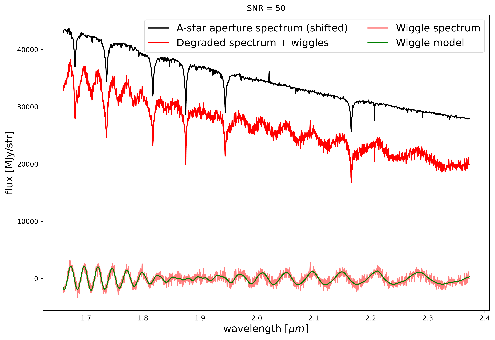
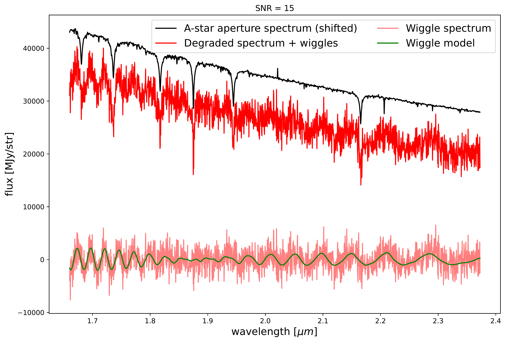
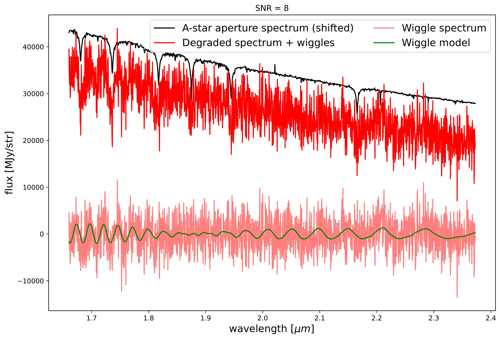
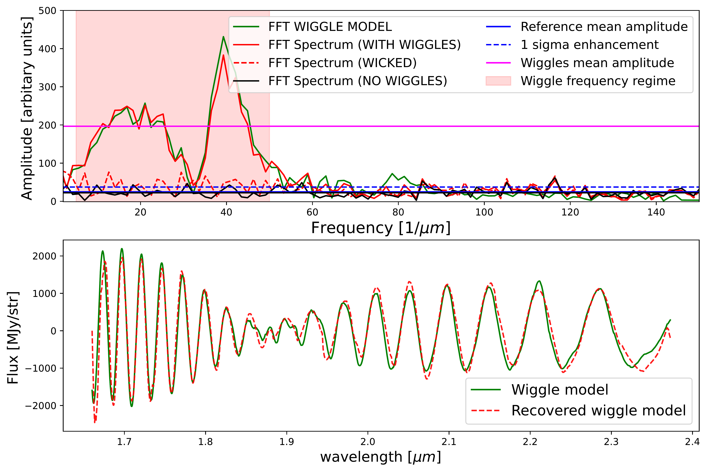
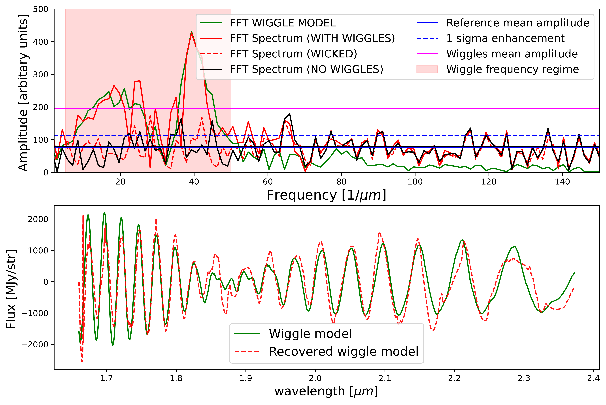
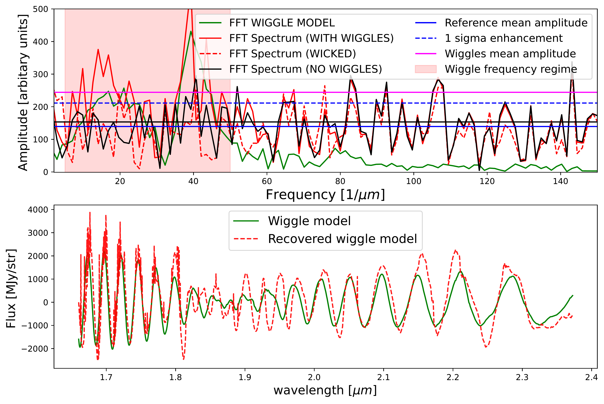
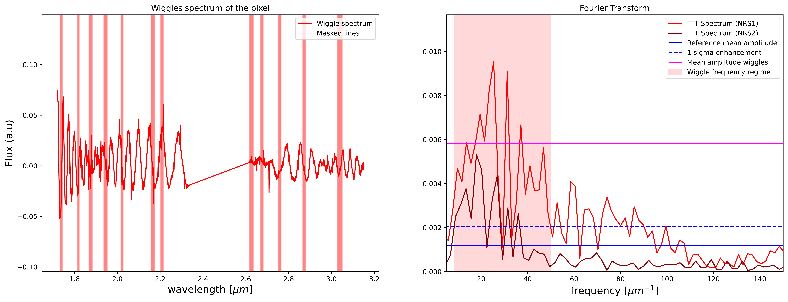
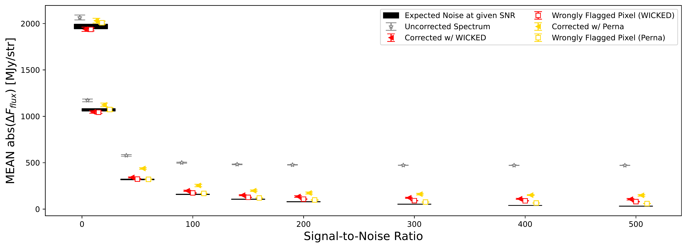

$\newcommand{\ensuremath}{}$
$\newcommand{\xspace}{}$
$\newcommand{\object}[1]{\texttt{#1}}$
$\newcommand{\farcs}{{.}''}$
$\newcommand{\farcm}{{.}'}$
$\newcommand{\arcsec}{''}$
$\newcommand{\arcmin}{'}$
$\newcommand{\ion}[2]{#1#2}$
$\newcommand{\textsc}[1]{\textrm{#1}}$
$\newcommand{\hl}[1]{\textrm{#1}}$
$\newcommand{\footnote}[1]{}$
$\newcommand{\vdag}{(v)^\dagger}$
$\newcommand$
$\newcommand$
$\newcommand{\orcid}[1]{\protect\href{https://orcid.org/#1}{\protect\includegraphics[width=8pt]{orcid.png}}}$

# $_ WI_$ggle $_ C_$orrector $_ K_$it for NIRSp$_ E_$c $_ D_$ata: WICKED

<mark>Appeared on: 2025-03-14</mark> -  _Submitted to A&A_

<mark>A. Dumont</mark>, et al. -- incl., <mark>N. Neumayer</mark>

**Abstract:** $_ Context:_$ The point-spread function of the integral-field unit (IFU) mode of the Near-Infrared Spectrograph (NIRSpec) detector of JWST is heavily under-sampled. The resampling of the spectra into a 3D data cube creates resampling noise seen as low-frequency sinusoidal-like artifacts, or "wiggles". These artifacts in the data are not corrected in the JWST data pipeline, and significantly impact the science that can be achieved at a single-pixel level. $_ Aims:_$ Here we present the tool " $_ WI_$ ggle $_ C_$ orrector $_ K_$ it for NIRSp $_ E_$ c $_ D_$ ata" ( ${\sc WICKED}$ ), designed to remove these artifacts. While fully characterizing wiggles requires forward modeling of the instrument response, ${\sc WICKED}$ offers a faster, computationally efficient alternative using an empirical correction. $_ Methods:_$ ${\sc WICKED}$ uses the  Fast Fourier Transform to identify wiggle-affected spaxels across the (IFU) data cube. Spectra are modeled with a mix of integrated aperture and annular templates, a power-law, and a second-degree polynomial, avoiding high-degree polynomials that distort spectral features. Our correction works across all medium and high-resolution NIRSpec gratings: F070LP, F100LP, F170LP, and F290LP. $_ Results:_$ ${ \sc WICKED}$ can recover the true overall spectral shape up to a factor of 3.5 $\times$ better compared to uncorrected spectra. It recovers the equivalent width of  absorption lines within 5 \% of the true value \textemdash $\sim$ 3 $\times$ better than uncorrected spectra and $\sim2\times$ better than other methods. ${\sc WICKED}$ significantly improves kinematic measurements, recovering the line-of-sight velocity (LOSV) within 1 \% of the true value \textemdash more than $100\times$ better than uncorrected spectra at S/N $\sim$ 40 . The superior wiggle-removal capabilities of ${\sc WICKED}$ also reduces the LOSV uncertainties by $\sim$ 50 \% compared to other methods. As a case study, we applied ${\sc WICKED}$ to G235H/F170LP IFU data of the elliptical galaxy NGC 5128, finding good agreement with previous studies. In wiggle-affected regions, the uncorrected spectrum showed stellar LOSV and velocity dispersion differences compared to the ${\sc WICKED}$ -cleaned spectrum, of $\sim$ 17 $\times$ and $\sim$ 36 $\times$ larger than the estimated uncertainties, respectively. $_ Conclusions:_$ ${Wiggles in NIRSpec IFU data can significantly distort the overall spectral shape, bias line measurements and kinematics to values larger than the expected uncertainties for uncorrected spectra. \sc WICKED}$ is a robust, user-friendly solution for mitigating wiggles in NIRSpec data. Unlike other methods, it minimizes residual artifacts, enabling precise single-pixel studies, enhancing JWST’s potential for groundbreaking discoveries in galaxy kinematics and early universe studies.

**Figure 3. -** Comparison of the spectrum of the A-star J1757132 (top, black) and the degraded spectrum (top, red) with the added wiggle model (green) at _ S/N_ ratios of $50$, $15$ and $8$.
_ Middle:_ the Fourier spectra of i) the degraded spectrum (solid, red), ii) the wiggle model (green), iii) the degraded spectrum without wiggles (black), and iv) the data corrected with {\sc WICKED}(dashed, red).
The horizontal lines mark the mean amplitude of the Fourier spectrum at frequencies dominated by wiggles and at larger frequencies. The Fourier ratio can effectively distinguish wiggles from noise down to a _ S/N_ ratio of $\sim 8$. _ Bottom:_ comparison of the input wiggle model (green) versus the recovered wiggle spectrum for the data cleaned with {\sc WICKED}. (*fig:FFT_test_SNR*)

**Figure 2. -** The Fast Fourier Transform is used in {\sc WICKED} to flag spaxels in the data cube affected by wiggles. The built-in method {\sc plot\_wiggle\_FFT} in WICKED allows for manual examination of the spectrum and its Fourier transform for a specific spaxel in the datacube.
    Left panel shows the wiggle spectrum, created by subtracting the spectrum from the best-fit model. Right panel shows the Fourier transform of the wiggle spectrum. The solid fuchsia line represents the mean amplitude in the wiggle-dominated part of the spectrum (shaded red region). WICKED flags spaxels by comparing this value to the standard deviation (blue dashed line). If data from both NRS detectors are available, as in this case, WICKED determines which part of the spectrum shows the most prominent wiggles and bases the flagging on that part of the spectrum.
     (*fig:FFT-example*)

**Figure 5. -** Comparison of the mean difference flux respect to the aperture spectrum of the A-star J175713. The black rectangles represent the minimum expected the flux difference at a given _ S/N_ ratio. The spectra corrected using {\sc WICKED}(solid red) shows the smallest mean flux difference compared to the uncorrected spectrum (gray) and the spectrum clean using the method by [Perna, Arribas and Marshall (2023)]()(solid yellow) at all _ S/N_.   (*fig:MeanDiff_vs_SNR*)

