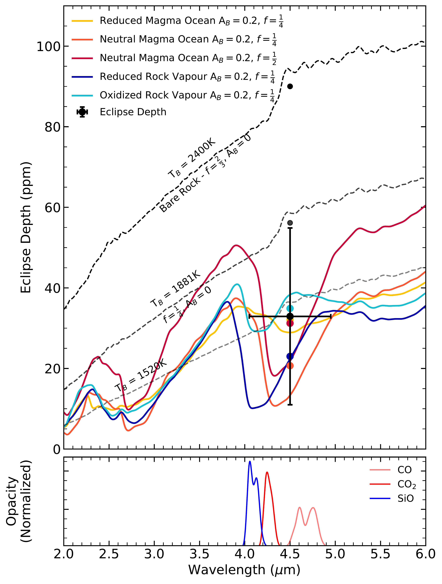
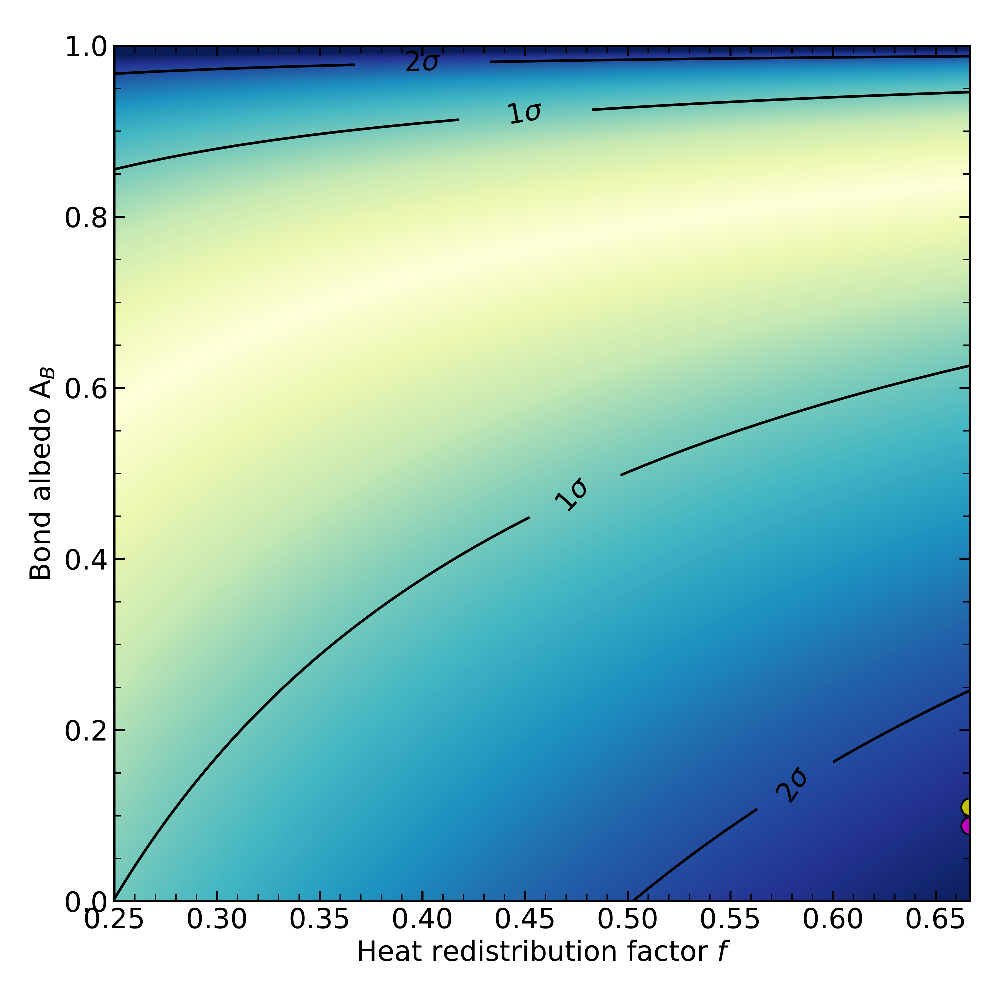
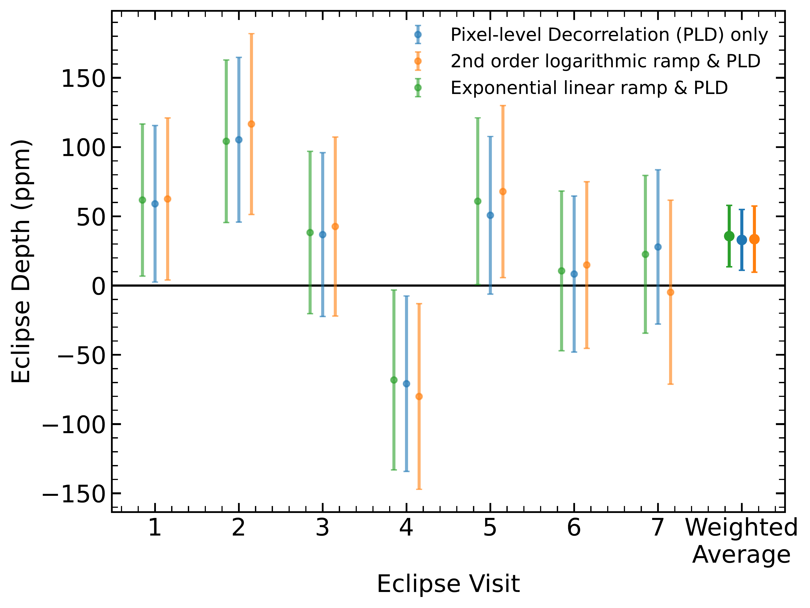

$\newcommand{\ensuremath}{}$
$\newcommand{\xspace}{}$
$\newcommand{\object}[1]{\texttt{#1}}$
$\newcommand{\farcs}{{.}''}$
$\newcommand{\farcm}{{.}'}$
$\newcommand{\arcsec}{''}$
$\newcommand{\arcmin}{'}$
$\newcommand{\ion}[2]{#1#2}$
$\newcommand{\textsc}[1]{\textrm{#1}}$
$\newcommand{\hl}[1]{\textrm{#1}}$
$\newcommand{\footnote}[1]{}$
$\newcommand{\vdag}{(v)^\dagger}$
$\newcommand$
$\newcommand$

# $\large{Low 4.5$ \mu$m  Dayside Emission Disfavors a Dark Bare-Rock scenario\ for the Hot Super-Earth TOI-431 b}$

<mark>Appeared on: 2025-03-14</mark> -  _14 pages, 5 figures, accepted for publication in The Astronomical Journal_

C. Monaghan, et al. -- incl., <mark>I. J. M. Crossfield</mark>, <mark>L. Kreidberg</mark>

**Abstract:** The full range of conditions under which rocky planets can host atmospheres remains poorly understood, especially in the regime of close-in orbits around late-type stars. One way to assess the presence of atmospheres on rocky exoplanets is to measure their dayside emission as they are eclipsed by their host stars. Here, we present Spitzer observations of the 4.5 µm secondary eclipses of the rocky super-Earth TOI-431 b, whose mass and radius indicate an Earth-like bulk composition (3.07 $\pm 0.35$ M $_{\oplus}$ , 1.28 $\pm 0.04$ R $_{\oplus}$ ). Exposed to more than 2000 times the irradiation of Earth, dayside temperatures of up to 2400 K are expected if the planet is a dark bare-rock without a significant atmosphere. Intriguingly, despite the strong stellar insolation, we measure a secondary eclipse depth of only 33 $\pm$ 22 ppm, which corresponds to a dayside brightness temperature of $1520_{-390}^{+360}$ K. This notably low eclipse depth disagrees with the dark bare-rock scenario at the 2.5 $\sigma$ level, and suggests either that the planet is surrounded by an atmosphere, or that it is a bare-rock with a highly reflective surface. In the atmosphere scenario, the low dayside emission implies the efficient redistribution of heat to the nightside, or by molecular absorption in the 4--5 $\mu$ m bandpass. In the bare-rock scenario, a surface composition made of a high-albedo mineral species such as ultramafic rock can lead to reduced thermal emission consistent with low eclipse depth measurement. Follow-up spectroscopic observations with the James Webb Space Telescope hold the key to constraining the nature of the planet.

**Figure 5. -** Eclipse depth of TOI-431 b at 4.5 µm compared to a suite of theoretical emission spectra produced by SCARLET. The coloured lines represent the five atmospheric models simulated by SCARLET using a non-gray temperature profile and a well-mixed composition. The dashed gray lines show the blackbody eclipse spectra corresponding to different combinations of $f$ and A$_{B}$ at uniform dayside temperatures. The black dot represents the measured eclipse depth, with the associated $\pm1\sigma$ error bars. Coloured circles represent the models integrated over the IRAC2 bandpass between 4.05 and 4.95  µm. The exact compositions of the atmospheric models are shown in Table \ref{tab:models}. Normalized opacity bands from dominating molecules in the models (CO, CO$_{2}$, and SiO) are shown in the bottom panel. (*fig:atmospheremodels*)

**Figure 3. -** Joint posterior distribution of the Bond albedo A$_{B}$(vertical axis) and heat redistribution factor $f$(horizontal axis) assuming TOI-431 b radiates as blackbody at its 4.5 µm brightness temperature of $1520$K. The 2D posterior is shown using colored shading, where darker regions indicate lower probabilities. The 1$\sigma$ and 2$\sigma$ regions are indicated by the black contour lines. The approximate values for the Moon and Mercury are shown in yellow and magenta at the bottom right, respectively. (*fig:blackbodyAbF*)

**Figure 1. -** Measured eclipse depths for all seven visits using three different systematic models, including the associated error bars of each. The rightmost points show the weighted average across all visits for the individual systematics. (*fig:systematicscomparison*)

