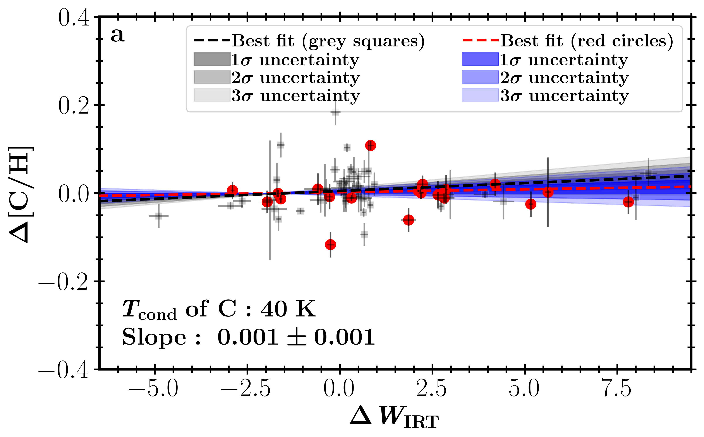
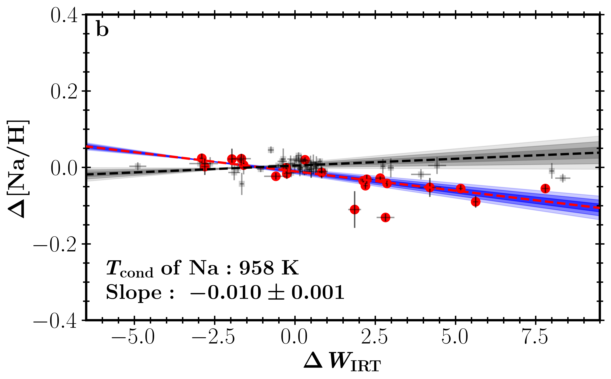
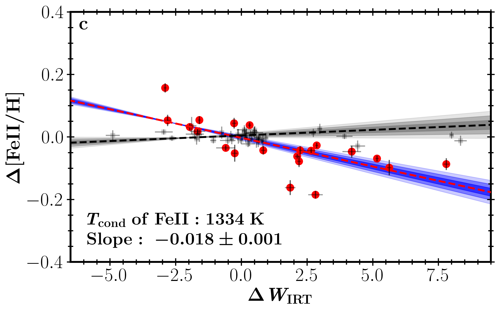
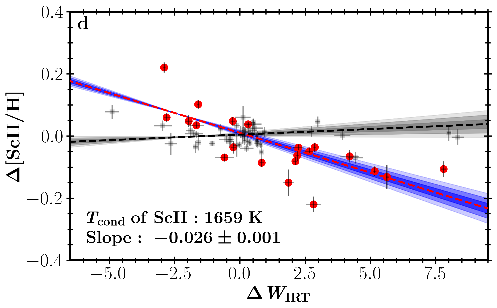
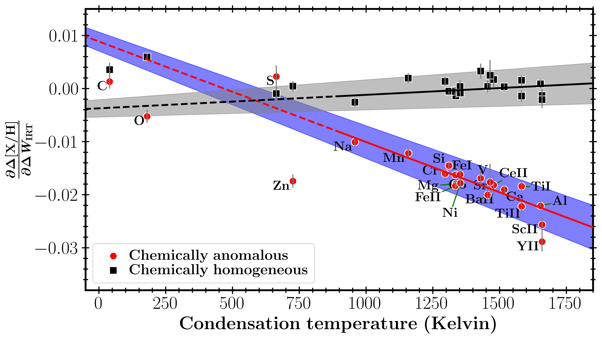
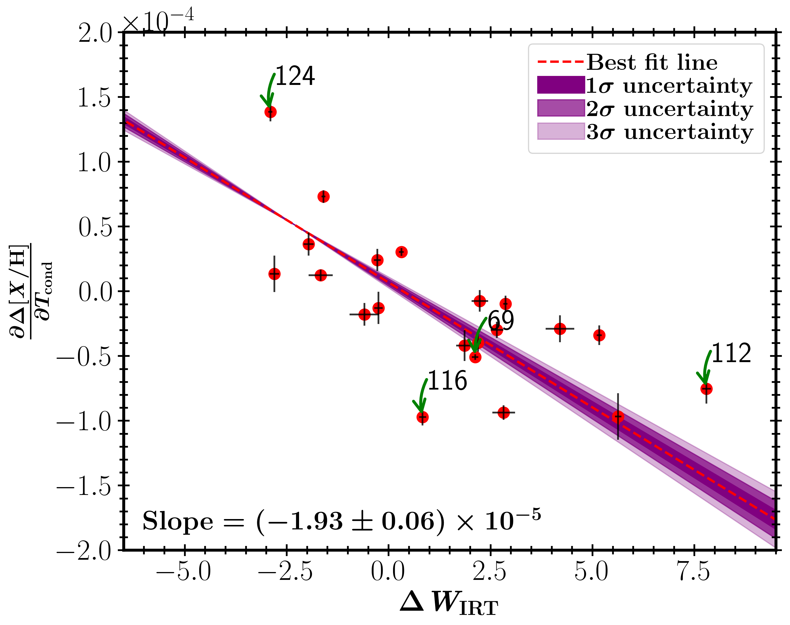

$\newcommand{\ensuremath}{}$
$\newcommand{\xspace}{}$
$\newcommand{\object}[1]{\texttt{#1}}$
$\newcommand{\farcs}{{.}''}$
$\newcommand{\farcm}{{.}'}$
$\newcommand{\arcsec}{''}$
$\newcommand{\arcmin}{'}$
$\newcommand{\ion}[2]{#1#2}$
$\newcommand{\textsc}[1]{\textrm{#1}}$
$\newcommand{\hl}[1]{\textrm{#1}}$
$\newcommand{\footnote}[1]{}$
$\newcommand{\myslash}{\operatorname{/}}$
$\newcommand{\myleftbracket}{\left[}$
$\newcommand{\myrightbracket}{\right]}$
$\newcommand{\highlight}[1]{\textcolor{black}{\textnormal{{#1}}}}$
$\newcommand{\vdag}{(v)^\dagger}$
$\newcommand$
$\newcommand$
$\newcommand{\teff}{\mbox{T_{\text{eff}}}}$
$\newcommand{\msun}{\mbox{M_{\odot}}}$
$\newcommand{\logg}{\mbox{\log g}}$
$\newcommand{\feh}{\mbox{[Fe/H]}}$
$\newcommand{\vsini}{\mbox{v \text{sin} i}}$
$\newcommand{\logrhk}{\mbox{\log R^{\prime}_{\text{HK}}}}$
$\newcommand{\alpham}{\mbox{[\rm \alpha/M]}}$
$\newcommand{\yar}{\mbox{young \alpha--rich}}$
$\newcommand{\yap}{\mbox{young \alpha--poor}}$
$\newcommand{\oar}{\mbox{old \alpha--rich}}$
$\newcommand{\halpha}{\mbox{H_{\alpha}}}$
$\newcommand{\primerhk}{\mbox{R^{\prime}_{\textrm{HK}}}}$
$\newcommand{\rhk}{\mbox{R_{\textrm{HK}}}}$
$\newcommand{\rhkphot}{\mbox{R_{\textrm{HK,phot}}}}$
$\newcommand{\dwirt}{\mbox{\Delta W_{\textrm{IRT}}}}$
$\newcommand{\dsindex}{\mbox{\Delta S_{\textrm{HK}}}}$
$\newcommand{\dfeh}{\mbox{\Delta[\textrm{Fe/H]}}}$
$\newcommand{\sigmafeh}{\mbox{\sigma_{[\textrm{Fe/H]}}}}$
$\newcommand{\sindex}{\mbox{S_{\textrm{HK}}}}$
$\newcommand{\dxh}{\mbox{\Delta[\textit{X}/\textrm{H}]}}$
$\newcommand{\dxo}{\mbox{\Delta[\textit{X}/\textrm{O}]}}$
$\newcommand{\dxhdtcont}{\frac{\partial \Delta \myleftbracket X \myslash \rm{H} \myrightbracket}{\partial T_{\rm{cond}}}}$
$\newcommand{\dxhdwirt}{\frac{\partial \Delta \myleftbracket X \myslash \rm{H} \myrightbracket}{\partial \Delta W_{\textrm{IRT}}}}$
$\newcommand$
$\newcommand{\thebibliography}{\DeclareRobustCommand{\VAN}[3]{##3}\VANthebibliography}$

# $\centering{C3PO IV: co-natal stars depleted in refractories are magnetically more active--- possible imprints of planets}$

<mark>Appeared on: 2025-03-14</mark> -  _13 pages, 12 figures. Accepted for publication in MNRAS_

J. Yu, et al. -- incl., <mark>J. Liu</mark>

**Abstract:** Chemical abundance anomalies in twin stars have recently been considered tell-tale signs of interactions between stars and planets. While such signals are prevalent, their nature remains a subject of debate. On one hand, exoplanet formation may induce chemical depletion in host stars by locking up refractory elements. On the other hand, exoplanet engulfment can result in chemical enrichment, both processes potentially producing similar differential signals. In this study, we aim to observationally disentangle these processes by using the Ca II infrared triplet to measure the magnetic activity of 125 co-moving star pairs with high SNR, high-resolution spectra from the Magellan, Keck, and VLT telescopes. We find that co-natal star pairs in which the two stars exhibit significant chemical abundance differences also show differences in their magnetic activity, with stars depleted in refractories being magnetically more active. Furthermore, the strength of this correlation between differential chemical abundances and differential magnetic activity increases with condensation temperature. One possible explanation is that the chemical anomaly signature may be linked to planet formation, wherein refractory elements are locked into planets, and the host stars become more active due to more efficient contraction during the pre-main-sequence phase or star–planet tidal and magnetic interactions.

**Figure 5. -** \bc{Relationships between the differential activity index, $\dwirt$, and the elemental abundance difference, $\Delta$[X/H], for Carbon (**a**), Sodium (**b**), Iron II (**c**), and Scandium II (**d**). The condensation temperatures of these elements increase from 40 K for C to 958 K for Na, 1334 K for Fe II, and 1659 K for Sc II, as noted in each panel. Red circles indicate star pairs with chemical anomalies, while grey circles represent those without. The red dashed line shows the best linear fit to the $\dwirt$–$\Delta$[X/H] relation for the chemical anomalies sample, whereas the black dashed line represents the fit for the chemical homogeneous sample. Shaded regions indicate 1$\sigma$, 2$\sigma$, and 3$\sigma$ uncertainties, with blue for the chemical anomalies sample and grey for the homogeneous sample (see legend in panel a). The slope of the red dashed line and its 1$\sigma$ uncertainty are indicated in each panel. } (*fig:ActivityAbundance*)

**Figure 9. -** Correlation between condensation temperature and the slope of the $\dwirt$–$\dxh$ relation (i.e., $\dxh$dwirt, with 4 examples illustrated in Fig. \ref{fig:ActivityAbundance}), where _X_ represents 21 individual elements annotated in the plot. Co-natal systems with chemical anomalies (i.e., $|\dfeh| \geq 3\sigma_{\dfeh}$) are represented by red circles, while those without chemical anomalies (i.e., $|\dfeh| < 3\sigma_{\dfeh}$) are represented by black squares (see legend). The red and black solid lines represent the best linear fits for the chemically anomalous and homogeneous groups, respectively, considering only refractory elements with condensation temperatures greater than $900 \mathrm{K}$. These lines are extrapolated to lower condensation temperatures ($<900 \mathrm{K}$) and are shown as dashed lines in this range. The blue and grey shaded regions represent the 1--$\sigma$ uncertainties of the fits.  The slope of the red dashed line is $\left(-1.89\pm0.13\right) \times 10^{-5}$, while the slope of the black dashed line is $\left(2.54\pm1.19\right) \times 10^{-6}$. Including volatile elements in the fitting slightly alters the slopes and  intercepts. (*fig:CondenTeff*)

**Figure 4. -** Differential activity index ($\dwirt$) as a function of the slope of the condensation temperature versus elemental abundance difference relation ($\dxh$dtcont) for 21 co-natal systems exhibiting chemical anomalies (i.e., $|\dfeh| \geq 3\sigma_{\dfeh}$). The red dashed line represents the best fit obtained through weighted linear regression, minimizing the weighted sum of squared residuals between observed data and the fitted line, with weights as the inverse square of the uncertainty in $\dxh$dtcont as determined from the linear fit. The shaded purple regions indicate the 1-, 2-, and 3-$\sigma$ uncertainties around the best fit, with the slope value annotated. Green arrows highlight four pairs suggested by liu2024 as potential exoplanet engulfment instances, with corresponding pair IDs. (*fig:chemistrytcondactivity*)

