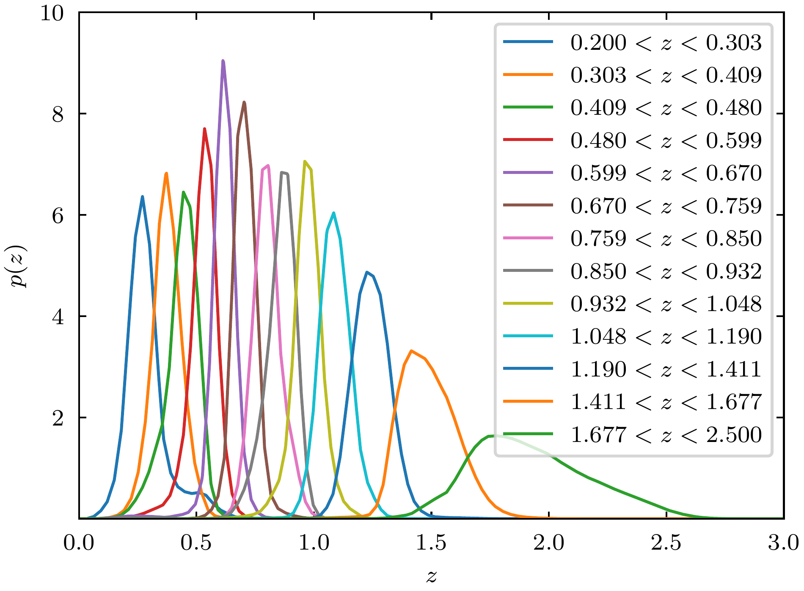
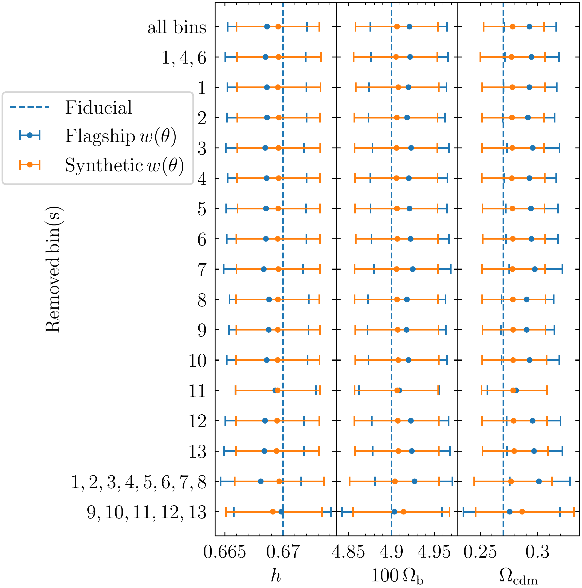
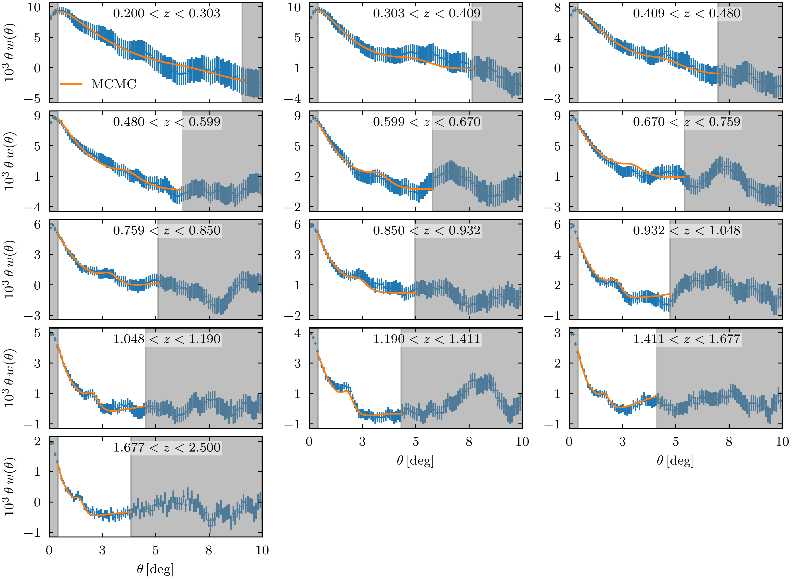

$\newcommand{\ensuremath}{}$
$\newcommand{\xspace}{}$
$\newcommand{\object}[1]{\texttt{#1}}$
$\newcommand{\farcs}{{.}''}$
$\newcommand{\farcm}{{.}'}$
$\newcommand{\arcsec}{''}$
$\newcommand{\arcmin}{'}$
$\newcommand{\ion}[2]{#1#2}$
$\newcommand{\textsc}[1]{\textrm{#1}}$
$\newcommand{\hl}[1]{\textrm{#1}}$
$\newcommand{\footnote}[1]{}$
$\newcommand{\orcid}[1]$

# $\Euclid$ preparation.: BAO analysis of photometric galaxy clustering in configuration space

<mark>Appeared on: 2025-03-17</mark> -  _18 pages, 12 figures, submitted to A&A_

E. Collaboration, et al. -- incl., <mark>K. Jahnke</mark>

**Abstract:** With about 1.5 billion galaxies expected to be observed, the very large number of objects in the $\Euclid$ photometric survey will allow for precise studies of galaxy clustering from a single survey, over a large range of redshifts $0.2 < z < 2.5$ . In this work, we use photometric redshifts ( $\zph$ ) to extract the baryon acoustic oscillation signal (BAO) from the Flagship galaxy mock catalogue with a tomographic approach to constrain the evolution of the Universe and infer its cosmological parameters. We measure the two-point angular correlation function in 13 redshift bins. A template-fitting approach is applied to the measurement to extract the shift of the BAO peak through the transverse Alcock--Paczynski parameter $\alpha$ . A joint analysis of all redshift bins is performed to constrain $\alpha$ at the effective redshift $z_\mathrm{eff}=0.77$ with Markov Chain Monte-Carlo and profile likelihood techniques. We also extract one $\alpha_i$ parameter per redshift bin to quantify its evolution as a function of time. From these 13 $\alpha_i$ , which are directly proportional to the ratio $D_\mathrm{A}/ r_\mathrm{s, drag}$ , we constrain the reduced Hubble constant $h$ , the baryon density parameter $\Omb$ , and the cold dark matter density parameter $\Omcdm$ . From the joint analysis, we constrain $\alpha(z_\mathrm{eff}=0.77)=1.0011^{+0.0078}_{-0.0079}$ at the 68 \% confidence level, which represents a three-fold improvement over current constraints from the Dark Energy Survey (uncertainty of $\pm 0.023$ at $z_\mathrm{eff}=0.85$ with the same observable). As expected, the constraining power in the analysis of each redshift bin is lower, with an uncertainty ranging from $\pm 0.13$ to $\pm 0.024$ . From these results, we constrain $h$ at 0.45 \% , $\Omb$ at 0.91 \% , and $\Omcdm$ at 7.7 \% . We quantify the influence of analysis choices like the template, scale cuts, redshift bins, and systematic effects like redshift-space distortions over our constraints both at the level of the extracted $\alpha_i$ parameters and at the level of cosmological inference.

**Figure 1. -** True redshift distribution of the galaxies from Flagship 2.1.10 selected in 13 equipopulated photometric redshift bins. (*fig:flagship_nz*)

**Figure 6. -** Comparison of cosmological parameters obtained when one or several redshift bins are removed from the analysis. The fiducial values of the simulation are highlighted as a vertical dashed line. The baseline including all bins is shown at the top as a reference. The results in blue and orange are respectively obtained from the $\alpha_{i}$ extracted by template fitting of the $w(\theta)$ measured on Flagship and a noise-free synthetic $w(\theta)$.  (*fig:cosmo_bins_robustness*)

**Figure 9. -** Two-point angular correlation function measured on the Flagship simulation in 13 redshift bins. The errors come from the analytical covariance presented in Sect. \ref{sc:covariance}. The orange curve is the correlation function computed using the template from Eq.\eqref{eq:template_BAO} evaluated with the parameters inferred from MCMC in each redshift bin. Scale cuts are shown as grey bands and are defined as $\thmin=\ang{0.6}$, $\thmax=\thbao+\ang{2.5}$ where $\thbao$ is the expected position of the BAO peak in the fiducial cosmology. (*fig:flagship_2pcf*)

