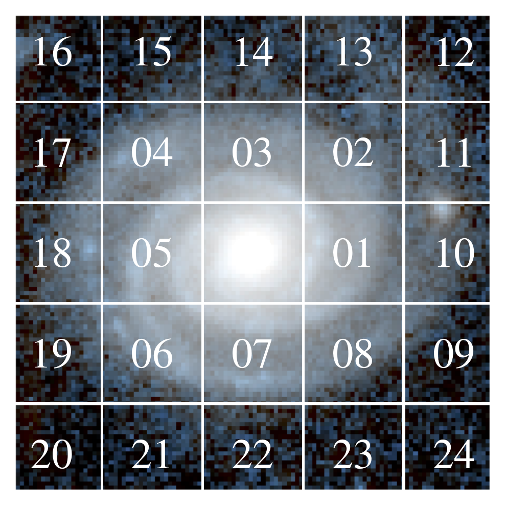
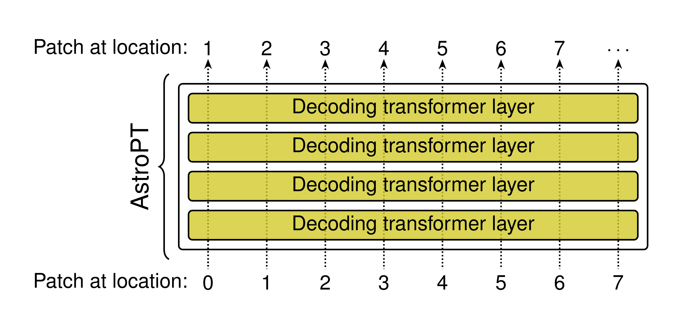
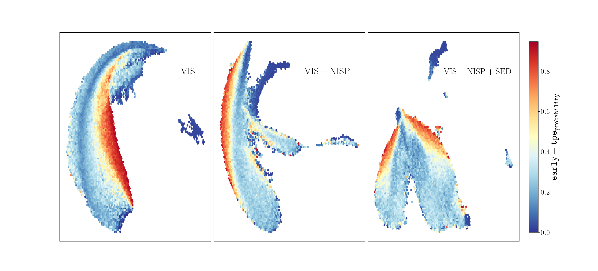
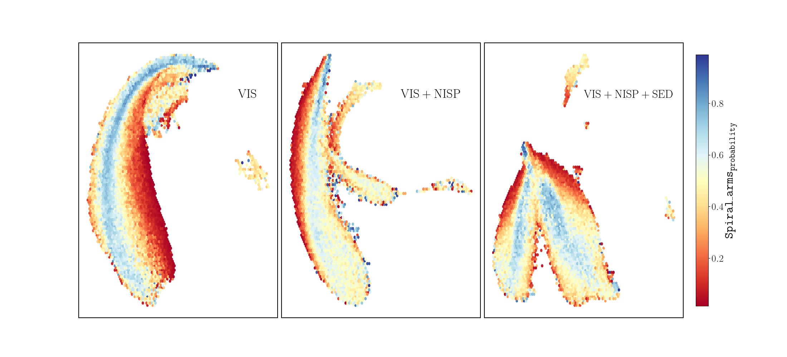
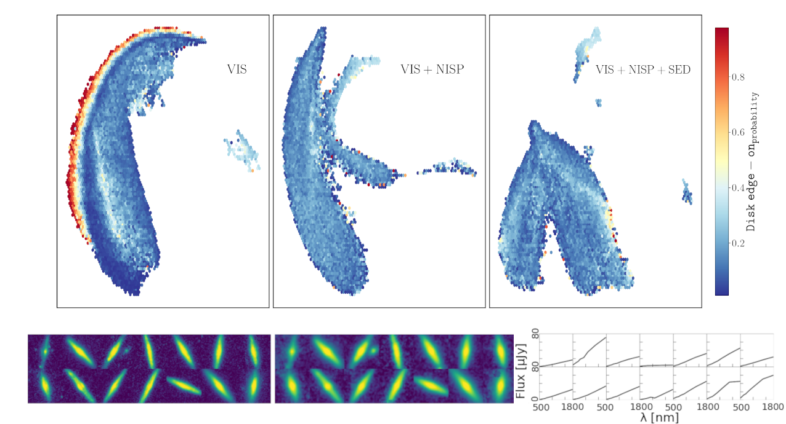

$\newcommand{\ensuremath}{}$
$\newcommand{\xspace}{}$
$\newcommand{\object}[1]{\texttt{#1}}$
$\newcommand{\farcs}{{.}''}$
$\newcommand{\farcm}{{.}'}$
$\newcommand{\arcsec}{''}$
$\newcommand{\arcmin}{'}$
$\newcommand{\ion}[2]{#1#2}$
$\newcommand{\textsc}[1]{\textrm{#1}}$
$\newcommand{\hl}[1]{\textrm{#1}}$
$\newcommand{\footnote}[1]{}$
$\newcommand{\Mstarsun}{\logten(M_{\ast}/M_\odot)}$
$\newcommand{\citenopar}[1]{$
$  \begingroup$
$  \@tempcnta\z@$
$  \@for\@II:=#1\do{\advance\@tempcnta\@ne}$
$  \@tempcntb\z@$
$  \@for\@II:=#1\do{$
$    \advance\@tempcntb\@ne$
$    \citeauthor{\@II} \citeyear{\@II}$
$    \ifnum\@tempcntb<\@tempcnta, \fi$
$  }$
$  \endgroup$
$}$
$\newcommand{\orcid}[1]$

# Euclid Quick Data Release (Q1): Exploring galaxy properties with a multi-modal foundation model

<mark>Appeared on: 2025-03-20</mark> -  _Paper submitted as part of the A&A Special Issue `Euclid Quick Data Release (Q1)', 31 pages, 17 figures_

E. Collaboration, et al. -- incl., <mark>K. Jahnke</mark>

**Abstract:** Modern astronomical surveys, such as the $\Euclid$ mission, produce high-dimensional, multi-modal data sets that include imaging and spectroscopic information for millions of galaxies. These data serve as an ideal benchmark for large, pre-trained multi-modal models, which can leverage vast amounts of unlabelled data. In this work, we present the first exploration of $\Euclid$ data with \texttt{AstroPT} , an autoregressive multi-modal foundation model trained on approximately $\(300 000\)$ optical and infrared $\Euclid$ images and spectral energy distributions (SEDs) from the first $\Euclid$ Quick Data Release. We compare self-supervised pre-training with baseline fully supervised training across several tasks: galaxy morphology classification; redshift estimation; similarity searches; and outlier detection. Our results show that: (a) \texttt{AstroPT} embeddings are highly informative, correlating with morphology and effectively isolating outliers; (b) including infrared data helps to isolate stars, but degrades the identification of edge-on galaxies, which are better captured by optical images; (c) simple fine-tuning of these embeddings for photometric redshift and stellar mass estimation outperforms a fully supervised approach, even when using only $\(1\%\)$ of the training labels; and (d) incorporating SED data into \texttt{AstroPT} via a straightforward multi-modal token-chaining method improves photo- $\(z\)$ predictions, and allow us to identify potentially more interesting anomalies (such as ringed or interacting galaxies) compared to a model pre-trained solely on imaging data.

**Figure 13. -** {\tt AstroPT's} training objective is predicting the next patch in a sequence of galaxy image (and other modalities') patches. On the left we show the order of galaxy patches used in this work, and on the right we show how each patch is processed by {\tt AstroPT}. (*fig_galaxyastropt*)

**Figure 16. -** UMAP visualisations of the self-supervised embeddings from {\tt AstroPT} trained on VIS (left), VIS+NISP (centre), and VIS+NISP+SED (right) coloured by morphological parameters derived from the GZ catalogue \citep{Q1-SP047}. Representations show clear clustering of smooth, non-spiral, and non-smooth, spiral galaxies. (*fig:UMAP_visualisation_morphology_spiral*)

**Figure 17. -** UMAP visualisations of the self-supervised embeddings from {\tt AstroPt} coloured by morphological parameters derived from the GZ catalogue \citep{Q1-SP047}. $Left$: Representations from VIS images alone, showing a distinct region for edge-on galaxies. $Middle$: Representations incorporating both VIS and NISP data, where the separation of edge-on galaxies becomes less distinct. $Right$: Representations incorporating VIS, NISP, and SED data. $Bottom$: Example cutouts and SEDs of the edge-on galaxies. (*fig:UMAP_visualisation_morphology_edge_on*)

