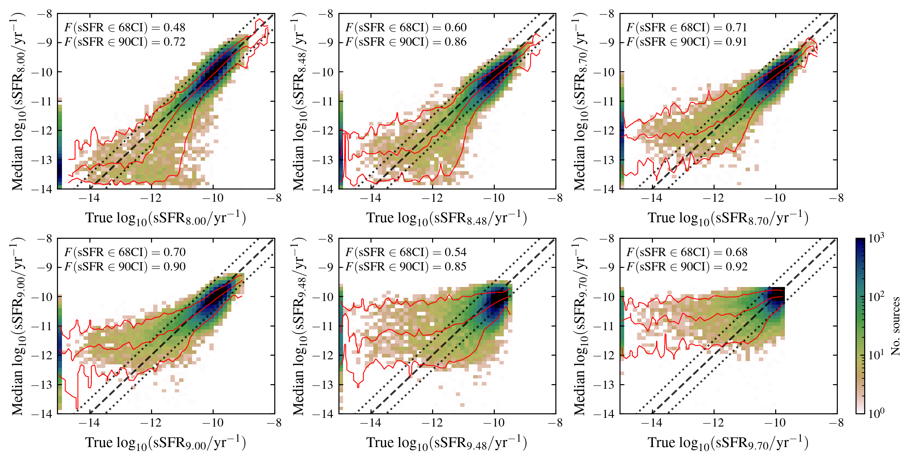
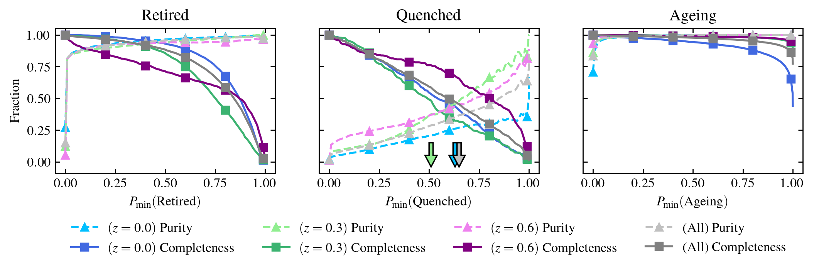
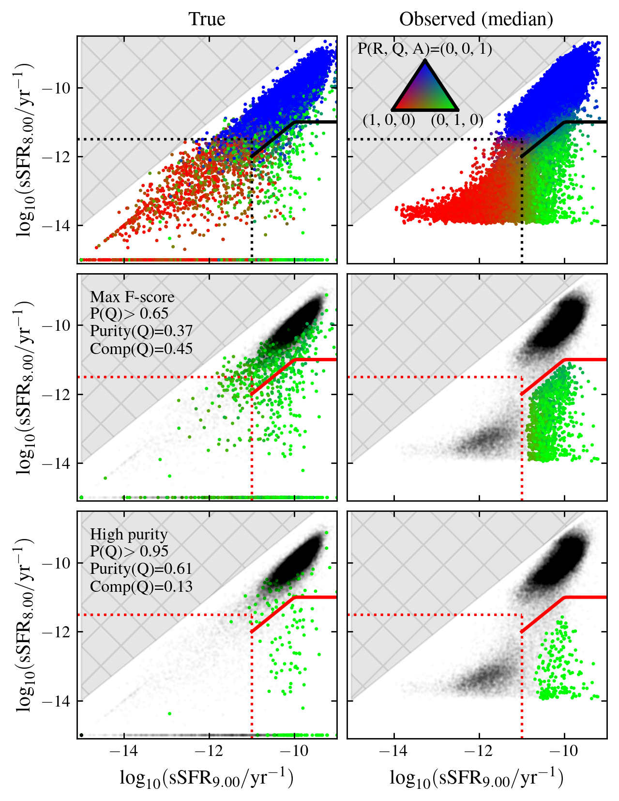

$\newcommand{\ensuremath}{}$
$\newcommand{\xspace}{}$
$\newcommand{\object}[1]{\texttt{#1}}$
$\newcommand{\farcs}{{.}''}$
$\newcommand{\farcm}{{.}'}$
$\newcommand{\arcsec}{''}$
$\newcommand{\arcmin}{'}$
$\newcommand{\ion}[2]{#1#2}$
$\newcommand{\textsc}[1]{\textrm{#1}}$
$\newcommand{\hl}[1]{\textrm{#1}}$
$\newcommand{\footnote}[1]{}$
$\newcommand{\todo}[1]{\textcolor{red}{#1}}$
$\newcommand{\change}[1]{\textbf{#1}}$
$\newcommand{\Msun}{\ensuremath{{M_\odot}}\xspace}$
$\newcommand{\angstrom}{\text{\normalfontÅ}}$
$\newcommand{\ew}{\ensuremath{\rm EW(\ha)}\xspace}$
$\newcommand{\reff}[1]{\ensuremath{#1 R_{\rm e}}\xspace}$
$\newcommand{\wl}{\ensuremath{\lambda}}$
$\newcommand{\dd}{{\rm d}}$
$\newcommand{\zstar}{\ensuremath{Z_\ast}\xspace}$
$\newcommand{\mstar}{\ensuremath{M_\ast}\xspace}$
$\newcommand{\mass}{\ensuremath{\mstar(t)}\xspace}$
$\newcommand{\metal}{\ensuremath{Z(t)}\xspace}$
$\newcommand{\massnormof}[1]{\ensuremath{\widetilde{M}_\ast(#1)}\xspace}$
$\newcommand{\massnorm}{\massnormof{t}}$
$\newcommand{\massnormssp}{\ensuremath{\widetilde{M}_{\rm SSP}}\xspace}$
$\newcommand{\balbreak}{\ensuremath{D_n(4000)}\xspace}$
$\newcommand{\gr}{\ensuremath{(g-r)_0}\xspace}$
$\newcommand{\logmass}{\ensuremath{\log_{10}(\mass/{\rm \Msun})}\xspace}$
$\newcommand{\re}{\ensuremath{R_{\rm e}}\xspace}$
$\newcommand{\concen}{\ensuremath{\frac{\rpetro{90}}{\rpetro{50}}}\xspace}$
$\newcommand{\logz}{\ensuremath{\log_{10}(Z_\ast/{Z_\odot})}\xspace}$
$\newcommand{\sfr}{\ensuremath{{\rm SFR}}\xspace}$
$\newcommand{\ssfr}{\ensuremath{{\rm sSFR}}\xspace}$
$\newcommand{\ssfrval}[1]{\ensuremath{\ssfr=#1~\rm yr^{1}}\xspace}$
$\newcommand{\avssfr}{\ensuremath{\ssfr_\tau}\xspace}$
$\newcommand{\avssfrval}[1]{\ensuremath{\ssfr_{#1}}\xspace}$
$\newcommand{\logavssfrval}[1]{\ensuremath{\log_{10}\left(\avssfrval{#1} / \rm yr^{-1}\right)}\xspace}$
$\newcommand{\besta}{\texttt{BESTA}\xspace}$
$\newcommand{\orcid}[1]$

# Euclid Quick Data Release (Q1): A probabilistic classification of quenched galaxies

<mark>Appeared on: 2025-03-20</mark> -  _Paper submitted as part of the A&A Special Issue `Euclid Quick Data Release (Q1)', 24 pages, 11 figures (+ 2 appendices)_

E. Collaboration, et al. -- incl., <mark>K. Jahnke</mark>

**Abstract:** Investigating the drivers of the quenching of star formation in galaxies is key to understanding their evolution.The $\Euclid$ mission will provide rich spatial and spectral data from optical to infrared wavelengths for millions of galaxies, enabling precise measurements of their star formation histories.Using the first Euclid Quick Data Release (Q1), we developed a probabilistic classification framework, that combines the average specific star-formation rate ( $\avssfr$ ) inferred over two timescales ( $\tau={10^8,10^9}$ yr), to categorise galaxies as `Ageing' (secularly evolving), `Quenched' (recently halted star formation), or `Retired' (dominated by old stars).We validated this methodology using synthetic observations from the IllustrisTNG simulation.Two classification methods were employed: a probabilistic approach, integrating posterior distributions, and a model-driven method optimising sample purity and completeness using IllustrisTNG.At $z<0.1$ and $\mstar \gtrsim 3\times10^{8} \Msun$ , we obtain $\Euclid$ class fractions of 68--72 \% , 8--17 \% , and 14--19 \% for Ageing, Quenched, and Retired populations, respectively, consistent with previous studies.Ageing and Retired galaxies dominate at the low- and high-mass end, respectively, while Quenched galaxies surpass the Retired fraction for $M_\ast \lesssim 10^{10} \Msun$ .The evolution with redshift shows increasing/decreasing fraction of Ageing/Retired galaxies.The fraction of quenched systems shows a weaker dependence on stellar mass and redshift, varying between 5 and 15 $\%$ .We find tentative evidence of more massive galaxies usually undergoing quenching episodes at earlier times with respect to their low-mass counterparts.We analysed the mass-size-metallicity relation for each population.Ageing galaxies generally exhibit disc morphologies and low metallicities.Retired galaxies show compact structures and enhanced chemical enrichment, while Quenched galaxies form an intermediate population, more compact and chemically evolved than Ageing systems.Despite potential selection biases, this work demonstrates $\Euclid$ 's great potential for elucidating the physical nature of the quenching mechanisms that govern galaxy evolution.

**Figure 5. -** IllustrisTNG $\avssfr$ true values versus the median value recovered by $\besta$.
    Coloured maps denote the number of sources in each bin.
    Bottom to top red lines of every panel correspond to the running 5, 50, and 95 percentiles of $\avssfr$ as function of the true value.
    Dashed and dotted black lines illustrate the one-to-one and 0.5 dex offset lines, respectively.
    Each panel includes at the top-right corner the fraction of sources whose true value lies within the 68 and 90\% estimated credible intervals, respectively. (*fig:illustris_ssfr_recovered_values*)

**Figure 7. -** Retired (left), Quenched (middle), and Ageing (right) galaxy classification purity and completeness, as function of the minimum probability threshold used to perform the classification. Each redshift sample at $z=0$, $z=0.3$, and $z=0.6$ is denoted by the blue, green, and purple lines, respectively. Coloured arrows denote the value of $P_{\rm min}(\rm Quenched)$ that maximises the $F$-score at each redshift (see Sect. $\re$f{sec:quenched_selection}). (*fig:tng_vanilla_classes*)

**Figure 2. -** Distribution of IllustrisTNG galaxies across the $\avssfr$val{9} versus  $\avssfr$val{8} plane. Left and right columns show the distribution based on the true (null values of $\ssfr$ are arbitrarily set to $\log_{10}($\ssfr$ / \rm yr^{-1})=-15$) and inferred median values, respectively. Top row panels display the full sample RGB colour-coded by the probability of belonging to the Retired, Quenched, and Ageing classes. Solid and dotted lines represent the demarcation lines given by Eqs. $\re$f{eq:quenched_line} and $\re$f{eq:retired_line}, respectively. Middle and bottom rows illustrate the two proposed approaches for selecting quenched galaxies (coloured points) by colouring in black with low transparency those systems classified as Retired or Ageing. (*fig:tng_quenched_selection*)

