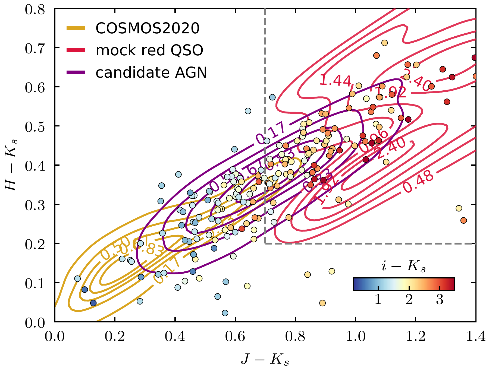
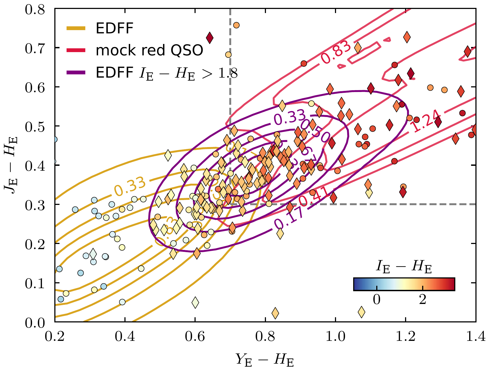
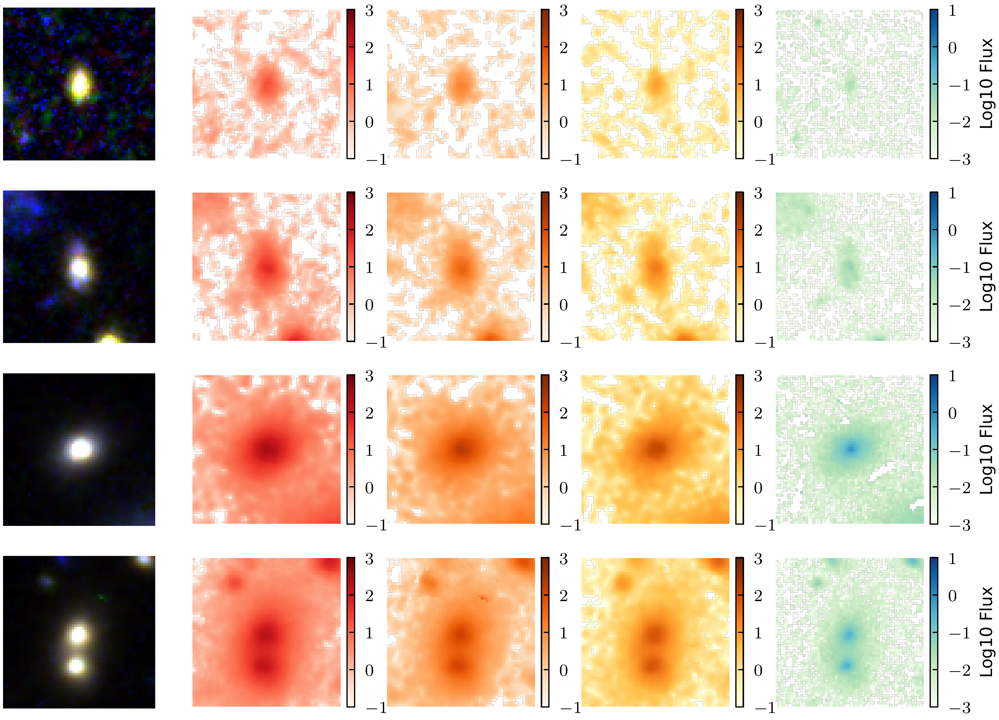

$\newcommand{\ensuremath}{}$
$\newcommand{\xspace}{}$
$\newcommand{\object}[1]{\texttt{#1}}$
$\newcommand{\farcs}{{.}''}$
$\newcommand{\farcm}{{.}'}$
$\newcommand{\arcsec}{''}$
$\newcommand{\arcmin}{'}$
$\newcommand{\ion}[2]{#1#2}$
$\newcommand{\textsc}[1]{\textrm{#1}}$
$\newcommand{\hl}[1]{\textrm{#1}}$
$\newcommand{\footnote}[1]{}$
$\newcommand{\orcid}[1]$
$\newcommand{\refer}[1]{,\ \cite{#1}; [{\tt #1}]}$
$\newcommand{\itemm}{$
$\medskip\noindent}$

# ${Euclid Quick Data Release (Q1)}$: First study of red quasars selection

<mark>Appeared on: 2025-03-20</mark> -  _Paper submitted as part of the A&A Special Issue 'Euclid Quick Data Release (Q1)', 17 pages, 18 figures_

E. Collaboration, et al. -- incl., <mark>K. Jahnke</mark>

**Abstract:** $\iffalse{\colour{blue} \bf NEW VERSION: We have a modified style file,     aaEC.cls, used here; with that, the bug reported in Sect. 8 no     longer occurs. In order to demonstrate this, the long author list     of \cite{EROData} was copied here.}$ \ $\fi$ Red quasars constitute an important but elusive phase in the evolution of supermassive black holes, where dust obscuration can significantly alter their observed properties. They have broad emission lines, like other quasars, but their optical continuum emission is significantly reddened, which is why they were traditionally identified based on near- and mid-infrared selection criteria.This work showcases the capability of the $\Euclid$ space telescope to find a large sample of red quasars, using $\Euclid$ near infrared (NIR) photometry. We first conduct a forecast analysis, comparing a synthetic catalogue of red QSOs with COSMOS2020. Using template fitting, we reconstruct $\Euclid$ -like photometry for the COSMOS sources and identify a sample of candidates in a multidimensional colour-colour space achieving $98\%$ completeness for mock red QSOs with $30\%$ contaminants. To refine our selection function, we implement a probabilistic Random Forest classifier, and use UMAP visualisation to disentangle non-linear features in colour-space, reaching $98\%$ completeness and $88\%$ purity. A preliminary analysis of the candidates in the $\Euclid$ Deep Field Fornax (EDF-F) shows that, compared to VISTA+DECAm-based colour selection criteria, $\Euclid$ ’s superior depth, resolution and optical-to-NIR coverage improves the identification of the reddest, most obscured sources. Notably, the $\Euclid$ exquisite resolution in the $I_E$ filter unveils the presence of a candidate dual quasar system, highlighting the potential for this mission to contribute to future studies on the population of dual AGN.The resulting catalogue of candidates, including more the 150 000 sources, provides a first census of red quasars in $\Euclid$ Q1 and sets the groundwork for future studies in the Euclid Wide Survey (EWS), including spectral follow-up analyses and host morphology characterisation.

**Figure 4. -** The VISTA colour-colour diagram showing the separation of mock red QSOs from COSMOS 2020. The proposed colour-colour selection function is displayed by the gray dashed lines. A subset of candidate AGN overlays the selection, colour-coded as $i - K_s$. (*fig:img_cc_03*)

**Figure 8. -** The colour-colour diagram showing the separation of mock red QSOs from the \Euclid Q1 sample. The proposed colour-colour selection is displayed by the grey dashed lines. The control samples are colour-coded by $\IE - \HE$: dots and diamonds represent MIR-selected and radio-selected AGN, respectively. (*fig:img_09*)

**Figure 17. -** Candidate sources. Panels show, from left to right, the RGB image and the \HE, \JE, \YE and \IE bands. Raw images were obtained through ESA Datalabs \citep{Navarro2024}. (*fig:ex1*)

