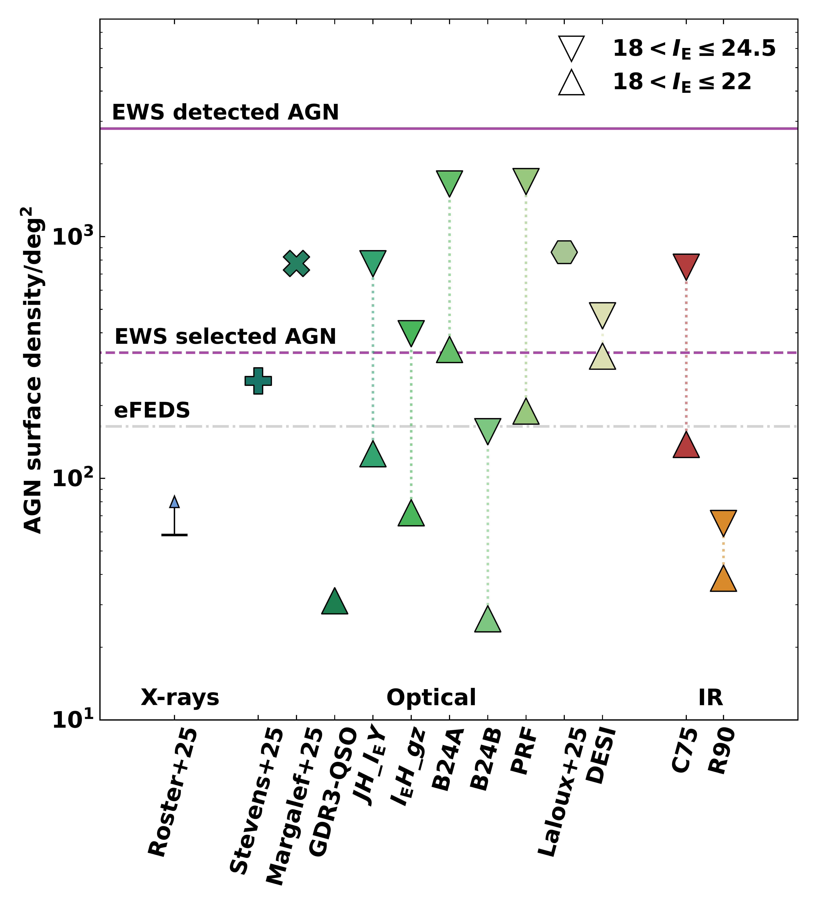
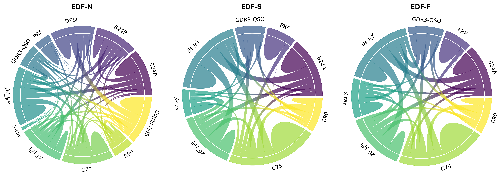
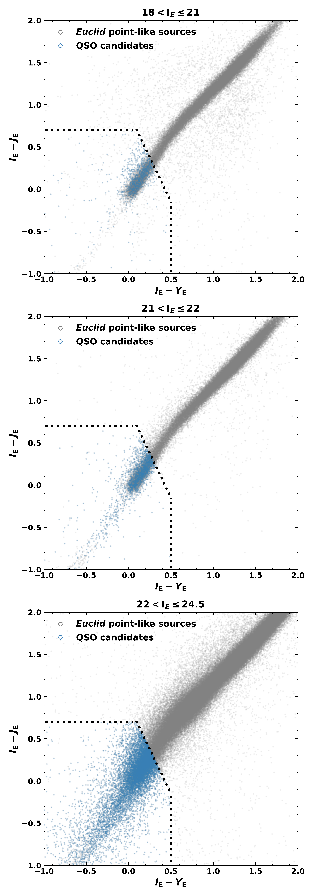

$\newcommand{\ensuremath}{}$
$\newcommand{\xspace}{}$
$\newcommand{\object}[1]{\texttt{#1}}$
$\newcommand{\farcs}{{.}''}$
$\newcommand{\farcm}{{.}'}$
$\newcommand{\arcsec}{''}$
$\newcommand{\arcmin}{'}$
$\newcommand{\ion}[2]{#1#2}$
$\newcommand{\textsc}[1]{\textrm{#1}}$
$\newcommand{\hl}[1]{\textrm{#1}}$
$\newcommand{\footnote}[1]{}$
$\newcommand{\orcid}[1]{\orcidlink{#1}}$
$\newcommand$
$\newcommand$
$\newcommand$
$\newcommand$

# Euclid Quick Data Release (Q1): The active galaxies of  $\Euclid$

<mark>Appeared on: 2025-03-20</mark> -  _Paper submitted as part of the A&A Special Issue "Euclid Quick Data Release (Q1)", 30 pages, 20 figures_

E. Collaboration, et al. -- incl., <mark>K. Jahnke</mark>

**Abstract:** We present a catalogue of candidate active galactic nuclei (AGN) in the $\Euclid$ Quick Release (Q1) fields. For each $\Euclid$ source we collect multi-wavelength photometry and spectroscopy information from Galaxy Evolution Explorer (GALEX), $\gaia$ , Dark Energy Survey (DES), Wise-field Infrared Survey Explorer (WISE), _Spitzer_ , Dark Energy Survey (DESI), and Sloan Digital Sky Survey (SDSS), including spectroscopic redshift from public compilations.We investigate the AGN contents of the Q1 fields by applying selection criteria using $\Euclid$ colours and WISE-AllWISE cuts finding respectively 292 222 and 65 131 candidates. We also create a high-purity QSO catalogue based on $\gaia$ DR3 information containing 1971 candidates. Furthermore, we utilise the collected spectroscopic information from DESI to perform broad-line and narrow-line AGN selections, leading to a total of 4392 AGN candidates in the Q1 field. We investigate and refine the Q1 probabilistic random forest QSO population, selecting a total of  180 666 candidates. Additionally, we perform SED fitting on a subset of sources with available $z_{\text{spec}}$ , and by utilizing the derived AGN fraction, we identify a total of 7766 AGN candidates. We discuss purity and completeness of the selections and define two new colour selection criteria ( $JH$ \_ $I_{\text{E}}Y$ and $I_{\text{E}}H$ \_ $gz$ ) to improve on purity, finding 313 714 and 267 513 candidates respectively in the Q1 data. We find a total of 229 779 AGN candidates equivalent to an AGN surface density of 3641 deg $^{-2}$ for $18<\IE\leq 24.5$ , and a subsample of 30 422 candidates corresponding to an AGN surface density of 482 deg $^{-2}$ when limiting the depth to $18<\IE\leq 22$ . The surface density of AGN recovered from this work is in line with predictions based on the AGN X-ray luminosity functions.

**Figure 2. -** Comparison of AGN surface densities obtained from the selection methods discussed in this work, divided into energy bands: X-ray selections (blue;, optical selections (shades of green); and IR selections (shades of orange). For the selections B24A, B24B, $JH$\_$I_{\text{E}}Y$, $I_{\text{E}}H$\_$gz$, C75, R90, DESI, and PRF the AGN surface densities are split into $18<\IE\leq 24.5$(upside down triangles); and $18<\IE\leq 22$(upside up triangles). For the GDR3-QSOs, only the $18<\IE\leq 22$ is shown due to the limiting magnitude of \gaia. Individual markers indicate AGN surface densities from other Q1 related works, including X-rays from \citetalias{Q1-SP003}(with the lower limit indicated by an arrow pointing up); morphology-based selections from \citetalias{Q1-SP009}(plus sign); and \citetalias{Q1-SP015}(cross); and SED fitting from LB25 (hexagon). The predictions for the detectable AGN (purple horizontal solid line) and identifiable AGN (purple dashed line) in the EWS from \citetalias{EP-Selwood} are included. The grey horizontal dashed line represents recovered AGN surface density by eFEDS  ([Liu, Bulbul and Ghirardini 2022]()) . (*fig:selwoodpredictions*)

**Figure 10. -** Comparison among the number of sources selected as AGN candidates for the different criteria investigated in this work per EDF. We exclude the morphology-based AGN candidates due to the significant differences in their methodologies compared to other techniques explored in this work. We set the detection limit to the range of 18 < \IE$\leq$ 22, ensuring all selections match in depth. Note that EDF-N shows more selection criteria than EDF-S and EDF-F. (*fig:chords*)

**Figure 6. -** Comparison between the number of B24A QSO (blue) candidates per magnitude bin in the EDF-N. In grey we show all \Euclid compact sources in the corresponding magnitude bin. Because the magnitude bins go from brighter colours (top plot) to faintest (bottom plot) the number of sources and QSO candidates increase. (*fig:b24a_magbins*)

