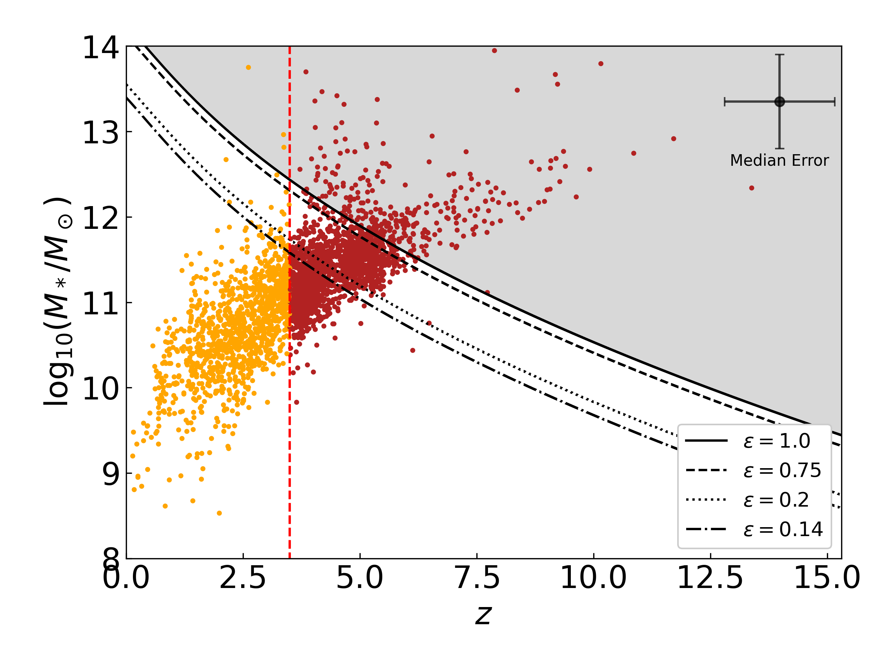
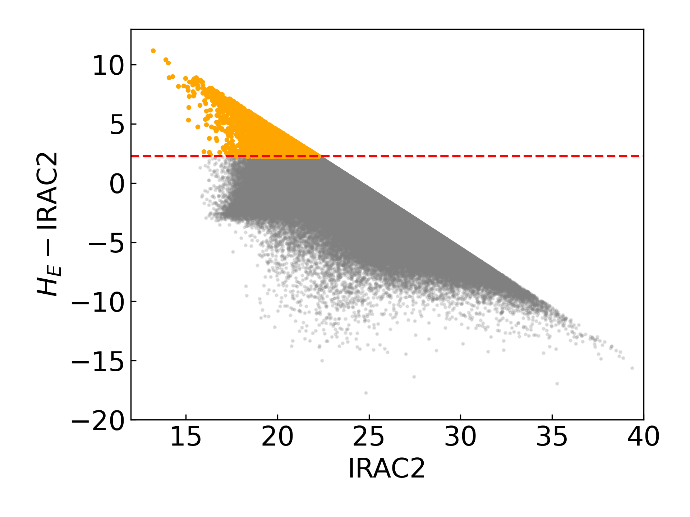
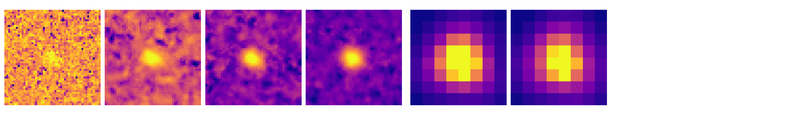
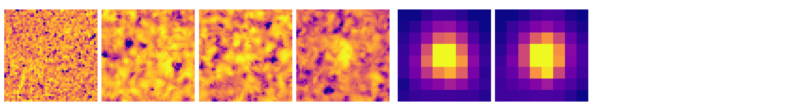

$\newcommand{\ensuremath}{}$
$\newcommand{\xspace}{}$
$\newcommand{\object}[1]{\texttt{#1}}$
$\newcommand{\farcs}{{.}''}$
$\newcommand{\farcm}{{.}'}$
$\newcommand{\arcsec}{''}$
$\newcommand{\arcmin}{'}$
$\newcommand{\ion}[2]{#1#2}$
$\newcommand{\textsc}[1]{\textrm{#1}}$
$\newcommand{\hl}[1]{\textrm{#1}}$
$\newcommand{\footnote}[1]{}$
$\newcommand{\orcid}[1]$

# Euclid Quick Data Release (Q1): An investigation of optically faint, red objects in the Euclid Deep Fields

<mark>Appeared on: 2025-03-20</mark> -  _Paper submitted as part of the A&A Special Issue `Euclid Quick Data Release (Q1)'. 10 pages, 7 figures_

E. Collaboration, et al. -- incl., <mark>K. Jahnke</mark>

**Abstract:** Our understanding of cosmic star formation at $z > 3$ used to largely rely on rest-frame UV observations. However, these observations overlook dusty and massive sources, resulting in an incomplete census of early star-forming galaxies. Recently, infrared data from _Spitzer_ and the _James Webb_ Space Telescope (JWST) have revealed a hidden population at $z\sim3$ -- $6$ with extreme red colours.Taking advantage of the overlap between imaging in the Euclid Deep Fields (EDFs), covering about $60$ deg $^2$ , and ancillary _Spitzer_ observations, we identified $27 000$ extremely red objects with $\HE - \mathrm{IRAC2} > 2.25$ (dubbed HIEROs) down to a $10 \sigma$ completeness magnitude limit of $\mathrm{IRAC2} = 22.5$ AB. After a visual investigation to discard artefacts and any objects with troubling photometry, we ended up with a final sample of $3 900$ candidates. We retrieved the physical parameter estimates for these objects from the SED-fitting tool \texttt{CIGALE} .Our results confirm that HIERO galaxies may populate the high-mass end of the stellar mass function at $z>3$ , with some sources reaching extreme stellar masses ( $M_*>10^{11}M_\odot$ ) and exhibiting high dust attenuation values ( $A_V>3$ ). However, we consider the stellar mass estimates unreliable for sources at $z>3.5$ . For this reason, we favour a more conservative lower- $z$ solution. The challenges faced by SED-fitting tools in accurately characterising these objects underscore the need for further studies, incorporating both observations at shorter wavelengths and spectroscopic data. $\Euclid$ spectra will help resolve degeneracies and better constrain the physical properties of the brightest galaxies. Given the extreme nature of this population, characterising these sources is crucial for building a comprehensive picture of galaxy evolution and stellar mass assembly across most of the history of the Universe. This work demonstrates $\Euclid$ 's potential to provide statistical samples of rare objects, such as massive, dust-obscured galaxies at $z>3$ , which will be prime targets for JWST, the Atacama Large Millimeter/Submillimeter Array (ALMA) and the Extremely Large Telescope (ELT).

**Figure 7. -** Stellar mass versus redshift distribution of the HIERO sample. The _y_-axis is on a logarithmic scale. The vertical red dotted line corresponds to $z = 3.5$, above which we don't trust the high redshift solutions found by the fit. These high-$z$ sources are displayed as red dots. The grey-shaded area represents the region forbidden by the $\Lambda$CDM model. The black lines show the limit for different values of $\epsilon$. The median error for both the quantities is reported in the top right corner of the plot. The left panel show the results from the \texttt{CIGALE} run described in Sect. \ref{SED_fitting}, while the right panel uses the results from the low-$z$ run for the high-$z$ objects, which are still displayed as red dots.
     (*fig:M-vs-z*)

**Figure 1. -** Colour-magnitude plot of the clean sample. All the object falling above the red line, representing $\HE - \mathrm{IRAC2} > 2.25$, i.e., the HIERO colour selection  (wang2016infrared) , end up being in our HIERO sample. The diagonal cut is due to the magnitude limit in the \HE band. (*fig:color-selection*)

**Figure 2. -** Examples of two HIEROs that have passed our visual check and that are kept in our final catalogue.
    From left to right: \IE, \YE, \JE, \HE, IRAC1, and IRAC2. Each cutout has a size of $\ang{;;5} \times \ang{;;5}$. (*fig:cutout-good*)

