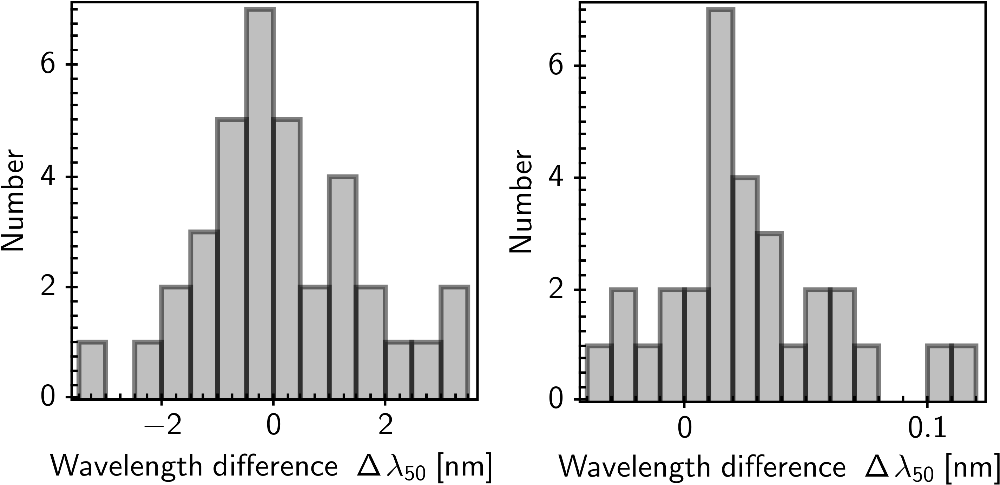

$\newcommand{\ensuremath}{}$
$\newcommand{\xspace}{}$
$\newcommand{\object}[1]{\texttt{#1}}$
$\newcommand{\farcs}{{.}''}$
$\newcommand{\farcm}{{.}'}$
$\newcommand{\arcsec}{''}$
$\newcommand{\arcmin}{'}$
$\newcommand{\ion}[2]{#1#2}$
$\newcommand{\textsc}[1]{\textrm{#1}}$
$\newcommand{\hl}[1]{\textrm{#1}}$
$\newcommand{\footnote}[1]{}$
$\newcommand{\orcid}[1]$
$\newcommand{\tmax}{{\vartheta_{\rm max}}}$
$\newcommand{\refer}[1]{,\ \cite{#1}; [{\tt #1}]}$
$\newcommand{\itemm}{$
$\medskip\noindent}$
$\newcommand{\pd}{\phantom{1}}$

# $\Euclid$\/: Title of your paper$\thanks{This paper is published on     behalf of the Euclid Consortium}$

<mark>Appeared on: 2025-03-20</mark> -  _Paper submitted as part of the A&A Special Issue `Euclid Quick Data Release (Q1)', 15 pages, 8 figures_

E. Collaboration, et al. -- incl., <mark>K. Jahnke</mark>

**Abstract:** ${\color{blue} \bf NEW VERSION: We have a modified style file,     aaEC.cls, used here; with that, the bug reported in Sect. 8 no     longer occurs. In order to demonstrate this, the long author list     of \cite{EROData} was copied here.}$ \ This is a template file for the preparation of Euclid Consortium (EC) papersfor submission to A \& A. The list of lead authors and affiliations shouldbe prepared by the authors only on first submission to the ECEditorial Board (ECEB). Once thepaper is circulated within the full EC, and eligible authors can signup, then you should instead use the author and affiliation listgenerated for your paper on the Publication Portal; any editing ofthese lists byhand is error prone and must not be done.With the macros \textbackslash{\tt titlerunning} and \textbackslash{\tt authorrunning} ,shortened versions of the author list and the title should be given, suchthat they fit into the headline of each odd-numbered page.As a default, it is recommended to use the "traditional" abstract, asgiven in this example here. Nevertheless, the structure of theabstract should follow the journal's guidelines, i.e., context, aims,methods, and results, just without explicitly writing the headings.In the Appendix, we provide a list of EC publications, which will becontinuously updated. Furthermore, we have prepared the file ${\tt  Euclid.bib}$ , which contains most of the EC papers and can be usedfor preparing your reference list.

**Figure 1. -** This is an example figure (that happens to have two panels),
which is well suited to fit into a single column. (*fig:1*)

**Figure 3. -** A bigger, but horrible version of Fig. \ref{fig:1}. In this
  case, anisotropic stretching of the figure was applied, by
  specifying both the figure's height and width. One sees from this
  figure that such stretching should _ never\/_ be used. (*fig:2*)

**Figure 4. -** A bigger version of Fig. \ref{fig:1}, with a side
  caption. This sometimes can be useful when figures would appear too small for
a single column, but would also appear too big if extending over the
full page width. However, using this {\tt{\textbackslash}sidecaption}
option may cause problems in some cases, for example fitting the
caption may become difficult, or leave too much white space. (*fig:3*)

