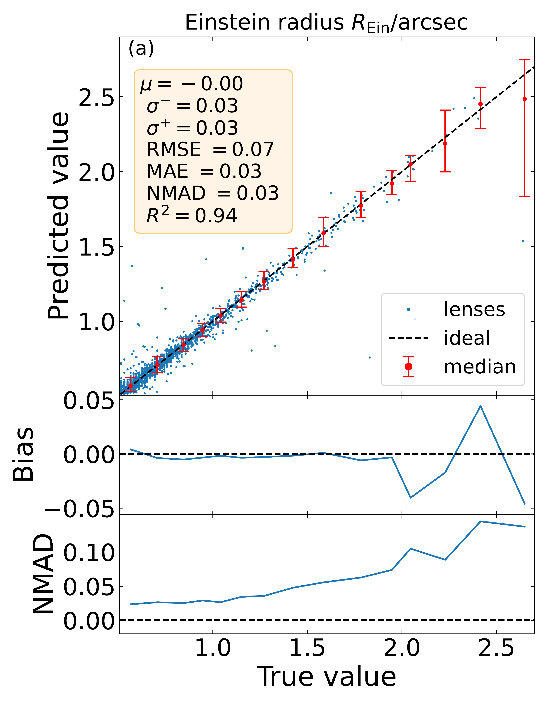
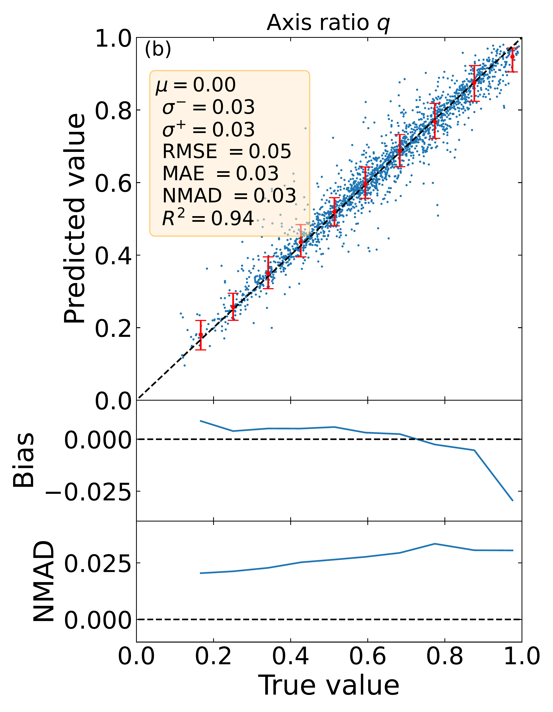
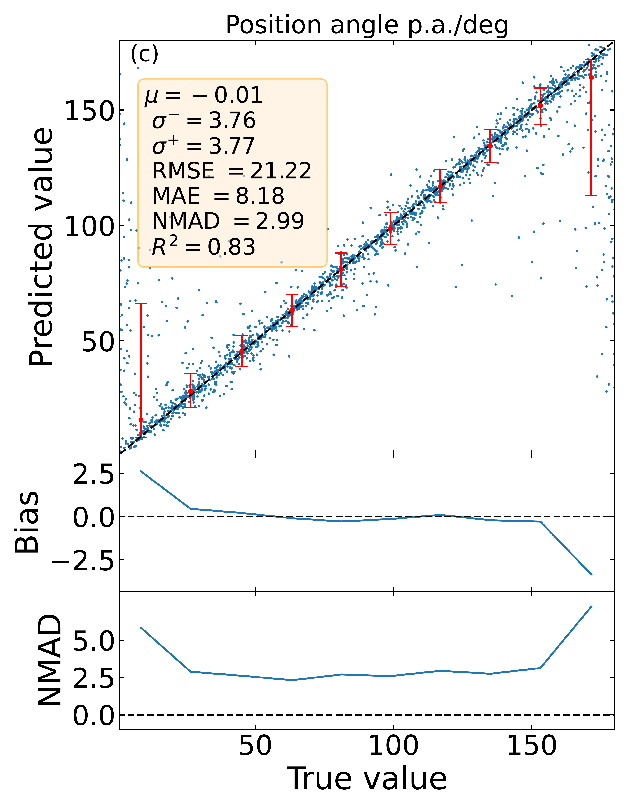
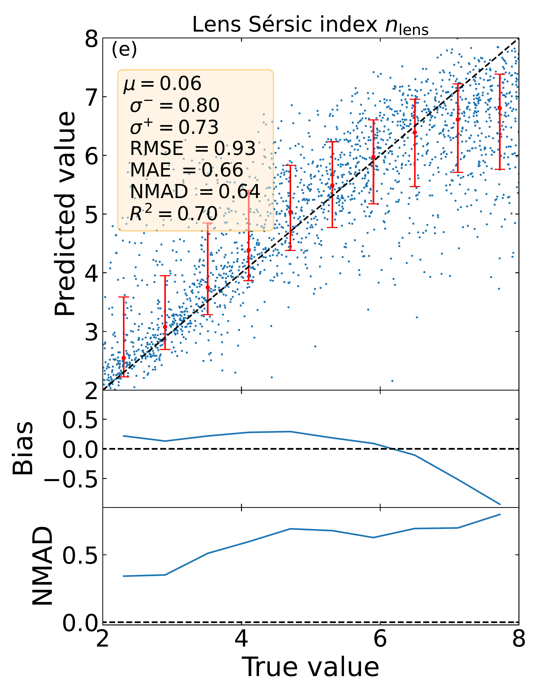
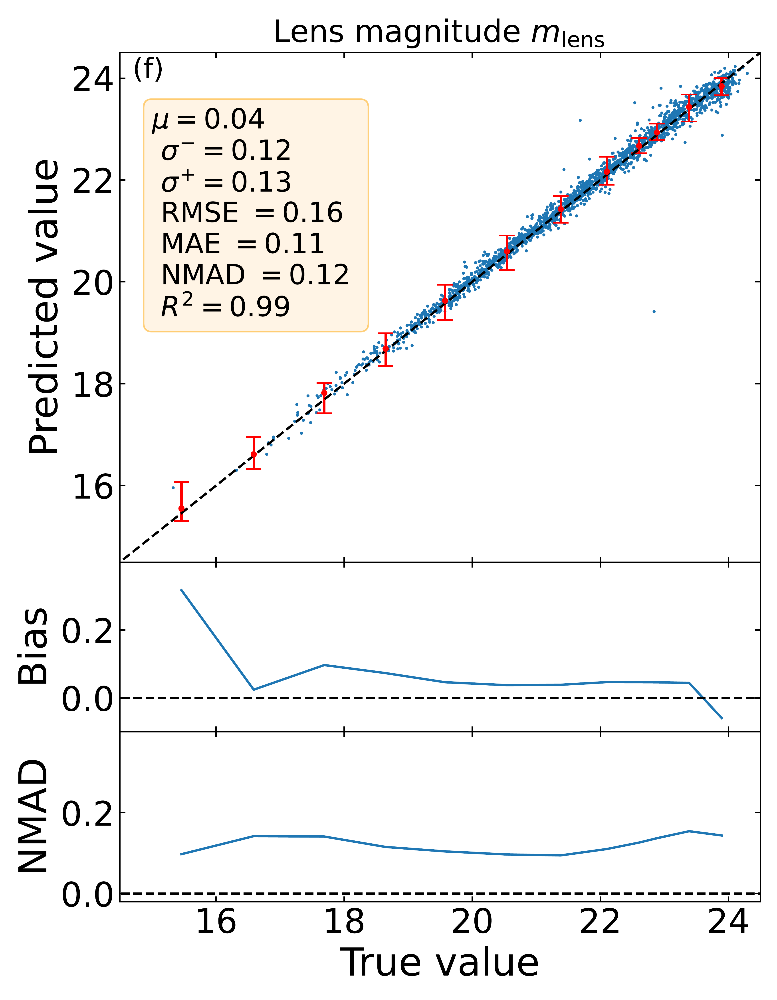
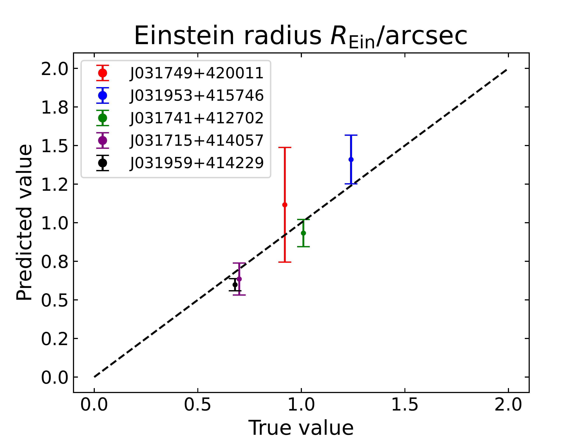

$\newcommand{\ensuremath}{}$
$\newcommand{\xspace}{}$
$\newcommand{\object}[1]{\texttt{#1}}$
$\newcommand{\farcs}{{.}''}$
$\newcommand{\farcm}{{.}'}$
$\newcommand{\arcsec}{''}$
$\newcommand{\arcmin}{'}$
$\newcommand{\ion}[2]{#1#2}$
$\newcommand{\textsc}[1]{\textrm{#1}}$
$\newcommand{\hl}[1]{\textrm{#1}}$
$\newcommand{\footnote}[1]{}$
$\newcommand{\val}[1]{{\color{black}{#1}}}$
$\newcommand{\cre}[1]{{\color{black}{#1}}}$
$\newcommand{\HS}{\texttt{HST2EUCLID}}$
$\newcommand{\orcid}[1]$
$\newcommand{\Eq}{\mbox{Eq.~}}$
$\newcommand{\Eqs}{\mbox{Eqs.~}}$
$\newcommand{\Fig}{\mbox{Fig.~}}$
$\newcommand{\Figs}{\mbox{Figs.~}}$
$\newcommand{\Tab}{\mbox{Table~}}$
$\newcommand{\Tabs}{\mbox{Tables.~}}$
$\newcommand{\Sec}{\mbox{Sect.~}}$
$\newcommand{\Secs}{\mbox{Sects-~}}$
$\newcommand{\App}{\mbox{App.~}}$
$\newcommand{\Apps}{\mbox{Apps.~}}$

# Euclid Quick Data Release (Q1): LEMON -- Lens Modelling with Neural networks. Automated and fast modelling of $\Euclid$ gravitational lenses with a singular isothermal ellipsoid mass profile

<mark>Appeared on: 2025-03-20</mark> -  _Paper submitted as part of the A&A Special Issue `Euclid Quick Data Release (Q1)', 23 pages, 17 figures_

E. Collaboration, et al. -- incl., <mark>K. Jahnke</mark>

**Abstract:** The $\Euclid$ mission aims to survey around $\num{14000}$ $\deg^{2}$ of extragalactic sky, providing around $10^{5}$ gravitational lens images. Modelling of gravitational lenses is fundamental to estimate the total mass of the lens galaxy, along with its dark matter content. Traditional modelling of gravitational lenses is computationally intensive and requires manual input. In this paper, we use a Bayesian neural network, LEns MOdelling with Neural networks (LEMON), for modelling $\Euclid$ gravitational lenses with a singular isothermal ellipsoid mass profile. Our method estimates key lens mass profile parameters, such as the Einstein radius, while also predicting the light parameters of foreground galaxies and their uncertainties. We validate LEMON's performance on both mock $\Euclid$ data sets, real Euclidised lenses observed with $\HST$ (hereafter HST), and real $\Euclid$ lenses found in the Perseus ERO field, demonstrating the ability of LEMON to predict parameters of both simulated and real lenses. Results show promising accuracy and reliability in predicting the Einstein radius, axis ratio, position angle, effective radius, Sérsic index, and lens magnitude for simulated lens galaxies. The application to real data, including the latest Quick Release 1 strong lens candidates, provides encouraging results, particularly for the Einstein radius. We also verified that LEMON has the potential to accelerate traditional modelling methods, by giving to the classical optimiser the LEMON predictions as starting points, resulting in a speed-up of up to 26 times the original time needed to model a sample of gravitational lenses, a result that would be impossible with randomly initialised guesses. This work represents a significant step towards efficient, automated gravitational lens modelling, which is crucial for handling the large data volumes expected from $\Euclid$ .

**Figure 8. -** Recovery plot of the parameters of \Euclid mock lenses, showing how well the predicted model parameters from LEMON ($y$ coordinate) reproduce the corresponding true value ($x$ coordinate), for each lens of the test set (blue points). The ideal recovery line is shown as a dashed black line. The median trend of the scatter plots, along with the respective scatters associated with the 16th and 84th percentiles, are shown as red points and bars, respectively. For each panel, we also report the respective cumulative metrics. The bottom two rows of each parameter show the bias and the NMAD, respectively, as defined in $\Sec$\protect\ref{sec:metrics}, as a function of the true value of the parameters estimated by LEMON. For clarity, we have plotted only \num{2000} random points from the test set. (*fig:recovery_plot*)

**Figure 12. -** Recovery plot for the parameters of the Euclidised lenses, showing how well the predicted model parameters from LEMON ($y$ coordinate) reproduce the corresponding true value ($x$ coordinate), for each lens. The ideal recovery line is shown as a dashed black line. The SLACS and ACS best values for the Sérsic indexes are evaluated as the median of the predictions against the value for a De Vaucouleurs profile ($n_{\textrm{lens}}=4$), with uncertainty given by the NMAD of the predictions. Lenses in panel (d) with true values bigger than $2$\arcsec$$ have been removed due to being outside the training space of LEMON. (*fig:recovery_plot_Euclidized_lenses*)

**Figure 2. -** Same as $\Fig$\protect\ref{fig:recovery_plot_Euclidized_lenses}, but for the \Euclid lenses found in the Perseus ERO field. (*fig:recovery_plot_Perseus_ERO*)

