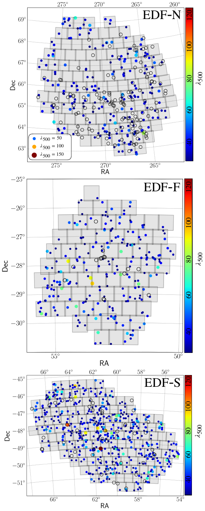

$\newcommand{\ensuremath}{}$
$\newcommand{\xspace}{}$
$\newcommand{\object}[1]{\texttt{#1}}$
$\newcommand{\farcs}{{.}''}$
$\newcommand{\farcm}{{.}'}$
$\newcommand{\arcsec}{''}$
$\newcommand{\arcmin}{'}$
$\newcommand{\ion}[2]{#1#2}$
$\newcommand{\textsc}[1]{\textrm{#1}}$
$\newcommand{\hl}[1]{\textrm{#1}}$
$\newcommand{\footnote}[1]{}$
$\newcommand{\pb}[1]{{\color{red}{#1}}}$
$\newcommand{\ana}[1]{{\color{magenta}{#1}}}$
$\newcommand{\LT}{\texttt{LensTool}}$
$\newcommand{\T}{Table }$
$\newcommand{\Sec}{Sect. }$
$\newcommand{\Fig}{Fig. }$
$\newcommand{\Eq}{Eq. }$
$\newcommand{\ppxf}{\texttt{Ppxf}}$
$\newcommand{\HS}{\texttt{HST2EUCLID}}$
$\newcommand{\sig}{velocity dispersion}$
$\newcommand{\sn}{\left<S/N\right>}$
$\newcommand{\dee}{\mathop{\mathrm{d}\!}}$
$\newcommand{ç}[1]{{\color{blue}{#1}}}$
$\newcommand{\orcid}[1]$

# Euclid Quick Data Release (Q1): The first catalogue of strong-lensing galaxy clusters

<mark>Appeared on: 2025-03-20</mark> -  _Paper submitted as part of the A&A Special Issue `Euclid Quick Data Release (Q1)', 16 pages, 10 figures_

E. Collaboration, et al. -- incl., <mark>K. Jahnke</mark>, <mark>M. Schirmer</mark>

**Abstract:** We present the first catalogue of strong lensing galaxy clusters identified in the Euclid Quick Release 1 observations (covering $63.1 \mathrm{deg^2}$ ). This catalogue is the result of the visual inspection of 1260 cluster fields. Each galaxy cluster was ranked with a probability, $\mathcal{P}_{\mathrm{lens}}$ , based on the number and plausibility of the identified strong lensing features.    Specifically, we identified 83 gravitational lenses with $\mathcal{P}_{\mathrm{lens}}>0.5$ , of which 14 have $\mathcal{P}_{\mathrm{lens}}=1$ , and clearly exhibiting secure strong lensing features, such as giant tangential and radial arcs, and multiple images. Considering the measured number density of lensing galaxy clusters, approximately $0.3 \mathrm{deg}^{-2}$ for $\mathcal{P}_{\mathrm{lens}}>0.9$ , we predict that $\Euclid$ will likely see more than 4500 strong lensing clusters over the course of the mission. Notably, only three of the identified cluster-scale lenses had been previously observed from space. Thus, $\Euclid$ has provided the first high-resolution imaging for the remaining $80$ galaxy cluster lenses, including those with the highest probability. The identified strong lensing features will be used for training deep-learning models for identifying gravitational arcs and multiple images automatically in $\Euclid$ observations. This study confirms the huge potential of $\Euclid$ for finding new strong lensing clusters, enabling exciting new discoveries on the nature of dark matter and dark energy and the study of the high-redshift Universe.

**Figure 10. -** Merging galaxy cluster identified as a secure gravitational lens in the second phase of the visual inspection. The zoom-ins centred on the two merging massive structures are superimposed, showing heat maps derived from the rectangular regions drawn by the inspectors during the visual inspection process. These maps highlight various strong lensing features, including tangential and radial arcs, as well as multiple images, with redder colours indicating more evident features. (*fig:bullet*)

**Figure 1. -** Spatial distribution of galaxy clusters in the DLS and GCWG samples (see $\Sec$\ref{sec:GCcatalogue}). From top to bottom: three zoomed-in views of the Euclid Deep Field North (EDF-N), Euclid Deep Field Fornax (EDF-F), and Euclid Deep Field South (EDF-S) regions. Dot colours and sizes are scaled according to cluster richness, while empty circles mark clusters for which the richness value is not measured by [ and Wen (2024)](). A cut in richness at $\lambda_{500}>30$ is applied to the catalogue by [ and Wen (2024)]() to select the galaxy clusters for visual inspection. (*fig:sky*)

**Figure 3. -** The three secure galaxy cluster strong gravitational lenses ($\mathcal{P}_{\mathrm{lens}}=1$) identified in the calibration phase (GCWG sample). (*fig:clusters_phase1*)

