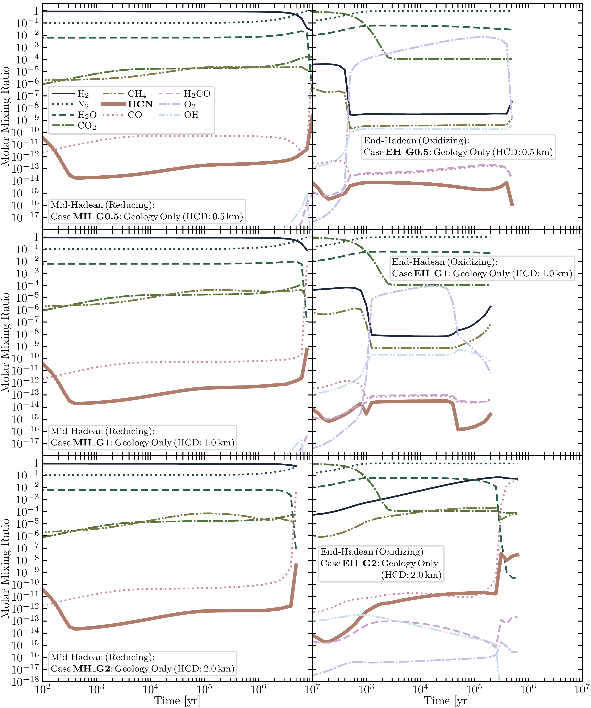
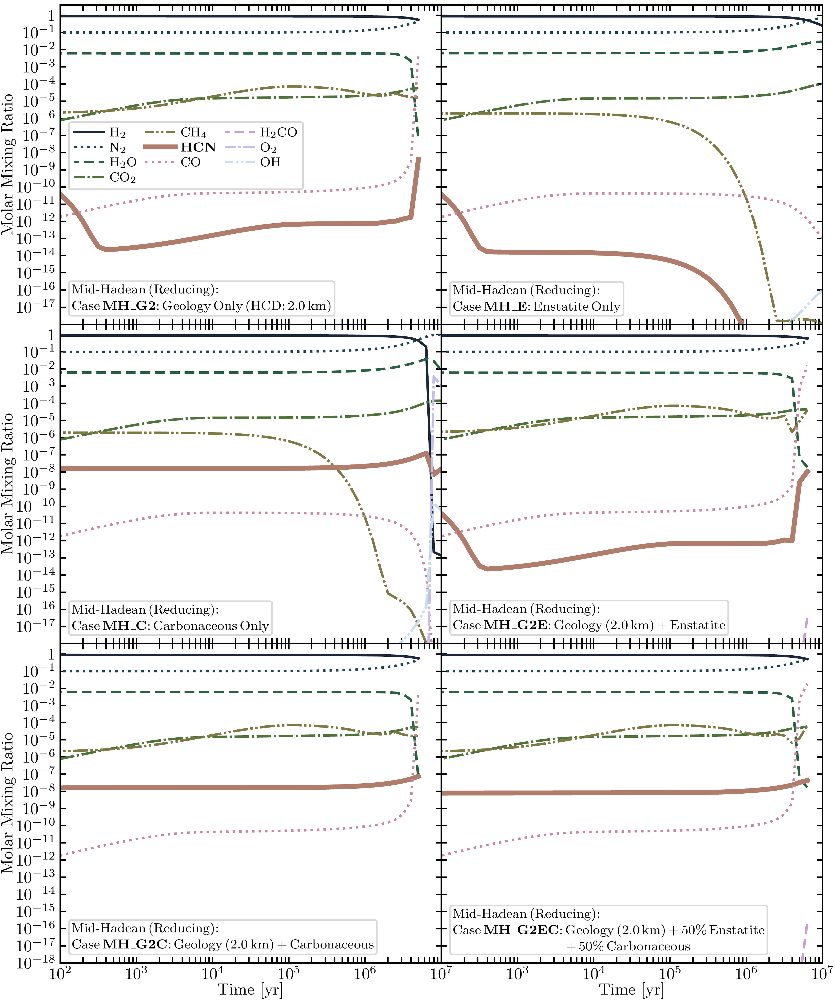

$\newcommand{\ensuremath}{}$
$\newcommand{\xspace}{}$
$\newcommand{\object}[1]{\texttt{#1}}$
$\newcommand{\farcs}{{.}''}$
$\newcommand{\farcm}{{.}'}$
$\newcommand{\arcsec}{''}$
$\newcommand{\arcmin}{'}$
$\newcommand{\ion}[2]{#1#2}$
$\newcommand{\textsc}[1]{\textrm{#1}}$
$\newcommand{\hl}[1]{\textrm{#1}}$
$\newcommand{\footnote}[1]{}$
$\newcommand{\vdag}{(v)^\dagger}$
$\newcommand$
$\newcommand$

# Deep Mantle-Atmosphere Coupling and Carbonaceous Bombardment: Options for Biomolecule Formation on an Oxidized Early Earth

<mark>Appeared on: 2025-03-20</mark> -  _Accepted for publication in The Astrophysical Journal. 44 pages, 12 figures (all colored)_

<mark>K. Paschek</mark>, et al. -- incl., <mark>T. K. Henning</mark>

**Abstract:** $\noindent$ Understanding what environmental conditions prevailed on early Earth during the Hadean eon, and how this set the stage for the origins of life, remains a challenge. Geologic processes such as serpentinization and bombardment by chondritic material during the late veneer might have been very active, shaping an atmospheric composition reducing enough to allow efficient photochemical synthesis of $\ce{HCN}$ , one of the key precursors of prebiotic molecules. $\ce{HCN}$ can rain out and accumulate in warm little ponds (WLPs), forming prebiotic molecules such as nucleobases and the sugar ribose. These molecules could condense to nucleotides, the building blocks of RNA molecules, one of the ingredients of life. Here, we perform a systematic study of potential sources of reducing gases on Hadean Earth and calculate the concentrations of prebiotic molecules in WLPs based on a comprehensive geophysical and atmospheric model. We find that in a reduced $\ce{H2}$ -dominated atmosphere, carbonaceous bombardment can produce enough $\ce{HCN}$ to reach maximum WLP concentrations of $\sim$ $\SIrange{1}{10}{\milli\Molar}$ for nucleobases and, in the absence of seepage, $\sim$ $\SIrange{10}{100}{\micro\Molar}$ for ribose. If the Hadean atmosphere was initially oxidized and $\ce{CO2}$ -rich ( $\SI{90}{\percent}$ ), we find serpentinization alone can reduce the atmosphere, resulting in WLP concentrations of an order of magnitude lower than the reducing carbonaceous bombardment case. In both cases, concentrations are sufficient for nucleotide synthesis, as shown in experimental studies. RNA could have appeared on Earth immediately after it became habitable (about $\SI{100}{\mega\year}$ after the Moon-forming impact), or it could have (re)appeared later at any time up to the beginning of the Archean.

**Figure 6. -** Effect of varying the hydrothermal circulation depth (HCD) during serpentinization on the atmospheric evolution. Shown is the simulated atmospheric composition of key species in the layer closest to the surface as a function of time. Only geological surface fluxes from extended models by Miyazaki2022 are considered as sources for \ce{H2}, \ce{CO2}, and \ce{CH4}(see cases MH/EH\_G0.5, MH/EH\_G1, and MH/EH\_G2 in Tables \ref{tab:cases_red} and \ref{tab:cases_ox}). The two epochs of the mid-Hadean (MH) at \SI{4.4}{\giga\year} with reducing initial conditions and the end-Hadean (EH) at \SI{4.0}{\giga\year} with oxidizing initial conditions are compared (left vs. right column; Panels **MH\_G0.5**, **MH\_G1**, **MH\_G2** vs. **EH\_G0.5**, **EH\_G1**, **EH\_G2**). For each epoch, different HCDs of the primordial ocean penetrating the crustal rock are considered (top row (**MH\_G0.5**, **EH\_G0.5**): \SI{0.5}{\kilo\meter}, middle row (**MH\_G1**, **EH\_G1**): \SI{1.0}{\kilo\meter}, bottom row (**MH\_G2**, **EH\_G2**): \SI{2.0}{\kilo\meter}). The initial conditions for the reducing and oxidizing models are summarized in Table \ref{tab:epochs}, closely following the established atmosphere models developed by Pearce2022. (*fig:photochem_geo*)

**Figure 5. -** The "**_\ce{HCN** machine_}": Geological, atmospheric, meteoritic, and chemical processes synthesizing the building blocks of life on the Hadean Earth (artist's impression, own creation, © Klaus Paschek). Panel **A**(lower right): Serpentinization and mantle processes lead to the efficient synthesis of \ce{H2} and \ce{CH4}, including reactions with water and \ce{CO2}. Panel **B**(lower left): Emission of \ce{H2}, \ce{CH4}, and \ce{CO2} from hydrothermal vents at volcanically active mid-ocean ridges. Panel **C**(center left): Degassing of \ce{H2} and \ce{HCN} by giant impacts. Panel **D**(top right): Synthesis of \ce{HCN} from \ce{CH4} and \ce{N2} by UV photochemistry in the atmosphere. Panel **E**(top left): Atmospheric \ce{HCN} rains out to the Earth's surface and enters lakes, ponds, and the ocean. In ponds, wet-dry cycling and aqueous chemistry convert \ce{HCN} into nucleobases, sugars, and ultimately RNA (oligo)nucleotides, key ingredients of life. (*fig:hadean_earth_scheme*)

**Figure 7. -** Testing whether exogenous chondritic bombardment is capable of keeping the atmosphere reduced while counteracting the oxidizing gases emitted by volcanism, as well as exploring its interplay with serpentinization. Shown is the simulated atmospheric composition of key species in the layer closest to the surface as a function of time starting at \SI{4.4}{\giga\year}. The atmosphere is initially set to a reducing state (\ce{H2}: \SI{90}{\percent}, \ce{N2}: \SI{10}{\percent}, \ce{CH4}: \SI{1}{ppm}) and a temperature of \SI{78}{\celsius}(Table \ref{tab:epochs}), closely following the reducing case considered by Pearce2022. Panel/case **MH\_G2** corresponds to a model driven by serpentinization alone (geology only) and is identical to Figure \ref{fig:photochem_geo}(MH\_G2). It is shown here again for reference to facilitate comparison with the other cases. Cases E and C correspond to scenarios without any contribution from serpentinization, but with the reduction capacity of the late veneer alone competing with the \ce{CO2} flux emitted from the Earth's mantle. Panel **MH\_E** corresponds to a scenario with a bombardment of pure enstatite composition, and panel **MH\_C** instead corresponds to a pure carbonaceous composition. Panels **MH\_G2E**, **MH\_G2C**, and **MH\_G2EC** present the results corresponding to scenarios combining geological and late veneer source flux contributions, with case MH\_G2E combining the geology with an enstatite bombardment (cases MH\_G2 and MH\_E), case MH\_G2C combines the geology instead with a carbonaceous bombardment (MH\_G2 and MH\_C), and case MH\_G2EC combines all three with a half-half split bombardment composition (MH\_G2, \SI{50}{\percent} of MH\_E, and \SI{50}{\percent} of MH\_C). (*fig:photochem_red*)

