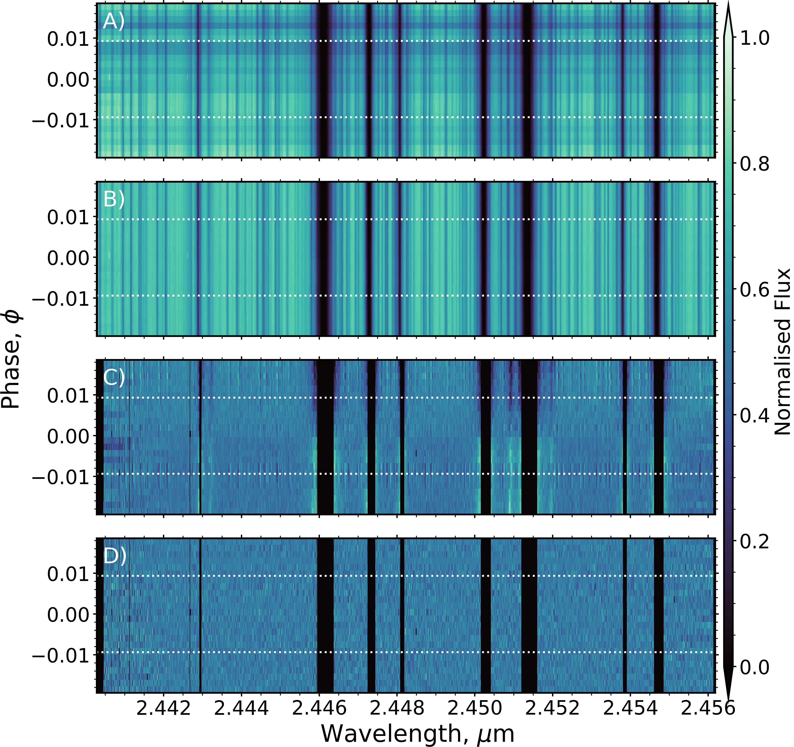
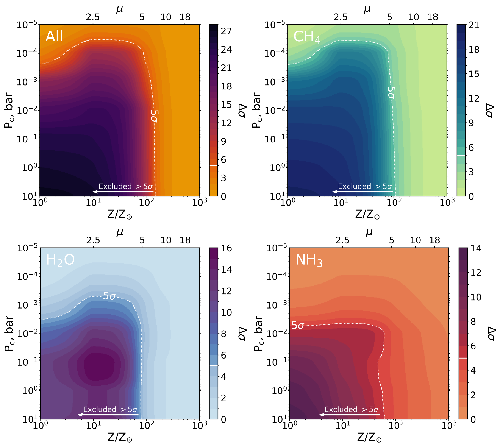
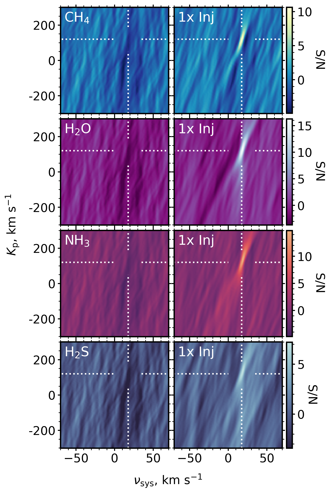

$\newcommand{\ensuremath}{}$
$\newcommand{\xspace}{}$
$\newcommand{\object}[1]{\texttt{#1}}$
$\newcommand{\farcs}{{.}''}$
$\newcommand{\farcm}{{.}'}$
$\newcommand{\arcsec}{''}$
$\newcommand{\arcmin}{'}$
$\newcommand{\ion}[2]{#1#2}$
$\newcommand{\textsc}[1]{\textrm{#1}}$
$\newcommand{\hl}[1]{\textrm{#1}}$
$\newcommand{\footnote}[1]{}$
$\newcommand{\LTP}[1]{\textcolor{red}{\textsf{LTP: #1}}}$
$\newcommand{\thebibliography}{\DeclareRobustCommand{\VAN}[3]{##3}\VANthebibliography}$

# Limits on the atmospheric metallicity and aerosols of the sub-Neptune GJ 3090 b from high-resolution CRIRES+ spectroscopy

<mark>Appeared on: 2025-03-24</mark> -  _17 pages, 11 figures. Accepted for publication in MNRAS_

L. T. Parker, et al. -- incl., <mark>L. Kreidberg</mark>

**Abstract:** The sub-Neptune planets have no solar system analogues, and their low bulk densities suggest thick atmospheres containing degenerate quantities of volatiles and H/He, surrounding cores of unknown sizes. Measurements of their atmospheric composition can help break these degeneracies, but many previous studies at low spectral resolution have largely been hindered by clouds or hazes, returning muted spectra. Here, we present the first comprehensive study of a short-period sub-Neptune using ground-based, high-resolution spectroscopy, which is sensitive to the cores of spectral lines that can extend above potential high altitude aerosol layers. We observe four CRIRES+ _K_ -band transits of the warm sub-Neptune GJ 3090 b (T $_{\text{eq}}$ = 693 $\pm$ 18 K) which orbits an M2V host star. Despite the high quality data and sensitivity to $CH_4$ , $H_2$ O, $NH_3$ , and $H_2$ S, we detect no molecular species. Injection-recovery tests are consistent with two degenerate scenarios. First, GJ 3090 b may host a highly metal-enriched atmosphere with > 150 Z $_{\odot}$ and mean molecular weight > 7.1 g mol $^{-1}$ , representing a volatile dominated envelope with a H/He mass fraction $x_{\text{H/He}} < 33\%$ , and an unconstrained aerosol layer. Second, the data are consistent with a high altitude cloud or haze layer at pressures < 3.3 $\times$ 10 $^{-5}$ bar, for any metallicity. GJ 3090 b joins the growing evidence to suggest that high metallicity atmospheres and high altitude aerosol layers are common within the warm (500 $< T_{\text{eq}} <$ 800 K) sub-Neptune population. We discuss the observational challenges posed by the M-dwarf host star, and suggest observing strategies for transmission spectroscopy of challenging targets around M-dwarfs for existing and ELT instrumentation.

**Figure 4. -** The data processing stages for the four CRIRES+ transits, with transit ingress and egress marked by the white dashed horizontal lines. Panel A shows the optimally extracted and phase ordered spectra, following basic calibrations including background subtraction. Panel B shows the normalised, wavelength calibrated spectra, where any residual large scale trends have been removed through division by a smoothed spectrum. Panel C shows the spectra shifted into the stellar rest frame, where saturated telluric lines and high variance columns have been masked following bad pixel correction and division by the master spectrum constructed from the mean of all exposures. Finally, Panel D shows the spectra after sysrem is applied iteratively to remove remaining linear systematic trends in the data. These resulting cleaned spectra are subsequently cross-correlated with planetary models. This figure shows the B nod spectra extracted from the first order of the second detector during the second transit. (*fig:data_proc*)

**Figure 11. -** Recovered significance on the planetary signal ($\Delta\sigma$) when performing all-species injection-recovery tests i.e. where a model containing spectral features from all considered molecules ($CH_4$, $H_2$O, $NH_3$, $H_2$S, $CO_2$, CO) is injected, and a template containing only a single molecule is used to recover it. The exception is the top left panel where the cross-correlation template matches the all-species injected model. Dark regions denote areas of the parameter space where the injected model is confidently recovered to $>$5$\sigma$ and thus ruled out as a plausible scenarios for the planetary atmosphere. The sensitivity of the data to $CH_4$ is largely invariant across the all vs. single-species injection methods (see Figure \ref{fig:injections_ind_inj}). Low metallicities with low cloud decks are strongly disfavoured. The molecules for which we have no constraining power in these injection-recovery tests are shown in Figure \ref{fig:injections_no_constrainign_power}.
 (*fig:injections_all_inj*)

**Figure 5. -** Left: the combined $K_{\text{p}}$--$v_{\text{sys}}$ map from the four K2166 transits of GJ 3090 b for cross-correlation with $CH_4$, $H_2$O, $NH_3$ and $H_2$S templates (1 bar cloud deck, 10 Z$_{\odot}$ metallicity). No signals are observed at the expected planetary orbital and systemic velocities at sufficient significance to support a planetary origin. Note the anti-correlation at the planetary $K_{\text{p}}$, which is offset by $\sim$5 km s$^{-1}$ from the planetary systemic velocity. This likely arises from the overlap of stellar and telluric residual noise when combining the four transits, but does not impact the recovery significance of injected models when using the log(L) mapping. Right: the recovery of the same models (1 bar cloud deck, 10 Z$_{\odot}$ metallicity) injected into the 4 transit datasets. Each of these models can be recovered at high S/N, demonstrating the constraining power of the data. (*fig:real_vs_inj*)

