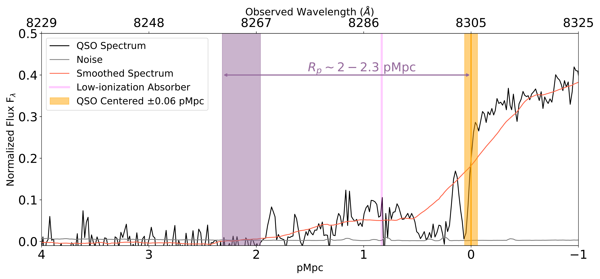
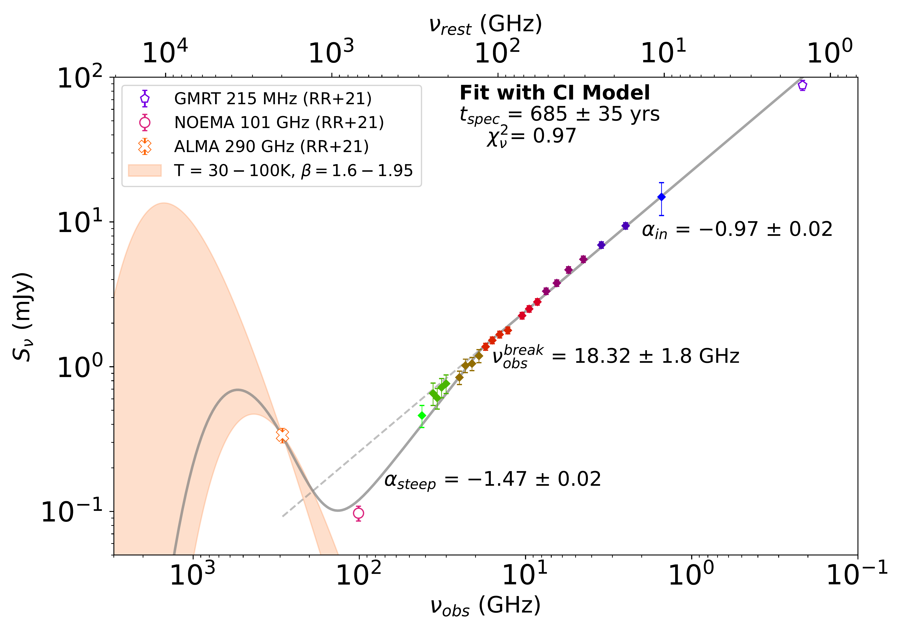
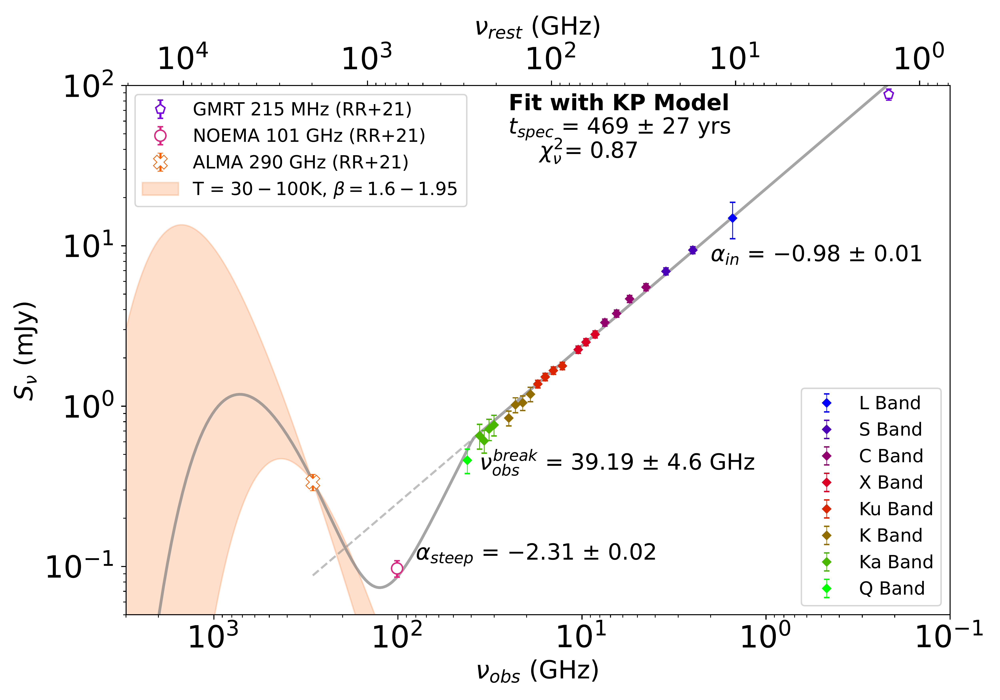
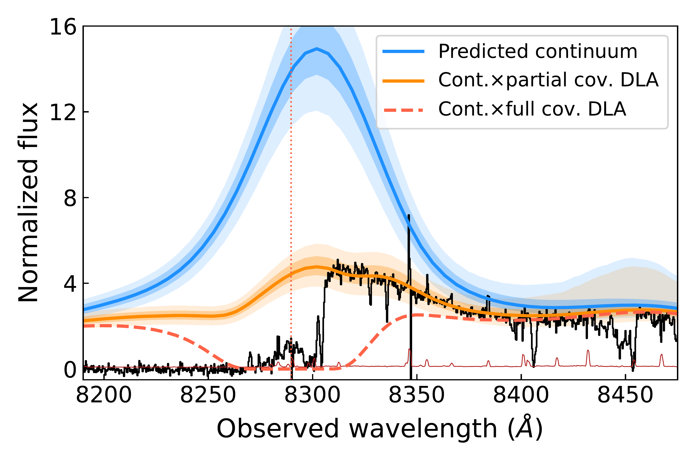

$\newcommand{\ensuremath}{}$
$\newcommand{\xspace}{}$
$\newcommand{\object}[1]{\texttt{#1}}$
$\newcommand{\farcs}{{.}''}$
$\newcommand{\farcm}{{.}'}$
$\newcommand{\arcsec}{''}$
$\newcommand{\arcmin}{'}$
$\newcommand{\ion}[2]{#1#2}$
$\newcommand{\textsc}[1]{\textrm{#1}}$
$\newcommand{\hl}[1]{\textrm{#1}}$
$\newcommand{\footnote}[1]{}$
$\newcommand{\checktext}[1]{\textbf{\textcolor{orange}{#1}}}$
$\newcommand{\fix}[1]{\textcolor{red}{#1}}$
$\newcommand{\lsim}{\mbox{_<\atop^{\sim}}}$
$\newcommand{\gsim}{\mbox{_>\atop^{\sim}}}$
$\newcommand{\eseven}{\times10^{-17}}$
$\newcommand{\eeight}{\times10^{-18}}$
$\newcommand{\lya}{Ly\alpha}$
$\newcommand{\ha}{H\alpha}$
$\newcommand{\han}{H\alpha+[\ion{N}{2}]}$
$\newcommand{\hb}{H\beta}$
$\newcommand{\hg}{H\gamma}$
$\newcommand{\oiiib}{[\ion{O}{3}]\lambda5007}$
$\newcommand{\sii}{[\ion{S}{2}]}$
$\newcommand{\hi}{H {\sc i}}$
$\newcommand{\hii}{H {\sc ii}}$
$\newcommand{\hei}{He {\sc i}}$
$\newcommand{\heii}{He {\sc ii}}$
$\newcommand{\nii}{[Ni {\sc ii}}$
$\newcommand{\ciii}{C {\sc iii}]}$
$\newcommand{\ciiiS}{C {\sc iii}]}$
$\newcommand{\siiv}{Si {\sc iv}}$
$\newcommand{\civ}{C {\sc iv}}$
$\newcommand{\nv}{N {\sc v}}$
$\newcommand{\cii}{[C {\sc ii}]}$
$\newcommand{\ciiS}{C {\sc ii}}$
$\newcommand{\oiii}{[O {\sc iii}]}$
$\newcommand{\oii}{[O {\sc ii}]}$
$\newcommand{\oi}{O {\sc i}}$
$\newcommand{\mgii}{Mg {\sc ii}}$
$\newcommand{\siii}{Si {\sc ii}}$
$\newcommand{\feii}{Fe {\sc ii}}$
$\newcommand{\alii}{Al {\sc ii}}$
$\newcommand{\Mdust}{\textit{M}_{\mathrm{Dust}} }$
$\newcommand{\Lfir}{\textit{L}_{\mathrm{FIR}}}$
$\newcommand{\Ltir}{\textit{L}_{\mathrm{TIR}} }$
$\newcommand{\Msun}{M_\odot}$
$\newcommand{\angstrom}{\text{\normalfontÅ}}$
$\newcommand{\es}{erg s^{-1}}$
$\newcommand{\esc}{erg s^{-1} cm^{-2}}$
$\newcommand{\esca}{erg s^{-1} cm^{-2} Å^{-1}}$
$\newcommand{\esa}{erg s^{-1} Å^{-1}}$
$\newcommand{\vband}{V_{\mathrm{F606W}}}$
$\newcommand{\ibband}{I_{\mathrm{F600LP}}}$
$\newcommand{\iband}{I_{\mathrm{F814W}}}$
$\newcommand{\ybband}{Y_{\mathrm{F098M}}}$
$\newcommand{\yband}{Y_{\mathrm{F105W}}}$
$\newcommand{\yj}{J_{\mathrm{F110W}}}$
$\newcommand{\jband}{J_{\mathrm{F125W}}}$
$\newcommand{\jh}{JH_{\mathrm{F140W}}}$
$\newcommand{\hband}{H_{\mathrm{F160W}}}$
$\newcommand{\hst}{\textit{HST}}$
$\newcommand{\jwst}{\textit{JWST}}$
$\newcommand{\spitzer}{\textit{Spitzer}}$
$\newcommand{\se}{\textit{Source Extractor}}$
$\newcommand{\rhalf}{r_{1/2}}$
$\newcommand{\reff}{R_{\mathrm{eff}}}$
$\newcommand{\Pisco}{ULAS J1342+0928}$

# First Measurements of Black Hole Accretion and Radio-jet Timescales in a Young Quasar at the Edge of Reionization

<mark>Appeared on: 2025-03-24</mark> -  _20 pages, 9 figures, submitted to ApJ_

S. Rojas-Ruiz, et al. -- incl., <mark>E. Bañados</mark>, <mark>Y. Khusanova</mark>

**Abstract:** We present the first study dedicated to measuring the timescales for black hole accretion and jet launch in a quasar at the edge of Reionization, PSO J352.4034--15.3373 at $z\!=\!5.832 \pm 0.001$ .Previous work presented evidence of the strong radio synchrotron emission from the jet affecting the host galaxy dust-dominated continuum emission at $\nu_{\rm rest}=683$ GHz ( $\nu_{\rm obs}=100$ GHz), implying a break in the synchrotron spectrum. In this work, we present quasi-simultaneous observations at 1.5  GHz -- 42 GHz with the Karl G. Jansky Very Large Array (VLA), and derive a frequency break at $\nu^{\rm break}_{\rm rest} = 196.46$ GHz ( $\nu^{\rm break}_{\rm obs} = 28.76$ GHz). Modeling these observations, we calculate the jet spectral aging from the cooling of electrons to be $t_{\mathrm{spec}}\sim 580$ yr. From this measurement, we approximate the dynamical age $t_{\mathrm{dyn}}$ to be $\sim2,000$ yr, implying a recent jet ejection. We compare the jet timescale to the quasar's lifetime ( $t_{\mathrm{Q}}$ ) that indicates the duration of the latest black hole accretion event and is derived from the proximity zone size in the rest-UV/optical spectrum. However, a ghostly Damped Ly $\alpha$ (DLA) system affects this measurement yielding an upper limit of $t_{\mathrm{Q}} \lesssim 10^4$ yr, consistent with the jet lifetime and indicative of a young quasar. This suggests that the triggering of a UV-bright quasar phase may occur within comparable timescales as the launch of a relativistic radio jet. Therefore, we may be witnessing an early stage of black hole and jet interactions in a quasar during the first gigayear of the universe.

**Figure 6. -** Spectrum of P352--15 normalized by the predicted continuum from the PCA analysis (black) and the noise (grey). Given the strong low ionization absorber (centered at the location of the pink vertical line), the normalized flux is less than half at the boundary of the position of the quasar. The flux smoothed with a boxcar kernel of 20 Å is shown in red. Notice that despite the presence of the strong absorber, significant transmission extends from the position of the quasar (yellow vertical region) up to where the transmission and the smoothed spectrum reach the zero level (shaded in purple). This region corresponds to the measured proximity zone bounds $R_{\rm p}\sim2-2.3$ pMpc and is the conservative upper limit we use for the calculation of the quasar lifetime $t_{\mathrm{Q}}$. (*Rp*)

**Figure 3. -** The mm to radio SED fit of P352--15 based on different synchrotron break models.The mm to radio SED of P352--15. The mm-observations presented here are from \citetalias{rojas-ruiz_impact_2021}, and the radio observations are from this work in all the VLA from 1.5 GHz - 42 GHz. We report the combined fit of the cold dust emission, modeled with an MBB, and a synchrotron break, modeled with the CI _(top)_ and KP _(bottom)_ models (see \S\ref{model-break}). We note that both fits are consistent with our observations, the difference relies on the assumption of relativistic electron distribution. The resulting spectral aging of the jet $t_{\mathrm{spec}}$ from both models falls within the same order of magnitude and for the rest of this work we consider both values as upper and lower estimates, correspondingly. (*sync-models*)

**Figure 1. -** P352--15 spectrum (black) and different models predicting the Ly$\alpha$ emission. The model for the predicted unabsorbed spectrum is shown in blue. The DLA system is shown centered at the position of the red dotted vertical line. The continuum fully covered by the DLA is shown with a red dashed line. Given that partial flux is observed, we model the continuum prediction when partially covered by the DLA as shown in orange. Each model has the $\pm1\sigma$ and $\pm2\sigma$ uncertainties in shaded colors. (*ghost*)

