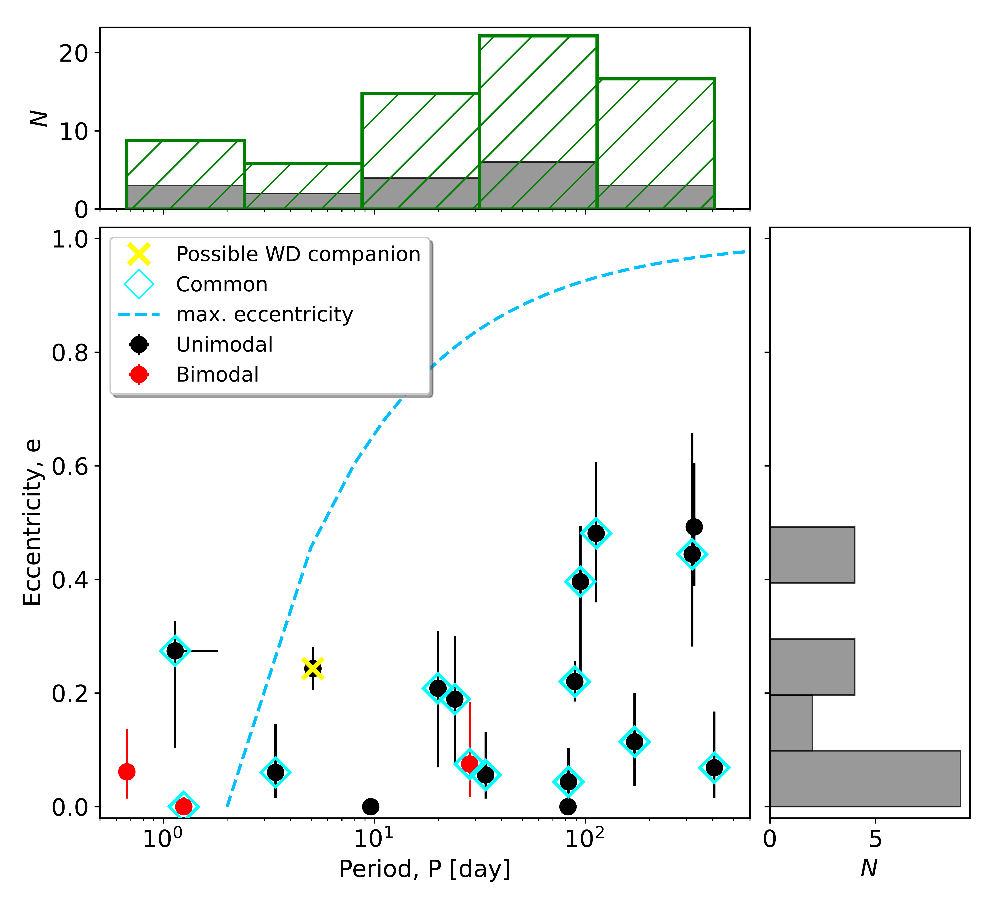
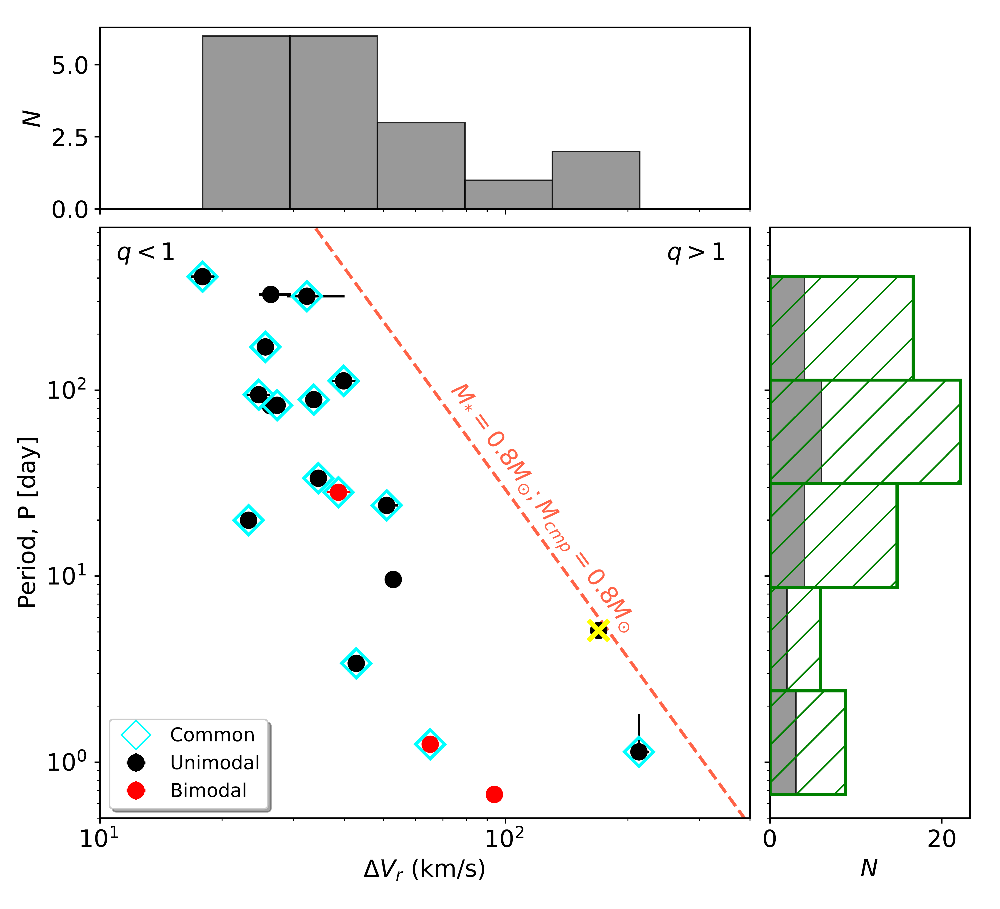
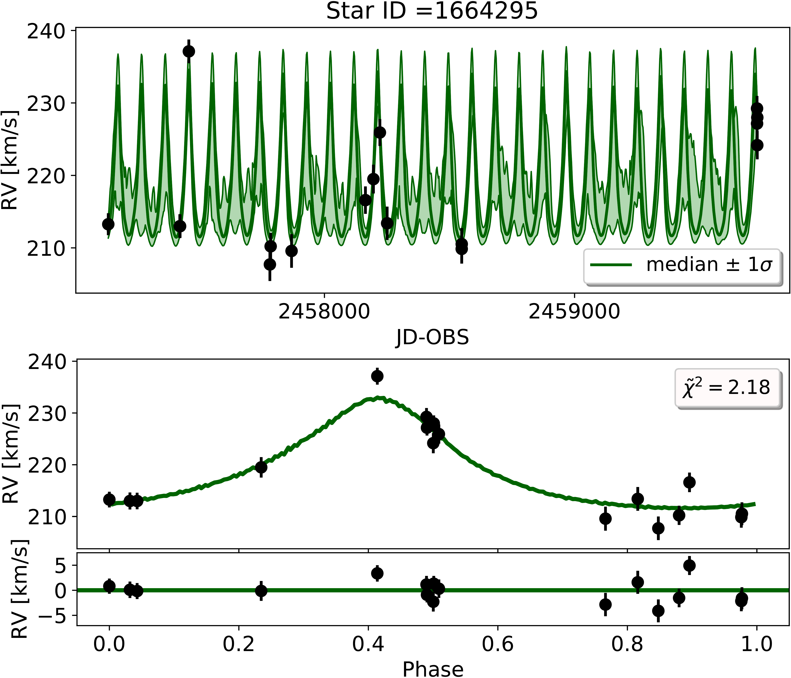
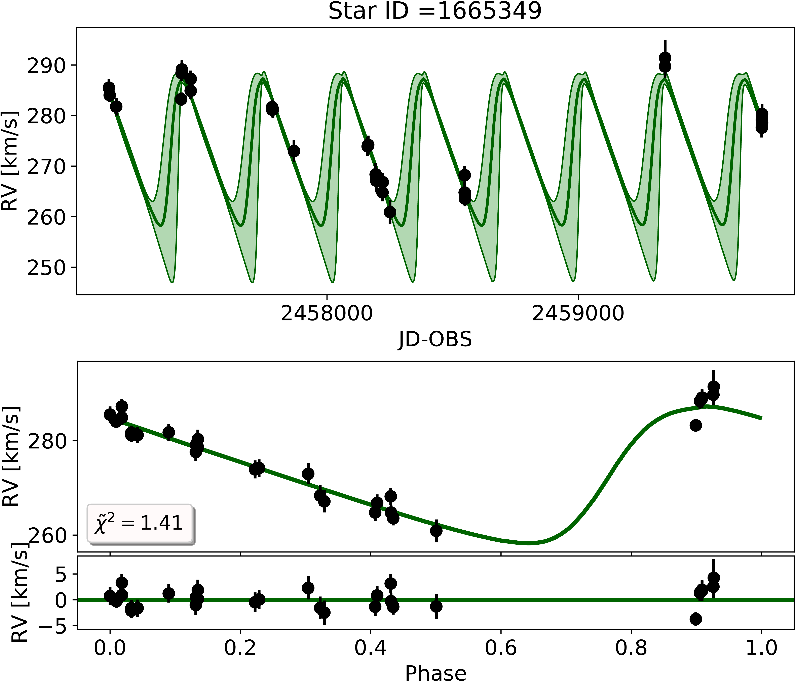
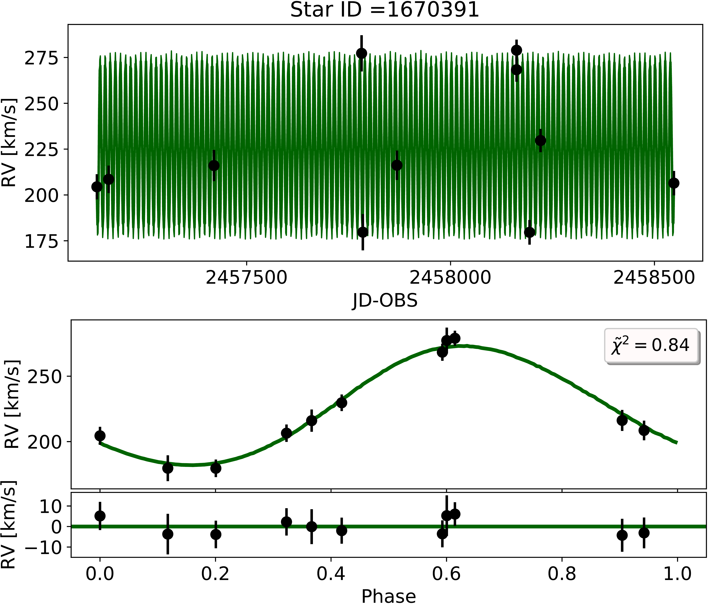
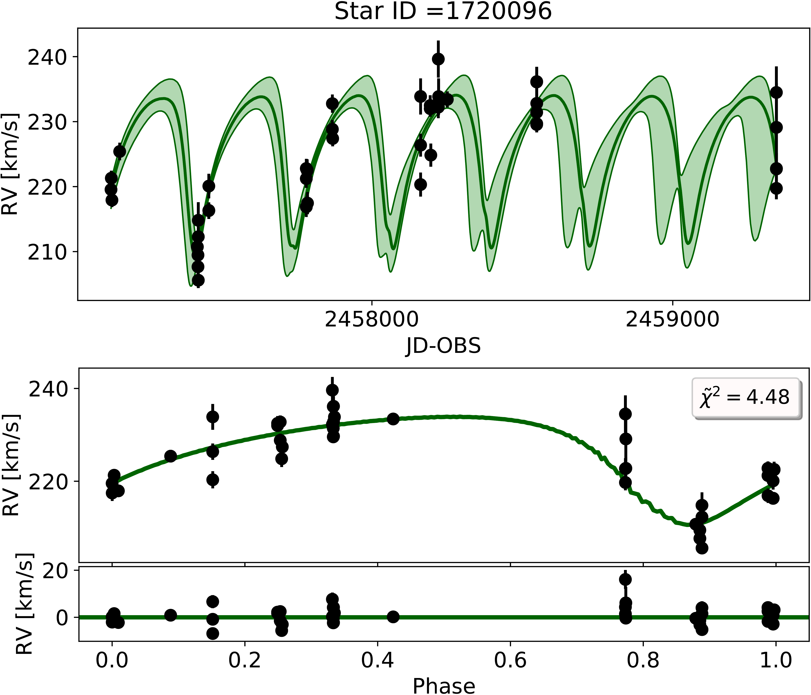
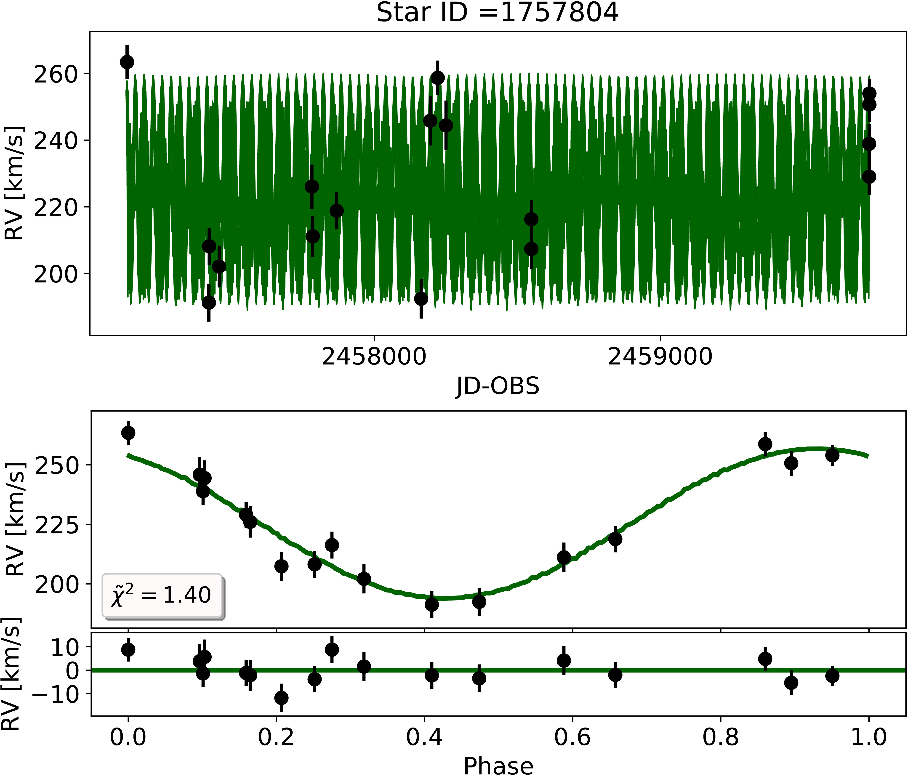

$\newcommand{\ensuremath}{}$
$\newcommand{\xspace}{}$
$\newcommand{\object}[1]{\texttt{#1}}$
$\newcommand{\farcs}{{.}''}$
$\newcommand{\farcm}{{.}'}$
$\newcommand{\arcsec}{''}$
$\newcommand{\arcmin}{'}$
$\newcommand{\ion}[2]{#1#2}$
$\newcommand{\textsc}[1]{\textrm{#1}}$
$\newcommand{\hl}[1]{\textrm{#1}}$
$\newcommand{\footnote}[1]{}$
$\newcommand{\thebibliography}{\DeclareRobustCommand{\VAN}[3]{##3}\VANthebibliography}$

# Studying Binary Systems in Omega Centauri with MUSE: II. Observational constraints on the orbital period distribution

<mark>Appeared on: 2025-03-26</mark> -  _22 pages (Appendix A and B included), 16 Figures, 4 Tables. Accepted for publication in Monthly Notices of the Royal Astronomical Society_

S. Saracino, et al. -- incl., <mark>J. Müller-Horn</mark>, <mark>N. Neumayer</mark>, <mark>M. Häberle</mark>

**Abstract:** Omega Centauri ( $\omega$ Cen) is one of the most complex star clusters in the Milky Way, and likely the stripped nucleus of an accreted dwarf galaxy. Being the subject of debate between it hosting an intermediate-mass black hole (IMBH) or a collection of stellar-mass black holes (BHs) in its center, $\omega$ Cen has been intensively studied over the past decades. Our work focuses on characterizing the properties of binary systems in $\omega$ Cen via multi-epoch MUSE spectroscopic observations spanning over eight years and covering much of its central regions (i.e. core radius). We did not detect any stellar-mass BHs candidates orbiting luminous stars, although mock samples indicate a high sensitivity of our survey to such systems. This suggests that BHs orbiting stars may be rare in $\omega$ Cen or in wide orbits around low-mass companions (where our survey is 50 \% complete) or that the periods of such systems are longer than expected from cluster dynamics. Additionally, we constrained the orbital properties of 19 binary systems in the cluster, with periods ranging from fractions of a day up to several hundred days. We observe an excess of binaries with P $\geq$ 10 d and find evidence that the intrinsic period distribution of binaries in $\omega$ Cen differs from those predicted by cluster evolutionary models.

**Figure 2. -** Eccentricity - Period plot of the well-constrained binaries in $\omega$ Cen. Binaries with unimodal and bimodal solutions in the posterior period sampling are shown as black and red dots, respectively. Cyan diamonds identify binaries constrained by both The Joker and Ultranest. The period distribution of the 19 binaries is shown in gray in logarithmic scale and spans the range between 1 and 500 days with multiple peaks. The green histogram shows the same period distribution, once corrected for the incompleteness derived in Section \ref{sec:testI}. The eccentricity distribution, on the other hand, varies only from 0 to 0.5, with a peak around 0.1/0.15, i.e. prefers low eccentricity orbits. The dashed cyan line defines the maximum expected eccentricity for a given period. Binaries with P$<$ 2 days are expected to have circular or close to circular orbits. The reported values are from Ultranest. The values from The Joker can be found in Table \ref{tab:constrained} in the Appendix. (*fig:Pe_plot*)

**Figure 3. -** Period - Peak-to-Peak RV variation ($\Delta V_{r}$) plot of the 19 well constrained binaries in $\omega$ Cen. The colour code is the same as in Figure \ref{fig:Pe_plot}, also shown in the bottom-left legend. Stars with large orbital periods and/or high peak-to-peak RV variability occupy the upper right region of the plot. The dashed orange line defines the locus where equal-mass binaries composed of two stars with mass $0.8M_{\odot}$ -- the maximum stellar mass expected in $\omega$ Cen given its absolute age -- are located when observed edge-on. Binaries with q<1 are on the left of the orange line, while binaries with q>1 are on the right. The 1D period and $\Delta V_{r}$ distributions of the 19 binaries are also shown in the figure, in gray in logarithmic scale, spanning a large range of values. As in Fig. \ref{fig:Pe_plot}, the green histogram refers to the distribution of periods, once corrected for the results of Section \ref{sec:testI}. The reported values are from Ultranest. The values from The Joker, are provided in Table \ref{tab:constrained} in the Appendix. (*fig:PK_plot*)

**Figure 13. -** Constrained binaries in $\omega$ Cen sorted by Star ID. The upper panel of every plot shows the observed RV curve (black points), the best-fit median model and the $\pm$ 1 $\sigma$ models (green continues lines). The green shaded area is the allowed region by propagating the uncertainties on the parameters. The lower panel shows the same RVs phase folded with the period from the median model. The colour code is the same as in upper panel. Moreover, it also contains the residuals after subtracting this model from the data. The reduced $\chi^2$ of the best-fit median model is also mentioned. (*fig:plot*)

