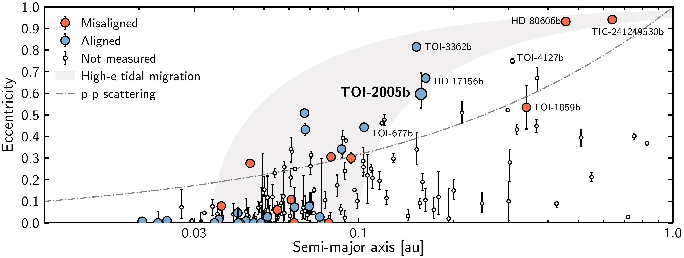
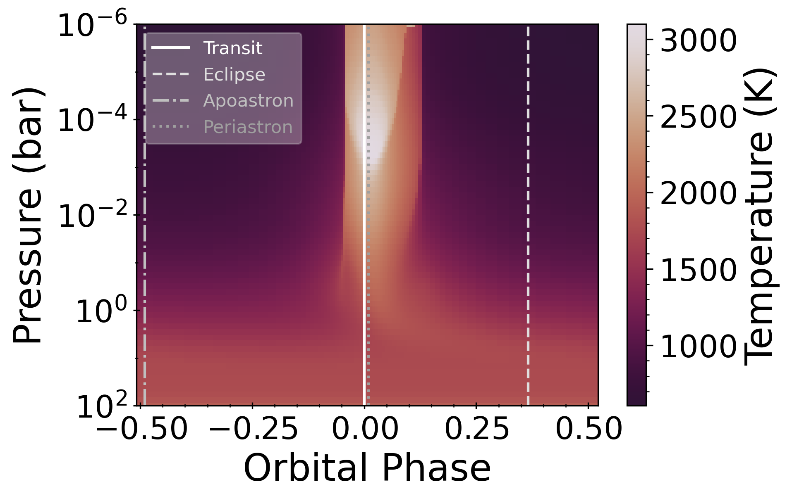
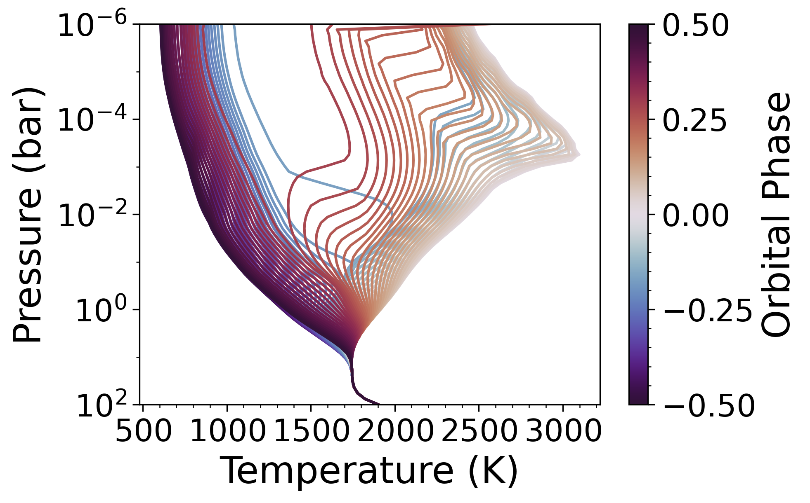
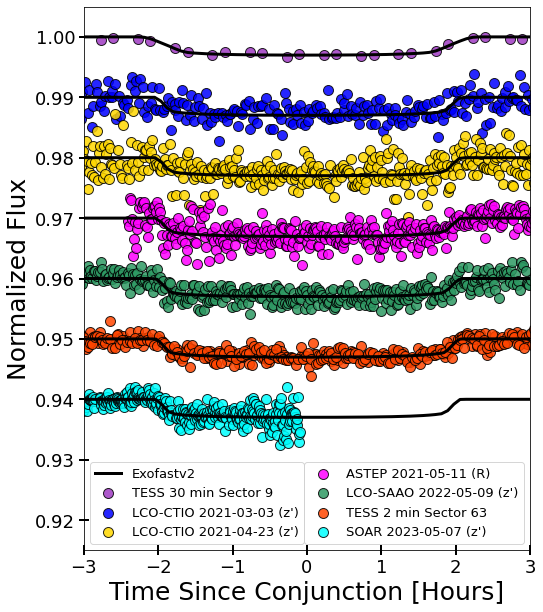

$\newcommand{\ensuremath}{}$
$\newcommand{\xspace}{}$
$\newcommand{\object}[1]{\texttt{#1}}$
$\newcommand{\farcs}{{.}''}$
$\newcommand{\farcm}{{.}'}$
$\newcommand{\arcsec}{''}$
$\newcommand{\arcmin}{'}$
$\newcommand{\ion}[2]{#1#2}$
$\newcommand{\textsc}[1]{\textrm{#1}}$
$\newcommand{\hl}[1]{\textrm{#1}}$
$\newcommand{\footnote}[1]{}$
$\newcommand{\bjdtdb}{\ensuremath{\rm{BJD_{TDB}}}}$
$\newcommand{\meh}{\ensuremath{\left[{\rm m}/{\rm H}\right]}}$
$\newcommand{\feh}{\ensuremath{\left[{\rm Fe}/{\rm H}\right]}}$
$\newcommand{\teff}{\ensuremath{T_{\rm eff}}}$
$\newcommand{\logg}{\ensuremath{\log g}}$
$\newcommand{\vsini}{\ensuremath{v\sin i}}$
$\newcommand{\vsinistar}{\ensuremath{v\sin I_\star}}$
$\newcommand{\loggunits}{cm s^{-2}}$
$\newcommand{\ecosw}{\ensuremath{e\cos{\omega_*}}}$
$\newcommand{\esinw}{\ensuremath{e\sin{\omega_*}}}$
$\newcommand{\aor}{\ensuremath{a/R_{\star}}}$
$\newcommand{\msun}{\ensuremath{M_\Sun}}$
$\newcommand{\rsun}{\ensuremath{R_\Sun}}$
$\newcommand{\lsun}{\ensuremath{L_\Sun}}$
$\newcommand{\rj}{\ensuremath{R_{\rm Jup}}}$
$\newcommand{\mj}{\ensuremath{M_{\rm Jup}}}$
$\newcommand{\fixme}{\textcolor{red}{[FIXME] }}$
$\newcommand{\vdag}{(v)^\dagger}$
$\newcommand$
$\newcommand$
$\newcommand{\tess}{\emph{TESS}\xspace}$
$\newcommand{\gaia}{\emph{Gaia}\xspace}$
$\newcommand{\tres}{TRES\xspace}$
$\newcommand{\ut}{UT\xspace}$
$\newcommand{\bjd}{BJD\xspace}$
$\newcommand{\ms}{ m s^{-1}}$
$\newcommand{\kms}{ km s^{-1}}$
$\newcommand{\tic}{TIC 147660886\xspace}$
$\newcommand{\ticb}{TIC 147660886 b\xspace}$
$\newcommand{\toi}{TOI-2005\xspace}$
$\newcommand{\toib}{TOI-2005 b\xspace}$
$\newcommand{\pmRA}{-25.248\pm0.012}$
$\newcommand{\pmDEC}{8.399\pm0.016}$
$\newcommand{\parallax}{2.991\pm0.017}$
$\newcommand{\vsiniLSD}{111\pm1}$
$\newcommand{\loggfit}{3.946\pm0.035}$
$\newcommand{\tefffit}{7130\pm150}$
$\newcommand{\metfit}{0.01\pm0.08}$
$\newcommand{\mstar}{1.59^{+0.016}_{-0.017}}$
$\newcommand{\rstar}{2.02^{+0.14}_{-0.16}}$
$\newcommand{\lstar}{9.17^{+0.52}_{-0.99}}$
$\newcommand{\age}{1.6\pm0.1}$
$\newcommand{\dist}{328.7^{+4.6}_{-4.2}}$
$\newcommand{\per}{17.305904_{-0.000020}^{+0.000023}}$
$\newcommand{\plrad}{1.07^{+0.06}_{-0.11}}$
$\newcommand{\ecc}{0.597^{+0.097}_{-0.065}}$
$\newcommand{\semimaj}{0.16\pm0.02}$
$\newcommand{\lam}{4.8^{+2.3}_{-2.5}}$
$\newcommand{\CfA}{Center for Astrophysics \textbar  Harvard \& Smithsonian, 60 Garden Street, Cambridge, MA 02138, USA}$
$\newcommand{\USQ}{University of Southern Queensland, Centre for Astrophysics, West Street, Toowoomba, QLD 4350 Australia}$
$\newcommand{\FlatironCCA}{Center for Computational Astrophysics, Flatiron Institute, 162 Fifth Avenue, New York, NY 10010, USA}$
$\newcommand{\UIUC}{Department of Astronomy, University of Illinois at Urbana-Champaign, Urbana, IL 61801, USA}$
$\newcommand{\PSUAA}{Department of Astronomy \& Astrophysics, 525 Davey Laboratory, The Pennsylvania State University, University Park, PA, 16802, USA}$
$\newcommand{\PSUCEHW}{Center for Exoplanets and Habitable Worlds, 525 Davey Laboratory, The Pennsylvania State University, University Park, PA, 16802, USA}$
$\newcommand{\NOIRLAB}{NSF’s National Optical-Infrared Astronomy Research Laboratory, 950 N. Cherry Avenue, Tucson, AZ 85719, USA}$
$\newcommand{\MITKavli}{Department of Physics and Kavli Institute for Astrophysics and Space Research, Massachusetts Institute of Technology, Cambridge, MA 02139, USA}$
$\newcommand{\DTU}{DTU Space,  Technical University of Denmark, Elektrovej 328, DK-2800 Kgs. Lyngby, Denmark}$
$\newcommand{\CarnegieOBS}{The Observatories of the Carnegie Instution for Science, 813 Santa Barbara Street, Pasadena, CA, 91101, USA}$
$\newcommand{\CarnegieLCO}{Las Campanas Observatory, Carnegie Institution for Science, Colina El Pino, Casilla 601 La Serena, Chile}$
$\newcommand{\CarnegieEPL}{Earth and Planets Laboratory, Carnegie Institution for Science, 5241 Broad Branch Road, NW, Washington, DC 20015, USA}$

# TOI-2005b: An Eccentric Warm Jupiter in Spin-Orbit Alignment

<mark>Appeared on: 2025-03-27</mark> -  _15 pages, 10 figures, 4 tables_

A. Bieryla, et al. -- incl., <mark>T. Henning</mark>

**Abstract:** We report the discovery and characterization of $\toib$ , a warm Jupiter on an eccentric ( $e\sim0.59$ ), 17.3-day orbit around a $V_\mathrm{mag}$ = 9.867 rapidly rotating F-star. The object was detected as a candidate by TESS and the planetary nature of $\toib$ was then confirmed via a series of ground-based photometric, spectroscopic, and diffraction-limited imaging observations. The planet was found to reside in a low sky-projected stellar obliquity orbit ( $\lambda = $ $\lam$ degrees) via a transit spectroscopic observation using the Magellan MIKE spectrograph. $\toib$ is one of a few planets known to have a low-obliquity, high-eccentricity orbit, which may be the result of high-eccentricity coplanar migration. The planet has a periastron equilibrium temperature of $\sim 2100$ K, similar to some highly irradiated hot Jupiters where atomic metal species have been detected in transmission spectroscopy, and varies by almost 1000 K during its orbit. Future observations of the atmosphere of TOI-2005b can inform us about its radiative timescales thanks to the rapid heating and cooling of the planet.

**Figure 9. -** Eccentricity vs. semi-major axis for all confirmed transiting planets between 6--20 Earth radii. Colored circles are planets with measured spin-orbit angles. Blue circles are defined as `aligned' with spin-orbit angles of less than 30 degrees and red circles are defined as `misaligned' with spin-orbit angles greater than 30 degrees. The gray region illustrates planets that are likely undergoing high-eccentricity tidal migration. The upper and lower limits of the track are set by the Roche limit and the tidal circularization timescale  ([Dong, Huang and Zhou 2021]()) . $\toi$b sits on the lower edge of the migration track. The dotted-dashed line presents the theoretical upper limit of eccentricities as a result of planet-planet scattering, assuming a planet with a mass of 0.5 $M_{\rm Jup}$ and a radius of 2 $R_{\rm Jup}$, for illustrative purpose  ([Petrovich, Tremaine and Rafikov 2014]()) .
Data were compiled from the NASA Exoplanet Archive as of October 30, 2024. Stellar obliquity measurements were obtained from [Knudstrup, Albrecht and Winn (2024)]() Table B2 with recent updates. (*fig:ecc_au*)

**Figure 5. -** Temperature as a function of pressure over orbital phase from a 1D timestepping cloud-free atmospheric model generated using \texttt{EGP+}. Due to the presence of TiO and VO in the model atmosphere, at periastron the temperature of the upper atmosphere rises rapidly causing an inversion. (*fig:TP*)

**Figure 1. -** Ground-based and TESS lightcurves normalized and offset relatively in flux and phased in time to the best-fit ephemeris. The best-fit model is shown in black. (*fig:allLCs*)

