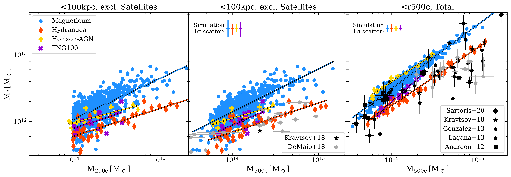
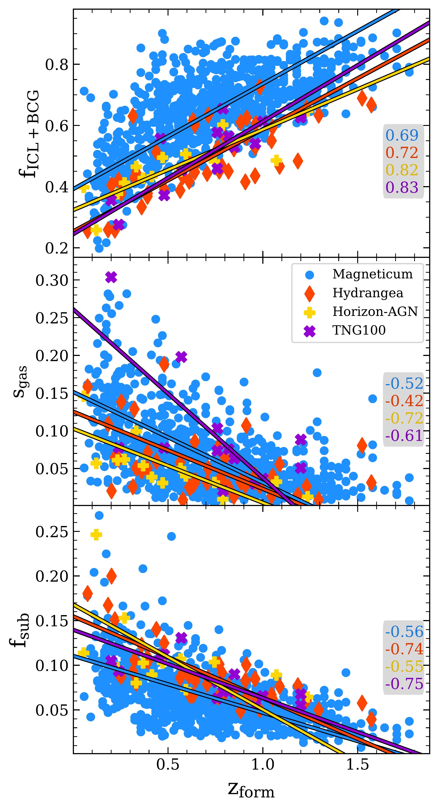
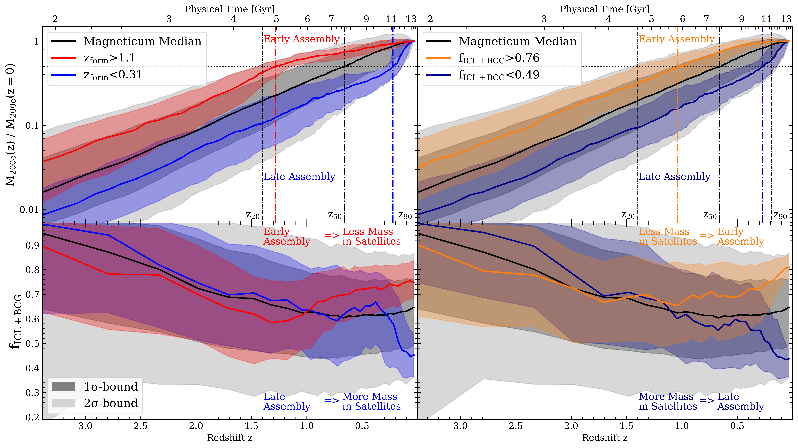

$\newcommand{\ensuremath}{}$
$\newcommand{\xspace}{}$
$\newcommand{\object}[1]{\texttt{#1}}$
$\newcommand{\farcs}{{.}''}$
$\newcommand{\farcm}{{.}'}$
$\newcommand{\arcsec}{''}$
$\newcommand{\arcmin}{'}$
$\newcommand{\ion}[2]{#1#2}$
$\newcommand{\textsc}[1]{\textrm{#1}}$
$\newcommand{\hl}[1]{\textrm{#1}}$
$\newcommand{\footnote}[1]{}$
$\newcommand{\creflastconjunction}{, and\nobreakspace}$
$\newcommand$
$\newcommand{\bibfont}{\aa@bibliographyfont}$
$\newcommand\MSUN{M_{\odot}}$

# Intra-Cluster Light as a Dynamical Clock for Galaxy Clusters: Insights from the MAGNETICUM, IllustrisTNG, Hydrangea and Horizon-AGN Simulations

<mark>Appeared on: 2025-03-28</mark> -  _23 pages, 16 figures, submitted to A&A -- comments welcome!_

L. C. Kimmig, et al. -- incl., <mark>A. Pillepich</mark>

**Abstract:** As the most massive nodes of the cosmic web, galaxy clusters represent the best probes of structure formation. Over time, they grow by accreting and disrupting satellite galaxies, adding those stars to the brightest cluster galaxy (BCG) and the intra-cluster light (ICL). However, the formation pathways of different galaxy clusters can vary significantly. To inform upcoming large surveys, we aim to identify observables that can distinguish galaxy cluster formation pathways. Using four different hydrodynamical simulations, Magneticum, TNG100 of IllustrisTNG, Horizon-AGN, and Hydrangea, we study how the fraction of stellar mass in the BCG and ICL ( $f_\mathrm{ICL+BCG}$ ) relates to the galaxy cluster mass assembly history. For all simulations, $f_\mathrm{ICL+BCG}$ is the best tracer for the time at which the cluster has accumulated 50 \% of its mass ( $z_\mathrm{form}$ ), performing better than other typical dynamical tracers, such as the subhalo mass fraction, the halo mass, and the position offset of the cluster mass barycenter to the BCG. More relaxed clusters have higher $f_\mathrm{ICL+BCG}$ , in rare cases up to 90 \% of all stellar mass, while dynamically active clusters have lower fractions, down to 20 \% , which we find to be independent of the exact implemented baryonic physics. We determine the average increase in $f_\mathrm{ICL+BCG}$ from stripping and mergers to be between 3-4 \% per Gyr. $f_\mathrm{ICL+BCG}$ itself is tightly traced by the stellar mass ratio between the BCG and both the second (M12) and fourth (M14) most massive cluster galaxy. The average galaxy cluster has assembled half of its halo mass by $z_\mathrm{form}=0.67$ (about $6 $ Gyr ago), though individual histories vary significantly from $z_\mathrm{form}=0.06$ to $z_\mathrm{form}=1.77$ (0.8 to $10 $ Gyr ago). As all four cosmological simulations consistently find that $f_\mathrm{ICL+BCG}$ is an excellent tracer of the cluster dynamical state, upcoming surveys can leverage measurements of $f_\mathrm{ICL+BCG}$ to statistically quantify the assembly of the most massive structures through cosmic time.

**Figure 7. -** _Left:_ Stellar mass of the central BCG within $100$ kpc versus the total halo mass $M_\mathrm{200c}$ for the four simulations, scaled to a common $h$. Magneticum is plotted in blue, IllustrisTNG in purple, Hydrangea in orange and Horizon-AGN in gold. _Center:_ The same stellar mass plotted against the halo mass as given by $M_\mathrm{500c}$. Also plotted are observations by \citet{demaio18} and \citet{kravtsov18}. _Right:_ The total stellar mass (BCG, ICL and satellites) against $M_\mathrm{500c}$ for the simulations, as well as observations by \citet{andreon:2012,lagana:2013,gonzalez13,budzynski14,kravtsov18,sartoris:2020}.
     (*fig:smhm*)

**Figure 3. -** _Upper panel:_$f_\mathrm{ICL+BCG}$ versus formation redshift $z_\mathrm{form}$, for the galaxy clusters from the Magneticum (blue), TNG100 (purple), Horizon-AGN (gold), and Hydrangea simulations (orange). The gray box displays the Pearson correlation coefficient for each simulation between $f_\mathrm{ICL+BCG}$ and $z_\mathrm{form}$. The closer the absolute value is to unity, the tighter the correlation. We further include best fit lines for each simulation determined via the least squares method (colored lines).
    _Middle panel:_ The center shift between the $3$D gas barycenter and the location of the BCG (normalized by $R_\mathrm{200c}$), plotted as a function of the formation redshift, with the colors the same as the upper panel.
    _Lower panel:_ The fraction of the total halo mass mass which is in all subhalos $f_\mathrm{sub}$(so excluding the central and diffuse halo) versus formation redshift, with colors as in the upper two panels.
     (*fig:dyncor*)

**Figure 8. -** _Upper row:_ Evolution of the halo mass $M_\mathrm{200,c}$ with redshift $z$ for all clusters in the Magneticum Box2 hr simulation, normalized to the final mass $M_\mathrm{200,c}(z=0)$. The black line shows the median, with the dark shaded area marking the $1\sigma$-bounds and the light shaded area marking the $2\sigma$-bounds. The colored lines and their $1\sigma$-bounds show the evolution of a subset of clusters split by their formation redshift (_left_) or their $f_\mathrm{ICL+BCG}$(_right_) as given in the legend. Black dash-dotted vertical lines mark the redshifts at which the average cluster has accumulated 20\%, 50\%, and 90\% of its total mass (horizontal black lines), marked by $z_\mathrm{20}$, $z_\mathrm{50}$, and $z_\mathrm{90}$, respectively. Note that $z_\mathrm{50}$ is what we define as formation redshift of a cluster.
    _Lower row_: Evolution of $f_\mathrm{ICL+BCG}$ with redshift $z$. As in the upper panel, the black line marks the average evolution of all clusters from Magneticum, with the gray shaded areas showing the $1\sigma$- and $2\sigma$-bounds. The colored lines and regions show the median and $1\sigma$-bounds for the same subsets of galaxy clusters.
     (*fig:tracks*)

