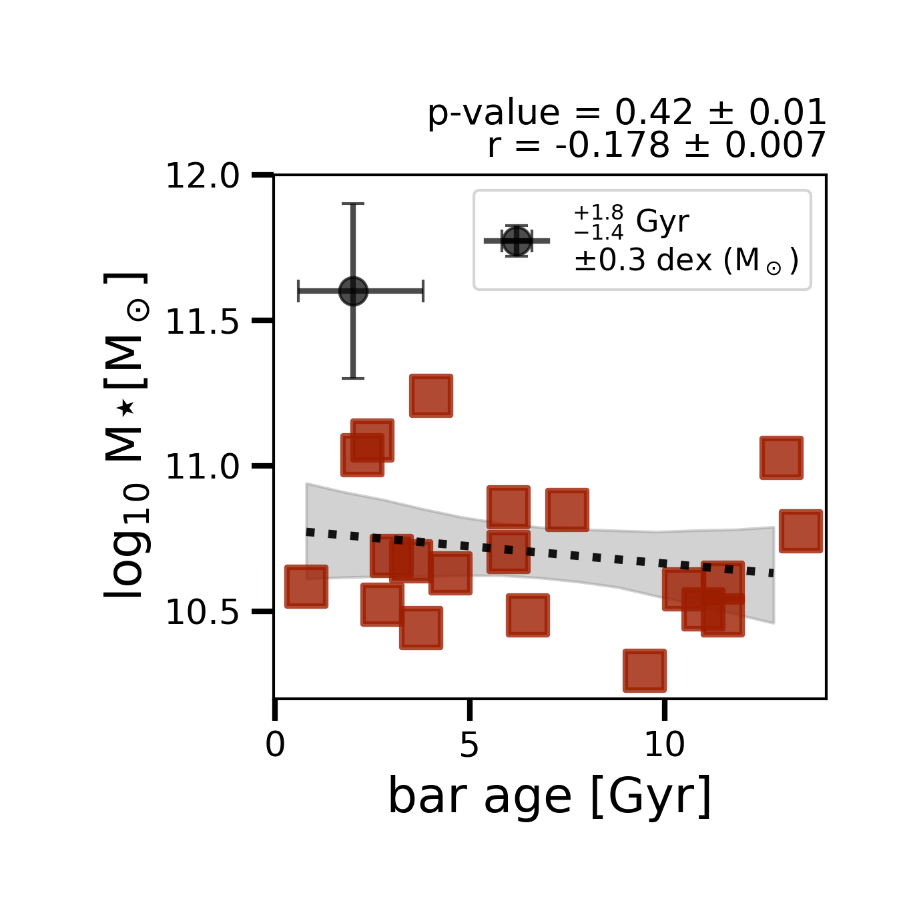
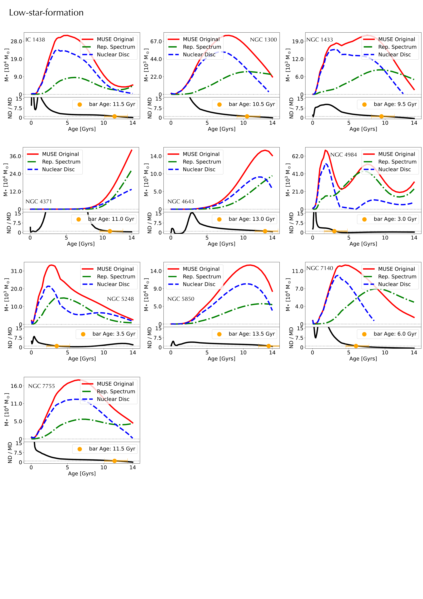

$\newcommand{\ensuremath}{}$
$\newcommand{\xspace}{}$
$\newcommand{\object}[1]{\texttt{#1}}$
$\newcommand{\farcs}{{.}''}$
$\newcommand{\farcm}{{.}'}$
$\newcommand{\arcsec}{''}$
$\newcommand{\arcmin}{'}$
$\newcommand{\ion}[2]{#1#2}$
$\newcommand{\textsc}[1]{\textrm{#1}}$
$\newcommand{\hl}[1]{\textrm{#1}}$
$\newcommand{\footnote}[1]{}$
$\newcommand{\arraystretch}{1.2}$
$\newcommand{\arraystretch}{1.1}$
$\newcommand{\arraystretch}{1.5}$

# Bar ages derived for the first time in nearby galaxies: Insights on secular evolution from the TIMER sample

<mark>Appeared on: 2025-03-28</mark> -  _Accepted for publication in Astronomy & Astrophysics (A&A), 20 pages, 13 Figures, 3 Appendice Figures_

C. d. Sá-Freitas, et al. -- incl., <mark>J. Neumann</mark>

**Abstract:** Once galaxies settle their discs and become self-gravitating, stellar bars can form, driving the subsequent evolution of their host galaxy. Determining the ages of bars can therefore shed light on the epoch of the onset of secular evolution. In this work, we apply the first broadly applicable methodology to derive bar ages to a sample of 20 nearby galaxies. The method is based on the co-eval build-up of nuclear structures and bars, and involves using integral field spectroscopic (IFS) data from the Multi Unit Spectroscopic Explorer (MUSE) instrument on the Very Large Telescope to disentangle the star formation history of the nuclear disc from the background population. This allows us to derive the formation epoch of the nuclear disc and, thus, of the bar. We estimate the bar formation epoch of nearby galaxies -- mostly from the TIMER survey--, creating the largest sample of galaxies with known bar ages to date. We find bar formation epochs varying between $1$ and $13 \mathrm{Gyr}$ ago, illustrating how disc-settling and bar formation are processes that first took place in the early Universe and are still taking place in some galaxies. We infer the bar fraction over cosmological time with our sample, finding remarkable agreement with that obtained from direct studies of galaxies at high redshifts. Additionally, for the first time we are able to investigate secular evolution processes taking into account the ages of bars. Our results agree with the scenario in which bars aid the quenching of the host galaxy, with galaxies hosting older bars tending to be more "quenched". We also find that older bars tend to be longer, stronger and host larger nuclear discs. \textcolor{black}{Furthermore, we find evidence of the nuclear disc stellar mass build-up over time.} On the other hand, we find no evidence of downsizing playing a role on bar formation, since we find that bar age is independent of galaxy stellar mass. With the means to estimate bar ages, we can begin to understand better when and how bars shape the observed properties of disc galaxies.

**Figure 3. -** **Stellar masses as a function of bar ages**. We consider the stellar masses from the S$^4$G survey, obtained with the $3.6\mu\mathrm{m}$ band (\citealp{munoz2015spitzer}) and the bar ages derived in this work.  We bootstrapped our sample $1000$ times in order to robustly estimate the _Pearson_ correlation coefficient and the $p-value$, with associated uncertainties. Lastly, we display the mean errors in the bar age \color{black} and stellar mass \color{black}estimates (black-dot). \color{black} As discussed in munoz2015spitzer, the main source of error in the galaxy stellar mass comes from errors in distance estimates, which translate to $\pm0.32$ dex error in mass. \color{black} Contrary to downsizing predictions, we find no correlation between the two properties, with a weak Pearson coefficient of $r=-0.180\pm0.007$ -- illustrated by the dotted line. (*fig_barAge_mstar*)

**Figure 15. -** Individual measurements of bar age of the low-SF sample. Following the de2023new methodology, we define the bar age as the moment in which the SFH of the nuclear disc (dashed-blue line) overcome the SFH of the main disc (dot-dashed-green line). Additionally, based on the tests performed in de2023new and here, we estimate the systematic measurement error of $^{+1.8}_{-1.4} \mathrm{Gyr}$.  (*fig_lSFmain*)

**Figure 16. -** Same as Fig. \ref{fig_lSFmain}, for the high-SF sub-sample. (*fig_hSFmain*)

