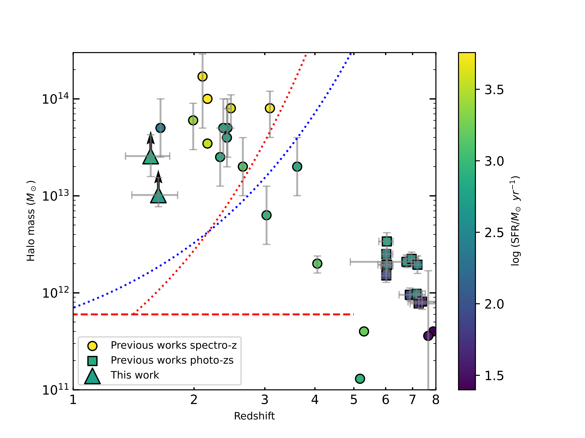
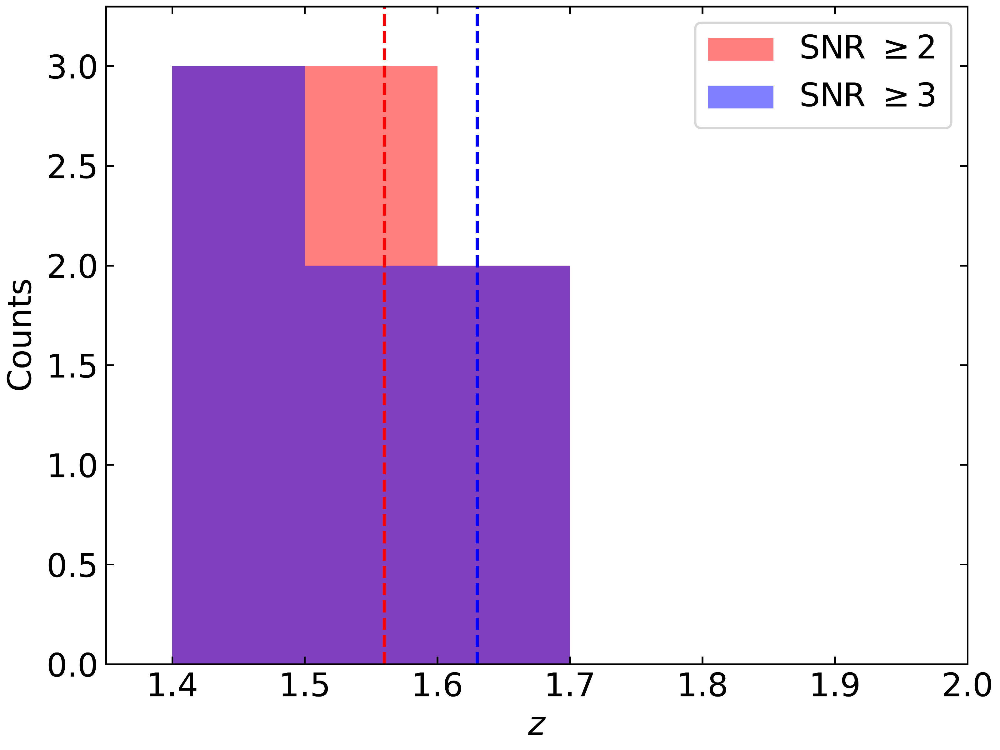
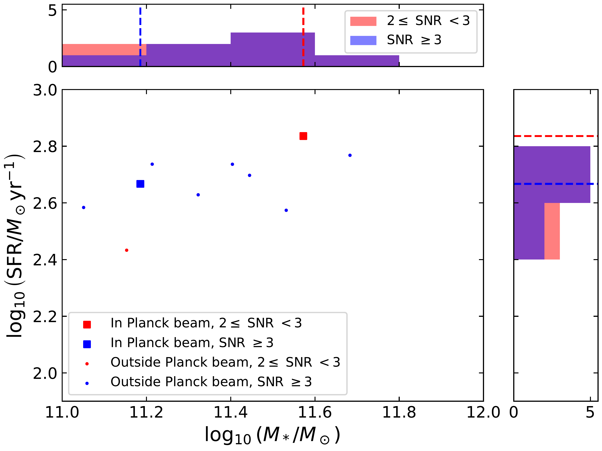

$\newcommand{\ensuremath}{}$
$\newcommand{\xspace}{}$
$\newcommand{\object}[1]{\texttt{#1}}$
$\newcommand{\farcs}{{.}''}$
$\newcommand{\farcm}{{.}'}$
$\newcommand{\arcsec}{''}$
$\newcommand{\arcmin}{'}$
$\newcommand{\ion}[2]{#1#2}$
$\newcommand{\textsc}[1]{\textrm{#1}}$
$\newcommand{\hl}[1]{\textrm{#1}}$
$\newcommand{\footnote}[1]{}$
$\newcommand{\N}[1]{\textcolor{violet}{#1}}$
$\newcommand{\T}[1]{\textcolor{teal}{#1}}$
$\newcommand{\BLF}[1]{\textcolor{green}{#1}}$
$\newcommand{\HD}[1]{\textcolor{magenta}{#1}}$
$\newcommand{\DS}[1]{\textcolor{brown}{DS: #1}}$
$\newcommand{\OC}[1]{\textcolor{orange}{#1}}$
$\newcommand{\Mh}[0]{M_{\rm h}}$
$\newcommand{\pd}{\phantom{0}}$
$\newcommand{\pa}{\phantom{a}}$
$\newcommand{\orcid}[1]$
$\newcommand{\Planck}{\textit{Planck}}$
$\newcommand{\Herschel}{\textit{Herschel}}$
$\newcommand{\Spitzer}{\textit{Spitzer}}$
$\newcommand{\protoa}{G254\_EUC\_2}$
$\newcommand{\protob}{G257\_EUC\_3}$

# Euclid Quick Data Release (Q1): The $\Euclid$ view on $\Planck$ galaxy protocluster candidates: towards a probe of the highest sites of star formation at cosmic noon

<mark>Appeared on: 2025-03-28</mark> -  _18 pages, 11 figures. Submitted to A&A_

E. Collaboration, et al. -- incl., <mark>K. Jahnke</mark>

**Abstract:** We search for galaxy protoclusters at redshifts $z > 1.5$ in the first data release (Q1) of the $\Euclid$ survey. We make use of the catalogues delivered by the $\Euclid$ Science Ground Segment (SGS), especially the positions, photometry, photometric redshifts, and derived physical parameters. After a galaxy selection on the $\HE$ magnitude and on the photometric redshift quality, we undertake the search using the \texttt{DETECTIFz} algorithm, an overdensity finder based on Delaunay tessellation that uses photometric redshift probability distributions through Monte Carlo simulations.In this pilot study, we conduct a search in the 11 $\Euclid$ tiles that contain previously known $\Planck$ high star-forming galaxy protocluster candidates, covering 2.75 deg $^2$ of the whole 63 deg $^2$ of Q1. We then focus on the two $\Euclid$ protocluster candidates that coincide with these $\Planck$ fields.These counterparts lie at photometric redshifts $z_{\rm ph}=1.63^{+0.19}_{-0.23}$ and $z_{\rm ph}=1.56^{+0.18}_{-0.21}$ . One of them also has partial $\Herschel$ coverage. Both detections have been confirmed by the independent protocluster detection algorithms Poisson Probability Method (PPM) and Monte-Carlo Delaunay Tesselation Field Estimator (MC-DTFE-LoG). We study the colours, the derived stellar masses (regarded as lower limits) and star-formation rates of the detected protoclusters. We also estimate their halo mass lower limits using stellar mass-halo mass relations from the literature.We investigate whether we are intercepting these galaxy overdensities in their `dying' (or `swan song') phase, such that the high star-formation rates would be due to their last unsustainable starburst (or star-formation event) before transitioning and maturing to groups or clusters of galaxies. Some galaxy members are found to lie above the main sequence of galaxies (star-formation rate versus stellar mass). These $\Planck$ and $\Euclid$ overdense regions occupy a position in the dark matter halo mass ( $\Mh$ ) / redshift ( $z$ ) plane at 13.0 $<\log_{10} \Mh<$ 13.5, $1.5<z<$ 2; in this locus, halos of forming galaxy clusters are expected to have experienced a transition between cold flows with no shock heating throughout the halo to shock heating in the halo.Finally, we empirically update the potential for galaxy protocluster discoveries at redshift up to $z \simeq3$ (wide survey) and $z \simeq5.5$ (deep survey) with $\Euclid$ for the next data release (DR1).

**Figure 9. -** Protocluster halo mass ($M_{\rm h}$) versus redshift $z$(notice the log-log scale), colour-coded by star-formation rate (SFR, colour bar). \Euclid protocluster lower limits: triangles, using Method B [S22]([Shuntov, McCracken and Gavazzi (2022)](), see Sect. \ref{sect:mstar_mh} for details.
Circles are protoclusters from the literature: [ and Casey (2016)](); [Polletta, Soucail and Dole (2021)](); [Laporte, Zitrin and Dole (2022)](); [Morishita, Roberts-Borsani and Treu (2023)](); [Morishita, Liu and Stiavelli (2024)](); [Sillassen, Jin and Magdis (2024)](); and [Shimakawa, Pérez-Martínez and Dannerbauer (2024)](). The lines illustrate the different predicted gas-cooling regimes: dotted lines come from [ and Dekel (2006)]()(red dashes) and [Daddi, Delvecchio and Dimauro (2022)]()(blue dashes) and separate loci of cold gas in a hot medium (top right) and hot gas (top left); halo masses below the horizontal red dashed line $M_{\rm shock}$, coming from [ and Dekel (2006)](), are predicted to contain only cold flows with no shock heating within haloes at $z<5$.
 (*fig:arthur_mh_vs_z*)

**Figure 1. -** Photometric distributions of the \Euclid overdensities outside $\Planck$ beams: red, overdensities with S/N $\geq 2$; and blue, S/N $\geq 3$ outside the $\Planck$ beams. Vertical dashed lines represent the values corresponding to the detections inside the $\Planck$ beams, with $2 \leq$ S/N $<3$(red dashes) or S/N $\geq 3$(blue dashes).
 (*fig:z_hist*)

**Figure 2. -** Star-formation rate as a function of stellar mass of the \Euclid protocluster candidates. Dots represent overdensities with a signal to noise ratio above 2 or 3 outside the $\Planck$ beams, depending on their colour. The two squares are the protocluster candidates discussed in this pilot study. Histograms for stellar mass (top) and SFR (right) are plotted using only detections outside the $\Planck$ beams.
 (*fig:SFR_vs_Mstar_stat_sample*)

