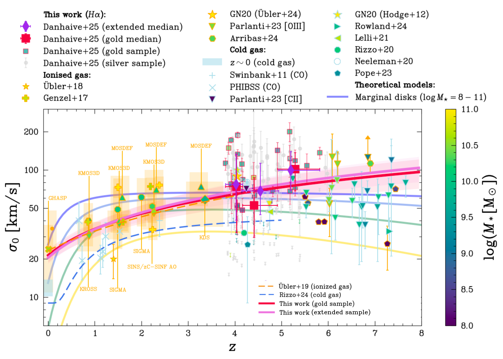
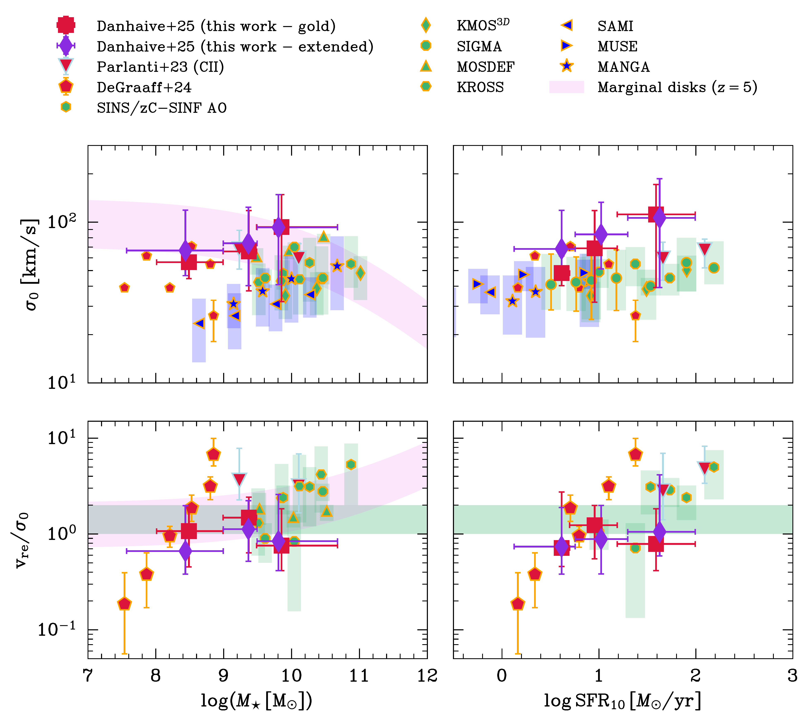

$\newcommand{\ensuremath}{}$
$\newcommand{\xspace}{}$
$\newcommand{\object}[1]{\texttt{#1}}$
$\newcommand{\farcs}{{.}''}$
$\newcommand{\farcm}{{.}'}$
$\newcommand{\arcsec}{''}$
$\newcommand{\arcmin}{'}$
$\newcommand{\ion}[2]{#1#2}$
$\newcommand{\textsc}[1]{\textrm{#1}}$
$\newcommand{\hl}[1]{\textrm{#1}}$
$\newcommand{\footnote}[1]{}$
$\newcommand{\OIII}{[\text{OIII}]}$
$\newcommand{\Ha}{H\alpha}$
$\newcommand{\disp}{\sigma_0}$
$\newcommand{\reff}{r_{e}}$
$\newcommand{\rotsupp}{\text{v}/\sigma_0}$
$\newcommand{\logMstar}{\log\thinspace M_{\star}}$
$\newcommand{\Mstar}{M_{\star}}$
$\newcommand{\logMdyn}{\log\thinspace M_{\text{dyn}}}$
$\newcommand{\Mdyn}{M_{\text{dyn}}}$
$\newcommand{\PAmorph}{\text{PA}_{\text{morph}}}$
$\newcommand{\PAkin}{\text{PA}_{\text{kin}}}$
$\newcommand{\vre}{\text{v}_{\text{re}}}$
$\newcommand{\vcirc}{\text{v}_{\text{circ}}}$
$\newcommand{\geko}{\textsc{geko}}$
$\newcommand$
$\newcommand{\labelitemi}{\labelitemii}$
$\newcommand{\arraystretch}{2}$
$\newcommand{\arraystretch}{2}$
$\newcommand{\arraystretch}{1.5}$
$\newcommand{\thebibliography}{\DeclareRobustCommand{\VAN}[3]{##3}\VANthebibliography}$

#  The dawn of disks: unveiling the turbulent ionised gas kinematics of the galaxy population at $z\sim4-6$ with JWST/NIRCam grism spectroscopy

<mark>Appeared on: 2025-03-31</mark> -  _25 pages, 13 figures, 3 tables, submitted to MNRAS_

A. L. Danhaive, et al. -- incl., <mark>A. d. Graaff</mark>

**Abstract:** Recent studies of gas kinematics at high redshift have reported disky systems which appear to challenge models of galaxy formation, but it is unclear whether they are representative of the underlying galaxy population. We present the first statistical sample of spatially resolved ionised gas kinematics at high redshift, comprised of $272$ H $\alpha$ emitters in GOODS-S and GOODS-N at redshifts $z\approx3.9-6.5$ , observed with JWST/NIRCam slitless spectroscopy and imaging from JADES, FRESCO and CONGRESS. The sample probes two orders of magnitude in stellar mass ( $\log (M_{\star}[\mathrm{M}_{\odot}])\approx8-10$ ) and star formation rate ( $\text{SFR}\approx0.3-100\thinspace M_{\odot}/$ yr), and is representative down to $\log(M_{\star}[\mathrm{M}_{\odot}])\approx 9$ . Using a novel inference tool, geko , we model the grism data to measure morphological and kinematic properties of the ionised gas, as probed by H $\alpha$ . Our results are consistent with a decrease of the rotational support $v/\sigma_0$ and increase of the velocity dispersion $\sigma_0$ with redshift, with $\sigma_0\approx100$ km/s and $v/\sigma_0\approx1-2$ at $z\approx3.9-6.5$ . We study the relations between $\sigma_0$ , and $v/\sigma_0$ , and different star formation tracers and find a large scatter and diversity, with the strongest correlations between $\sigma_0$ and SFR and SFR surface density. The fraction of rotationally supported systems ( $v/\sigma_0>1$ ) slightly increases with cosmic time, from $(36\pm6)\%$ to $(41\pm6)\%$ from $z\sim 5.5$ to $z\sim 4.5$ , for galaxies with masses $9<\log(M_{\star}[\mathrm{M}_{\odot}])<10$ . Overall, disks do not dominate the turbulent high-redshift galaxy population in the mass range probed by this work. When placed in the context of studies up to cosmic noon, our results are consistent with a significant increase of disk-like systems with cosmic time.

**Figure 14. -** Intrinsic $\Ha$ velocity dispersion $\disp$ as a function of redshift for our gold (red outlined squares) and silver (light gray circles) in the context of studies of warm ionised gas (i.e. $\Ha$ and [OIII]; orange outlines) and cold gas (i.e. HI, CO, and [CII]; blue outlines) kinematics across redshifts. The medians for the gold and extended samples are plotted in red squares and purple diamonds, respectively. The errorbars on the medians represent the $16^{\rm th}$ and $84^{\rm th}$ quantiles along the y-axis, and the extent of the bin along the x-axis. Our results are consistent with a decrease of $\disp$ with cosmic time when compared to  surveys from cosmic noon (KMOS3D \protect ([ and Wisnioski 2015](https://ui.adsabs.harvard.edu/abs/2015ApJ...799..209W)) , KROSS \protect ([ and Johnson 2018](https://ui.adsabs.harvard.edu/abs/2018MNRAS.474.5076J)) , MOSDEF  ([ and Price 2016](https://ui.adsabs.harvard.edu/abs/2016ApJ...819...80P), [ and Price 2020](https://ui.adsabs.harvard.edu/abs/2020ApJ...894...91P)) , KDS \protect ([ and Turner 2017](https://ui.adsabs.harvard.edu/abs/2017MNRAS.471.1280T), [Turner, et. al 2017](https://ui.adsabs.harvard.edu/abs/2017arXiv171103604T)) , SIGMA \protect ([ and Simons 2016](https://ui.adsabs.harvard.edu/abs/2016ApJ...830...14S)) , SINS/zC-SINF \protect (Forster-Schreiber:2006wk,  Forster-Schreiber:2018aa) , PHIBSS \protect ([ and Tacconi 2013](https://ui.adsabs.harvard.edu/abs/2013ApJ...768...74T)) , and points from \protect ([ and Swinbank 2011](https://ui.adsabs.harvard.edu/abs/2011ApJ...742...11S), [ and Genzel 2017](https://ui.adsabs.harvard.edu/abs/2017Natur.543..397G)) ) and the local Universe (GHASP \protect ([Epinat, et. al 2010](https://ui.adsabs.harvard.edu/abs/2010MNRAS.401.2113E)) , DYNAMO \protect ([ and Green 2014](https://ui.adsabs.harvard.edu/abs/2014MNRAS.437.1070G)) , EDGE-CALIFA \protect ([ and Bolatto 2017](https://ui.adsabs.harvard.edu/abs/2017ApJ...846..159B)) , HERACLES \protect ([ and Leroy 2009](https://ui.adsabs.harvard.edu/abs/2009AJ....137.4670L)) , THINGS \protect ([Walter, et. al 2008](https://ui.adsabs.harvard.edu/abs/2008AJ....136.2563W)) , and \protect ([Dib, Bell and Burkert 2006](https://ui.adsabs.harvard.edu/abs/2006ApJ...638..797D)) ; blue shaded region). Our best-fit relations (Eq. \ref{eq:powerlaw}), with (purple) and without (red) including upper limits, agree with the fit from \protect[ and Übler (2019)](https://ui.adsabs.harvard.edu/abs/2019ApJ...880...48U)(light red - long dashes), which is defined out to $z\sim4$. Similarly, we also include the exponential fit for cold gas measurements from \protect[ and Rizzo (2024)](https://ui.adsabs.harvard.edu/abs/2024A&A...689A.273R)(dark blue - long dashes) defined out to $z\sim5$, which highlight a similar evolution of $\disp$ tracing the cold gas, albeit with a factor 2-3 lower normalization. We compare our measurements with works at similar redshifts \protect ([Parlanti, et. al 2023](https://ui.adsabs.harvard.edu/abs/2023A&A...673A.153P), [ and Arribas 2024](https://ui.adsabs.harvard.edu/abs/2024A&A...688A.146A), de-Graaff:2024ab) , as well as detection of dynamically cold systems at high-redshift \protect[Neeleman, et. al (2020)](https://ui.adsabs.harvard.edu/abs/2020Natur.581..269N), [Rizzo, et. al (2020)](https://ui.adsabs.harvard.edu/abs/2020Natur.584..201R), [Lelli, et. al (2021)](https://ui.adsabs.harvard.edu/abs/2021Sci...371..713L), [ and Pope (2023)](https://ui.adsabs.harvard.edu/abs/2023ApJ...951L..46P), [ and Rowland (2024)](https://ui.adsabs.harvard.edu/abs/2024MNRAS.535.2068R). (*fig:sigma0-z-comp*)

**Figure 16. -** Dependence of the intrinsic velocity dispersion $\disp$(top panels) and rotational support $\rotsupp$(bottom panels) on $M_{\star}$, $\text{SFR}_{10}$, $\text{sSFR}_{10}$, and SFR surface density $\Sigma_{\text{SFR}_{10}}$ for our gold (squares) and silver sample (gray contours). We find a significant correlation between $\disp$ and $\text{SFR}_{10}$, which is highlighted by the running medians, for the gold sample (red squares) and for the extended sample (purple diamonds), and the Spearman rank coefficient $\rho$ and p-value $p$ for the resolved sample. The errorbars on the medians represent the $16^{\rm th}$ and $84^{\rm th}$ quantiles along the y-axis, and the extent of the bin along the x-axis. Both $\disp$ and $\rotsupp$ show a (weaker) correlation with $\Sigma_{\text{SFR}_{10}}$, highlighting the role of surface density in efficiently driving turbulence in the gas. The trends with $\text{SFR}_{10}$ and $\Sigma_{\text{SFR}_{10}}$ are stronger for $\disp$ than $\rotsupp$, which could be caused by the fact that we probing many dispersion-supported systems ($\rotsupp<1$) and systems in the transitional regions (green shaded region) between dispersion and rotation support, where stable rotation has not yet been established. (*fig:vsigma_sigma_mstar_sfr*)

**Figure 17. -** Dependence of $\disp$(top panels) and $\rotsupp$(bottom panels) on stellar mass and SFR for our sample (red squares and purple diamonds) in the context of other high-redshift works \citep[in red;][]{Parlanti:2023ab, de-Graaff:2024ab}, and works at cosmic noon (in green; see Fig. \ref{fig:sigma0-z-comp}) and the local Universe (in blue; MANGA  ([ and Yu 2019](https://ui.adsabs.harvard.edu/abs/2019MNRAS.486.4463Y)) , SAMI  ([ and Allen 2015](https://ui.adsabs.harvard.edu/abs/2015MNRAS.446.1567A), [ and Johnson 2018](https://ui.adsabs.harvard.edu/abs/2018MNRAS.474.5076J), [ and Green 2018](https://ui.adsabs.harvard.edu/abs/2018MNRAS.475..716G)) , and MUSE  ([ and Swinbank 2017](https://ui.adsabs.harvard.edu/abs/2017MNRAS.467.3140S)) ). The errorbars on our plotted medians represent the $16^{\rm th}$ and $16^{\rm th}$ quantiles along the y-axis, and the extent of the bin along the x-axis. The $\disp$-SFR relation holds across redshifts, for both ionised ($\Ha$; orange outline) and cold ([CII]; blue outline) gas, although we find higher values of $\disp$ and a steeper slope. Some works at lower redshift find a similar weak increasing trend for the $\disp-M_{\star}$ relation as our sample  ([ and Wisnioski 2015](https://ui.adsabs.harvard.edu/abs/2015ApJ...799..209W), Forster-Schreiber:2018aa, [ and Yu 2019](https://ui.adsabs.harvard.edu/abs/2019MNRAS.486.4463Y), [ and Price 2020](https://ui.adsabs.harvard.edu/abs/2020ApJ...894...91P)) , while [ and Simons (2017)](https://ui.adsabs.harvard.edu/abs/2017ApJ...843...46S) finds no significant trend. The trends for $\rotsupp$ are less clear, but our results could indicate a flattening in the $\rotsupp-M_{\star}$ relation at low masses $\log M_{\star} [\mathrm{M}_{\odot}] \lesssim10$, which is consistent with other works in this mass range and which is predicted by the marginal disk model (purple shaded regions). (*fig:corr-comp*)

