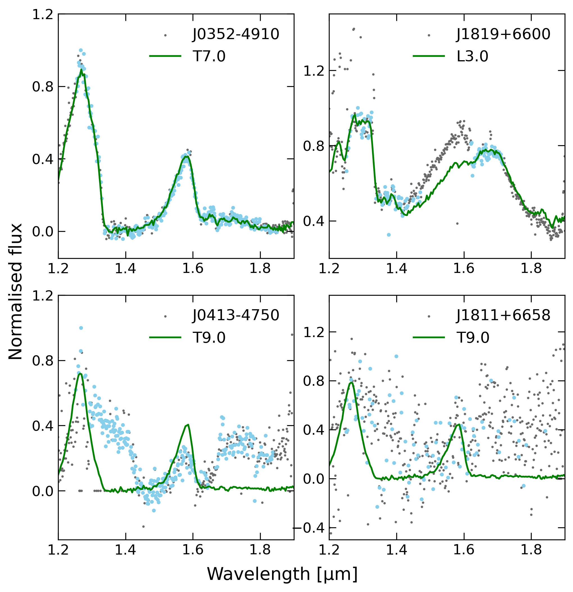
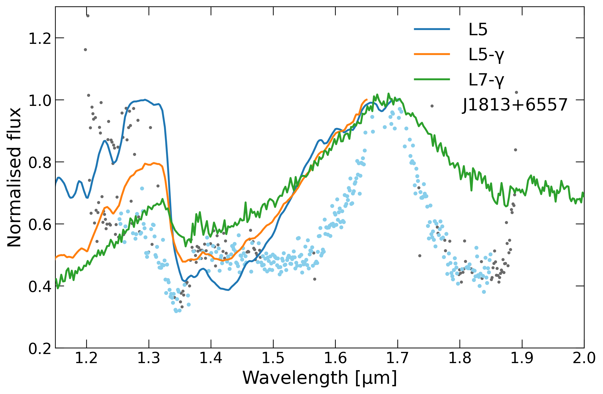
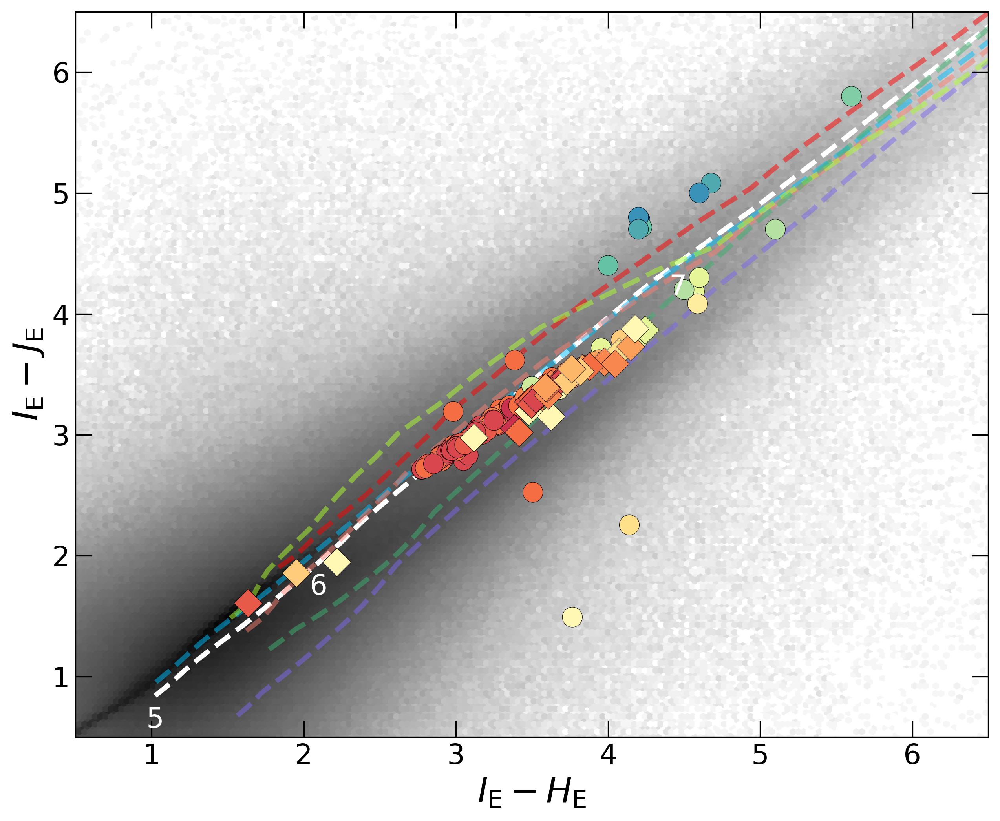
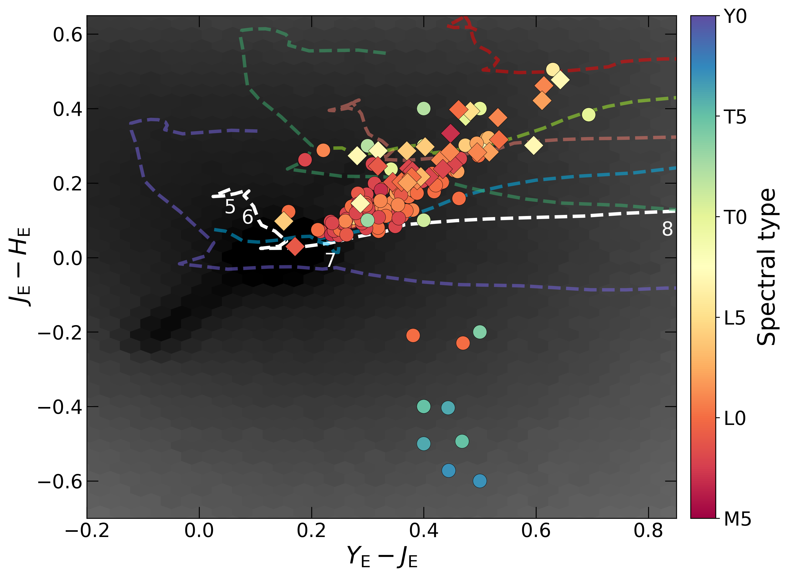
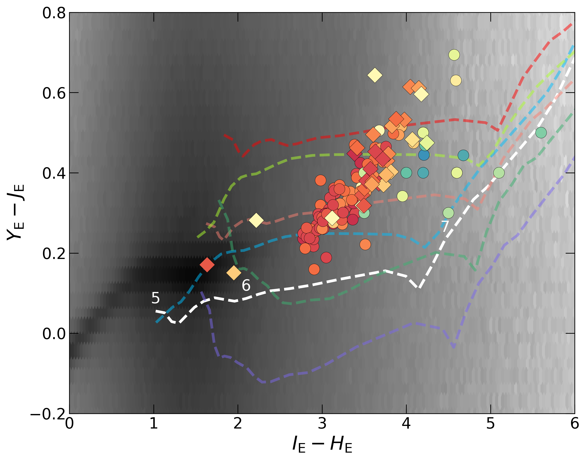
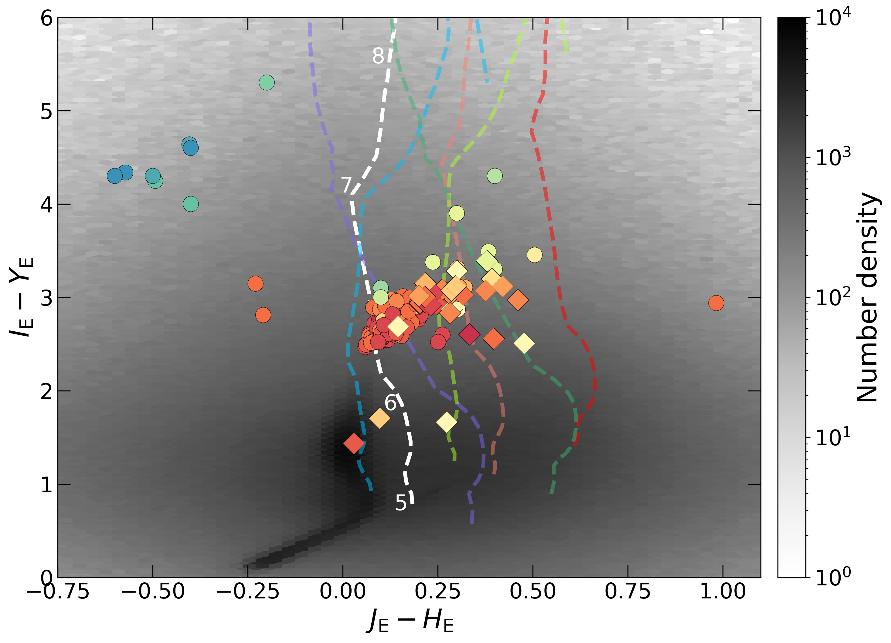

$\newcommand{\ensuremath}{}$
$\newcommand{\xspace}{}$
$\newcommand{\object}[1]{\texttt{#1}}$
$\newcommand{\farcs}{{.}''}$
$\newcommand{\farcm}{{.}'}$
$\newcommand{\arcsec}{''}$
$\newcommand{\arcmin}{'}$
$\newcommand{\ion}[2]{#1#2}$
$\newcommand{\textsc}[1]{\textrm{#1}}$
$\newcommand{\hl}[1]{\textrm{#1}}$
$\newcommand{\footnote}[1]{}$
$\newcommand{\com}[2]{ {\textcolor{orange}{ #1 :}}{\textcolor{blue}{ #2}}}$
$\newcommand{\NNEW}{202\xspace}$
$\newcommand{\NNEWSPECTRA}{33\xspace}$
$\newcommand{\NKNWSPECTRA}{109\xspace}$
$\newcommand{\NSPECTRA}{142\xspace}$
$\newcommand{\NNEWINTSPECTRA}{46\xspace}$
$\newcommand{\NDES}{326\xspace}$
$\newcommand{\NKNW}{12\xspace}$
$\newcommand{\EDFN}{EDF-N\xspace}$
$\newcommand{\EDFF}{EDF-F\xspace}$
$\newcommand{\EDFS}{EDF-S\xspace}$
$\newcommand{\orcid}[1]$

# $\Euclid$ Quick Data Release (Q1) --Ultracool dwarfs in the Euclid Deep Field North$\thanks{This paper is published on behalf of the Euclid Consortium}$

<mark>Appeared on: 2025-03-31</mark> -  _14 pages, 9 figures, 2 tables_

A. Mohandasan, et al. -- incl., <mark>E. Bañados</mark>, <mark>K. Jahnke</mark>

**Abstract:** Ultracool dwarfs (UCDs) encompass the lowest-mass stars and brown dwarfs, defining the stellar-substellar boundary. They have significant potential for advancing the understanding of substellar physics; however, these objects are challenging to detect due to their low luminosity. The wide coverage and deep sensitivity of the $\Euclid$ survey will increase the number of confirmed and well-characterised UCDs by several orders of magnitude.In this study, we take advantage of the $\Euclid$ Quick Data Release (Q1) and in particular we look in detail at the known and new UCDs in the $\Euclid$ Deep Field North ( $22.9\deg^2$ down to $\JE$ $\approx 24.5$ mag), to understand the advantages of using the slitless $\Euclid$ spectroscopy.We compile a comparison sample of known UCDs and use their spectra to demonstrate the capability of $\Euclid$ to derive spectral types using a template-matching method. This method is then applied to the spectra of the newly identified candidates.We confirm that $\NNEWSPECTRA$ of these candidates are new UCDs, with spectral types ranging from M7 to T1 and $\JE=17$ --21 mag.We look at their locus in colour-colour diagrams and compare them with the expected colours of QSOs.A machine-readable catalogue is provided for further study, containing both the comparison sample and the newly identified UCDs, along with their spectral classifications where the Q1 spectra quality allows for confident determination.

**Figure 1. -** Q1 spectra of four UCDs with published spectral classifications. The solid green line represents the template spectrum corresponding to the published spectral type. Grey points denote all measured data, while blue points indicate those retained after quality filtering. (*fig:maskeffect*)

**Figure 3. -** Peculiar spectrum of J1813$+$6557, along with spectra of very low-gravity and a normal L5 from JWST and a very low-gravity L7 observed from the ground, for comparison (refer to Sect. \ref{spectral_new}). Spectra are normalised at 1.7 \micron . (*fig:speactra_new*)

**Figure 7. -** 142 UCDs analysed in this study, of which 33 are newly identified with \Euclid, displayed in various colour-colour diagrams, with only those having good quality spectrum and confident spectral typing included. Dots represent previously known UCDs with good-quality Q1 spectra. Diamonds represent new UCDs studied in this work with reliable spectral typing. They are colour-coded according to the spectral type assigned in this paper, which is displayed in the colour scale. Grey points are all Q1 objects with \texttt{point}\_\texttt{like}\_\texttt{probab}$\geq 0.8$ with a shade that represents the number density as indicated in the scale.
The dashed lines of different colours denote the expected position for typical QSOs with redshift from $z=5$ to $z=9$; White for default QSO position. Light and dark blue denote extremely weak and extremely strong lined QSO. Light and dark red denote *E(B$-$V)*=0.1 and 0.2, in QSO rest frame. Light and dark green denote extremely weak and strong lined QSO with *E(B$-$V)*=0.1.
 (*fig:Q1x:YJvsJH*)

