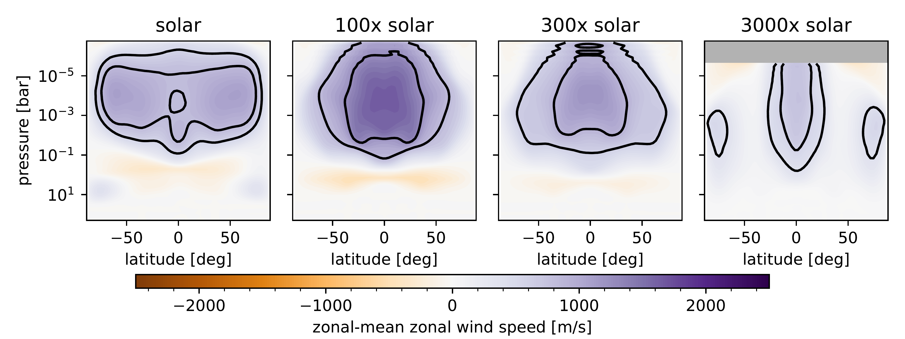
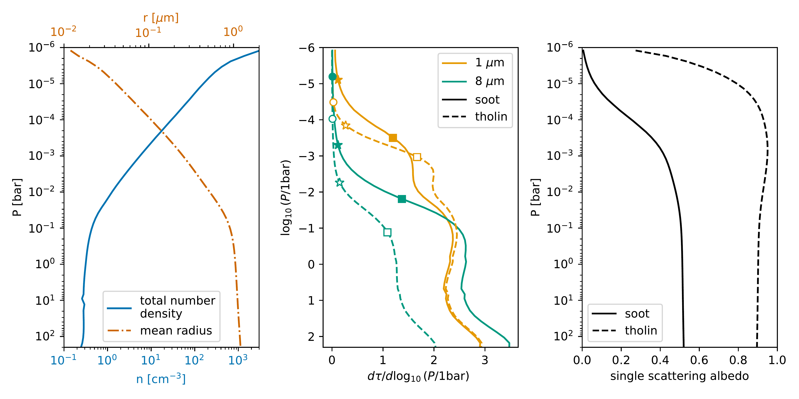
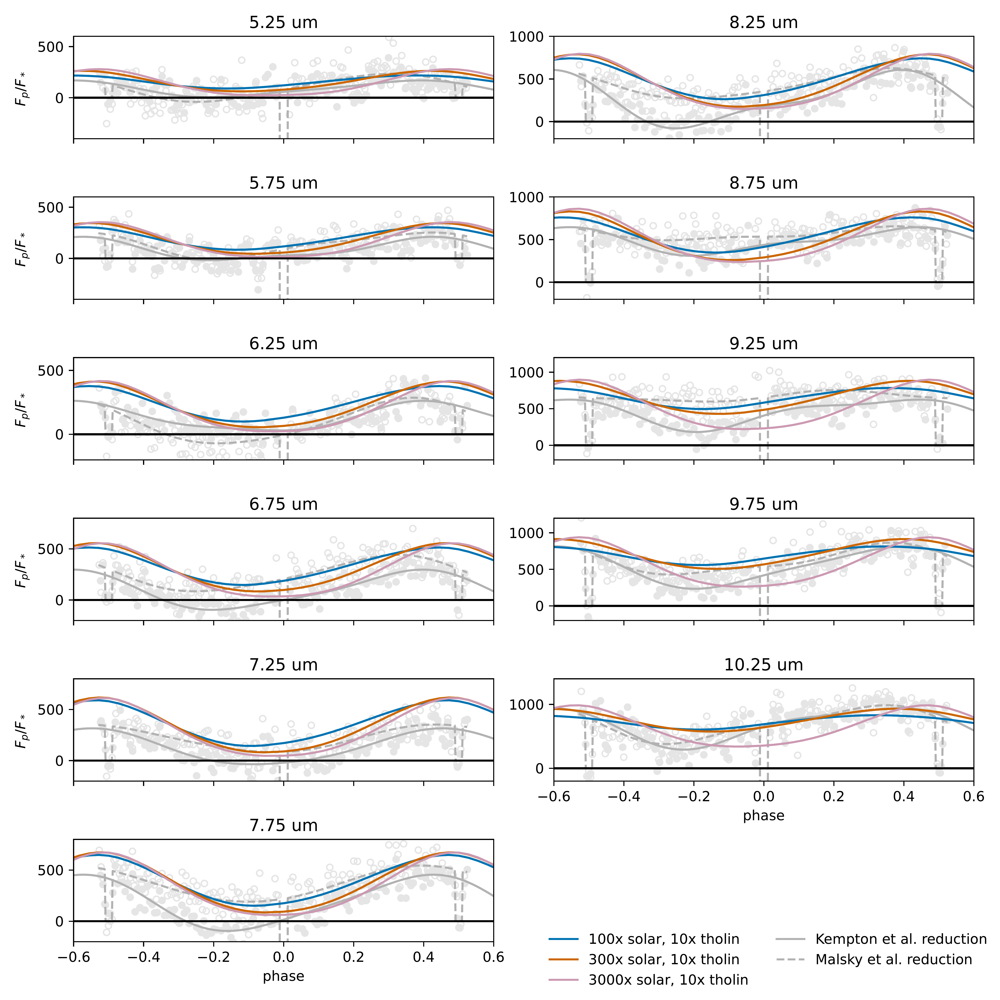

$\newcommand{\ensuremath}{}$
$\newcommand{\xspace}{}$
$\newcommand{\object}[1]{\texttt{#1}}$
$\newcommand{\farcs}{{.}''}$
$\newcommand{\farcm}{{.}'}$
$\newcommand{\arcsec}{''}$
$\newcommand{\arcmin}{'}$
$\newcommand{\ion}[2]{#1#2}$
$\newcommand{\textsc}[1]{\textrm{#1}}$
$\newcommand{\hl}[1]{\textrm{#1}}$
$\newcommand{\footnote}[1]{}$
$\newcommand{\vdag}{(v)^\dagger}$
$\newcommand$
$\newcommand$
$\newcommand{\MalskyEtAlP}{\citep{MalskyEtAl2025}}$
$\newcommand{\MalskyEtAlT}{\citet{MalskyEtAl2025} }$

# The radiative effects of photochemical hazes on the atmospheric circulation and phase curves of sub-Neptunes

<mark>Appeared on: 2025-03-31</mark> -  _resubmitted to ApJ after addressing referee report_

M. E. Steinrueck, et al. -- incl., <mark>L. Kreidberg</mark>

**Abstract:** Measuring the atmospheric composition of hazy sub-Neptunes like GJ 1214b through transmission spectroscopy is difficult because of the degeneracy between mean molecular weight and haziness. It has been proposed that phase curve observations can break this degeneracy because of the relationship between mean molecular weight (MMW) and phase curve amplitude. However, photochemical hazes can strongly affect phase curve amplitudes as well. We present a large set of GCM simulations of the sub-Neptune GJ 1214b that include photochemical hazes with varying atmospheric composition, haze opacity and haze optical properties. In our simulations, photochemical hazes cause temperature changes of up to 200 K, producing thermal inversions and cooling deeper regions. This results in increased phase curve amplitudes and adds a considerable scatter to the phase curve amplitude--metallicity relationship. However, we find that if the haze production rate is high enough to significantly alter the phase curve, the secondary eclipse spectrum will exhibit either emission features or strongly muted absorption features. Thus, the combination of a white-light phase curve and a secondary eclipse spectrum can successfully distinguish between a hazy, lower MMW and a clear, high MMW scenario.

**Figure 7. -** Zonal-mean zonal velocity for the clear-atmosphere simulations. The contours highlight where the zonal-mean zonal velocity reaches 50\% and 75\% of the peak velocity within the simulation. (*fig:uzonalav_clear*)

**Figure 5. -** Summary of the haze properties assumed in the simulations. The left panel shows number density and mean radius of the haze distribution that was used as input in the GCM simulations. The middle panel shows the differential optical depth for soot (solid) and tholin (dashed) hazes at 1 $\mu$m (representative for the incoming starlight) and 8 $\mu$m (representative for the outgoing thermal radiation) for the nominal haze opacity case. The pressure levels where the optical depth reaches 0.01 (circle), 0.1 (star), and 1 (square) are highlighted. For soot at 1 $\mu$m, the optical depth reaches 0.01 at a pressure of $6\cdot10^{-7}$ bar, outside the pressure range shown.  The right panel shows the wavelength-averaged single scattering albedo weighted by the stellar flux. For the "maximally reflective" case, the optical depth is identical to the soot case, but the single scattering albedo is fixed to 0.9999. (*fig:hazeproperties_vs_pressure*)

**Figure 15. -** Spectral phase curves for a selection of models with tholin hazes that provide a relatively good match to the observed white-light phase curve. The models substantially overpredict the emitted flux for a large fraction of the phase curve in spectral regions that show emission features in the secondary eclipse spectrum (6-8.5 $\mu$m). The observed spectral phasecurves are plotted in the background in light gray with filled circles and solid lines representing the \citet{KemptonEtAl2023} reduction and empty circles and dashed lines the $\MalskyEtAlT$ reduction. We note that due to the relatively low resolution of our post-processing, the spectral bins of the models do not line up exactly with the spectral bins of the observations (see Appendix for more detail). (*fig:spectralphasecurve_tholin*)

