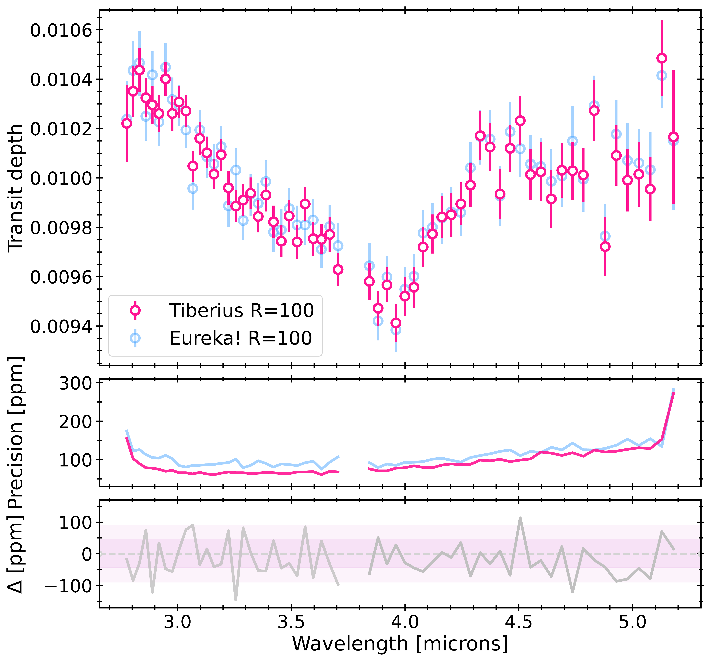
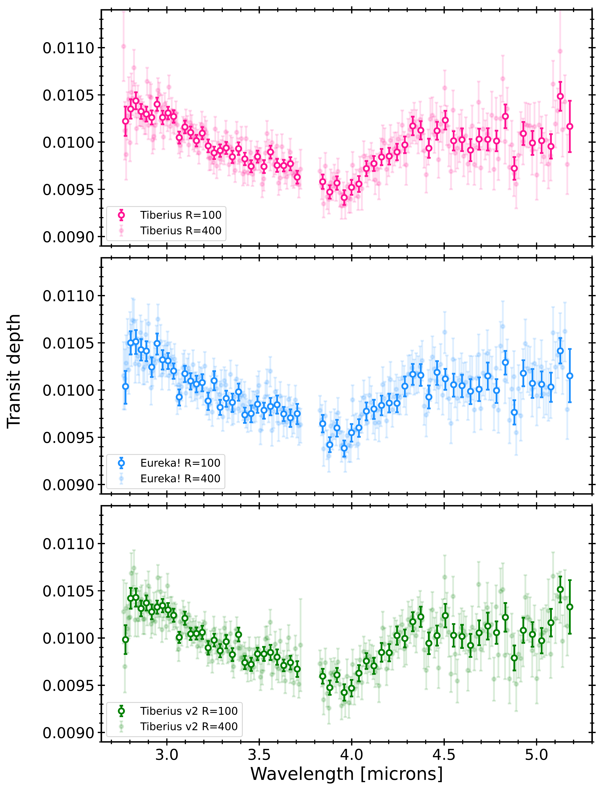
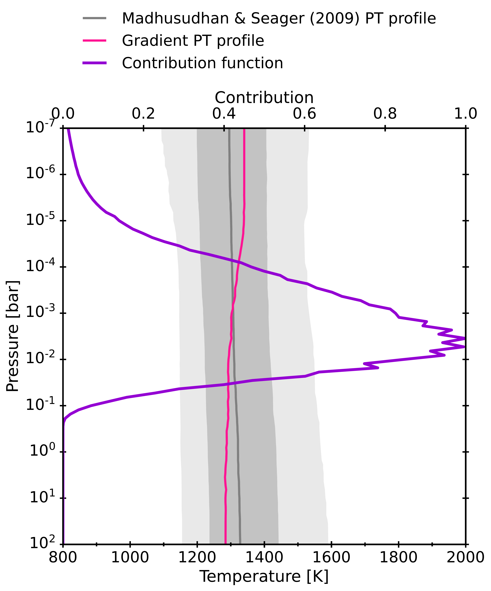

$\newcommand{\ensuremath}{}$
$\newcommand{\xspace}{}$
$\newcommand{\object}[1]{\texttt{#1}}$
$\newcommand{\farcs}{{.}''}$
$\newcommand{\farcm}{{.}'}$
$\newcommand{\arcsec}{''}$
$\newcommand{\arcmin}{'}$
$\newcommand{\ion}[2]{#1#2}$
$\newcommand{\textsc}[1]{\textrm{#1}}$
$\newcommand{\hl}[1]{\textrm{#1}}$
$\newcommand{\footnote}[1]{}$
$\newcommand{\red}[1]{\textcolor{red}{#1}}$
$\newcommand{\mystar}{TrES-4\xspace}$
$\newcommand{\planet}{TrES-4 b\xspace}$
$\newcommand{\tiberius}[1]{\texttt{Tiberius}\xspace}$
$\newcommand{\eureka}[1]{\texttt{Eureka!}\xspace}$
$\newcommand{\poseidon}[1]{\texttt{POSEIDON}\xspace}$
$\newcommand{\prt}{\texttt{petitRADTRANS}\xspace}$
$\newcommand{\redfootnote}[1]{\textcolor{red}{\footnote{\textcolor{red}{#1}}}}$
$\newcommand{\vdag}{\dagger}$
$\newcommand{\arraystretch}{1.2}$
$\newcommand{\arraystretch}{1.4}$
$\newcommand{\arraystretch}{1.2}$
$\newcommand{\arraystretch}{1.2}$
$\newcommand{\arraystretch}{1.3}$
$\newcommand{\thebibliography}{\DeclareRobustCommand{\VAN}[3]{##3}\VANthebibliography}$
$\newcommand\mn{@urlcharsother}$
$\newcommand\mn{@doi}$
$\newcommand\mn{@doi@}$
$\newcommand\mn{@eprint#1#2}$
$\newcommand\mn{@eprint@arXiv#1}$
$\newcommand\mn{@eprint@dblp#1}$
$\newcommand\mn{@eprint@#1:#2:#3:#4}$
$\newcommand{\@}{tempa}$
$\newcommand{\@}{tempa }$
$\newcommand{\@}{tempb }$
$\newcommand{\@}{tempc }$
$\newcommand{\@}{tempb }$

# BOWIE-ALIGN: Sub-stellar metallicity and carbon depletion in the aligned TrES-4b with JWST NIRSpec transmission spectroscopy

<mark>Appeared on: 2025-04-01</mark> -  _23 pages, 20 figures, 7 tables. Accepted to MNRAS on 26 March 2025_

A. Meech, et al. -- incl., <mark>E.-M. Ahrer</mark>

**Abstract:** The formation and migration history of a planet is expected to be imprinted in its atmosphere, in particular its carbon-to-oxygen (C/O) ratio and metallicity.The BOWIE-ALIGN programme is performing a comparative study of JWST spectra of four aligned and four misaligned hot Jupiters, with the aim of characterising their atmospheres and corroborating the link between the observables and the formation history.In this work, we present the $2.8-5.2$ micron transmission spectrum of $\planet$ , a hot Jupiter with an orbit aligned with the rotation axis of its F-type host star.Using free chemistry atmospheric retrievals, we report a confident detection of $H_2$ O at an abundance of $\log X_\mathrm{H_2O}=-2.98^{+0.68}_{-0.73}$ at a significance of $8.4\sigma$ .We also find evidence for CO and small amounts of $CO_2$ , retrieving abundances $\log X_\mathrm{CO}= -3.76^{+0.89}_{-1.01}$ and $\log X_\mathrm{CO_2}= -6.86^{+0.62}_{-0.65}$ ( $3.1\sigma$ and $4.0\sigma$ respectively).The observations are consistent with the the atmosphere being in chemical equilibrium; our retrievals yield $\mathrm{C/O}$ between $0.30-0.42$ and constrain the atmospheric metallicity to the range $0.4-0.7\times$ solar.The inferred sub-stellar properties (C/O and metallicity) challenge traditional models, and could have arisen from an oxygen-rich gas accretion scenario, or a combination of low-metallicity gas and carbon-poor solid accretion.

**Figure 2. -** **Top panel:** The $R\simeq100$ transmission spectrum of $\planet$ from the \texttt{Tiberius} and \texttt{Eureka!} reductions in pink and blue respectively. **Middle panel:** The precision of each spectrum and **bottom panel:** the difference between the two reductions. The $1/2\sigma$ intervals are shaded for reference. (*fig:transmission-spec*)

**Figure 9. -** The $R\simeq100$ and $R\simeq400$ transmission spectra from the three independent reductions using **(top panel):**$\tiberius$**(middle):**$\eureka$  and **(bottom):**$\tiberius$ second reduction as detailed in Appendix \ref{SECTION-7:appendix-tiberiusJK}. (*fig-app:R400*)

**Figure 10. -** The median retrieved PT profile (mean and $1/2\sigma$ regions in grey) of the chemical equilibrium reference retrieval on the $\tiberius$$R\simeq100$ transmission spectrum, having implemented the more complex PT profile of \citet{Madhusudhan2009}.
    Overplotted in pink is the median retrieved gradient PT profile on the same spectrum (preferred), and in purple is the photometric contribution function across the full NIRSpec G395H bandpass. (*fig-app:madhu-PT*)

