

$\newcommand{\ensuremath}{}$
$\newcommand{\xspace}{}$
$\newcommand{\object}[1]{\texttt{#1}}$
$\newcommand{\farcs}{{.}''}$
$\newcommand{\farcm}{{.}'}$
$\newcommand{\arcsec}{''}$
$\newcommand{\arcmin}{'}$
$\newcommand{\ion}[2]{#1#2}$
$\newcommand{\textsc}[1]{\textrm{#1}}$
$\newcommand{\hl}[1]{\textrm{#1}}$
$\newcommand{\footnote}[1]{}$
$\newcommand{\vdag}{(v)^\dagger}$
$\newcommand$
$\newcommand$
$\newcommand$
$\newcommand$
$\newcommand$
$\newcommand$
$\newcommand$
$\newcommand$
$\newcommand$
$\newcommand$
$\newcommand$
$\newcommand$
$\newcommand$
$\newcommand$
$\newcommand$
$\newcommand$
$\newcommand$
$\newcommand$
$\newcommand$
$\newcommand$
$\newcommand{\rt}[1]{{#1}}$
$\newcommand{\arraystretch}{1.25}$

# XUE. Thermochemical Modeling Suggests a Compact and Gas-Depleted Structure for a Distant, Irradiated Protoplanetary Disk

<mark>Appeared on: 2025-04-02</mark> -  _20 pages, 7 figures, 3 tables. Accepted for publication in The Astrophysical Journal, March 28, 2025_

B. Portilla-Revelo, et al. -- incl., <mark>T. Henning</mark>

**Abstract:** Unveiling the physical structure of protoplanetary disk is crucial for interpreting the diversity of the exoplanet population. Until recently, the census of the physical properties of protoplanetary disks probed by mid-infrared observations was limited to the solar neighborhood ( $d \lesssim 250$ pc); however, nearby star-forming regions (SFRs) such as Taurus---where no O-type stars reside---are not representative of the environments where the majority of the planet formation occurs in the Galaxy. The James Webb Space Telescope (JWST) now enables observations of disks in distant high-mass SFRs, where strong external Far-Ultraviolet (FUV) radiation is expected to impact those disks.  Nevertheless, a detailed characterization of externally irradiated disks is still lacking. We use the thermochemical code $\prodimo$ to model JWST/MIRI spectroscopy and archival visual/near-infrared photometry aiming to constrain the physical structure of the irradiated disk around the solar-mass star XUE 1 in NGC 6357 ( $d \approx 1690$ pc). Our findings are: (1) Mid-infrared dust emission features are explained by amorphous and crystalline silicates with compositions similar to nearby disks. (2) The molecular features detected with MIRI originate within the first $\sim 1$ au, consistent with slab models' results. (3) Our model favors a disk truncated at $10$ au with a gas-to-dust ratio of unity in the outskirts. (4) Comparing models of the same disk structure under different irradiation levels, we find that strong external irradiation raises gas temperature tenfold and boosts water abundance beyond 10 au by a factor of 100. Our findings suggest the inner disk resists external irradiation, retaining the elements necessary for planet formation.

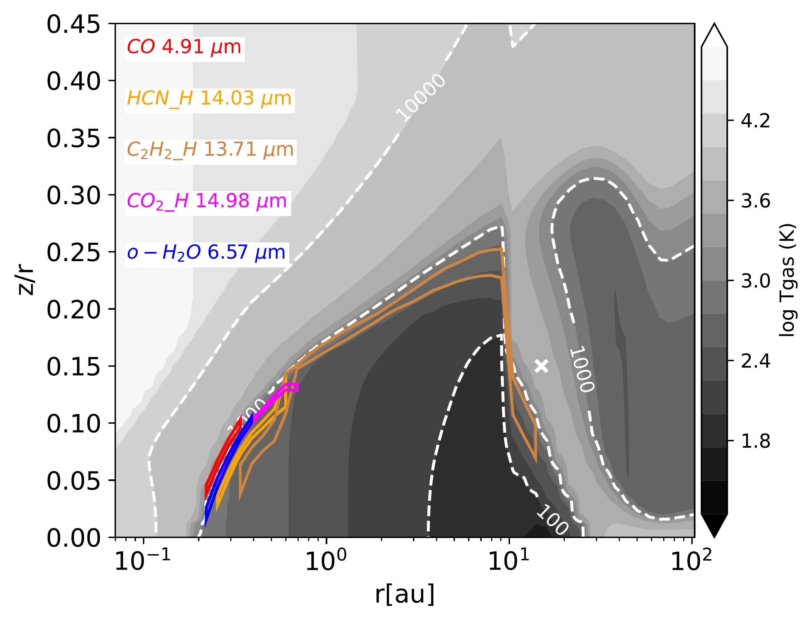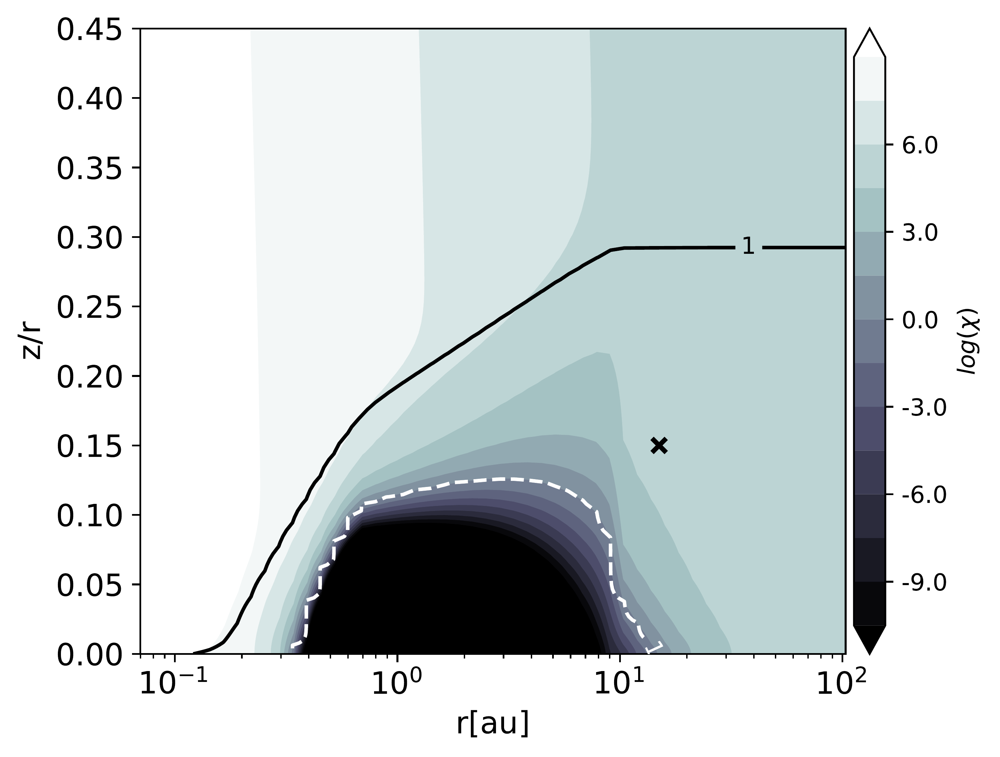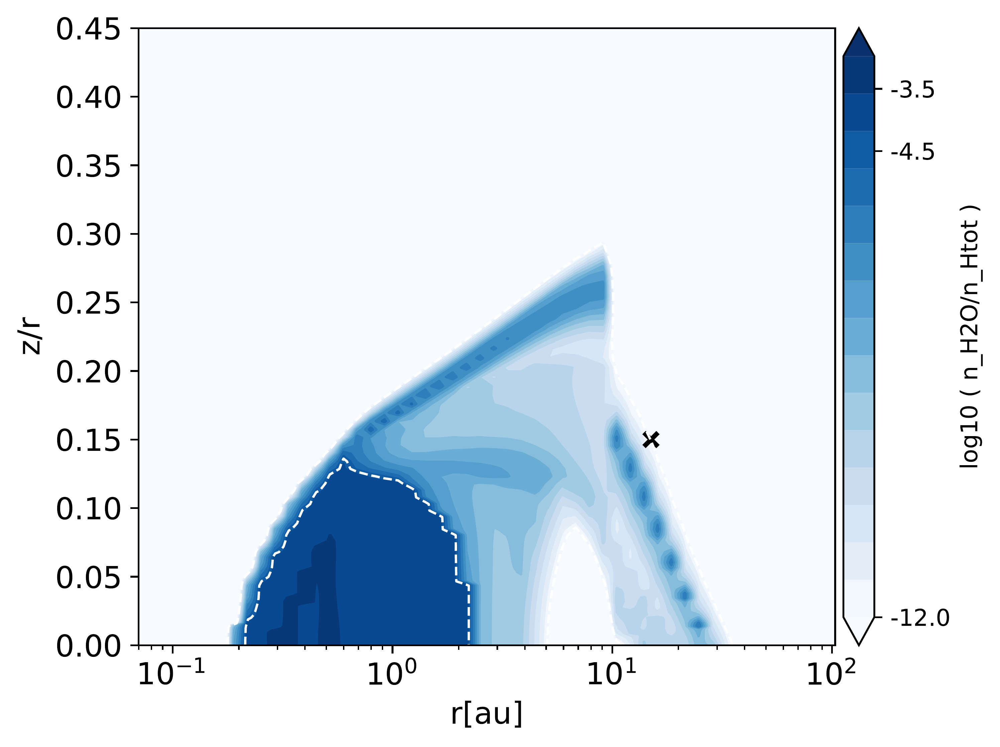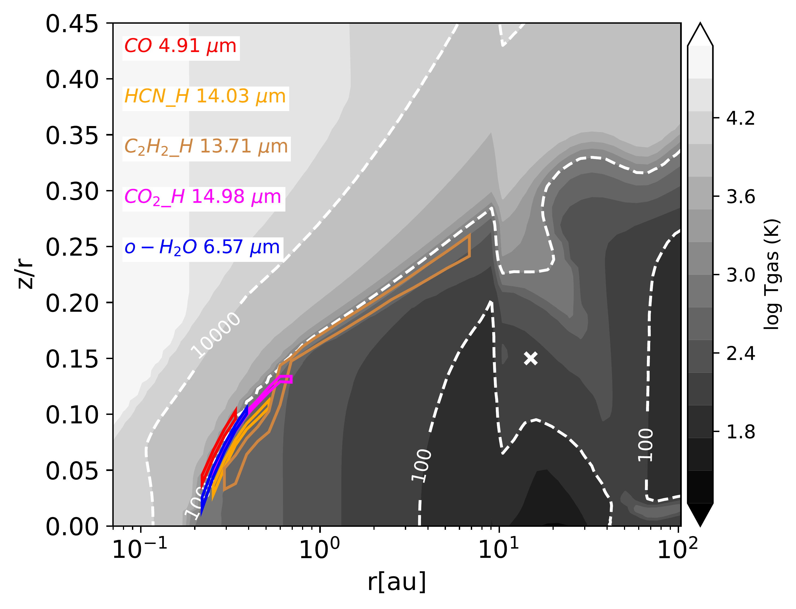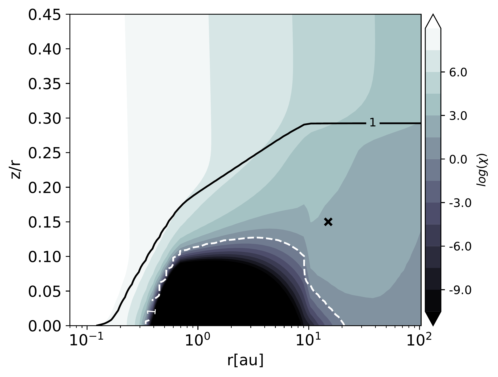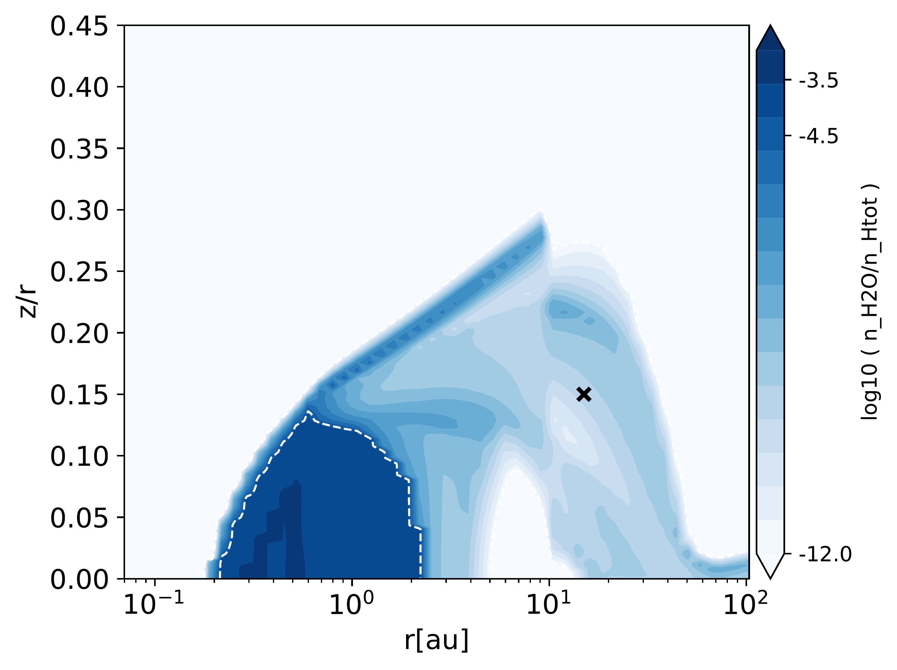

**Figure 6. -** Two-dimensional maps in disk's aspect ratio vs radial distance space for selected disk properties. Top row contains the solution from the best representative model for the XUE 1 disk ($\Go=10^5$); bottom row shows the solution from a non-irradiated disk ($\Go=10^0$) with the same gas and dust composition and structure. Left panels: The grey-scale image shows disk gas temperature with isothermal contours in white dashed lines. The color boxes depict the $15\%-85\%$ emitting areas of the lines that are indicated in the upper-left corner of the figure. Middle panels: strength of the UV radiation field in units of the Draine field---dashed contour indicates the region in the disk that is exposed to an FUV strength equal to the value in the solar neighborhood. Solid contour indicates the region where the radial optical depth is one. Right panels: abundance of gas-phase water relative to the total number of hydrogen nuclei---dashed line encloses $90\%$ of the total abundance. The quantitative analyses presented in Sects. \ref{sec:gas-distribution} and \ref{sec:temperatures-and-abundances} are done at the grid point indicated by the cross. (*fig:Tgas*)

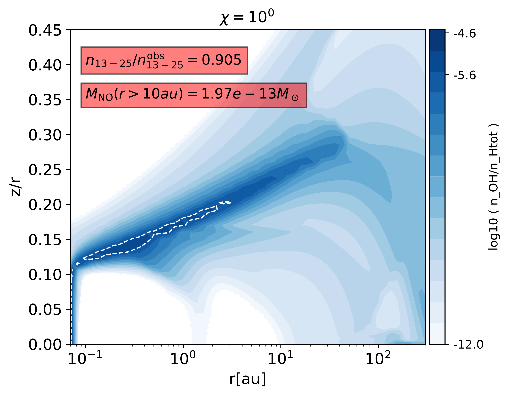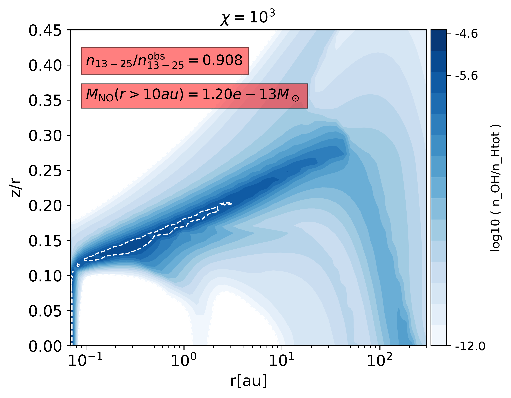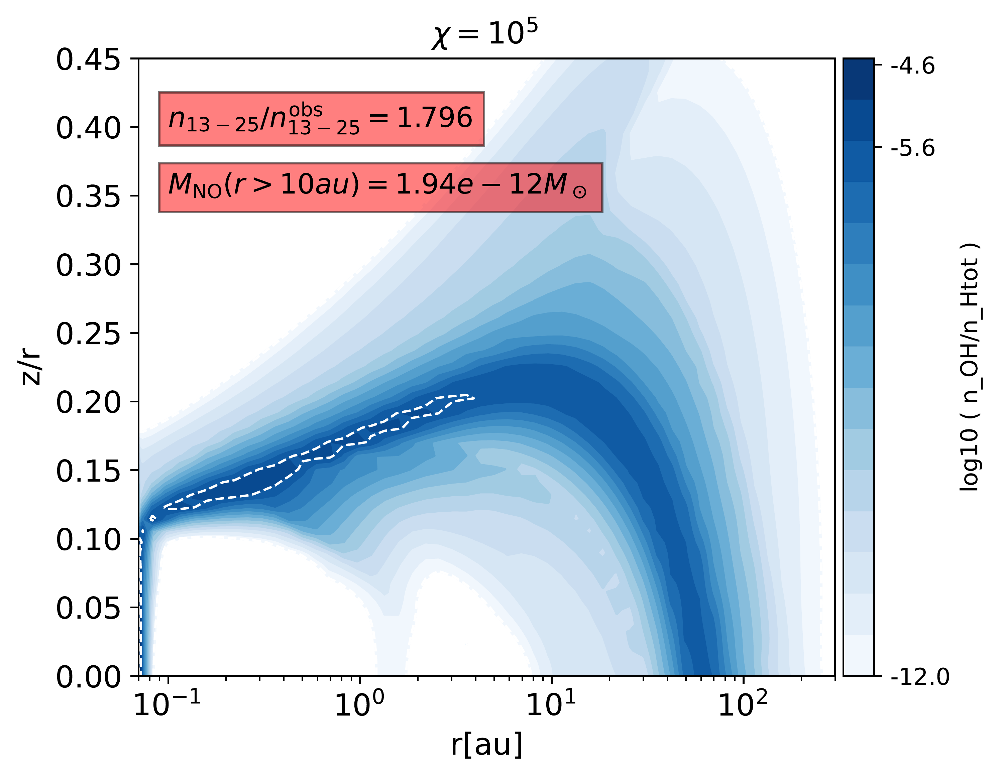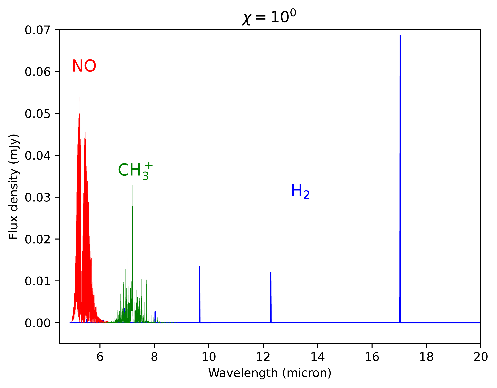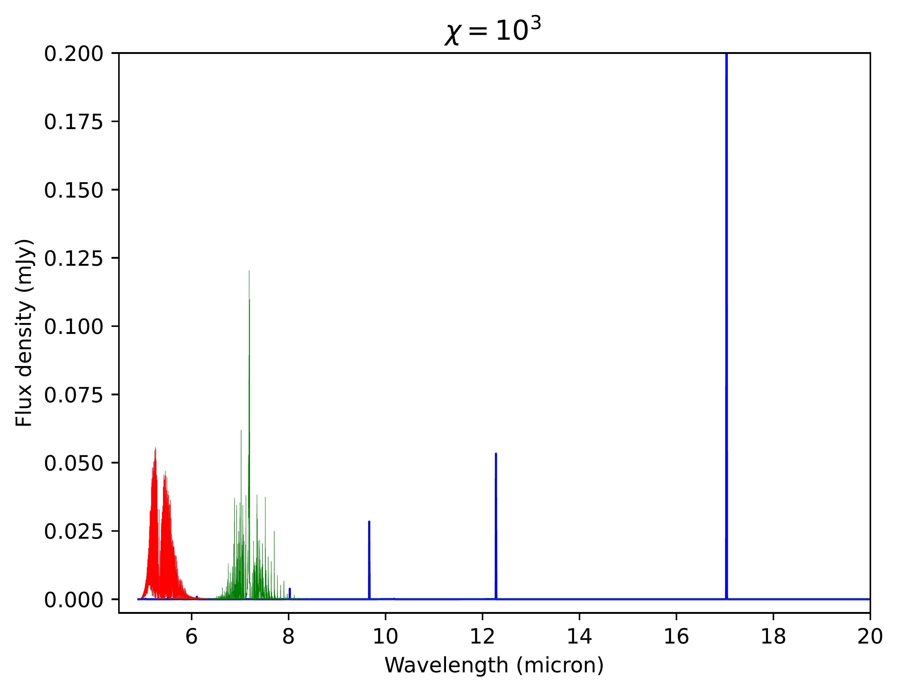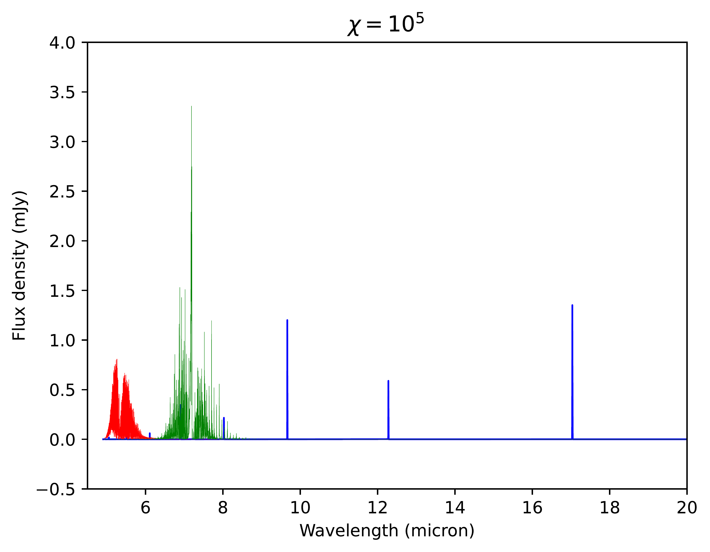

**Figure 7. -** $\rt${Effect of external irradiation on the physical structure and line emission of the fiducial disk. _Top:_} Two-dimensional distribution of gas-phase \ce{OH} for different realizations of the fiducial disk. Each realization corresponds to a different value of $\Go$. Dashed lines enclose $90\%$ of the total abundance of \ce{OH}. The insets display for each model the ratio of the synthetic spectral index to the observed one and the corresponding mass of \ce{NO} contained beyond $10$ au. $\rt${_Bottom:_ Synthetic spectra for \ce{NO, H2} and \ce{CH3+}. Note the difference on the vertical scale.} (*fig:size-irradiation-degeneracy*)

**Figure 9. -** Two-dimensional distribution of gas-phase \ce{OH} for different realizations of the fiducial disk. Each realization corresponds to a different value of $\Go$. Dashed lines enclose $90\%$ of the total abundance of \ce{OH}. The insets display for each model the ratio of the synthetic spectral index to the observed one, and the mass of \ce{NO} contained beyond $10$ au. (*fig:size-irradiation-degeneracy*)

