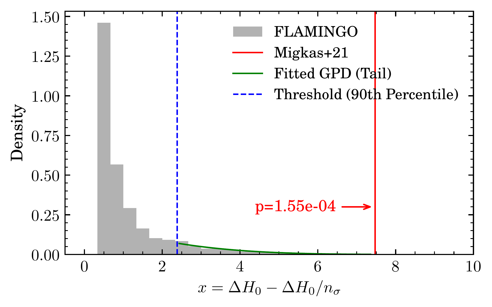
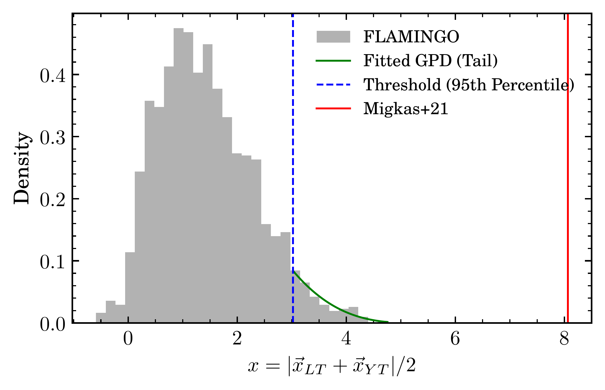
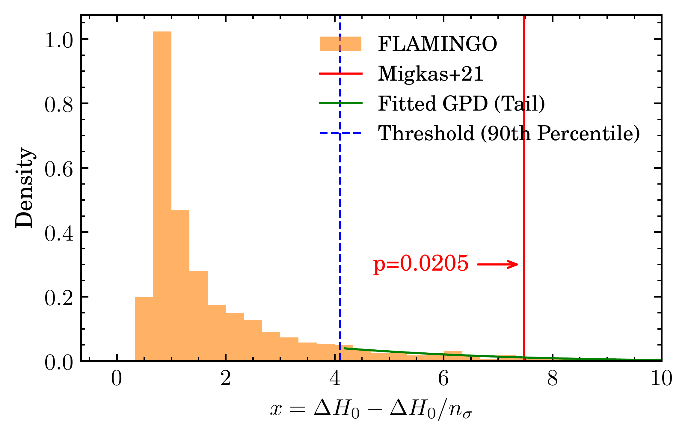
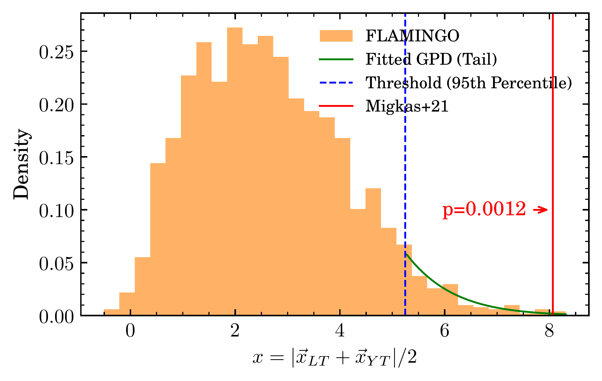
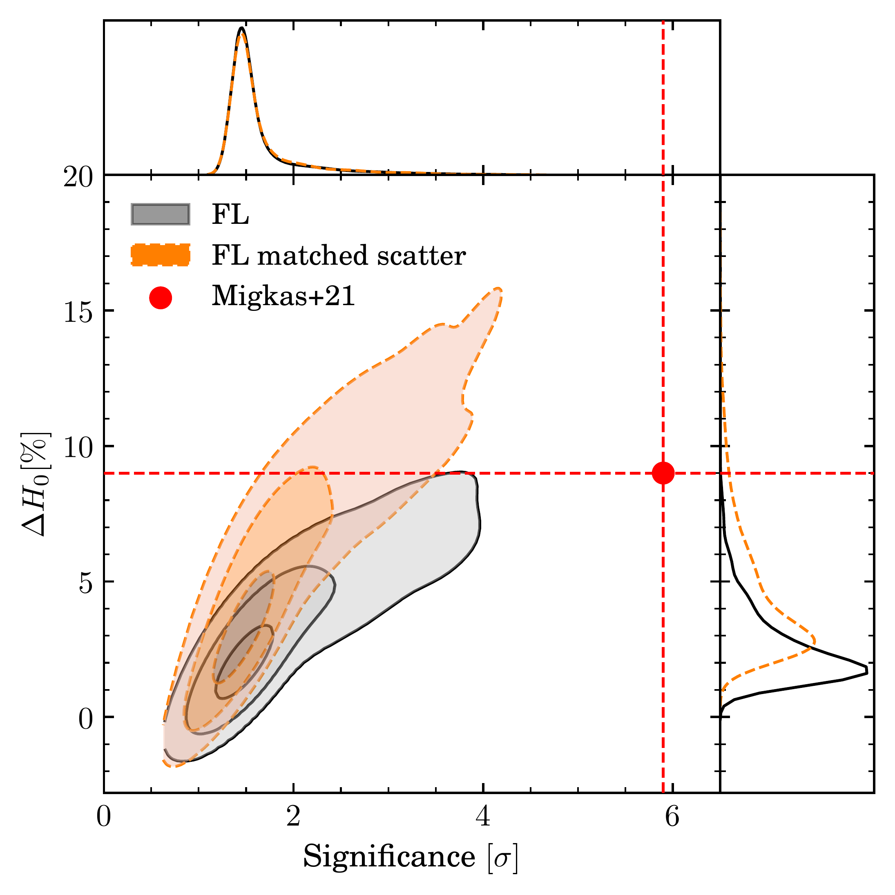
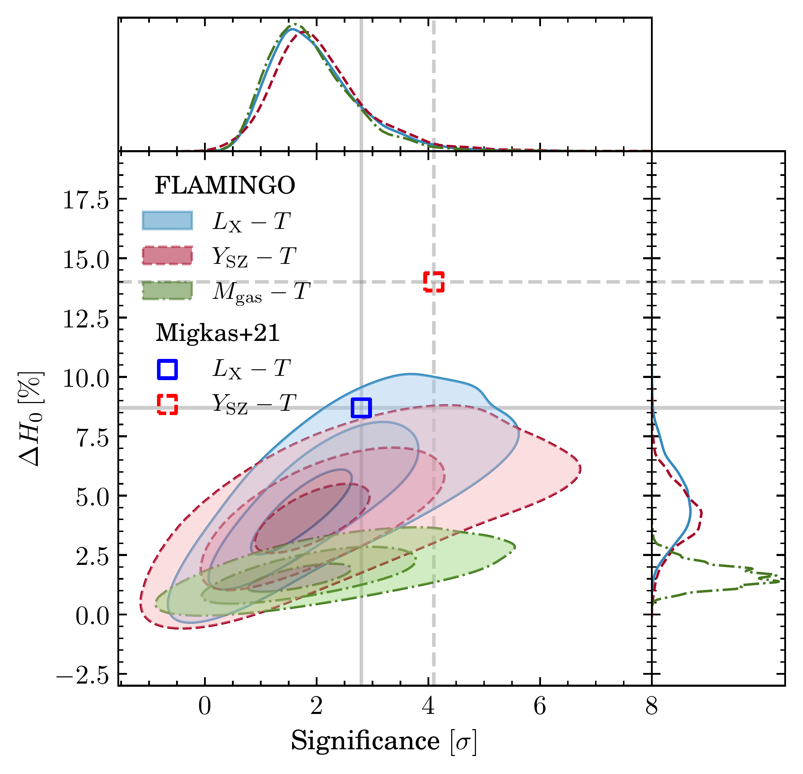
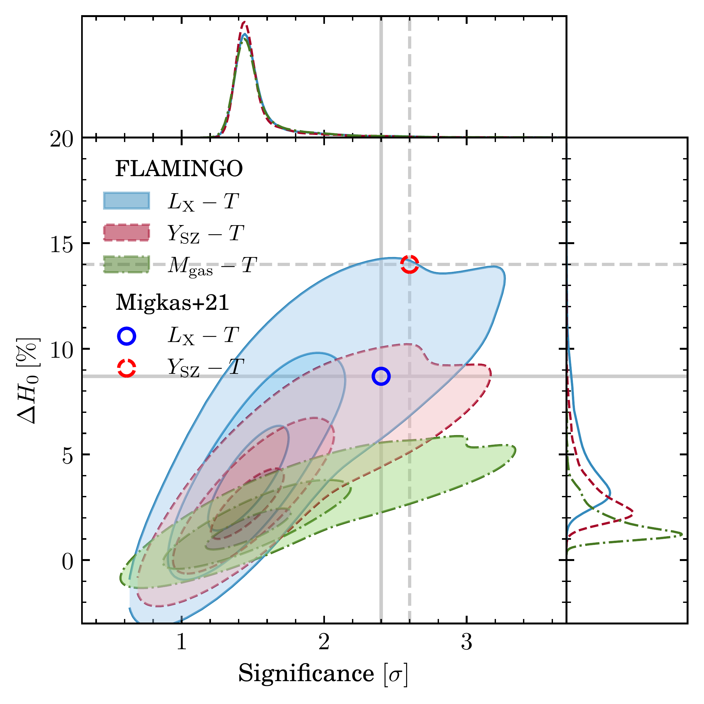
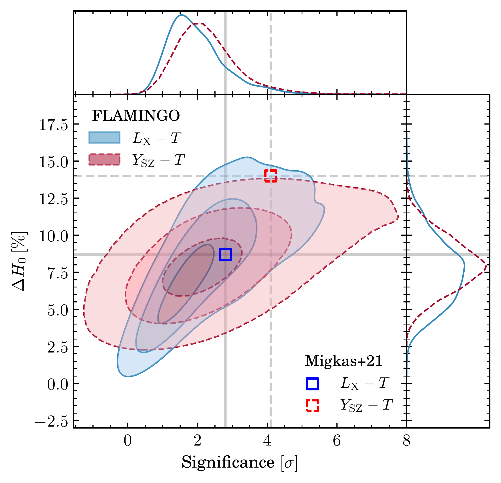
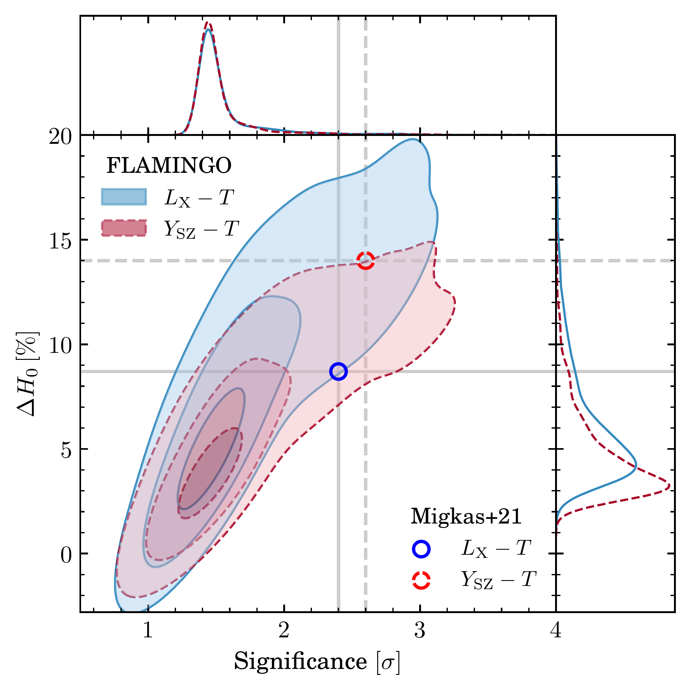

$\newcommand{\ensuremath}{}$
$\newcommand{\xspace}{}$
$\newcommand{\object}[1]{\texttt{#1}}$
$\newcommand{\farcs}{{.}''}$
$\newcommand{\farcm}{{.}'}$
$\newcommand{\arcsec}{''}$
$\newcommand{\arcmin}{'}$
$\newcommand{\ion}[2]{#1#2}$
$\newcommand{\textsc}[1]{\textrm{#1}}$
$\newcommand{\hl}[1]{\textrm{#1}}$
$\newcommand{\footnote}[1]{}$
$\newcommand{\dash}{\text{--}}$
$\newcommand{\LT}{L_\mathrm{X}\dash T}$
$\newcommand{\YT}{Y_\mathrm{SZ}\dash T}$
$\newcommand{\MT}{M_\mathrm{gas}\dash T}$
$\newcommand{\placehold}[1]{{\color{green}\texttt{[{#1}]}}}$

# Characterising galaxy cluster scaling relations as cosmic isotropy tracers using the FLAMINGO simulations

<mark>Appeared on: 2025-04-03</mark> -  _17 pages, 7 figures, submitted to A&A_

Y. He, et al. -- incl., <mark>J. Braspenning</mark>

**Abstract:** The standard cosmological model, $\Lambda$ CDM, assumes isotropy on large cosmic scales. However, recent studies using galaxy cluster scaling relations reported an apparent $H_0$ anisotropy at $5.4\sigma$ that could be attributed to large bulk flows extending beyond $\SI{500}{Mpc}$ , in disagreement with $\Lambda$ CDM. To quantify the statistical tension of the observational galaxy cluster data used in past studies with $\Lambda$ CDM, we utilize the isotropic ( $\SI{2.8}{Gpc})^3$ run of the FLAMINGO ( $\Lambda$ CDM) simulations, the largest hydrodynamical cosmological simulation available to date. We create 1728 simulated lightcones and study the apparent level of anisotropy traced by X-ray and thermal Sunyaev-Zeldovich scaling relations in the same cluster sample selection and methodology as in migkas_cosmological_2021 . We find the probability of such apparent anisotropies randomly emerging in cluster scaling relations within a $\Lambda$ CDM universe to be $0.12\%  (3.2\sigma)$ . The discrepancy goes up to $\sim 3.6\sigma$ when modelled as a bulk flow at $z < 0.1$ . We find that statistical noise accounts for over $80\%$ of the anisotropy amplitude in each lightcone, with large peculiar velocities contributing less than $20\%$ . We also show that anisotropy amplitudes are highly sensitive to the intrinsic scatter in the scaling relations, with tighter relations providing stronger constraints. Nevertheless, the tension between migkas_cosmological_2021 and $\Lambda$ CDM persists, however, at a lower significance than previously reported.

**Figure 10. -** EVS analyses of joint $H_0$ anisotropy in the FLAMINGO lightcones using the MCMC (left) and M21 (right) methods, without (top) and with (bottom) matched scatter. Grey and orange histograms show the lower-bound projection of all 1728 lightcones without and with scatter, respectively. The red vertical line marks the M21 result under the same projection. The blue dashed line indicates the GPD threshold (90th or 95th percentile), above which the tail is modelled by a Generalized Pareto Distribution (GPD), shown in green. Annotated in red is the EVS probability of obtaining the M21 result in FLAMINGO. (*fig:evs-all-joint*)

**Figure 3. -** Joint MCMC constraint from the $\LT$ and $\YT$ relations, compared to the combined M21 result (red dot). The orange contour includes injected scatter, while the grey does not. Contours show the 39\%, 86\%, and 98.9\% confidence regions. (*fig:h0-result-joint-MCMC*)

**Figure 9. -** Distribution of $H_0$ variation and its statistical significance from 1728 lightcones using the M21 scanning method (left) and the MCMC method (right), with (bottom) and without (top) mock scatter. Blue solid, red dashed, and green dash-dotted contours correspond to constraints from the $\LT$, $\YT$, and $\MT$ relations, respectively. Contour levels indicate 39\%, 86\%, and 98.9\% probability regions (equivalent to 1, 2, and 3$\sigma$ in two dimensions). Blue (red) squares mark the M21 results from $\LT$($\YT$), including their measured statistical significance. Blue (red) circles show the M21 results obtained from isotropic Monte Carlo realisations for $\LT$($\YT$). (*fig:h0-result*)

