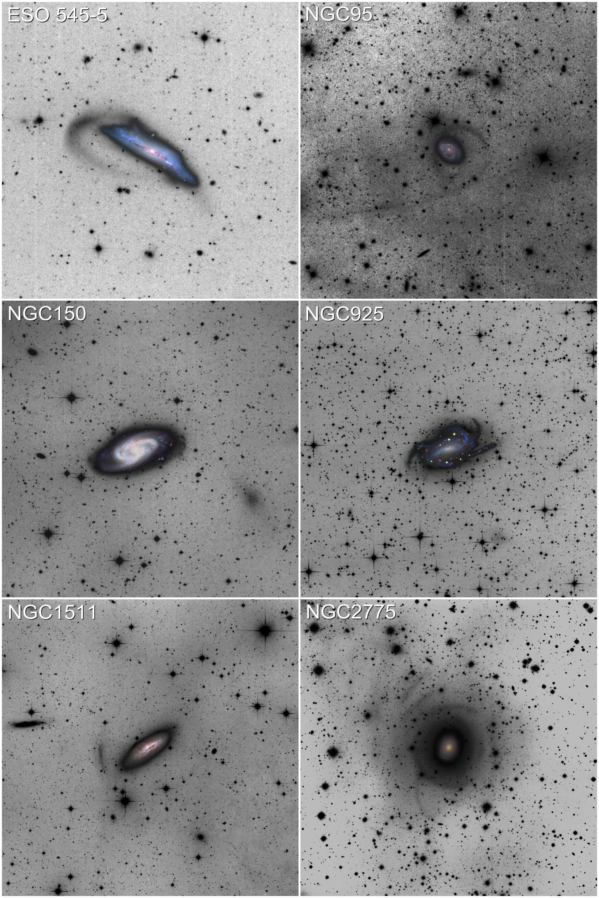
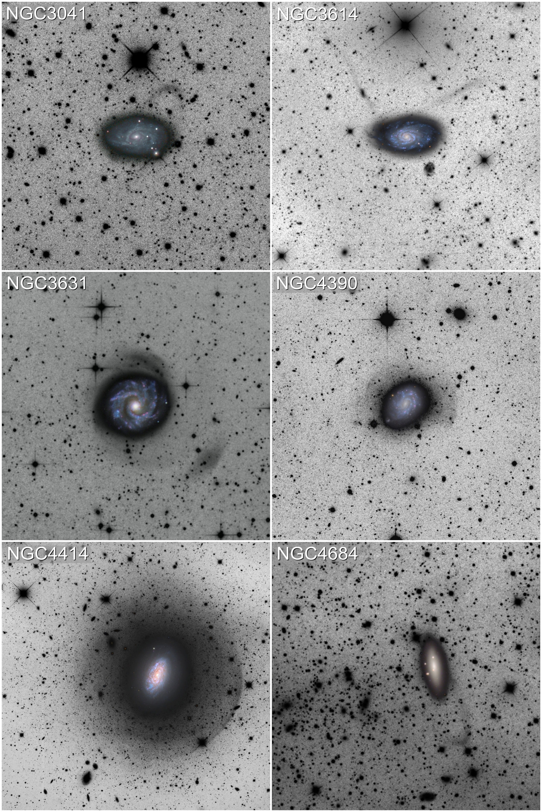

$\newcommand{\ensuremath}{}$
$\newcommand{\xspace}{}$
$\newcommand{\object}[1]{\texttt{#1}}$
$\newcommand{\farcs}{{.}''}$
$\newcommand{\farcm}{{.}'}$
$\newcommand{\arcsec}{''}$
$\newcommand{\arcmin}{'}$
$\newcommand{\ion}[2]{#1#2}$
$\newcommand{\textsc}[1]{\textrm{#1}}$
$\newcommand{\hl}[1]{\textrm{#1}}$
$\newcommand{\footnote}[1]{}$
$\newcommand{\commentMS}[1]{\textcolor{orange}{[MS: #1]}}$
$\newcommand$

# Stellar tidal streams around nearby spiral galaxies with deep imaging from amateur telescopes

<mark>Appeared on: 2025-04-04</mark> -  _21 pages, 16 figures, 5 tables. Full resolution version available in this link: this https URL_

D. Martinez-Delgado, et al. -- incl., <mark>M. Schirmer</mark>

**Abstract:** Tidal interactions between massive galaxies and their satellites are fundamental processes in a Universe with $\Lambda$ -Cold Dark Matter ( $\Lambda$ CDM) cosmology, redistributing material into faint features that preserve records of past galactic interactions. While stellar streams in the Local Group impressively demonstrate satellite disruption, they do not constitute a statistically significant sample. Constructing a substantial catalog of stellar streams beyond the Local Group remains challenging due to the difficulties in obtaining sufficiently deep, wide-field images of galaxies. Despite their potential to illuminate dark matter distribution and galaxy formation processes overall, stellar streams remain underutilized as cosmological probes. The Stellar Tidal Stream Survey (STSS) addresses this observational gap by leveraging amateur telescopes to obtain deep, scientific-grade images of galactic outskirts, capable of building a more statistically meaningful sample of stellar streams. Over the last decade, the STSS has acquired deep (up to surface brightness limit $\sim$ 28.3 mag/arcsec $^2$ in the _r_ -band) wide-field images of 15 nearby Milky Way analog galaxies using a coordinated network of robotic amateur telescopes, avoiding the issues associated with `mosaicing’ smaller images taken with a single, professional telescope. Our survey has revealed a diverse range of previously unreported faint features related to dwarf satellite accretion— including stellar streams, shells, and umbrella-like structures. We serendipitously discover an ultra-diffuse galaxy (NGC150-UDG1) which shows hints of tidal tails. The STSS demonstrates the suitability of modern amateur telescopes to detect and study faint, diffuse structures in large fields around nearby spiral galaxies. Their economic and accessibility advantages enable larger statistical samples with deep imaging, essential for testing galaxy formation models and constraining the frequency and properties of minor merger events in the local Universe.

**Figure 20. -** Our STSS images of ESO 545-5, NGC 95, NGC 150, NGC 925, NGC 1511 and NGC 2775. North is up and East is left. See text for discussion on all six images. (*fig:cmd1*)

**Figure 23. -** Our STSS images of NGC 3041, NGC 3614, NGC3631, NGC 3631, NGC 4390, NGC 4414 and NGC 4684. See text for discussion on all six images. (*fig:cmd2*)

**Figure 5. -** Vibrational stability equation of state
               $S_{\mathrm{vib}}(\lg e, \lg \rho)$.
               $>0$ means vibrational stability.
              Vibrational stability equation of state
               $S_{\mathrm{vib}}(\lg e, \lg \rho)$.
               $>0$ means vibrational stability.
              Nonlinear Model ResultsNonlinear Model ResultsSpectral types and photometry for stars in the
  region.Spectral types and photometry for stars in the
  region.List of nearby SNe used in this work.Summary for ISOCAM sources with mid-IR excess
(YSO candidates).Summary for ISOCAM sources with mid-IR excess
(YSO candidates). Sample stars with absolute magnitudecontinued. Sample stars with absolute magnitudecontinued.Shown in greyscale is a...Plotted above...Complexes characterisation.Line data and abundances ...Continued. (*FigVibStab*)

