

$\newcommand{\ensuremath}{}$
$\newcommand{\xspace}{}$
$\newcommand{\object}[1]{\texttt{#1}}$
$\newcommand{\farcs}{{.}''}$
$\newcommand{\farcm}{{.}'}$
$\newcommand{\arcsec}{''}$
$\newcommand{\arcmin}{'}$
$\newcommand{\ion}[2]{#1#2}$
$\newcommand{\textsc}[1]{\textrm{#1}}$
$\newcommand{\hl}[1]{\textrm{#1}}$
$\newcommand{\footnote}[1]{}$

# Mid-infrared extinction curve for protostellar envelopes from JWST-detected embedded jet emission: the case of TMC1A

<mark>Appeared on: 2025-04-04</mark> -  _Submitted to A&A_

K. D. Assani, et al. -- incl., <mark>H. Beuther</mark>

**Abstract:** Dust grains are fundamental components of the interstellar medium and play a crucial role in star formation, serving as catalysts for chemical reactions and the building blocks of planets. Extinction curves serve as a tool for characterizing dust properties, yet mid-infrared (MIR) extinction remains less constrained in protostellar environments. Gas-phase line ratios from embedded protostellar jets offer a spatially resolved method to measure extinction from protostellar envelopes, complementing traditional background starlight techniques. We aim to derive mid-IR extinction curves along the lines of sight toward a protostellar jet embedded within an envelope and assess whether they differ from those inferred in dense molecular clouds. We analyze JWST NIRSpec IFU and MIRI MRS observations, focusing on four locations along the blue-shifted TMC1A jet. After extracting observed [ $\ion{Fe}{II}$ ] line intensities, we model intrinsic line ratios using the Cloudy spectral synthesis code across a range of electron densities and temperatures. By comparing observed near-IR (NIR) and MIR line ratios to Cloudy-predicted intrinsic ratios, we infer the relative extinction between NIR and MIR wavelengths. Electron densities ( $n_e$ ) derived from NIR [ $\ion{Fe}{II}$ ] lines range from $\sim5 \times 10^4$ to $\sim5 \times 10^3$ cm $^{-3}$ along the jet axis at scales $\lesssim$ 350 AU, serving as reference points for comparing relative NIR and MIR extinction. The derived MIR extinction values exhibit higher reddening than the empirical dark cloud curve from [ and McClure (2009)]() at the corresponding $n_e$ and temperatures ranging from a few 10 $^3$ K to $\sim$ 10 $^4$ K, as adopted from shock models. While both electron density and temperature influence the NIR-to-MIR [ $\ion{Fe}{II}$ ] line ratios, the ratios are more strongly dependent on $n_e$ over the adopted range. If the MIR emission originates from gas that is less dense and cooler than the NIR-emitting region, the inferred extinction curves remain consistent with background star-derived values. This study introduces a new line-based method for deriving spatially resolved MIR extinction curves towards embedded protostellar sources exhibiting a bright [ $\ion{Fe}{II}$ ] jet. The results suggest that protostellar envelopes may contain dust with a modified grain size distribution---such as an increased fraction of larger grains, potentially due to grain growth---if the MIR and NIR lines originate from similar regions along the same sightlines. Alternatively, if the grain size distribution has not changed (i.e., no grain growth), the MIR lines may trace cooler, less dense gas than the NIR lines along the same sightlines. This method provides a novel approach for studying dust properties in star-forming regions and can be extended to other protostellar systems to refine extinction models in embedded environments.

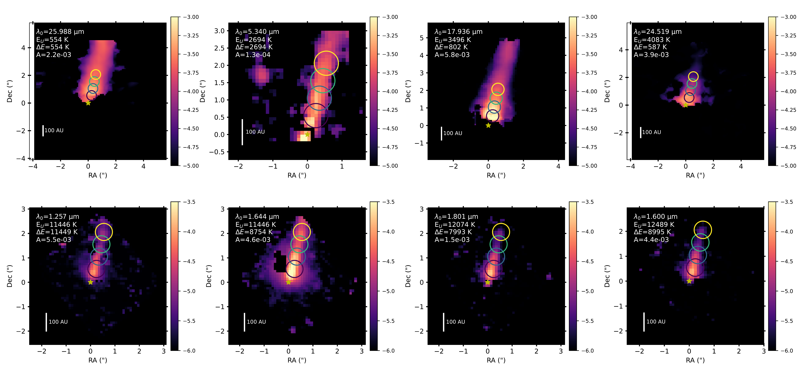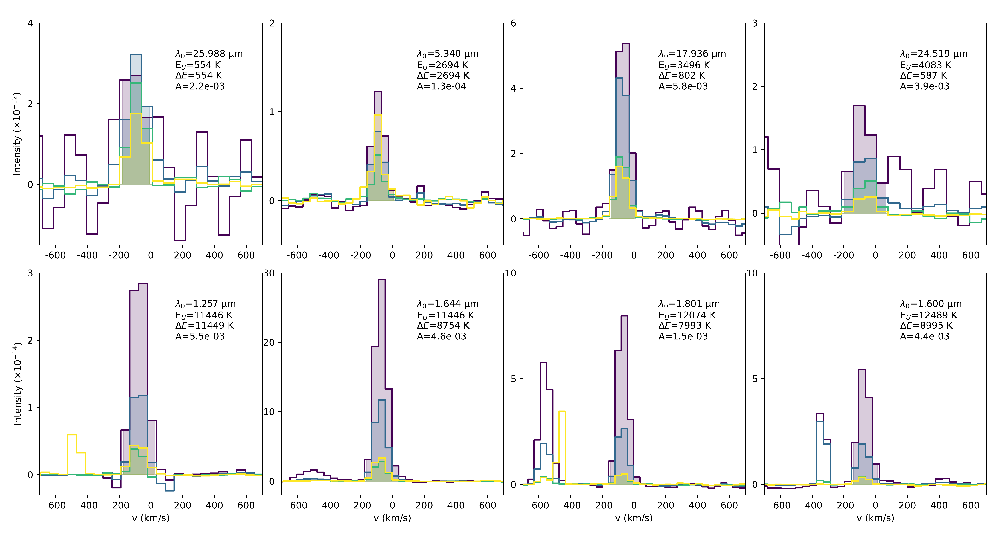

**Figure 5. -** [$\ion${Fe}{II}] emission lines used in this study and detected with NIRSpec and MIRI, arranged in order of increasing upper energy ($E_U/k$). **Top panels**: moment-0 maps (in units of erg s$^{-1}$ cm$^{-2}$ sr$^{-1}$), constructed by integrating the emission across the frequency range indicated by the shaded regions in the corresponding spectra below. Although integration is performed in frequency space, the x-axis is displayed in velocity (km s$^{-1}$) for clarity. A 3-sigma threshold is applied. The maps are overlaid with circular, color-coded apertures (0.7") used consistently throughout this study. **Bottom panels**: spectra (in units of erg s$^{-1}$ cm$^{-2}$ sr$^{-1}$ Hz$^{-1}$) extracted from each aperture, with shaded regions highlighting the velocity range used for integration, primarily focusing on blue-shifted emission. Each subplot includes the rest wavelength ($\lambda_0$), transition and upper energies ($\Delta E$, $E_U$), and Einstein-A value for reference. (*fig:iron_detections_subset*)

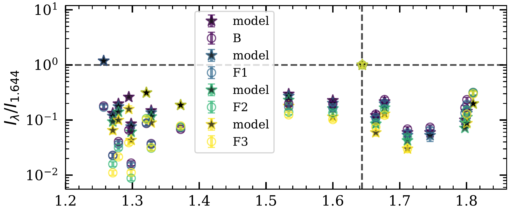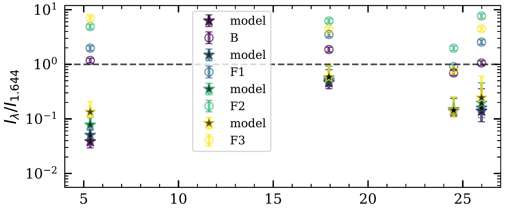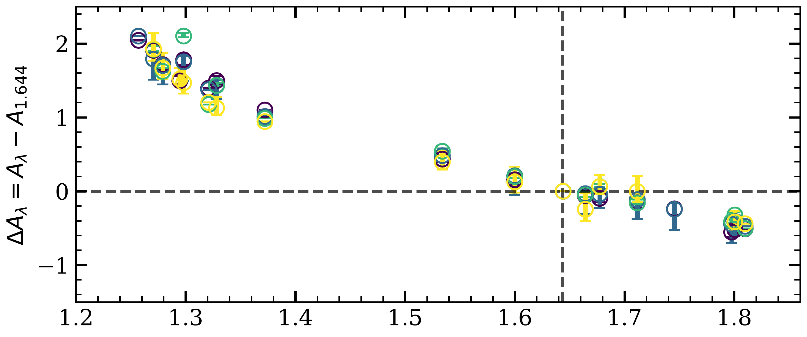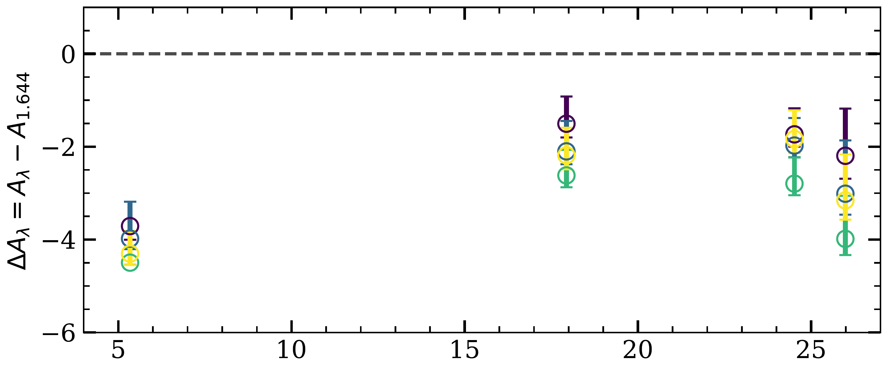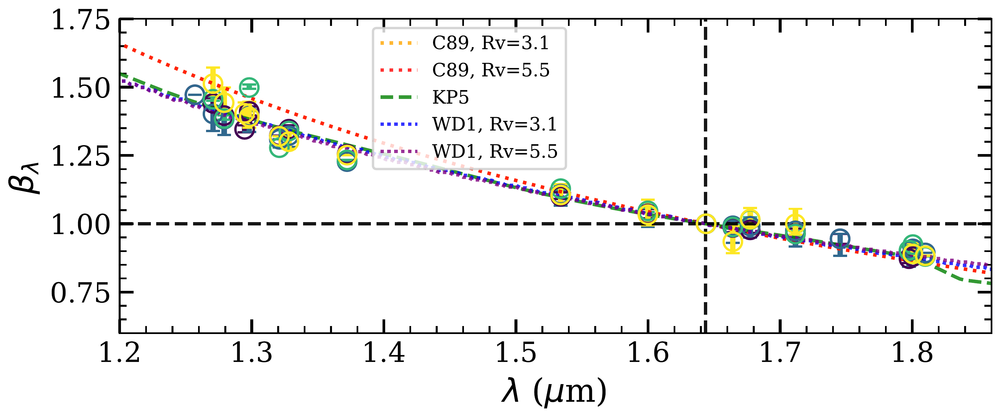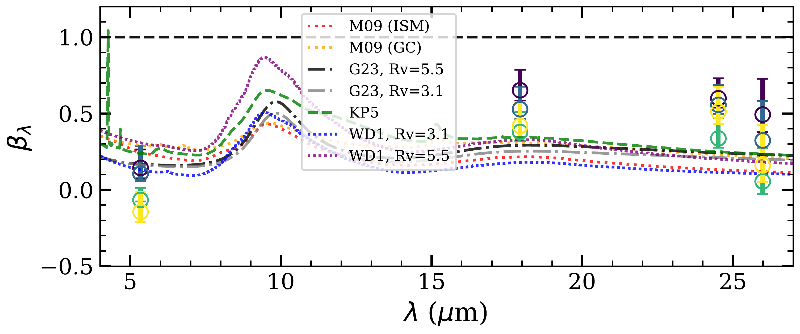

**Figure 6. -** _NIR and MIR extinction toward the TMC1A jet_. Same as Figure 2, but extended to include additional a$^4$D lines in the NIR (left) used for $n_{\rm e}$ derivation, along with MIR lines (right). Model scatter points correspond to the derived electron density at 10,000 K (see Sect. \ref{sec:4_electron_density_NIR}), with uncertainties reflecting the uncertainty range in the determined $n_{\rm e}$ value and temperatures from 5,000–10,000 K. Commonly used NIR/MIR extinction curves are overplotted for comparison (see text). (*fig:MIR_derived_extinction_same_cond*)

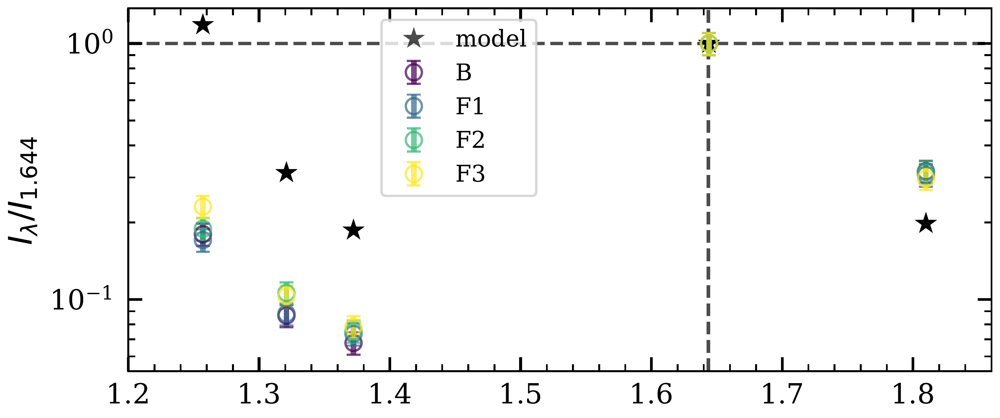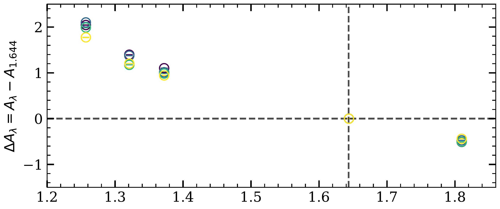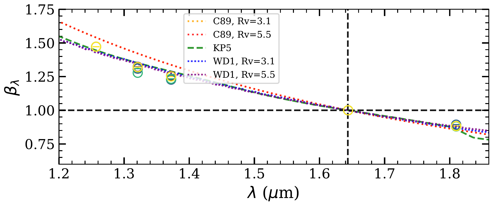

**Figure 1. -** Near-infrared (NIR) extinction of a$^4$D J=7/2 lines relative to the 1.644 $\mu$m line (horizontal and vertical dashed lines.).
**Top:** Observed (\texttt{'o'}) and modeled (\texttt{'*'}) line ratios for all four jet locations in this study.
**Middle:** The difference in extinction relative to the 1.644 $\mu$m line.
**Bottom:** Derived $\beta_{\lambda}$ values, normalized by the extinction at 1.644 $\mu$m, which is computed as an average over existing NIR extinction curves. This is compared with empirically determined NIR extinction curves---C89 cardelli1989relationship, and modeled extinction curves---WD1 [ and Weingartner (2001)](), KP5 [Pontoppidan, et. al (2024)]().
We include $R_V=3.1$ and $R_V=5.5$ for applicable curves to illustrate that NIR extinction in the 1.2–1.8 $\mu$m range is largely independent of $R_V$ and shows minimal differences between independent studies. Dashed lines mark the reference line ratio, extinction difference, and $\beta_{\lambda}$ value at 1.644 $\mu$m (horizontal) and the wavelength of 1.644 $\mu$m (vertical) in all three panels. (*fig:a4dj72_extinction*)

