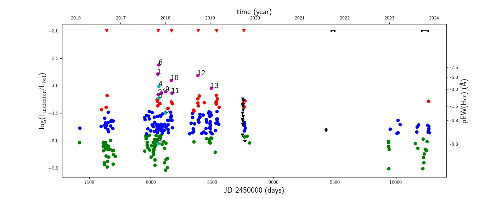
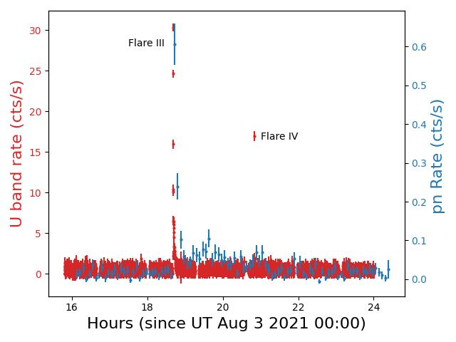
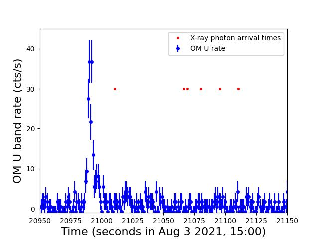

$\newcommand{\ensuremath}{}$
$\newcommand{\xspace}{}$
$\newcommand{\object}[1]{\texttt{#1}}$
$\newcommand{\farcs}{{.}''}$
$\newcommand{\farcm}{{.}'}$
$\newcommand{\arcsec}{''}$
$\newcommand{\arcmin}{'}$
$\newcommand{\ion}[2]{#1#2}$
$\newcommand{\textsc}[1]{\textrm{#1}}$
$\newcommand{\hl}[1]{\textrm{#1}}$
$\newcommand{\footnote}[1]{}$
$\newcommand{\gaia}{{\it Gaia}\xspace}$
$\newcommand{\chandra}{{\it Chandra}\xspace}$

# Coronal and chromospheric activity of Teegarden's star 

<mark>Appeared on: 2025-04-04</mark> -  _15 pages, 20 figures_

B. Fuhrmeister, et al. -- incl., <mark>T. Henning</mark>

**Abstract:** Teegarden's star is a late-type M-dwarf planet host, typically showing only rather low levels of activity. In this paper we present an extensive characterisation of this activity at photospheric, chromospheric, and coronal levels.  We specifically investigated TESS observations of Teegarden's star, which showed two very large flares with an estimated flare fluence between 10 $^{29}$ and 10 $^{32}$ erg comparable to the largest solar flares.  We furthermore analysed nearly 300 CARMENES spectra and 11 ESPRESSO spectra covering all the usually used chromospheric lines in the optical from the $\ion{Ca}{ii}$ H \& K lines at 3930 Å  to the $\ion{He}{i}$ infrared triplet at 10830 Å. These lines show different behaviour: The $\ion{He}{i}$ infrared triplet is the only one absent in all spectra,  some lines show up only during flares, and  others are always present and highly variable. Specifically, the H $\alpha$ line is more or less filled in during quiescence; however, the higher Balmer lines are still observed in emission. Many chromospheric lines show a correlation with H $\alpha$ variability, which, in addition to stochastic behaviour, also shows systematic behaviour on different timescales including the rotation period.    Moreover, we found several flares and also report hints of an erupting prominence, which may have led to a coronal mass ejection. Finally, we present X-ray observations of Teegarden's star (i.e. a discovery pointing obtained with the $*Chandra*$ observatory)    and an extensive study with the $*XMM-Newton*$ observatory; when  these    two large flares were observed, one of them showed clear signatures of the Neupert effect, suggesting the production of hard X-rays in the system.

**Figure 18. -**  Time series of $L_{\mathrm{indicator}}/L_{\mathrm{bol}}$. For the CARMENES
  $L_{\mathrm{H}\alpha}/L_{\mathrm{bol}}$ we mark low activity states as green and blue dots, high activity states as  red dots, flares as magenta dots, and spectra with an asymmetric H$\alpha$ shape as cyan dots (see Sect. \ref{sec:halpha} for a detailed discussion). The cyan and magenta dots are labelled with the flare number also used in Fig.\ref{subtracspec}. Flare no. 14 is not shown here since the spectrum gets into absorption, and therefore no $L_{\mathrm{indicator}}/L_{\mathrm{bol}}$ can be calculated with the $\chi$ method used here since it is only defined for emission lines.
  The ESPRESSO H$\alpha$ measurements are marked as black triangles.
  The $L_{\rm X}/L_{\mathrm{bol}}$ measurement of the *Chandra* observation is marked as a black star; that of the *XMM-Newton* observation is marked as a black diamond.  The time spans of the TESS observations are marked as   small black dots connected by a black line. Since TESS is not photometrically calibrated, the position on the y-axis is arbitrary (we note here that for a blackbody of the temperature of Teegarden's star about 20 percent of the radiation is in the TESS band). The red triangles mark the positions of the clusters of the higher activity states.
 (*pEWhalpha*)

**Figure 1. -** _ XMM-Newton_ light curve for Teegarden's star obtained with the
OM in the U band (red data points, time resolution 10 s) and
the EPIC pn detector (blue data points, time resolution 300 s). Flare III occurs at $\sim$18.6 h and Flare IV occurs at $\sim$20.9 h.
 (*fig:xmm_pn_om*)

**Figure 3. -**  Close-up view of _XMM-Newton_ data for Flare IV. The OM U band rate (1 sec bins) is shown as blue data points, while the arrival times of the recorded EPIC events are shown as red dots.  (*flare_2_higres*)

