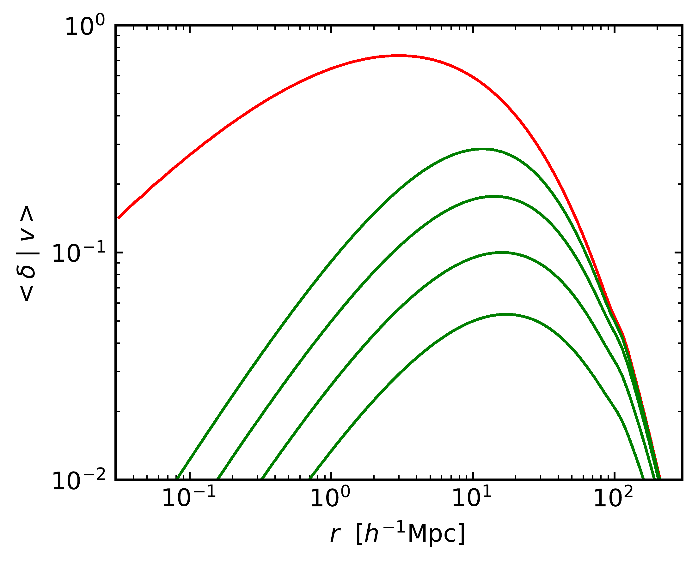
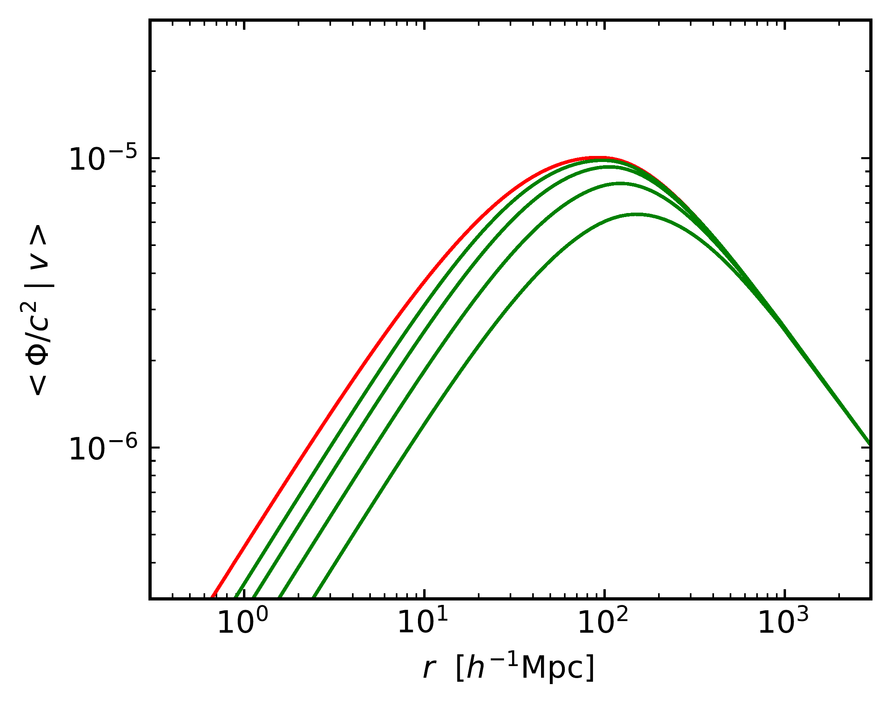

$\newcommand{\ensuremath}{}$
$\newcommand{\xspace}{}$
$\newcommand{\object}[1]{\texttt{#1}}$
$\newcommand{\farcs}{{.}''}$
$\newcommand{\farcm}{{.}'}$
$\newcommand{\arcsec}{''}$
$\newcommand{\arcmin}{'}$
$\newcommand{\ion}[2]{#1#2}$
$\newcommand{\textsc}[1]{\textrm{#1}}$
$\newcommand{\hl}[1]{\textrm{#1}}$
$\newcommand{\footnote}[1]{}$
$\newcommand{\be}{\begin{equation}}$
$\newcommand{\ee}{\end{equation}}$
$\newcommand{\bes}{\begin{equation*}}$
$\newcommand{\ees}{\end{equation*}}$
$\newcommand{\bea}{\begin{eqnarray}}$
$\newcommand{\eea}{\end{eqnarray}}$
$\newcommand{\beas}{\begin{eqnarray*}}$
$\newcommand{\eeas}{\end{eqnarray*}}$
$\newcommand{\msun}{M_{\odot}}$
$\newcommand{\ten}{10^{10}}$
$\newcommand{\eleven}{10^{11}}$
$\newcommand{\twelve}{10^{12}}$
$\newcommand{\thirteen}{10^{13}}$
$\newcommand{\fourteen}{10^{14}}$
$\newcommand{\Mpc}{ h^{-1}{\rm Mpc}}$
$\newcommand{\de}{{\rm d}}$
$\newcommand{\rhoin}{\rho_{\rm in}}$
$\newcommand{\rhoout}{\rho_{\rm out}}$
$\newcommand{\phiin}{\phi_{\rm in}}$
$\newcommand{\phiout}{\phi_{\rm out}}$
$\newcommand{\roll}{R_{\rm roll}}$
$\newcommand{\lamin}{\lambda_{\rm in}}$
$\newcommand{\lamout}{\lambda_{\rm out}}$
$\newcommand{\mpl}{M_{\rm Pl}}$
$\newcommand{\senv}{S_{\rm env}}$
$\newcommand{\renv}{R_{\rm env}}$
$\newcommand{\denv}{\delta_{\rm env}}$
$\newcommand{\dsc}{\delta_{\rm sc}}$
$\newcommand{\dv}{\delta_{\rm v}}$
$\newcommand{\tcr}{\textcolor{red}}$
$\newcommand{\tcb}{\textcolor{red}}$
$\newcommand\bnabla{{\boldsymbol{\nabla}}}$
$\newcommand\br{{\bf r}}$
$\newcommand\bg{{\bf g}}$
$\newcommand\bv{{\bf v}}$
$\newcommand\bx{{\bf x}}$
$\newcommand\bxhat{{\hat \bx}}$
$\newcommand{\[}{\begin{equation}}$
$\newcommand{\]}{\end{equation}}$
$\newcommand{\kms}{{ \rm km s^{-1}}}$
$\newcommand{\kmsmpc}{{ \rm km s^{-1}Mpc^{-1}}}$
$\newcommand{\hompc}{{ h \rm Mpc^{-1}}}$
$\newcommand{\mpcoh}{{ h^{-1} \rm Mpc}}$
$\newcommand\JAP{#1}{{\color{red}#1}}$
$\newcommand\SA{#1}{{\color{pink}#1}}$
$\newcommand\v{#1}{{\bf #1}}$
$\newcommand{\vec}[1]{{\boldsymbol{#1}}}$
$\newcommand{\YC}[1]{{\color{red}{#1}}}$
$\newcommand{\JP}[1]{{\color{green}{#1}}}$
$\newcommand\citejap{#1}{\citeauthor{#1} \citeyear{#1}}$
$\newcommand\JAP{#1}{{\color{red}#1}}$
$\newcommand\SA{#1}{{\color{magenta}#1}}$
$\newcommand\YC{#1}{{\color{orange}#1}}$
$\newcommand\m{@th}{\mathsurround=0pt }$
$\newcommand\eqalign{#1}{\null \vcenter{\openup1\jot \m@th$
$ \ialign{\strut\hfil\displaystyle{##}&\displaystyle{ ##}\hfil$
$ \crcr#1\crcr}} }$
$\newcommand{\beq}{\begin{equation}}$
$\newcommand{\eeq}{\end{equation}}$
$\newcommand{\gs}{\mathrel{\lower0.6ex\hbox{\buildrel{\textstyle >}$
$ \over{\scriptstyle \sim}}}}$
$\newcommand{\ls}{\mathrel{\lower0.6ex\hbox{\buildrel{\textstyle <}$
$ \over{\scriptstyle \sim}}}}$
$\newcommand{\japsc}{\scriptscriptstyle\rm}$
$\newcommand\omit{#1 $
$}\newcommand{\fg}{f}$
$\include{aas_journals}$
$\setlength{\topmargin}{-10mm}$
$\begin{document}$
$\title[Detection of cosmological dipoles aligned with transverse peculiar velocities]{Detection of cosmological dipoles aligned with transverse peculiar velocities}$
$\author[Y.-C. Cai et al.]{$
$Yan-Chuan Cai^{1}\thanks{E-mail: cai@roe.ac.uk},$
$John A. Peacock^{1},$
$Anna de Graaff^{2},$
$Shadab Alam^{3}$
$\ ^{1}Institute for Astronomy, University of Edinburgh, Royal Observatory Edinburgh, Blackford Hill, Edinburgh EH9 3HJ, UK\ ^2Max-Planck-Institut für Astronomie, Königstuhl 17, D-69117 Heidelberg, Germany \ ^3Department of Theoretical Physics, Tata Institute of Fundamental Research, Homi Bhabha Road, Mumbai 400005, India$
$}$
$\maketitle$
$\begin{abstract}$
$Peculiar velocities encode rich cosmological information, but their transverse components are hard to measure. Here, we present the first observations of a novel effect of transverse velocities: the dipole signatures that they imprint on the Cosmic Microwave Background.$
$The peculiar velocity field points towards gravitational wells and away from potential hills, reflecting a large-scale dipole in the gravitational potential, coherent over hundreds of Mpc. Analogous dipoles will also exist in all other fields that correlate with the potential. These dipoles are readily observed in projection on the CMB sky via gravitational lensing and the integrated Sachs-Wolfe (ISW) effect -- both of which correlate with transverse peculiar velocities. The large-scale ISW dipole is distinct from the small-scale moving lens effect, which has a dipole of the opposite sign. We new a unified framework for analysing these velocity-related dipoles and demonstrate how stacking can extract the signal from sky maps of galaxy properties, CMB temperature, and lensing. We show that the CMB dipole signal is independent of galaxy bias, and orthogonal to the usual monopole correlation function, so this new observable news additional cosmological information. We present the first detections of the dipole signal in (i) galaxy density; (ii) CMB lensing convergence; and (iii) CMB temperature -- interpreted as the ISW effect -- using galaxies from the SDSS-III BOSS survey and CMB maps from {\it Planck}. We show that the observed signals are consistent with \LambdaCDM predictions, and use the combined lensing and ISW results to set limits on linearised models of modified gravity.$
$\end{abstract}$
$\begin{keywords}$
$gravitation -- gravitational lensing: weak -- methods: analytical -- methods: observational -- cosmic background radiation -- cosmological parameters -- large-scale structure of Universe -- cosmology: observations$
$\end{keywords}$
$\n\end{document}\end{equation}}\end{equation}}\end{eqnarray*}}\end{eqnarray}}\end{equation*}}\end{equation}}$
$\newcommand{\ee}{\end{equation}}$
$\newcommand{\bes}{\begin{equation*}}$
$\newcommand{\ees}{\end{equation*}}$
$\newcommand{\bea}{\begin{eqnarray}}$
$\newcommand{\eea}{\end{eqnarray}}$
$\newcommand{\beas}{\begin{eqnarray*}}$
$\newcommand{\eeas}{\end{eqnarray*}}$
$\newcommand{\msun}{M_{\odot}}$
$\newcommand{\ten}{10^{10}}$
$\newcommand{\eleven}{10^{11}}$
$\newcommand{\twelve}{10^{12}}$
$\newcommand{\thirteen}{10^{13}}$
$\newcommand{\fourteen}{10^{14}}$
$\newcommand{\Mpc}{ h^{-1}{\rm Mpc}}$
$\newcommand{\de}{{\rm d}}$
$\newcommand{\rhoin}{\rho_{\rm in}}$
$\newcommand{\rhoout}{\rho_{\rm out}}$
$\newcommand{\phiin}{\phi_{\rm in}}$
$\newcommand{\phiout}{\phi_{\rm out}}$
$\newcommand{\roll}{R_{\rm roll}}$
$\newcommand{\lamin}{\lambda_{\rm in}}$
$\newcommand{\lamout}{\lambda_{\rm out}}$
$\newcommand{\mpl}{M_{\rm Pl}}$
$\newcommand{\senv}{S_{\rm env}}$
$\newcommand{\renv}{R_{\rm env}}$
$\newcommand{\denv}{\delta_{\rm env}}$
$\newcommand{\dsc}{\delta_{\rm sc}}$
$\newcommand{\dv}{\delta_{\rm v}}$
$\newcommand{\tcr}{\textcolor{red}}$
$\newcommand{\tcb}{\textcolor{red}}$
$\newcommand\bnabla{{\boldsymbol{\nabla}}}$
$\newcommand\br{{\bf r}}$
$\newcommand\bg{{\bf g}}$
$\newcommand\bv{{\bf v}}$
$\newcommand\bx{{\bf x}}$
$\newcommand\bxhat{{\hat \bx}}$
$\newcommand{\[}{\begin{equation}}$
$\newcommand{\]}{\end{equation}}$
$\newcommand{\kms}{{ \rm km s^{-1}}}$
$\newcommand{\kmsmpc}{{ \rm km s^{-1}Mpc^{-1}}}$
$\newcommand{\hompc}{{ h \rm Mpc^{-1}}}$
$\newcommand{\mpcoh}{{ h^{-1} \rm Mpc}}$
$\newcommand\JAP{#1}{{\color{red}#1}}$
$\newcommand\SA{#1}{{\color{pink}#1}}$
$\newcommand\v{#1}{{\bf #1}}$
$\newcommand{\vec}[1]{{\boldsymbol{#1}}}$
$\newcommand{\YC}[1]{{\color{red}{#1}}}$
$\newcommand{\JP}[1]{{\color{green}{#1}}}$
$\newcommand\citejap{#1}{\citeauthor{#1} \citeyear{#1}}$
$\newcommand\JAP{#1}{{\color{red}#1}}$
$\newcommand\SA{#1}{{\color{magenta}#1}}$
$\newcommand\YC{#1}{{\color{orange}#1}}$
$\newcommand\m{@th}{\mathsurround=0pt }$
$\newcommand\eqalign{#1}{\null \vcenter{\openup1\jot \m@th$
$ \ialign{\strut\hfil\displaystyle{##}&\displaystyle{ ##}\hfil$
$ \crcr#1\crcr}} }$
$\newcommand{\beq}{\begin{equation}}$
$\newcommand{\eeq}{\end{equation}}$
$\newcommand{\gs}{\mathrel{\lower0.6ex\hbox{\buildrel{\textstyle >}$
$ \over{\scriptstyle \sim}}}}$
$\newcommand{\ls}{\mathrel{\lower0.6ex\hbox{\buildrel{\textstyle <}$
$ \over{\scriptstyle \sim}}}}$
$\newcommand{\japsc}{\scriptscriptstyle\rm}$
$\newcommand\omit{#1 $
$}\newcommand{\fg}{f}$
$\include{aas_journals}$
$\setlength{\topmargin}{-10mm}$
$\begin{document}$
$\title[Detection of cosmological dipoles aligned with transverse peculiar velocities]{Detection of cosmological dipoles aligned with transverse peculiar velocities}$
$\author[Y.-C. Cai et al.]{$
$Yan-Chuan Cai^{1}\thanks{E-mail: cai@roe.ac.uk},$
$John A. Peacock^{1},$
$Anna de Graaff^{2},$
$Shadab Alam^{3}$
$\ ^{1}Institute for Astronomy, University of Edinburgh, Royal Observatory Edinburgh, Blackford Hill, Edinburgh EH9 3HJ, UK\ ^2Max-Planck-Institut für Astronomie, Königstuhl 17, D-69117 Heidelberg, Germany \ ^3Department of Theoretical Physics, Tata Institute of Fundamental Research, Homi Bhabha Road, Mumbai 400005, India$
$}$
$\maketitle$
$\begin{abstract}$
$Peculiar velocities encode rich cosmological information, but their transverse components are hard to measure. Here, we present the first observations of a novel effect of transverse velocities: the dipole signatures that they imprint on the Cosmic Microwave Background.$
$The peculiar velocity field points towards gravitational wells and away from potential hills, reflecting a large-scale dipole in the gravitational potential, coherent over hundreds of Mpc. Analogous dipoles will also exist in all other fields that correlate with the potential. These dipoles are readily observed in projection on the CMB sky via gravitational lensing and the integrated Sachs-Wolfe (ISW) effect -- both of which correlate with transverse peculiar velocities. The large-scale ISW dipole is distinct from the small-scale moving lens effect, which has a dipole of the opposite sign. We new a unified framework for analysing these velocity-related dipoles and demonstrate how stacking can extract the signal from sky maps of galaxy properties, CMB temperature, and lensing. We show that the CMB dipole signal is independent of galaxy bias, and orthogonal to the usual monopole correlation function, so this new observable news additional cosmological information. We present the first detections of the dipole signal in (i) galaxy density; (ii) CMB lensing convergence; and (iii) CMB temperature -- interpreted as the ISW effect -- using galaxies from the SDSS-III BOSS survey and CMB maps from {\it Planck}. We show that the observed signals are consistent with \LambdaCDM predictions, and use the combined lensing and ISW results to set limits on linearised models of modified gravity.$
$\end{abstract}$
$\begin{keywords}$
$gravitation -- gravitational lensing: weak -- methods: analytical -- methods: observational -- cosmic background radiation -- cosmological parameters -- large-scale structure of Universe -- cosmology: observations$
$\end{keywords}$
$\n\end{document}\end{equation}}\end{equation}}\end{eqnarray*}}\end{eqnarray}}\end{equation*}}$
$\newcommand{\ees}{\end{equation*}}$
$\newcommand{\bea}{\begin{eqnarray}}$
$\newcommand{\eea}{\end{eqnarray}}$
$\newcommand{\beas}{\begin{eqnarray*}}$
$\newcommand{\eeas}{\end{eqnarray*}}$
$\newcommand{\msun}{M_{\odot}}$
$\newcommand{\ten}{10^{10}}$
$\newcommand{\eleven}{10^{11}}$
$\newcommand{\twelve}{10^{12}}$
$\newcommand{\thirteen}{10^{13}}$
$\newcommand{\fourteen}{10^{14}}$
$\newcommand{\Mpc}{ h^{-1}{\rm Mpc}}$
$\newcommand{\de}{{\rm d}}$
$\newcommand{\rhoin}{\rho_{\rm in}}$
$\newcommand{\rhoout}{\rho_{\rm out}}$
$\newcommand{\phiin}{\phi_{\rm in}}$
$\newcommand{\phiout}{\phi_{\rm out}}$
$\newcommand{\roll}{R_{\rm roll}}$
$\newcommand{\lamin}{\lambda_{\rm in}}$
$\newcommand{\lamout}{\lambda_{\rm out}}$
$\newcommand{\mpl}{M_{\rm Pl}}$
$\newcommand{\senv}{S_{\rm env}}$
$\newcommand{\renv}{R_{\rm env}}$
$\newcommand{\denv}{\delta_{\rm env}}$
$\newcommand{\dsc}{\delta_{\rm sc}}$
$\newcommand{\dv}{\delta_{\rm v}}$
$\newcommand{\tcr}{\textcolor{red}}$
$\newcommand{\tcb}{\textcolor{red}}$
$\newcommand\bnabla{{\boldsymbol{\nabla}}}$
$\newcommand\br{{\bf r}}$
$\newcommand\bg{{\bf g}}$
$\newcommand\bv{{\bf v}}$
$\newcommand\bx{{\bf x}}$
$\newcommand\bxhat{{\hat \bx}}$
$\newcommand{\[}{\begin{equation}}$
$\newcommand{\]}{\end{equation}}$
$\newcommand{\kms}{{ \rm km s^{-1}}}$
$\newcommand{\kmsmpc}{{ \rm km s^{-1}Mpc^{-1}}}$
$\newcommand{\hompc}{{ h \rm Mpc^{-1}}}$
$\newcommand{\mpcoh}{{ h^{-1} \rm Mpc}}$
$\newcommand\JAP{#1}{{\color{red}#1}}$
$\newcommand\SA{#1}{{\color{pink}#1}}$
$\newcommand\v{#1}{{\bf #1}}$
$\newcommand{\vec}[1]{{\boldsymbol{#1}}}$
$\newcommand{\YC}[1]{{\color{red}{#1}}}$
$\newcommand{\JP}[1]{{\color{green}{#1}}}$
$\newcommand\citejap{#1}{\citeauthor{#1} \citeyear{#1}}$
$\newcommand\JAP{#1}{{\color{red}#1}}$
$\newcommand\SA{#1}{{\color{magenta}#1}}$
$\newcommand\YC{#1}{{\color{orange}#1}}$
$\newcommand\m{@th}{\mathsurround=0pt }$
$\newcommand\eqalign{#1}{\null \vcenter{\openup1\jot \m@th$
$ \ialign{\strut\hfil\displaystyle{##}&\displaystyle{ ##}\hfil$
$ \crcr#1\crcr}} }$
$\newcommand{\beq}{\begin{equation}}$
$\newcommand{\eeq}{\end{equation}}$
$\newcommand{\gs}{\mathrel{\lower0.6ex\hbox{\buildrel{\textstyle >}$
$ \over{\scriptstyle \sim}}}}$
$\newcommand{\ls}{\mathrel{\lower0.6ex\hbox{\buildrel{\textstyle <}$
$ \over{\scriptstyle \sim}}}}$
$\newcommand{\japsc}{\scriptscriptstyle\rm}$
$\newcommand\omit{#1 $
$}\newcommand{\fg}{f}$
$\include{aas_journals}$
$\setlength{\topmargin}{-10mm}$
$\begin{document}$
$\title[Detection of cosmological dipoles aligned with transverse peculiar velocities]{Detection of cosmological dipoles aligned with transverse peculiar velocities}$
$\author[Y.-C. Cai et al.]{$
$Yan-Chuan Cai^{1}\thanks{E-mail: cai@roe.ac.uk},$
$John A. Peacock^{1},$
$Anna de Graaff^{2},$
$Shadab Alam^{3}$
$\ ^{1}Institute for Astronomy, University of Edinburgh, Royal Observatory Edinburgh, Blackford Hill, Edinburgh EH9 3HJ, UK\ ^2Max-Planck-Institut für Astronomie, Königstuhl 17, D-69117 Heidelberg, Germany \ ^3Department of Theoretical Physics, Tata Institute of Fundamental Research, Homi Bhabha Road, Mumbai 400005, India$
$}$
$\maketitle$
$\begin{abstract}$
$Peculiar velocities encode rich cosmological information, but their transverse components are hard to measure. Here, we present the first observations of a novel effect of transverse velocities: the dipole signatures that they imprint on the Cosmic Microwave Background.$
$The peculiar velocity field points towards gravitational wells and away from potential hills, reflecting a large-scale dipole in the gravitational potential, coherent over hundreds of Mpc. Analogous dipoles will also exist in all other fields that correlate with the potential. These dipoles are readily observed in projection on the CMB sky via gravitational lensing and the integrated Sachs-Wolfe (ISW) effect -- both of which correlate with transverse peculiar velocities. The large-scale ISW dipole is distinct from the small-scale moving lens effect, which has a dipole of the opposite sign. We new a unified framework for analysing these velocity-related dipoles and demonstrate how stacking can extract the signal from sky maps of galaxy properties, CMB temperature, and lensing. We show that the CMB dipole signal is independent of galaxy bias, and orthogonal to the usual monopole correlation function, so this new observable news additional cosmological information. We present the first detections of the dipole signal in (i) galaxy density; (ii) CMB lensing convergence; and (iii) CMB temperature -- interpreted as the ISW effect -- using galaxies from the SDSS-III BOSS survey and CMB maps from {\it Planck}. We show that the observed signals are consistent with \LambdaCDM predictions, and use the combined lensing and ISW results to set limits on linearised models of modified gravity.$
$\end{abstract}$
$\begin{keywords}$
$gravitation -- gravitational lensing: weak -- methods: analytical -- methods: observational -- cosmic background radiation -- cosmological parameters -- large-scale structure of Universe -- cosmology: observations$
$\end{keywords}$
$\n\end{document}\end{equation}}\end{equation}}\end{eqnarray*}}\end{eqnarray}}$
$\newcommand{\eea}{\end{eqnarray}}$
$\newcommand{\beas}{\begin{eqnarray*}}$
$\newcommand{\eeas}{\end{eqnarray*}}$
$\newcommand{\msun}{M_{\odot}}$
$\newcommand{\ten}{10^{10}}$
$\newcommand{\eleven}{10^{11}}$
$\newcommand{\twelve}{10^{12}}$
$\newcommand{\thirteen}{10^{13}}$
$\newcommand{\fourteen}{10^{14}}$
$\newcommand{\Mpc}{ h^{-1}{\rm Mpc}}$
$\newcommand{\de}{{\rm d}}$
$\newcommand{\rhoin}{\rho_{\rm in}}$
$\newcommand{\rhoout}{\rho_{\rm out}}$
$\newcommand{\phiin}{\phi_{\rm in}}$
$\newcommand{\phiout}{\phi_{\rm out}}$
$\newcommand{\roll}{R_{\rm roll}}$
$\newcommand{\lamin}{\lambda_{\rm in}}$
$\newcommand{\lamout}{\lambda_{\rm out}}$
$\newcommand{\mpl}{M_{\rm Pl}}$
$\newcommand{\senv}{S_{\rm env}}$
$\newcommand{\renv}{R_{\rm env}}$
$\newcommand{\denv}{\delta_{\rm env}}$
$\newcommand{\dsc}{\delta_{\rm sc}}$
$\newcommand{\dv}{\delta_{\rm v}}$
$\newcommand{\tcr}{\textcolor{red}}$
$\newcommand{\tcb}{\textcolor{red}}$
$\newcommand\bnabla{{\boldsymbol{\nabla}}}$
$\newcommand\br{{\bf r}}$
$\newcommand\bg{{\bf g}}$
$\newcommand\bv{{\bf v}}$
$\newcommand\bx{{\bf x}}$
$\newcommand\bxhat{{\hat \bx}}$
$\newcommand{\[}{\begin{equation}}$
$\newcommand{\]}{\end{equation}}$
$\newcommand{\kms}{{ \rm km s^{-1}}}$
$\newcommand{\kmsmpc}{{ \rm km s^{-1}Mpc^{-1}}}$
$\newcommand{\hompc}{{ h \rm Mpc^{-1}}}$
$\newcommand{\mpcoh}{{ h^{-1} \rm Mpc}}$
$\newcommand\JAP{#1}{{\color{red}#1}}$
$\newcommand\SA{#1}{{\color{pink}#1}}$
$\newcommand\v{#1}{{\bf #1}}$
$\newcommand{\vec}[1]{{\boldsymbol{#1}}}$
$\newcommand{\YC}[1]{{\color{red}{#1}}}$
$\newcommand{\JP}[1]{{\color{green}{#1}}}$
$\newcommand\citejap{#1}{\citeauthor{#1} \citeyear{#1}}$
$\newcommand\JAP{#1}{{\color{red}#1}}$
$\newcommand\SA{#1}{{\color{magenta}#1}}$
$\newcommand\YC{#1}{{\color{orange}#1}}$
$\newcommand\m{@th}{\mathsurround=0pt }$
$\newcommand\eqalign{#1}{\null \vcenter{\openup1\jot \m@th$
$ \ialign{\strut\hfil\displaystyle{##}&\displaystyle{ ##}\hfil$
$ \crcr#1\crcr}} }$
$\newcommand{\beq}{\begin{equation}}$
$\newcommand{\eeq}{\end{equation}}$
$\newcommand{\gs}{\mathrel{\lower0.6ex\hbox{\buildrel{\textstyle >}$
$ \over{\scriptstyle \sim}}}}$
$\newcommand{\ls}{\mathrel{\lower0.6ex\hbox{\buildrel{\textstyle <}$
$ \over{\scriptstyle \sim}}}}$
$\newcommand{\japsc}{\scriptscriptstyle\rm}$
$\newcommand\omit{#1 $
$}\newcommand{\fg}{f}$
$\include{aas_journals}$
$\setlength{\topmargin}{-10mm}$
$\begin{document}$
$\title[Detection of cosmological dipoles aligned with transverse peculiar velocities]{Detection of cosmological dipoles aligned with transverse peculiar velocities}$
$\author[Y.-C. Cai et al.]{$
$Yan-Chuan Cai^{1}\thanks{E-mail: cai@roe.ac.uk},$
$John A. Peacock^{1},$
$Anna de Graaff^{2},$
$Shadab Alam^{3}$
$\ ^{1}Institute for Astronomy, University of Edinburgh, Royal Observatory Edinburgh, Blackford Hill, Edinburgh EH9 3HJ, UK\ ^2Max-Planck-Institut für Astronomie, Königstuhl 17, D-69117 Heidelberg, Germany \ ^3Department of Theoretical Physics, Tata Institute of Fundamental Research, Homi Bhabha Road, Mumbai 400005, India$
$}$
$\maketitle$
$\begin{abstract}$
$Peculiar velocities encode rich cosmological information, but their transverse components are hard to measure. Here, we present the first observations of a novel effect of transverse velocities: the dipole signatures that they imprint on the Cosmic Microwave Background.$
$The peculiar velocity field points towards gravitational wells and away from potential hills, reflecting a large-scale dipole in the gravitational potential, coherent over hundreds of Mpc. Analogous dipoles will also exist in all other fields that correlate with the potential. These dipoles are readily observed in projection on the CMB sky via gravitational lensing and the integrated Sachs-Wolfe (ISW) effect -- both of which correlate with transverse peculiar velocities. The large-scale ISW dipole is distinct from the small-scale moving lens effect, which has a dipole of the opposite sign. We new a unified framework for analysing these velocity-related dipoles and demonstrate how stacking can extract the signal from sky maps of galaxy properties, CMB temperature, and lensing. We show that the CMB dipole signal is independent of galaxy bias, and orthogonal to the usual monopole correlation function, so this new observable news additional cosmological information. We present the first detections of the dipole signal in (i) galaxy density; (ii) CMB lensing convergence; and (iii) CMB temperature -- interpreted as the ISW effect -- using galaxies from the SDSS-III BOSS survey and CMB maps from {\it Planck}. We show that the observed signals are consistent with \LambdaCDM predictions, and use the combined lensing and ISW results to set limits on linearised models of modified gravity.$
$\end{abstract}$
$\begin{keywords}$
$gravitation -- gravitational lensing: weak -- methods: analytical -- methods: observational -- cosmic background radiation -- cosmological parameters -- large-scale structure of Universe -- cosmology: observations$
$\end{keywords}$
$\n\end{document}\end{equation}}\end{equation}}\end{eqnarray*}}$
$\newcommand{\eeas}{\end{eqnarray*}}$
$\newcommand{\msun}{M_{\odot}}$
$\newcommand{\ten}{10^{10}}$
$\newcommand{\eleven}{10^{11}}$
$\newcommand{\twelve}{10^{12}}$
$\newcommand{\thirteen}{10^{13}}$
$\newcommand{\fourteen}{10^{14}}$
$\newcommand{\Mpc}{ h^{-1}{\rm Mpc}}$
$\newcommand{\de}{{\rm d}}$
$\newcommand{\rhoin}{\rho_{\rm in}}$
$\newcommand{\rhoout}{\rho_{\rm out}}$
$\newcommand{\phiin}{\phi_{\rm in}}$
$\newcommand{\phiout}{\phi_{\rm out}}$
$\newcommand{\roll}{R_{\rm roll}}$
$\newcommand{\lamin}{\lambda_{\rm in}}$
$\newcommand{\lamout}{\lambda_{\rm out}}$
$\newcommand{\mpl}{M_{\rm Pl}}$
$\newcommand{\senv}{S_{\rm env}}$
$\newcommand{\renv}{R_{\rm env}}$
$\newcommand{\denv}{\delta_{\rm env}}$
$\newcommand{\dsc}{\delta_{\rm sc}}$
$\newcommand{\dv}{\delta_{\rm v}}$
$\newcommand{\tcr}{\textcolor{red}}$
$\newcommand{\tcb}{\textcolor{red}}$
$\newcommand{\YC}[1]{{\color{red}{#1}}}$
$\newcommand{\JP}[1]{{\color{green}{#1}}}$
$\newcommand{\vec}[1]{{\boldsymbol{#1}}}$
$\newcommand{\theenumi}{(\arabic{enumi})}$
$\newcommand\bnabla{{\boldsymbol{\nabla}}}$
$\newcommand\br{{\bf r}}$
$\newcommand\bg{{\bf g}}$
$\newcommand\bv{{\bf v}}$
$\newcommand\bx{{\bf x}}$
$\newcommand\bxhat{{\hat \bx}}$
$\newcommand{\[}{\begin{equation}}$
$\newcommand{\]}{\end{equation}}$
$\newcommand{\kms}{{ \rm km s^{-1}}}$
$\newcommand{\kmsmpc}{{ \rm km s^{-1}Mpc^{-1}}}$
$\newcommand{\hompc}{{ h \rm Mpc^{-1}}}$
$\newcommand{\mpcoh}{{ h^{-1} \rm Mpc}}$
$\newcommand\JAP{#1}{{\color{red}#1}}$
$\newcommand\SA{#1}{{\color{pink}#1}}$
$\newcommand\v{#1}{{\bf #1}}$
$\newcommand{\vec}[1]{{\boldsymbol{#1}}}$
$\newcommand{\YC}[1]{{\color{red}{#1}}}$
$\newcommand{\JP}[1]{{\color{green}{#1}}}$
$\newcommand\citejap{#1}{\citeauthor{#1} \citeyear{#1}}$
$\newcommand\JAP{#1}{{\color{red}#1}}$
$\newcommand\SA{#1}{{\color{magenta}#1}}$
$\newcommand\YC{#1}{{\color{orange}#1}}$
$\newcommand\m{@th}{\mathsurround=0pt }$
$\newcommand\eqalign{#1}{\null \vcenter{\openup1\jot \m@th$
$ \ialign{\strut\hfil\displaystyle{##}&\displaystyle{ ##}\hfil$
$ \crcr#1\crcr}} }$
$\newcommand{\beq}{\begin{equation}}$
$\newcommand{\eeq}{\end{equation}}$
$\newcommand{\gs}{\mathrel{\lower0.6ex\hbox{\buildrel{\textstyle >}$
$ \over{\scriptstyle \sim}}}}$
$\newcommand{\ls}{\mathrel{\lower0.6ex\hbox{\buildrel{\textstyle <}$
$ \over{\scriptstyle \sim}}}}$
$\newcommand{\japsc}{\scriptscriptstyle\rm}$
$\newcommand\omit{#1 $
$}\newcommand{\fg}{f}$
$\include{aas_journals}$
$\setlength{\topmargin}{-10mm}$
$\begin{document}$
$\title[Detection of cosmological dipoles aligned with transverse peculiar velocities]{Detection of cosmological dipoles aligned with transverse peculiar velocities}$
$\author[Y.-C. Cai et al.]{$
$Yan-Chuan Cai^{1}\thanks{E-mail: cai@roe.ac.uk},$
$John A. Peacock^{1},$
$Anna de Graaff^{2},$
$Shadab Alam^{3}$
$\ ^{1}Institute for Astronomy, University of Edinburgh, Royal Observatory Edinburgh, Blackford Hill, Edinburgh EH9 3HJ, UK\ ^2Max-Planck-Institut für Astronomie, Königstuhl 17, D-69117 Heidelberg, Germany \ ^3Department of Theoretical Physics, Tata Institute of Fundamental Research, Homi Bhabha Road, Mumbai 400005, India$
$}$
$\maketitle$
$\begin{abstract}$
$Peculiar velocities encode rich cosmological information, but their transverse components are hard to measure. Here, we present the first observations of a novel effect of transverse velocities: the dipole signatures that they imprint on the Cosmic Microwave Background.$
$The peculiar velocity field points towards gravitational wells and away from potential hills, reflecting a large-scale dipole in the gravitational potential, coherent over hundreds of Mpc. Analogous dipoles will also exist in all other fields that correlate with the potential. These dipoles are readily observed in projection on the CMB sky via gravitational lensing and the integrated Sachs-Wolfe (ISW) effect -- both of which correlate with transverse peculiar velocities. The large-scale ISW dipole is distinct from the small-scale moving lens effect, which has a dipole of the opposite sign. We new a unified framework for analysing these velocity-related dipoles and demonstrate how stacking can extract the signal from sky maps of galaxy properties, CMB temperature, and lensing. We show that the CMB dipole signal is independent of galaxy bias, and orthogonal to the usual monopole correlation function, so this new observable news additional cosmological information. We present the first detections of the dipole signal in (i) galaxy density; (ii) CMB lensing convergence; and (iii) CMB temperature -- interpreted as the ISW effect -- using galaxies from the SDSS-III BOSS survey and CMB maps from {\it Planck}. We show that the observed signals are consistent with \LambdaCDM predictions, and use the combined lensing and ISW results to set limits on linearised models of modified gravity.$
$\end{abstract}$
$\begin{keywords}$
$gravitation -- gravitational lensing: weak -- methods: analytical -- methods: observational -- cosmic background radiation -- cosmological parameters -- large-scale structure of Universe -- cosmology: observations$
$\end{keywords}$
$\n\end{document}\end{equation}}\end{equation}}$
$\newcommand{\]}{\end{equation}}$
$\newcommand{\kms}{{ \rm km s^{-1}}}$
$\newcommand{\kmsmpc}{{ \rm km s^{-1}Mpc^{-1}}}$
$\newcommand{\hompc}{{ h \rm Mpc^{-1}}}$
$\newcommand{\mpcoh}{{ h^{-1} \rm Mpc}}$
$\newcommand\JAP{#1}$
$\newcommand\SA{#1}$
$\newcommand\v{#1}$
$\newcommand\citejap{#1}$
$\newcommand\JAP{#1}$
$\newcommand\SA{#1}$
$\newcommand\YC{#1}$
$\newcommand\m{@th}$
$\newcommand\eqalign{#1}$
$\newcommand{\beq}{\begin{equation}}$
$\newcommand{\eeq}{\end{equation}}$
$\newcommand{\gs}{\mathrel{\lower0.6ex\hbox{\buildrel{\textstyle >}$
$ \over{\scriptstyle \sim}}}}$
$\newcommand{\ls}{\mathrel{\lower0.6ex\hbox{\buildrel{\textstyle <}$
$ \over{\scriptstyle \sim}}}}$
$\newcommand{\japsc}{\scriptscriptstyle\rm}$
$\newcommand\omit{#1 $
$}\newcommand{\fg}{f}$
$\include{aas_journals}$
$\setlength{\topmargin}{-10mm}$
$\begin{document}$
$\title[Detection of cosmological dipoles aligned with transverse peculiar velocities]{Detection of cosmological dipoles aligned with transverse peculiar velocities}$
$\author[Y.-C. Cai et al.]{$
$Yan-Chuan Cai^{1}\thanks{E-mail: cai@roe.ac.uk},$
$John A. Peacock^{1},$
$Anna de Graaff^{2},$
$Shadab Alam^{3}$
$\ ^{1}Institute for Astronomy, University of Edinburgh, Royal Observatory Edinburgh, Blackford Hill, Edinburgh EH9 3HJ, UK\ ^2Max-Planck-Institut für Astronomie, Königstuhl 17, D-69117 Heidelberg, Germany \ ^3Department of Theoretical Physics, Tata Institute of Fundamental Research, Homi Bhabha Road, Mumbai 400005, India$
$}$
$\maketitle$
$\begin{abstract}$
$Peculiar velocities encode rich cosmological information, but their transverse components are hard to measure. Here, we present the first observations of a novel effect of transverse velocities: the dipole signatures that they imprint on the Cosmic Microwave Background.$
$The peculiar velocity field points towards gravitational wells and away from potential hills, reflecting a large-scale dipole in the gravitational potential, coherent over hundreds of Mpc. Analogous dipoles will also exist in all other fields that correlate with the potential. These dipoles are readily observed in projection on the CMB sky via gravitational lensing and the integrated Sachs-Wolfe (ISW) effect -- both of which correlate with transverse peculiar velocities. The large-scale ISW dipole is distinct from the small-scale moving lens effect, which has a dipole of the opposite sign. We new a unified framework for analysing these velocity-related dipoles and demonstrate how stacking can extract the signal from sky maps of galaxy properties, CMB temperature, and lensing. We show that the CMB dipole signal is independent of galaxy bias, and orthogonal to the usual monopole correlation function, so this new observable news additional cosmological information. We present the first detections of the dipole signal in (i) galaxy density; (ii) CMB lensing convergence; and (iii) CMB temperature -- interpreted as the ISW effect -- using galaxies from the SDSS-III BOSS survey and CMB maps from {\it Planck}. We show that the observed signals are consistent with \LambdaCDM predictions, and use the combined lensing and ISW results to set limits on linearised models of modified gravity.$
$\end{abstract}$
$\begin{keywords}$
$gravitation -- gravitational lensing: weak -- methods: analytical -- methods: observational -- cosmic background radiation -- cosmological parameters -- large-scale structure of Universe -- cosmology: observations$
$\end{keywords}$
$\n\end{document}\end{equation}}$
$\newcommand{\eeq}{\end{equation}}$
$\newcommand{\gs}{\mathrel{\lower0.6ex\hbox{\buildrel{\textstyle >}$
$ \over{\scriptstyle \sim}}}}$
$\newcommand{\ls}{\mathrel{\lower0.6ex\hbox{\buildrel{\textstyle <}$
$ \over{\scriptstyle \sim}}}}$
$\newcommand{\japsc}{\scriptscriptstyle\rm}$
$\newcommand\omit{#1 $
$}$
$\newcommand{\fg}{f}$

# Detection of cosmological dipoles aligned with transverse peculiar velocities

<mark>Appeared on: 2025-04-04</mark> -  _26 pages, 18 figures_

Y.-C. Cai, J. A. Peacock, <mark>A. d. Graaff</mark>, S. Alam

**Abstract:** Peculiar velocities encode rich cosmological information, but their transverse components are hard to measure. Here, we present the first observations of a novel effect of transverse velocities: the dipole signatures that they imprint on the Cosmic Microwave Background.The peculiar velocity field points towards gravitational wells and away from potential hills, reflecting a large-scale dipole in the gravitational potential, coherent over hundreds of Mpc. Analogous dipoles will also exist in all other fields that correlate with the potential. These dipoles are readily observed in projection on the CMB sky via gravitational lensing and the integrated Sachs-Wolfe (ISW) effect -- both of which correlate with transverse peculiar velocities. The large-scale ISW dipole is distinct from the small-scale moving lens effect, which has a dipole of the opposite sign. We provide a unified framework for analysing these velocity-related dipoles and demonstrate how stacking can extract the signal from sky maps of galaxy properties, CMB temperature, and lensing. We show that the CMB dipole signal is independent of galaxy bias, and orthogonal to the usual monopole correlation function, so this new observable provides additional cosmological information. We present the first detections of the dipole signal in (i) galaxy density; (ii) CMB lensing convergence; and (iii) CMB temperature -- interpreted as the ISW effect -- using galaxies from the SDSS-III BOSS survey and CMB maps from $_ Planck_$ . We show that the observed signals are consistent with $\Lambda$ CDM predictions, and use the combined lensing and ISW results to set limits on linearised models of modified gravity.

**Figure 3. -** Top panels: $z=0.55$ stacked 2D velocity field predicted from linear theory as described in Section \ref{sec:vcorrelations}(right) and the measurement from simulations, as discussed in Appendix \ref{appA}(left).
            Colours represents the amplitude of velocities, and arrows indicate velocity vectors. We can see that the velocity vectors at the centre of the plots correctly indicate that matter flows from low density to high density regions. Bottom-left and bottom-right panels show the $x$ and $y$-component of the velocity field according to linear theory, revealing a dipole and a quadrupole, respectively. (*v-correlation-2D*)

**Figure 5. -** The ISW temperature fluctuations induced by the large-scale velocity field shown in Fig. \ref{v-correlation-2D}, calculated using Eq. (\ref{eq:v-ISW}). The signal is integrated over a slab of LOS depth $400$\mpcoh$$. Left: measurement from N-body simulations, as as discussed in Appendix \ref{appA}; right: linear theory. For a closer comparison with BOSS data, this figure shows results at $z=0.55$, rather than $z=0$.
     (*Tisw-2D*)

**Figure 4. -** The dipole amplitude according to Eq. (\ref{eq:dipole_amplitude}). This is calculated at $z=0$ according to linear theory, and scales in proportion to the linear fluctuation growth factor. The LH panel shows the case of density; the RH panel shows the case of gravitational potential, allowing for a flip in direction. Red lines show the idealised case of an infinitesimal slice, while green lines show the effect of nonzero extent along the line of sight. In the latter case, uniform slabs are considered, of thickness 50, 100, 200, $400$\mpcoh$$.
     (*fig:scalar_corr*)

