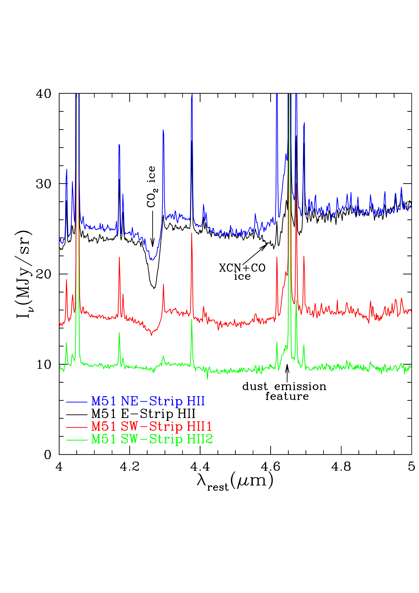
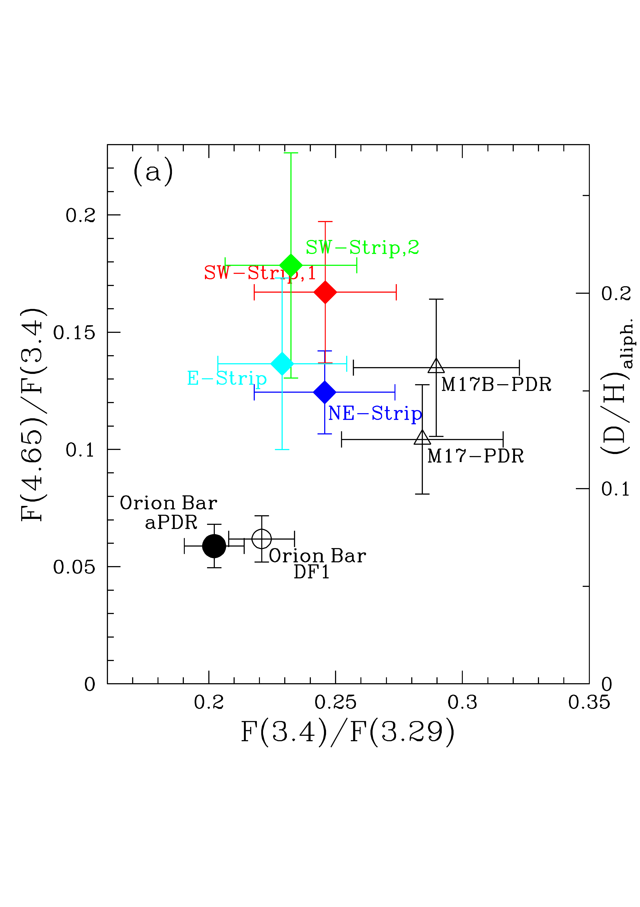
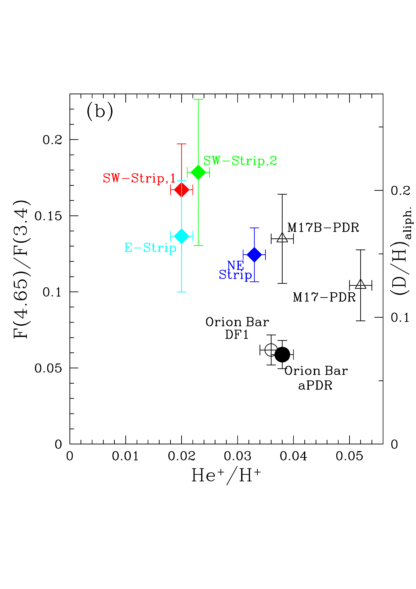
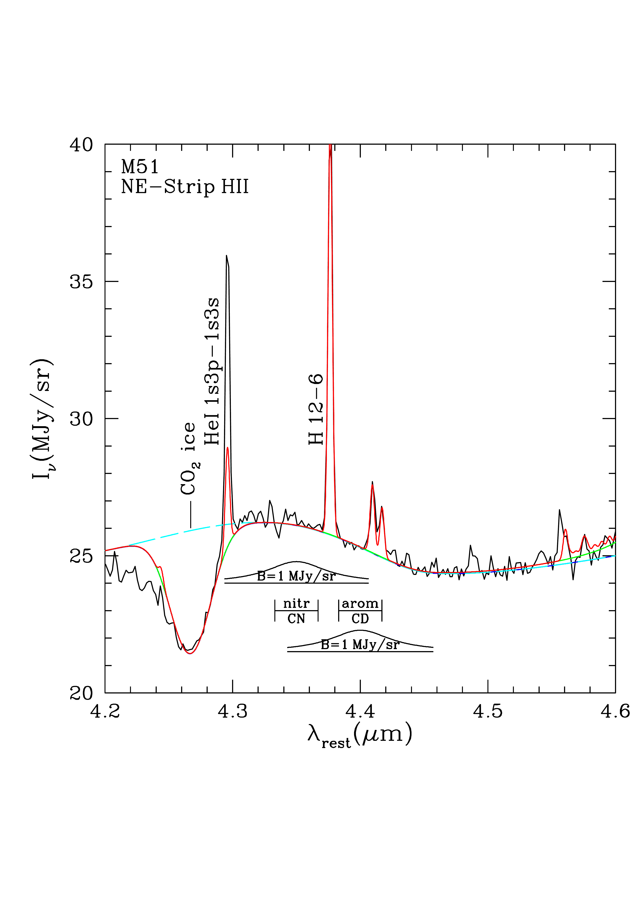
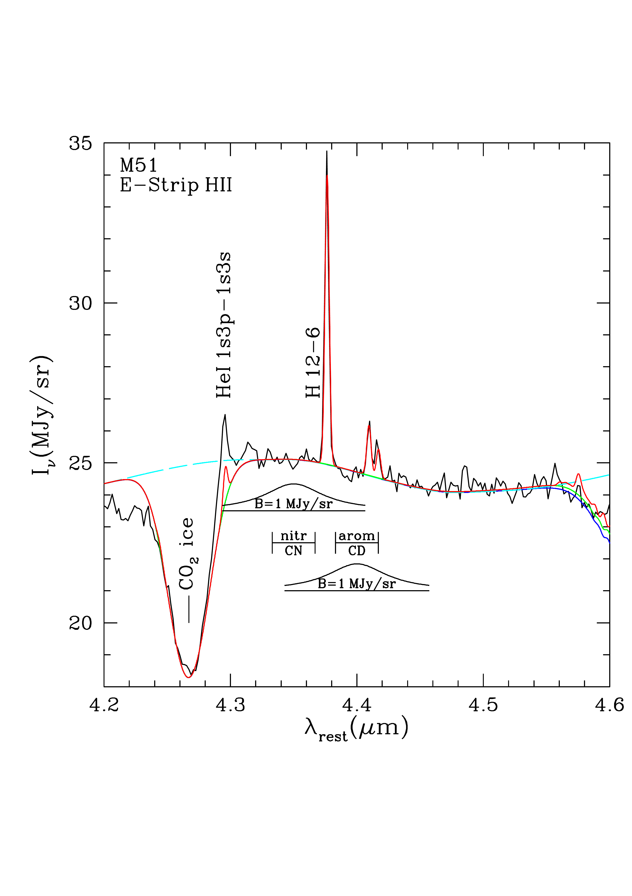
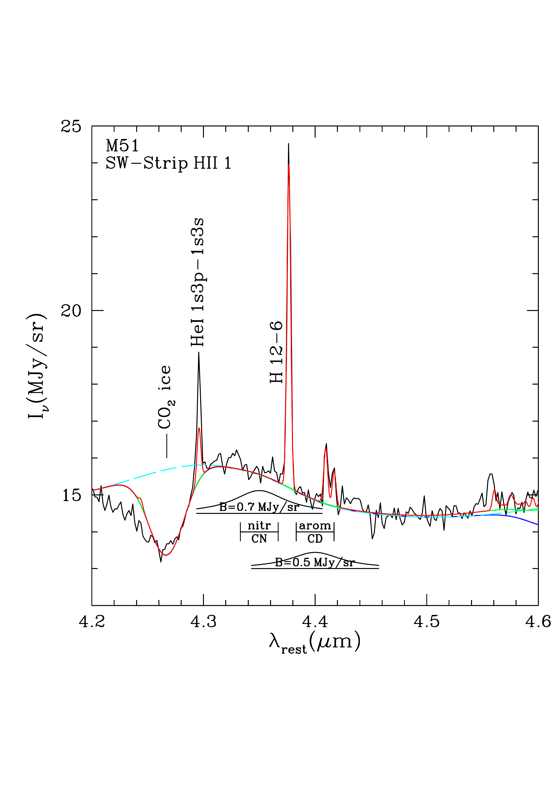
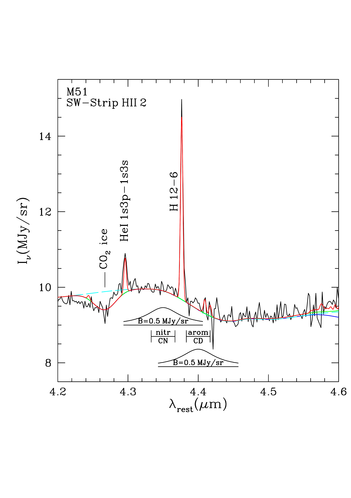

$\newcommand{\ensuremath}{}$
$\newcommand{\xspace}{}$
$\newcommand{\object}[1]{\texttt{#1}}$
$\newcommand{\farcs}{{.}''}$
$\newcommand{\farcm}{{.}'}$
$\newcommand{\arcsec}{''}$
$\newcommand{\arcmin}{'}$
$\newcommand{\ion}[2]{#1#2}$
$\newcommand{\textsc}[1]{\textrm{#1}}$
$\newcommand{\hl}[1]{\textrm{#1}}$
$\newcommand{\footnote}[1]{}$
$\newcommand$
$\newcommand{\fwidth}{8.8cm}$
$\newcommand$
$\newcommand$
$\newcommand$
$\newcommand$
$\newcommand$
$\newcommand$
$\newcommand$
$\newcommand$
$\newcommand$
$\newcommand$
$\newcommand$
$\newcommand$
$\newcommand$
$\newcommand$
$\newcommand$
$\newcommand$
$\newcommand$
$\newcommand$
$\newcommand$
$\newcommand$
$\newcommand$
$\newcommand$
$\newcommand$
$\newcommand$
$\newcommand$
$\newcommand$
$\newcommand$
$\newcommand$
$\newcommand$
$\newcommand$
$\newcommand$
$\newcommand$
$\newcommand$
$\newcommand$
$\newcommand$
$\newcommand$
$\newcommand$
$\newcommand$
$\newcommand$
$\newcommand$
$\newcommand$
$\newcommand$
$\newcommand$
$\newcommand$
$\newcommand$
$\newcommand$
$\newcommand$
$\newcommand$
$\newcommand$
$\newcommand$
$\newcommand$
$\newcommand$
$\newcommand$
$\newcommand$
$\newcommand$
$\newcommand$
$\newcommand$
$\newcommand$
$\newcommand$
$\newcommand$
$\newcommand$
$\newcommand$
$\newcommand$
$\newcommand$
$\newcommand$
$\newcommand$
$\newcommand$
$\newcommand$
$\newcommand$
$\newcommand$
$\newcommand$
$\newcommand$
$\newcommand$
$\newcommand$
$\newcommand$
$\newcommand$
$\newcommand$
$\newcommand$
$\newcommand$
$\newcommand$
$\newcommand$
$\newcommand$
$\newcommand$
$\newcommand$
$\newcommand$
$\newcommand$
$\newcommand$
$\newcommand$
$\newcommand$
$\newcommand$
$\newcommand$
$\newcommand$
$\newcommand$
$\newcommand$
$\newcommand$
$\newcommand$
$\newcommand$
$\newcommand$
$\newcommand$
$\newcommand$
$\newcommand$
$\newcommand$
$\newcommand$
$\newcommand$
$\newcommand$
$\newcommand$
$\newcommand$
$\newcommand$
$\newcommand$
$\newcommand$
$\newcommand$
$\newcommand$
$\newcommand$
$\newcommand$
$\newcommand$
$\newcommand$
$\newcommand$
$\newcommand$
$\newcommand$
$\newcommand$
$\newcommand$
$\newcommand$
$\newcommand$
$\newcommand$
$\newcommand$
$\newcommand$
$\newcommand$
$\newcommand$
$\newcommand$
$\newcommand$
$\newcommand$
$\newcommand$
$\newcommand$
$\newcommand$
$\newcommand$
$\newcommand$
$\newcommand$
$\newcommand$
$\newcommand$
$\newcommand$
$\newcommand$
$\newcommand$
$\newcommand$
$\newcommand$
$\newcommand$
$\newcommand$
$\newcommand$
$\newcommand$
$\newcommand$
$\newcommand$
$\newcommand$
$\newcommand$
$\newcommand$
$\newcommand$
$\newcommand$
$\newcommand$
$\newcommand$
$\newcommand$
$\newcommand$
$\newcommand$
$\newcommand$
$\newcommand$
$\newcommand$
$\newcommand$
$\newcommand$
$\newcommand$
$\newcommand$
$\newcommand$
$\newcommand$
$\newcommand$
$\newcommand$
$\newcommand$
$\newcommand$
$\newcommand$
$\newcommand$
$\newcommand$
$\newcommand$
$\newcommand$
$\newcommand$
$\newcommand$
$\newcommand$
$\newcommand$
$\newcommand{\btdnote}[1]$
$\newcommand{\omittext}[1]$
$\newcommand{\newtext}[1]{{\color{blue}#1}}$
$\newcommand{\subtext}[2]{{\color{red}#1}{\color{blue}#2}}$
$\newcommand$
$\newcommand$
$\newcommand$
$\newcommand$
$\newcommand$
$\newcommand$
$\newcommand$
$\newcommand$
$\newcommand$
$\newcommand$
$\newcommand$
$\newcommand$
$\newcommand$
$\newcommand$
$\newcommand{\topfraction}{0.99}$

#         $\vspace*{-2.0em}{\normalsize\rm Accepted for publication in _ The Astrophysical Journal Letters_}$\         $\vspace*{1.0em}** Detection of Deuterated Hydrocarbon Nanoparticles in the          Whirlpool Galaxy, M51**$	

<mark>Appeared on: 2025-04-04</mark> -  _Accepted for publication in Astrophysical Journal Letters_

B.~T.~Draine, et al. -- incl., <mark>E. Schinnerer</mark>, <mark>F. Walter</mark>

**Abstract:** Deuteration of hydrocarbon material, including polycyclic aromatichydrocarbons (PAHs), has been proposed to account for the lowgas-phase abundances of D in the interstellar medium.  JWST spectra offour star-forming regions in M51 show an emission feature, withcentral wavelength $\sim4.647\micron$ and FWHM $0.0265\micron$ ,corresponding to the C--D stretching mode in aliphatic hydrocarbons.The emitting aliphatic material is estimated to have ${\rm D/H})_{\rm aliph}\approx 0.17\pm0.02$ -- a factor $\sim10^4$ enrichment relative to the overall interstellar medium (ISM).  On $\sim50 $ pc scales, deuteration levels toward four $\ion{H}{2}$ regions in M51 are 2-3 times higher than in the Orion Barphotodissociation region (PDR), with implications for the processesresponsible for the formation and evolution of hydrocarbonnanoparticles, including PAHs.  The deuteration of the aliphaticmaterial is found to anticorrelate with helium ionization in theassociated $\ion{H}{2}$ , suggesting that harsh FUV radiation may act tolower the deuteration of aliphatics in PDRs near massive stars.  Noevidence is found for deuteration of aromatic material, with $({\rm D/H})_{\rm arom} \ltsim 0.016$ : deuteration of the aliphatic materialexceeds that of the aromatic material by at least a factor 10.  Theobserved levels of deuteration may account for the depletion of Dobserved in the Galactic interstellar medium.  If so, the $4.65\micron$ feature may be detectable in absorption.

**Figure 2. -** $\footnote$size$4-5\micron$ spectra
  ($R\approx 1100$) of four star-forming regions in M 51 (see text).
  Observed wavelengths have been corrected for redshift (see Table
  \ref{tab:params} for adopted radial velocities).  Three of the
  spectra show $CO_2$ ice absorption (strongest in E-Strip
  $\ion${H}{2}).  The E-Strip $\ion${H}{2} spectrum also shows
  4.56-4.69$\micron$ CO ice absorption.  A dust emission feature near
  $4.65\micron$ is present in all spectra.
   (*fig:m51_4-5*)

**Figure 9. -** $\footnote$size(a) $F(4.65)/F(3.4)$
  vs. $F(3.4)/F(3.29)$, where $F(4.65)$ is the power in the
  $4.65\micron$ aliphatic C-D feature, $F(3.4)$ is the "clipped"
  estimate of the non-aromatic C-H stretch power, and $F(3.29)$ is the
  "clipped" estimate of the aromatic C-H stretch power (see Figure
  \ref{fig:CH}).  Right-hand scale shows estimated $(\Da/\Ha)_\aliph$
  in the emitting nanoparticles, assuming $K/f=1.2$.  Deuteration is
  2-3 times higher in M51 than in the Orion Bar.  $(\Da/\Ha)_\aliph$
  does not appear to be correlated with nonaromatic fraction.  (b)
  Same as (a), but plotted against $\He^+/\Ha^+$.  $(\Da/\Ha)_\aliph$
  appears to depend on the hardness of the radiation ionizing the
  $\ion${H}{2} region associated with the PDR where the PAHs are
  located.   (*fig:cdr*)

**Figure 10. -** $\footnote$size$4.2-4.6\micron$ spectra
  of the four sightlines in Figure \ref{fig:m51_4-5}.  Black curves:
  observed spectra.  Blue dashed curves: estimate of continuum without
  ice absorption.  Green curves: continuum with ice absorption
  applied.  Red curves: continuum plus emission lines of H, He, and
  $H_2$(see text).  The expected wavelengths for nitrile CN
  ($\sim$4.35$\mu$m) and aromatic C--D ($\sim$4.40$\mu$m) are
  indicated.  In the M51 spectra there is no evidence of nitrile CN
  emission or aromatic C--D emission; the inset profile shows our
  estimated upper limit on the strength of either feature. (*fig:m51aromCD*)

