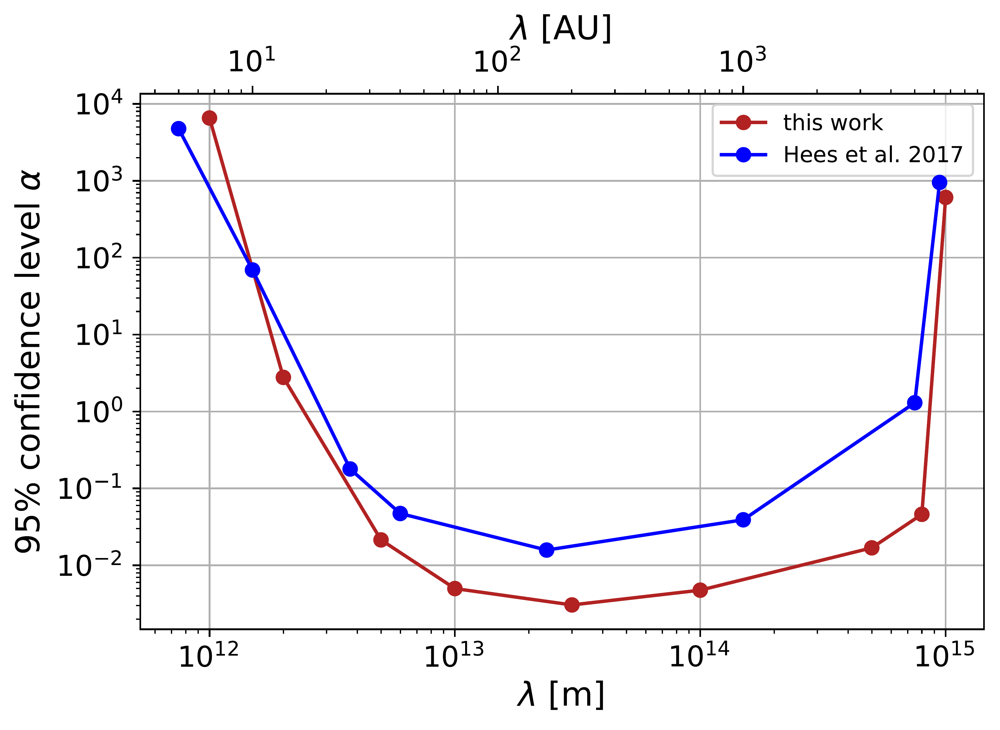
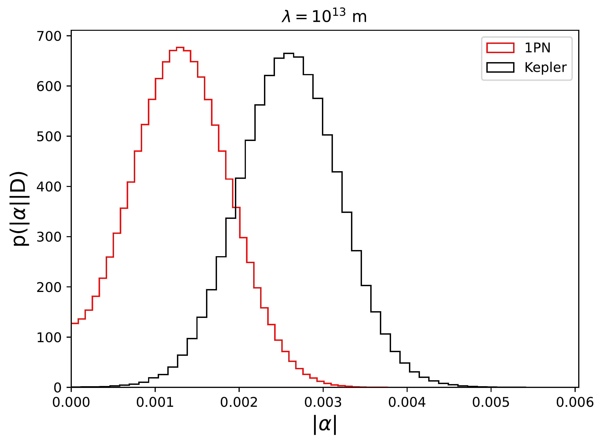

$\newcommand{\ensuremath}{}$
$\newcommand{\xspace}{}$
$\newcommand{\object}[1]{\texttt{#1}}$
$\newcommand{\farcs}{{.}''}$
$\newcommand{\farcm}{{.}'}$
$\newcommand{\arcsec}{''}$
$\newcommand{\arcmin}{'}$
$\newcommand{\ion}[2]{#1#2}$
$\newcommand{\textsc}[1]{\textrm{#1}}$
$\newcommand{\hl}[1]{\textrm{#1}}$
$\newcommand{\footnote}[1]{}$
$\newcommand{\La}{\mathcal{L}}$
$\newcommand{\Lb}{\pazocal{L}}$
$\newcommand{\af}[1]{{\textcolor{red}{\sf{[Arianna: #1]}} }}$
$\newcommand{\beq}{\begin{equation}}$
$\newcommand{\eeq}{\end{equation}}$
$\usepackage{calrsfs}$
$\DeclareMathAlphabet{\pazocal}{OMS}{zplm}{m}{n}$
$\newcommand{\La}{\mathcal{L}}$
$\newcommand{\Lb}{\pazocal{L}}$
$\newcommand{\af}[1]{{\textcolor{red}{\sf{[Arianna: #1]}} }}$
$\begin{document}$
$   \title{On the presence of a fifth force at the Galactic Center}$
$\author{$
$    The GRAVITY Collaboration\fnmsep\thanks{$
$    GRAVITY is developed in collaboration by MPE, LESIA of Paris Observatory / CNRS / Sorbonne Université / Univ. Paris Diderot, and IPAG of Université Grenoble Alpes / CNRS, MPIA, Univ. of Cologne, CENTRA - Centro de Astrofisica e Gravitação, and ESO. }$
$    :$
$    K.~Abd El Dayem             \inst{1}            \and$
$    R.~Abuter                   \inst{4}            \and$
$    N.~Aimar                    \inst{10, 7}            \and$
$    P.~Amaro Seoane             \inst{14,2,19}   \and$
$    A.~Amorim                   \inst{8,7}          \and$
$    J.P.~Berger                 \inst{3,4}          \and$
$    H.~Bonnet                   \inst{4}            \and$
$    G.~Bourdarot                \inst{2}            \and$
$    W.~Brandner                 \inst{5}            \and$
$    V.~Cardoso                  \inst{7,16}         \and$
$    Y.~Clénet                   \inst{1}            \and$
$    R.~Davies                   \inst{2}            \and$
$    P.T.~de~Zeeuw               \inst{20}           \and$
$    A.~Drescher                 \inst{2}            \and$
$    A.~Eckart                   \inst{6,13}         \and$
$    F.~Eisenhauer               \inst{2,18}         \and$
$    H.~Feuchtgruber             \inst{2}            \and$
$    G.~Finger                   \inst{2}            \and$
$    N.M.~Förster~Schreiber      \inst{2}            \and$
$    A.~Foschi                   \inst{1, 2}\thanks{Corresponding author: A.~Foschi (arianna.foschi{@}obspm.fr).}          \and$
$    P.~Garcia                   \inst{10,7}         \and$
$    E.~Gendron                  \inst{1}            \and$
$    R.~Genzel                   \inst{2,11}         \and$
$    S.~Gillessen                \inst{2}            \and$
$    M.~Hartl                    \inst{2}            \and$
$    X.~Haubois                  \inst{9}            \and$
$    F.~Haussmann                \inst{2}            \and$
$    T.~Henning                  \inst{5}            \and$
$    S.~Hippler                  \inst{5}            \and$
$    M.~Horrobin                 \inst{6}            \and$
$    L.~Jochum                   \inst{9}            \and$
$    L.~Jocou                    \inst{3}            \and$
$    A.~Kaufer                   \inst{9}            \and$
$    P.~Kervella                 \inst{1}            \and$
$    S.~Lacour                   \inst{1,4}            \and$
$    V.~Lapeyrère                \inst{1}            \and$
$    J.-B.~Le~Bouquin            \inst{3}            \and$
$    P.~Léna                     \inst{1}            \and$
$    D.~Lutz                     \inst{2}            \and$
$    F.~Mang                     \inst{2}            \and$
$    N.~More                     \inst{2}            \and$
$    J.~Osorno                   \inst{1}            \and$
$    T.~Ott                      \inst{2}            \and$
$    T.~Paumard                  \inst{1}            \and$
$    K.~Perraut                  \inst{3}            \and$
$    G.~Perrin                   \inst{1}            \and$
$    S.~Rabien                   \inst{2}            \and$
$    D.~C.~Ribeiro               \inst{2}            \and$
$    M.~Sadun Bordoni            \inst{2}            \and$
$    S.~Scheithauer              \inst{5}            \and$
$    J.~Shangguan                \inst{21}            \and$
$    T.~Shimizu                  \inst{2}            \and$
$    J.~Stadler                  \inst{12,2}         \and$
$    O.~Straub                   \inst{2,17}         \and$
$    C.~Straubmeier              \inst{6}            \and$
$    E.~Sturm                    \inst{2}            \and$
$    L.J.~Tacconi                \inst{2}            \and$
$    I.~Urso                     \inst{1}            \and$
$    F.~Vincent                  \inst{1}            \and$
$    S.D.~von~Fellenberg           \inst{13,2}         \and$
$    E.~Wieprecht                \inst{2}            \and$
$    J.~Woillez                  \inst{4}$
$}$
$    \institute{$
$            LIRA, Observatoire de Paris, Université PSL, CNRS, Sorbonne Université, Université de Paris, 5 place Jules Janssen, 92195 Meudon, France \and$
$  	    Max Planck Institute for Extraterrestrial Physics, Giessenbachstraße 1, 85748 Garching, Germany \and$
$  	    Univ. Grenoble Alpes, CNRS, IPAG, 38000 Grenoble, France \and$
$  	    European Southern Observatory, Karl-Schwarzschild-Straße 2, 85748 Garching, Germany \and$
$  	    Max Planck Institute for Astronomy, Königstuhl 17, 69117 Heidelberg, Germany \and$
$  	    1st Institute of Physics, University of Cologne, Zülpicher Straße 77, 50937 Cologne, Germany \and$
$  	    CENTRA - Centro de Astrofísica e Gravitação, IST, Universidade de Lisboa, 1049-001 Lisboa, Portugal \and$
$  	    Universidade de Lisboa - Faculdade de Ciências, Campo Grande, 1749-016 Lisboa, Portugal \and$
$  	    European Southern Observatory, Casilla 19001, Santiago 19, Chile \and$
$  	    Faculdade de Engenharia, Universidade do Porto, rua Dr. Roberto Frias, 4200-465 Porto, Portugal \and$
$  	    Departments of Physics \& Astronomy, Le Conte Hall, University of California, Berkeley, CA 94720, USA \and$
$  	    Max Planck Institute for Astrophysics, Karl-Schwarzschild-Straße 1, 85748 Garching, Germany \and$
$  	    Max Planck Institute for Radio Astronomy, auf dem Hügel 69, 53121 Bonn, Germany \and$
$  	    Institute of Multidisciplinary Mathematics, Universitat Politècnica de València, València, Spain \and$
$  	    Advanced Concepts Team, ESA, TEC-SF, ESTEC, Keplerlaan 1, 2201 AZ Noordwijk, The Netherlands \and$
$  	    Center of Gravity, Niels Bohr Institute, Blegdamsvej 17, 2100 Copenhagen, Denmark \and$
$  	    ORIGINS Excellence Cluster, Boltzmannstraße 2, 85748 Garching, Germany \and$
$  	    Department of Physics, Technical University of Munich, 85748 Garching, Germany \and$
$  	    Higgs Centre for Theoretical Physics, Edinburgh, UK \and$
$            Leiden University, 2311 EZ Leiden, The Netherlands \and$
$            The Kavli Institute for Astronomy and Astrophysics, Peking University, Beijing 100871, China$
$    }$
$   \date{$
$   }$
$  \abstract$
$    $
$   {The presence of a Yukawa-like correction to Newtonian gravity is investigated at the Galactic Center, leading to a new upper limit for the intensity of such a correction.}$
$   {We perform a Markov Chain Monte Carlo analysis using the astrometric and spectroscopic data of star S2 collected at the Very Large Telescope by GRAVITY, NACO and SINFONI instruments, covering the period from 1992 to 2022.}$
$   {The precision of the GRAVITY instrument allows us to derive the most stringent upper limit at the Galactic Center for the intensity of the Yukawa contribution (\propto   \alpha e^{- \lambda r}) to be |\alpha| < 0.003 for a scale length \lambda = 3 \cdot 10^{13}  \rm m   (\sim 200   \rm  AU). This improves by roughly one order of magnitude all estimates obtained in previous works. }$
$    $
$   \keywords{black holes physics --$
$                Galaxy:centre --$
$                gravitation$
$               }$
$   \maketitle$
$\n\end{document}\end{equation}}$
$\newcommand{\eeq}{\end{equation}}$

# On the presence of a fifth force at the Galactic Center

<mark>Appeared on: 2025-04-07</mark> -  _Submitted to A&A_

T. G. Collaboration, et al. -- incl., <mark>W. Brandner</mark>, <mark>P. Garcia</mark>, <mark>T. Henning</mark>, <mark>S. Scheithauer</mark>

**Abstract:**            Aims: The presence of a Yukawa-like correction to Newtonian gravity is investigated at the Galactic Center, leading to a new upper limit for the intensity of such a correction. Methods: We perform a Markov Chain Monte Carlo analysis using the astrometric and spectroscopic data of star S$2$ collected at the Very Large Telescope by GRAVITY, NACO and SINFONI instruments, covering the period from $1992$ to $2022$. Results: The precision of the GRAVITY instrument allows us to derive the most stringent upper limit at the Galactic Center for the intensity of the Yukawa contribution ($\propto \, \alpha e^{- \lambda r}$) to be $|\alpha| < 0.003$ for a scale length $\lambda = 3 \cdot 10^{13}\, \rm m\, (\sim 200 \, \rm AU)$. This improves by roughly one order of magnitude all estimates obtained in previous works.         

**Figure 5. -** Vibrational stability equation of state
               $S_{\mathrm{vib}}(\lg e, \lg \rho)$.
               $>0$ means vibrational stability.
              Vibrational stability equation of state
               $S_{\mathrm{vib}}(\lg e, \lg \rho)$.
               $>0$ means vibrational stability.
              Nonlinear Model ResultsNonlinear Model ResultsSpectral types and photometry for stars in the
  region.Spectral types and photometry for stars in the
  region.List of nearby SNe used in this work.Summary for ISOCAM sources with mid-IR excess
(YSO candidates).Summary for ISOCAM sources with mid-IR excess
(YSO candidates). Sample stars with absolute magnitudecontinued. Sample stars with absolute magnitudecontinued. (*FigVibStab*)

**Figure 7. -** $95\%$ confidence level on $|\alpha|$ obtained in this work (red dots) compared with previous estimates by \protectHees:2017aal(blue dots). (*fig:uncertainties_alpha*)

**Figure 6. -** Comparison of the posterior distributions $P(|\alpha||D)$ between the Keplerian model (black curve) and  the $1$PN model (red curve).
 (*fig:comparison_newton*)

