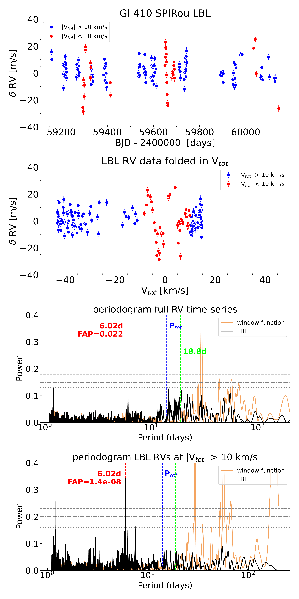
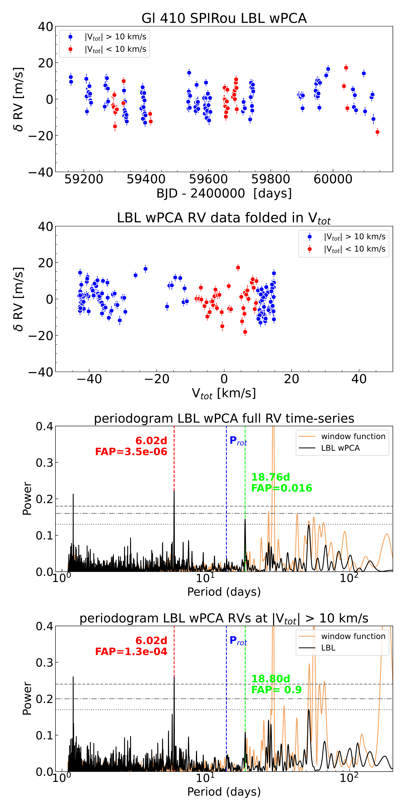
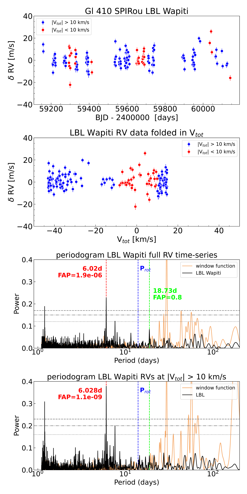
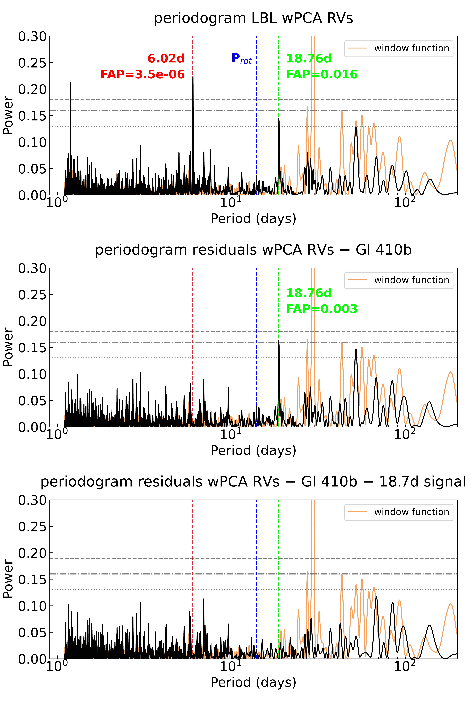
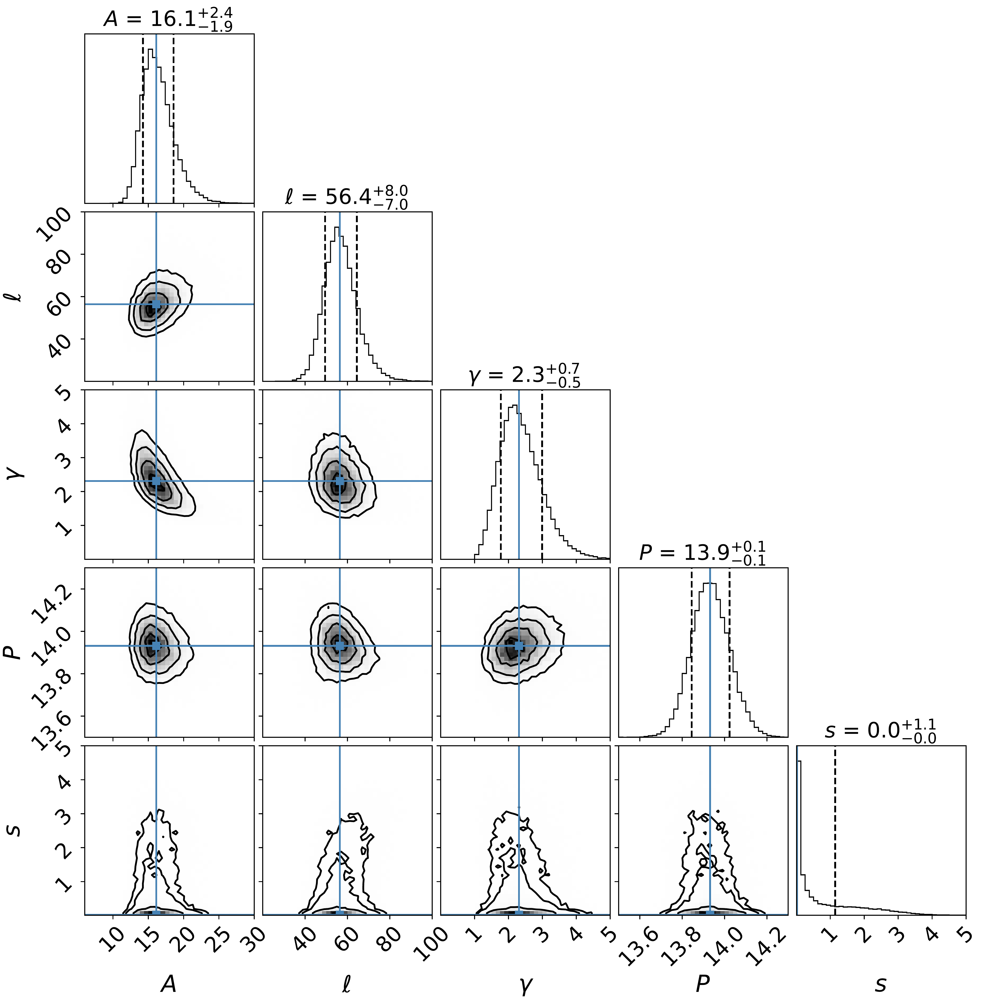

$\newcommand{\ensuremath}{}$
$\newcommand{\xspace}{}$
$\newcommand{\object}[1]{\texttt{#1}}$
$\newcommand{\farcs}{{.}''}$
$\newcommand{\farcm}{{.}'}$
$\newcommand{\arcsec}{''}$
$\newcommand{\arcmin}{'}$
$\newcommand{\ion}[2]{#1#2}$
$\newcommand{\textsc}[1]{\textrm{#1}}$
$\newcommand{\hl}[1]{\textrm{#1}}$
$\newcommand{\footnote}[1]{}$
$\newcommand{\vsys}{v_{\rm sys}}$
$\newcommand\MJ{M_{\mathrm{Jup}}}$
$\newcommand\RJ{R_{\mathrm{Jup}}}$
$\newcommand\RS{R_{\odot}}$
$\newcommand\MS{M\mathrm{_\odot}}$
$\newcommand\LS{L_{\odot}}$
$\newcommand\teff{T_\mathrm{eff}}$
$\newcommand\kms{km s^{-1}}$
$\newcommand\ms{m s^{-1}}$
$\newcommand{\1}{s}$
$\newcommand\t{0}$
$\newcommand\sls{\smallcapital SLS}$
$\newcommand\mp{M_{\rm p}}$
$\newcommand\rt{\mathrm{R_{\oplus}}}$
$\newcommand\mt{\mathrm{M_{\oplus}}}$
$\newcommand\starmass{M_\mathrm{s}}$
$\newcommand\gl{Gl~410}$
$\newcommand\spirou{SPIRou}$

# Characterizing planetary systems with SPIRou: Detection of a sub-Neptune in a 6 day period orbit   around the M dwarf Gl 410$\thanks{Based on observations obtained with the spectropolarimeter SPIRou at the Canada-France-Hawaii Telescope (CFHT).	  }$          

<mark>Appeared on: 2025-04-07</mark> -  _Accepted by A&A, 4 April 2025; 35 pages_

A. Carmona, et al. -- incl., <mark>L. Acuña</mark>

**Abstract:** The search of exoplanets around nearby M dwarfs is a crucial milestone to perform     the census of planetary systems in the vicinity of our Solar System. Since 2018 our team is carrying a blind search program for planets around nearby M dwarfs   with the near-IR spectro-polarimeter and velocimeter SPIRou at the CFHT and the optical velocimeter SOPHIE at the OHP in France.   The aim of this paper is to present our results on Gl 410, a 0.55 M $_\odot$ 480 $\pm$ 150 Myr old active M dwarf distant 12 pc. We search for planetary companions using radial velocities (RVs).   We use the line-by-line (LBL) technique to measure the RVs with SPIRou and the template matching method with SOPHIE.   Three different methods, two based in principal component analysis (PCA),   are used to clean the SPIRou RVs for systematics.   Gaussian processes (GP) modeling is applied to correct the SOPHIE RVs for stellar activity.   The $\ell_1$ and apodize sine periodogram (ASP) analysis is used to search for planetary signals in the SPIRou data taking into account activity indicators.   We analyse TESS data and search for planetary transits. We report the detection of a $M$ sin $(i)$ =8.4 $\pm$ 1.3 M $_\oplus$ sub-Neptune planet at a period of 6.020 $\pm$ 0.004 days   in circular orbit with SPIRou.   The same signal, although with lower significance, is also retrieved in the SOPHIE RV data after correction for activity   using a GP trained on SPIRou's longitudinal magnetic field ( $B_\ell$ ) measurements.   TESS data indicates that the planet is not transiting.   We find within the SPIRou wPCA RVs tentative evidence for two additional planetary signals at 2.99 and 18.7 days. Infrared RVs are a powerful method to detect extrasolar planets around active M dwarfs. Care should be taken however to correct/filter   systematics generated by residuals of the telluric correction or small structures in the detector plane.   The LBL technique combined with PCA offers a promising way to reach this objective.   Further monitoring of Gl 410 is necessary.

**Figure 31. -** SPIRou RV measurements as a function of time and { GLS} periodograms for the "raw" LBL measurements
and the PCA corrected LBL measurements obtained with wPCA (Artigau et al., in prep) and Wapiti \citep[][]{Wapiti2023}.
Blue dots indicate the measurements taken at $|V_{\rm tot}|>10$ km s$^{-1}$.
Red dots are the measurements obtained when $|V_{\rm tot}|<10$ km s$^{-1}$(i.e. moment of the highest influence of the atmosphere on the
stellar spectrum).
In the periodograms,
the grey horizontal lines indicate the { bootstrap-calculated} 10\%, 1\% and 0.1\% FAP levels.
A summary of the statistics of the each of the time-series is provided in Table \ref{table:SPIRou_RV_periodogram}. (*fig:SPIRou_RV_periodogram*)

**Figure 8. -** Periodograms of the SPIRou wPCA data
    after subtraction of the circular orbit models of Gl 410b and the candidate planetary signal at 18.7 days.
     (*GL410_wPCA_2planet*)

**Figure 19. -** Corner plot of the quasi-periodic GP fit of the SPIRou longitudinal magnetic field (B$_\ell$) time-series of  Gl 410.
    We provide the description of  the meaning of the variables in Table \ref{GP_table}. (*fig:corner_bell*)

