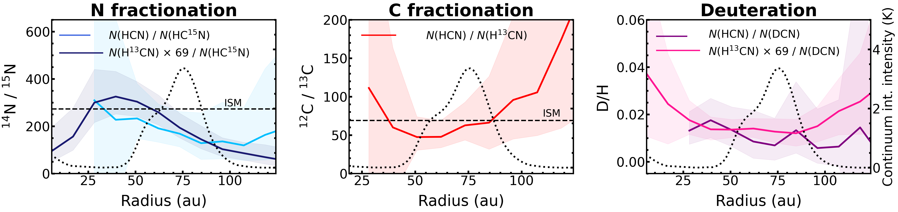
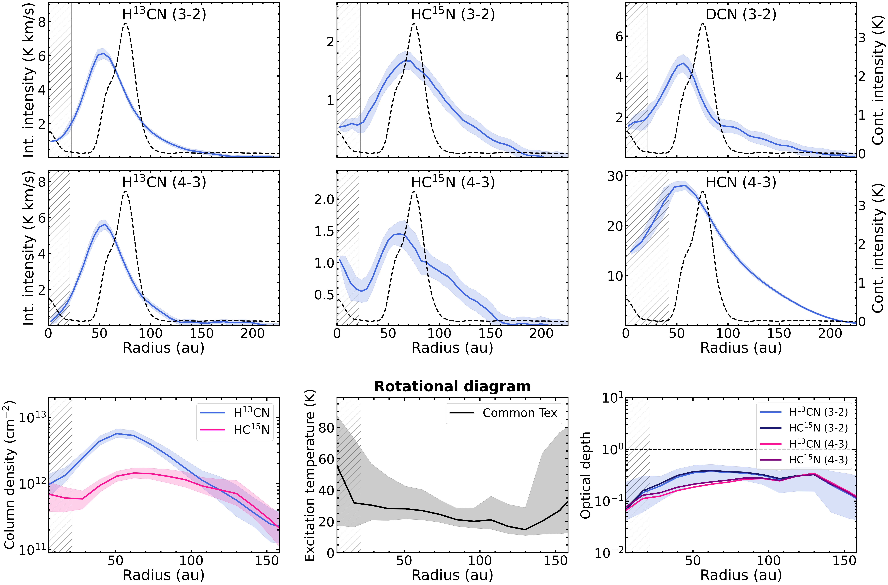
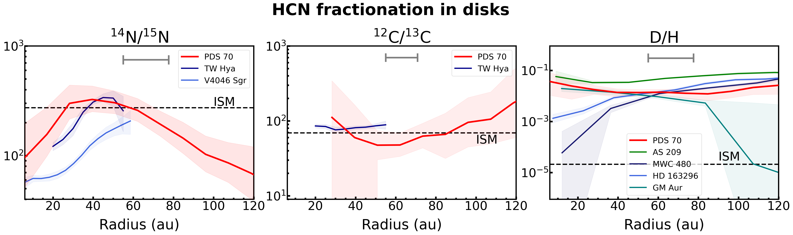

$\newcommand{\ensuremath}{}$
$\newcommand{\xspace}{}$
$\newcommand{\object}[1]{\texttt{#1}}$
$\newcommand{\farcs}{{.}''}$
$\newcommand{\farcm}{{.}'}$
$\newcommand{\arcsec}{''}$
$\newcommand{\arcmin}{'}$
$\newcommand{\ion}[2]{#1#2}$
$\newcommand{\textsc}[1]{\textrm{#1}}$
$\newcommand{\hl}[1]{\textrm{#1}}$
$\newcommand{\footnote}[1]{}$
$\newcommand{\as}{^{\prime\prime}}$
$\newcommand$
$\newcommand{\arraystretch}{1.2}$
$\newcommand{\arraystretch}{1.2}$

# Radial variations in nitrogen, carbon, and hydrogen fractionation in the PDS 70 planet-hosting disk

<mark>Appeared on: 2025-04-08</mark> -  _18 pages, 10 figures, 3 tables_

L. Rampinelli, et al. -- incl., <mark>M. Benisty</mark>

**Abstract:** Element isotopic ratios are powerful tools to reconstruct the journey of planetary material, from the parental molecular cloud to protoplanetary disks, where planets form and accrete their atmosphere. Radial variations in isotopic ratios in protoplanetary disks reveal local pathways which can critically affect the degree of isotope fractionation of planetary material. In this work we present spatially-resolved profiles of the $\ce{^14N}$ / $\ce{^15N}$ , $\ce{^12C}$ / $\ce{^13C}$ , and D/H isotopic ratios of the HCN molecule in the PDS 70 disk, which hosts two actively-accreting giant planets. ALMA high spatial resolution observations of HCN, $\ce{H^13CN}$ , $\ce{HC^15N}$ , and DCN reveal radial variations of fractionation profiles. We extract the HCN/ $\ce{HC^15N}$ ratio out to $\sim$ 120 au, which shows a decreasing trend outside the inner cavity wall of the PDS 70 disk located at $\sim50$ au. We suggest that the radial variations observed in the HCN/ $\ce{HC^15N}$ ratio are linked to isotope selective photodissociation of $\ce{N2}$ . We leverage the spectrally resolved hyperfine component of the HCN line to extract the radial profile of the HCN/ $\ce{H^13CN}$ ratio between $\sim$ 40 and 90 au, obtaining a value consistent with the ISM $\ce{^12C}$ / $\ce{^13C}$ ratio. The deuteration profile is also mostly constant throughout the disk extent, with a DCN/HCN ratio $\sim$ 0.02, in line with other disk-averaged values and radial profiles in disks around T Tauri stars. The extracted radial profiles of isotopologue ratios show how different fractionation processes dominate at different spatial scales in the planet-hosting disk of PDS 70.

**Figure 5. -** Nitrogen, carbon, and hydrogen fractionation of the HCN molecule. Left panel: $69\times\ce{H^13CN}/\ce{HC^15N}$(dark blue) and \ce{HCN}/\ce{HC^15N}(light blue) profiles. Middle panel:  \ce{HCN}/\ce{H^13CN}. Right panel: $69\times\ce{H^13CN}/\ce{DCN}$(pink) and \ce{HCN}/\ce{DCN}(purple) profiles. Ribbons show the 16th and 84th percentiles of the posterior distributions of isotopologue ratios. The dashed horizontal black lines show the ISM values of $\ce{^14N}/\ce{^15N}=274$(blue) and of $\ce{^12C}/\ce{^13C}=69$, while the ISM values of D/H is not indicated, as it is $\sim10^{-5}$\citep[see references in][]{nomura2022isotopic}. The marker length in each legend shows the major axis of the beam of cubes used to retrieve the corresponding profiles in the plots. The black dotted line shows the $855\mu$m continuum integrated intensity profile  ([Isella, Benisty and Teague 2019](), [Benisty, Bae and Facchini 2021]()) . (*fig:12C13C*)

**Figure 3. -** Top panels: integrated intensity profiles of lines of HCN isotopologues. The ribbons show the standard deviation across each annulus divided by the square root of the number of independent beams. The intensity is expressed in brightness temperature under the Rayleigh-Jeans approximation. The black dashed line is the integrated intensity profile of the 855 $\mu$m continuum  ([Isella, Benisty and Teague 2019](), [Benisty, Bae and Facchini 2021]()) . The hatched region shows the beam major axis of each line. Bottom row: results of the radial rotational diagram analysis. Solid lines in the left and middle panels show the 50th percentile of column density profiles (\ce{H^13CN} in blue and \ce{HC^15N} in pink), and of the excitation temperature (black). Ribbons show the 16th and 84th percentiles of the posterior distributions. The right panel represents the radial profiles of the optical depth for the analyzed molecular lines of \ce{H^13CN} and \ce{HC^15N}, and the related uncertainty shown for the \ce{H^13CN}(3-2) line, for reference, as it is representative of the typical uncertainty. The dashed black line shows the $\tau=1$ level. (*fig:profiles_rotdiagr*)

**Figure 6. -** Radial profiles of nitrogen, carbon, and hydrogen fractionation of HCN in disks. The red profiles in the three panels show the results for the PDS 70 disk (solid lines and ribbons show the 50th, 16th, and 84th percentiles of the posterior distributions, respectively), while the horizontal dashed lines indicate the ISM values  ([Nomura, Furuya and Cordiner 2023](), [Ritchey, Federman and Lambert 2015](), [ and Wilson 1999](), [Linsky, Draine and Moos 2006]()) . The isotopic ratios profiles for the PDS 70 disk are compared to the ones for the TW Hya  ([Hily-Blant, Kastner and Forveille 2019]())  and V4046 Sgr disks ( ([Nomura, Furuya and Cordiner 2023]()) , Guzmán et al. in prep.) for nitrogen in the left panel, the TW Hya disk  ([Hily-Blant, Kastner and Forveille 2019]())  for carbon in the middle panel, and to the disks in the MAPS survey  ([Cataldi, Yamato and Aikawa 2021]())  for hydrogen in the right panel. The nitrogen and hydrogen fractionation profiles are obtained by converting the \ce{H^13CN} into an HCN column density, assuming a fixed $\ce{^12C}/\ce{^13C}=69$ ratio. The grey line on top of each panel shows the major axis of the beam of the observations used to extract the profiles for the PDS 70 disk. (*fig:frac_disks*)

