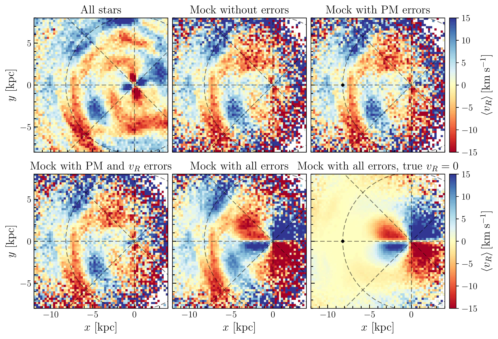
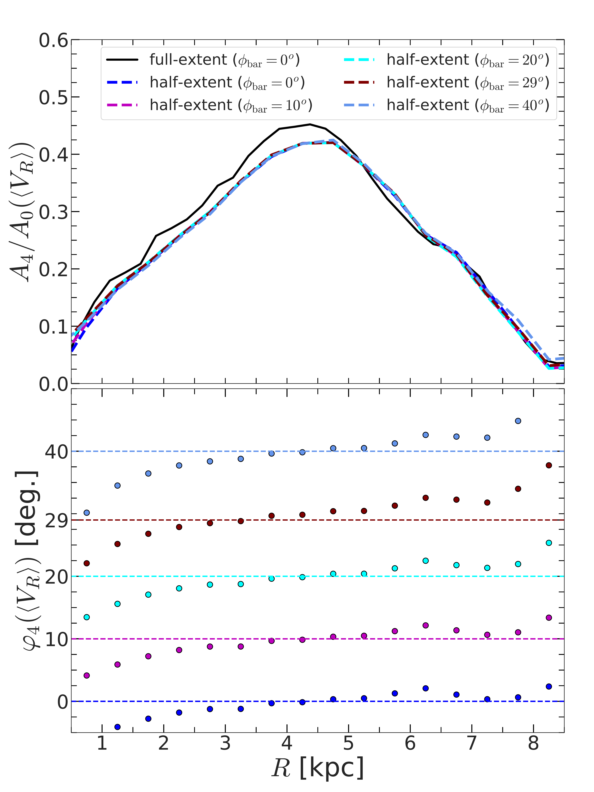

$\newcommand{\ensuremath}{}$
$\newcommand{\xspace}{}$
$\newcommand{\object}[1]{\texttt{#1}}$
$\newcommand{\farcs}{{.}''}$
$\newcommand{\farcm}{{.}'}$
$\newcommand{\arcsec}{''}$
$\newcommand{\arcmin}{'}$
$\newcommand{\ion}[2]{#1#2}$
$\newcommand{\textsc}[1]{\textrm{#1}}$
$\newcommand{\hl}[1]{\textrm{#1}}$
$\newcommand{\footnote}[1]{}$
$\newcommand{\kms}{\mbox{\>{\rm km  s^{-1}}}}$
$\newcommand{\pc}{\>{\rm pc}}$
$\newcommand{\kpc}{\mbox{\>{\rm kpc}}}$
$\newcommand{\kmsk}{\mbox{\>{\rm km  s^{-1}  kpc^{-1}}}}$
$\newcommand{\Gyr}{\mbox{\>{\rm Gyr}}}$
$\newcommand{\Myr}{\mbox{\>{\rm Myr}}}$
$\newcommand{\yr}{\mbox{\>{\rm yr}}}$
$\newcommand{\Msun}{\>{\rm M_{\odot}}}$
$\newcommand{\Rd}{\mbox{R_{\rm d}}}$
$\newcommand{\zd}{\mbox{z_{\rm d}}}$
$\newcommand{\md}{\mbox{M_{\rm d}}}$
$\newcommand$
$\newcommand{\avg}[1]{\mbox{\left<{#1}\right>}}$
$\newcommand{\sig}[1]{\mbox{\sigma_{#1}}}$
$\newcommand{\feh}{\mbox{\rm[Fe/H]}}$
$\newcommand{\al}{\mbox{\rm \alpha}}$
$\newcommand{\alfe}{\mbox{\rm[O/Fe]}}$
$\newcommand{\tf}{\mbox{\tau}}$
$\newcommand{\rs}{\mbox{R_s}}$
$\newcommand{\abar}{\mbox{A_{\rm bar}}}$
$\newcommand$
$\newcommand$

# Quadrupole signature as a kinematic diagnostic to constrain bar properties : implication for the Milky Way

<mark>Appeared on: 2025-04-10</mark> -  _15 pages, 1 table, 12 figures (including appendix), comments are welcome!_

S. Ghosh, et al. -- incl., <mark>T. Kalda</mark>

**Abstract:** The presence of a `butterfly' or a quadrupole structure in the stellar mean radial velocity ( $\avg{V_R}$ ) field of the Milky Way is well known from the $\gaia$ and the APOGEE surveys. Past studies indicated that a stellar bar can excite such a quadrupole feature in the $\avg{V_R}$ distribution. However, a systematic study investigating the co-evolution of bar and quadrupole structure is largely missing. Furthermore, whether this quadrupole structure in $\avg{V_R}$ can be used as a robust kinematic diagnostic to constrain bar properties, particularly for the Milky Way, is still beyond our grasp. Here, we investigate the bar-induced quadrupole feature using a suite of isolated $N$ -body models forming prominent bars and a sample of Milky Way-like barred galaxies from the TNG50 cosmological simulation.  We demonstrate that the properties of the quadrupole (strength, length, and orientation) are strongly correlated with the bar properties, regardless of the choice of the stellar tracer population; thereby making the quadrupole feature an excellent kinematic diagnostic for constraining the bar properties. In presence of spirals, the estimator which takes into account the phase-angle of $m = 4$ Fourier moment, serves as a more appropriate estimator for measuring the length of the quadrupole.  Further, we constructed a novel $\gaia$ -like mock dataset from a simulated bar model while incorporating the dust extinction and the broad trends of observational errors of the $\gaia$ survey. The quadrupole properties (strength and length) estimated from those $\gaia$ -like mock data are larger ( $\sim 35-45$ percent) when compared with their true values. We determined that the majority of this effect is due to the uncertainty in parallax measurement. This demonstrates the potential caveat of inferring Milky Way's bar properties by using the stellar kinematic information from the $\gaia$ DR3 without properly accounting for the observational uncertainties.

**Figure 9. -** _Investigating the effects of different uncertainties:_ Face-on distribution of $\avg{v_R}$ for the \gaia-like mock dataset at $t=3\mathrm{ Gyr}$, showcasing how the observed quadrupole feature is affected by errors in proper motion, radial velocity ($V_R$), and parallax. The _top left panel_ is for stars in the snapshot (no uncertainties and no magnitude cut) while _top middle panel_ shows the magnitude limited $G \leq 15.5$ mock dataset with no errors. The _top right panel_ and the _bottom left panel_ show the mock datasets with only proper motion (PM) uncertainty and both the PM and radial velocity uncertainties, respectively. The _bottom middle panel_ shows the mock dataset resampled according to the errors in the \gaia DR3 RGB subsample (see section \ref{sec:gaia_like_testing}), and the _bottom right panel_ shows the mock dataset where all the particles have had their $V_R$ set to zero prior to applying observational effects. For further details, see sect. \ref{sec:application_to_MW}. (*fig:0300_parallax_contamination_analysis*)

**Figure 5. -** _Dependence on the stellar tracer population:_ correlation between the bar strength, $S_{\rm bar}$ and the strength of the quadrupole, $S_{\rm quadrupole}$(_top row_), and correlation between the bar length, $R_{\rm bar}$ and the length of the quadrupole, $R_{\rm quadrupole}$(_bottom row_), computed using thin disc particles (_left panels_) and thick disc particles (_right panels_), for all thin+thick models and the sim6 model (see the legend). The black dash line denotes the best-fit straight line (of the form $Y = AX+B$) while the grey shaded region denotes the 5-$\sigma$ scatter around the best-fit line. Regardless of the stellar tracer population, the length and strength of the quadrupole remain strongly correlated with the length and the strength of the bar. (*fig:bar_quadrupole_correlation_Tracer_dependence*)

**Figure 1. -** _Top panel:_ Radial variation of the amplitude of the $m=4$ Fourier moment of the mean radial velocity, $\avg{V_R}$, calculated at $t = 9 $\Gyr$$ for the model rthick0.0, while putting the bar at different orientations (see the legend). _Bottom panel:_ radial variation of the corresponding phase-angle ($\varphi_4$) of $m=4$ Fourier moment of the mean radial velocity, $\avg{V_R}$. The points denoting the radial variation computed from the mean radial velocity, $\avg{V_R}$ while the horizontal lines denote the corresponding _true_ bar orientation. `Half-extent' refers to the scenario where stars falling only in the positive half ($x \geq 0$) are considered while computing the Fourier moments. (*fig:bar_quadrupole_orientation_quantification*)

