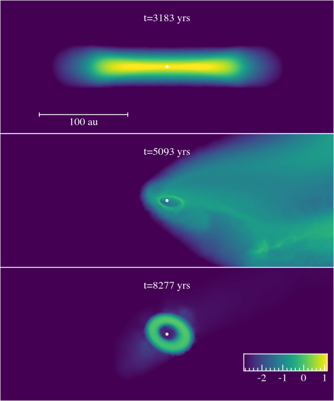
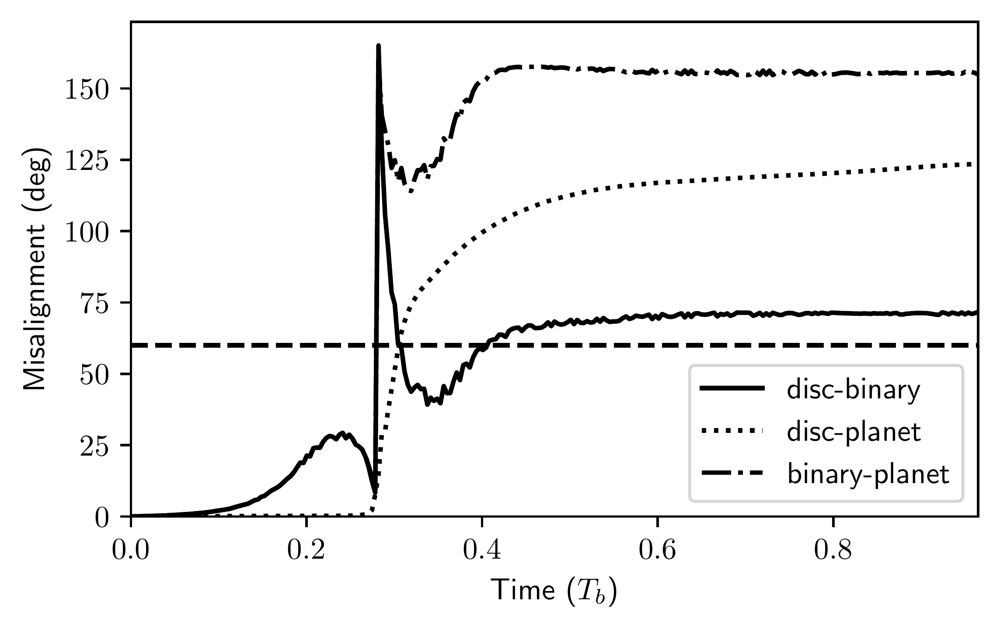

$\newcommand{\ensuremath}{}$
$\newcommand{\xspace}{}$
$\newcommand{\object}[1]{\texttt{#1}}$
$\newcommand{\farcs}{{.}''}$
$\newcommand{\farcm}{{.}'}$
$\newcommand{\arcsec}{''}$
$\newcommand{\arcmin}{'}$
$\newcommand{\ion}[2]{#1#2}$
$\newcommand{\textsc}[1]{\textrm{#1}}$
$\newcommand{\hl}[1]{\textrm{#1}}$
$\newcommand{\footnote}[1]{}$
$\newcommand{\rn}[1]{\textcolor{magenta}{#1}}$
$\newcommand{\HA}[1]{\textcolor{teal}{#1}}$
$\newcommand{\aw}[1]{\textcolor{purple}{#1}}$
$\newcommand{\js}[1]{\textcolor{orange}{#1}}$
$\newcommand{\thebibliography}{\DeclareRobustCommand{\VAN}[3]{##3}\VANthebibliography}$

# Disc-planet misalignment from an unstable triple system: IRAS04125

<mark>Appeared on: 2025-04-11</mark> -  _7 pages, 6 figures. Accepted for publication in MNRAS. Movie available at: this https URL_

R. Nealon, et al. -- incl., <mark>A. Winter</mark>

**Abstract:** The IRAS $01425$ + $2902$ wide binary system was recently reported to have both a young planet and a puzzling geometric arrangement, where the planet and binary both orbit edge-on, but misaligned by $60 ◦$ to the circumprimary disc. This is the youngest transiting planet yet to be detected but its misalignment to the disc is difficult to explain. In this paper we explore the dissolution of an unstable triple system as a potential mechanism to produce this system. We simulate the effects of an ejection interaction in models using a highly inclined, retrograde flyby centred on the primary star of IRAS $01425$ . The escaping star of $\sim 0.35$ M $_{\odot}$ inclines both the disc and binary orbits such that they have a relative misalignment of $\gtrsim60 ◦$ , as inferred from observations. The planet orbit also becomes inclined relative to the disc, and our interpretation predicts that the binary should have a highly eccentric orbit ( $e\gtrsim0.5$ from our simulations). We additionally demonstrate that despite the high relative misalignment of the disc it is unlikely to be vulnerable to von Zeipel-Kozai-Lidov oscillations.

**Figure 2. -** Flyby encounters that could be consistent with IRAS $04125$ are shown with orange symbols circled in black. Results are shown as a function of the flyby approach angle $\beta$ against the mass of the flyby $M_{\rm f}$ for $R_{\rm out}=75$ au (the $R_{\rm out}=100$ au are qualitatively similar, with most successes around $M_{\rm f} =0.35$ M$_{\odot}$). Orange circles indicate when the binary remains bound and flyby remains unbound, green diamonds when the binary becomes unbound, pink squares when the flyby becomes bound. (*fig:simulations_summary*)

**Figure 1. -** Explaining the misaligned disc in IRAS$04125$ using a flyby encounter: here the flyby has $M_{\rm f}=0.35$ M$_{\odot}$, $R_{\rm out}=75$ au and $\beta=60 ◦$. The encounter is disruptive and the remaining disc is torqued to more than $60 ◦$. The panels are all shown in the $x$-$z$ plane to emphasise the disc rotation with a scale $100$ au and the stars shown with white dots. The upper panel shows before the encounter, the middle panel during and the lower panel long after the encounter. The colour represents log of the column density in cgs (*fig:rendered_example*)

**Figure 4. -** The disc-planet and disc-binary inclination throughout the ejection encounter for the simulation shown in Figure \ref{fig:rendered_example}. Solid represents the disc-binary misalignment (as in the right panel of Figure \ref{fig:simulations_summary}), dotted shows the disc-planet misalignment and dash-dot the binary-planet. The horizontal dashed line represents the observed disc-binary misalignment  (Barber:2024te) . (*fig:planet_properties*)

