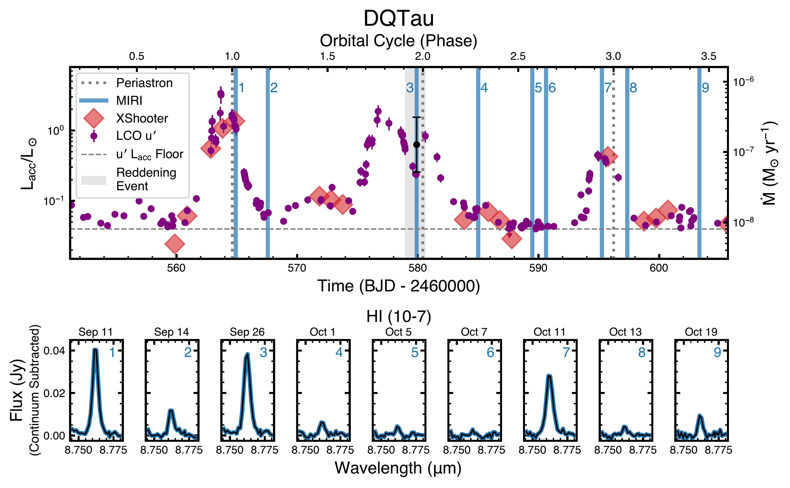
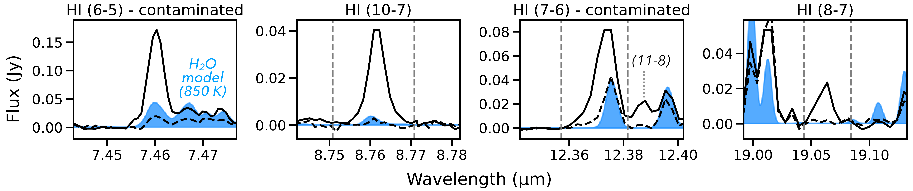
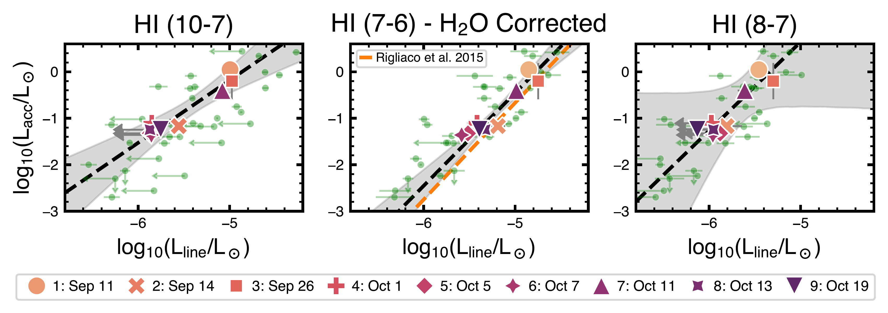

$\newcommand{\ensuremath}{}$
$\newcommand{\xspace}{}$
$\newcommand{\object}[1]{\texttt{#1}}$
$\newcommand{\farcs}{{.}''}$
$\newcommand{\farcm}{{.}'}$
$\newcommand{\arcsec}{''}$
$\newcommand{\arcmin}{'}$
$\newcommand{\ion}[2]{#1#2}$
$\newcommand{\textsc}[1]{\textrm{#1}}$
$\newcommand{\hl}[1]{\textrm{#1}}$
$\newcommand{\footnote}[1]{}$
$\newcommand{\url}[1]{\href{#1}{#1}}$
$\newcommand{\dodoi}[1]{doi:~\href{http://doi.org/#1}{\nolinkurl{#1}}}$
$\newcommand{\doeprint}[1]{\href{http://ascl.net/#1}{\nolinkurl{http://ascl.net/#1}}}$
$\newcommand{\doarXiv}[1]{\href{https://arxiv.org/abs/#1}{\nolinkurl{https://arxiv.org/abs/#1}}}$
$\newcommand{\teff}{\ensuremath{T_{\text{eff}}}}$
$\newcommand{\logg}{log(g)}$
$\newcommand{\vmac}{v_{\rm mac}}$
$\newcommand{\hal}{H\alpha}$
$\newcommand{\fbol}{F_{\mathrm{bol}}}$
$\newcommand{\rsun}{R_\odot}$
$\newcommand{\rstar}{R_\star}$
$\newcommand{\mstar}{M_\star}$
$\newcommand{\msun}{M_\odot}$
$\newcommand{\lsun}{L_\odot}$
$\newcommand{\rhosun}{\rho_\odot}$
$\newcommand{\degs}{^\circ}$
$\newcommand{\funit}{erg s^{-1} cm^{-2} Å^{-1}}$
$\newcommand{\vsini}{vsini}$
$\newcommand{\htwo}{H_2}$
$\newcommand{\lam}{\lambda}$
$\newcommand{\mdot}{\dot{M}}$
$\newcommand{\hei}{He {\scshape i}}$
$\newcommand{\hi}{H {\scshape i}}$
$\newcommand{\oi}{[O {\scshape i}]}$
$\newcommand{\caii}{Ca {\scshape ii}}$
$\newcommand{\lii}{Li {\scshape i}}$
$\newcommand{\nai}{Na {\scshape i}}$
$\newcommand{\ari}{Ar {\scshape i}}$
$\newcommand{\kms}{km s^{-1}}$
$\newcommand{\gaia}{{\it Gaia}}$
$\newcommand{\hst}{{\it HST}}$
$\newcommand{\kepler}{{\it Kepler}}$
$\newcommand{\ktwo}{{\it K}2}$
$\newcommand{\tess}{{\it TESS}}$
$\newcommand{\Tess}{{\it TESS}}$
$\newcommand{\spitzer}{{\it Spitzer}}$
$\newcommand{\Spitzer}{{\it Spitzer}}$
$\newcommand{\jwst}{{\it JWST}}$
$\newcommand$
$\newcommand{\fspot}{f_{\rm s}}$
$\newcommand{\fspotecl}{f_{\rm s, ecl}}$
$\newcommand{\co}{^{12}{\mathrm{CO}}  J=2-1}$
$\newcommand{\lacc}{L_{\rm acc}}$
$\newcommand{\up}{{\it u}^\prime}$
$\newcommand{\rp}{{\it r}^\prime}$
$\newcommand{\AB}[1]{\textcolor{orange}{\textbf{(AB:} #1)}}$
$\newcommand{\CFM}[1]{\textcolor{purple}{\textbf{(CFM:} #1)}}$
$\newcommand{\BT}[1]{\textcolor{red}{\textbf{(BT:} #1)}}$
$\newcommand\natexlab{#1}$

# Coordinated Space and Ground-Based Monitoring of Accretion Bursts in a Protoplanetary Disk: \ Establishing Mid-Infrared Hydrogen Lines as Accretion Diagnostics for $\jwst$--MIRI

<mark>Appeared on: 2025-04-14</mark> -  _Accepted to ApJ. 16 pages, 7 Figures, 3 Tables, 2 Appendices_

B. M. Tofflemire, et al. -- incl., <mark>M. Benisty</mark>

**Abstract:** In this paper, we establish and calibrate mid-infrared hydrogen recombination lines observed with $\jwst$ as accretion tracers for pre-main-sequence stars that accrete from circumstellar disks. This work is part of a coordinated, multi-observatory effort that monitored the well-known binary system DQ Tau over three orbital periods, capturing its periodic accretion bursts.In this first paper, we present 9 epochs of MIRI-MRS spectra with near-simultaneous LCO photometry and VLT--X-Shooter spectroscopy. This program caught exceptional accretion variability, spanning almost two orders of magnitude between the peak of the first periastron accretion burst and the following quiescent phases. The MIRI spectra show $\hi$ line luminosities that vary in step with the accretion-luminosity time series measured with LCO and X-Shooter. The tight correlation with accretion and the large line widths, which MIRI resolves for the first time, support an accretion-flow origin for mid-infrared $\hi$ transitions. Combining these three exceptional datasets, we derive accurate relations between mid-infrared line and accretion luminosities for three $\hi$ transitions (10-7, 7-6, 8-7), and improve upon a previous relation based on Spitzer spectra. These new relations equip the community with a direct measurement of the accretion luminosity from MIRI-MRS spectra. A MIRI-derived accretion luminosity is fundamental for time-domain chemistry studies, as well as for studies of accretion in embedded/distant sources that are currently inaccessible in the optical. With these new relations, we provide accretion luminosities for an archival sample of 38 MRS spectra of protoplanetary disks published to date.

**Figure 4. -** DQ Tau accretion variability. ** Top:** The accretion luminosity (left axis) and mass accretion rate (right axis) from X-Shooter spectra and LCO $\up$-band photometry. Time is presented in barycentric Julian days on the bottom axis and the binary orbital cycle on the top axis. Vertical dotted lines mark binary periastron passages. Blue vertical lines mark the times of MIRI-MRS observations with an associated epoch number. The dashed horizontal line represents the accretion luminosity measurement floor for the $\up$ photometry (see Section \ref{lco_lacc}; Figure \ref{fig: lacc_relation}). The gray vertical region surrounding MIRI Epoch 3 highlights a reddening event. The black point is an estimate of the accretion luminosity during this event (see Section \ref{reddening}).
** Bottom:** Variability in the $\hi$(10-7) emission line. Continuum subtracted MIRI-MRS spectra centered on the line are presented for each observation, with the epoch number listed on the top right corner of each panel. The $\hi$(10-7) temporal behavior tightly tracks the densely sampled accretion luminosity measurements. (*fig: lightcurve_epochs*)

**Figure 5. -** Gallery of some strong hydrogen recombination lines observed in MIRI spectra. Two DQ Tau epochs are shown in each panel to illustrate a high accretion phase (September 11th, in solid black) and the lowest accretion phase in this program (October 7th, dashed black). A hot water model (850 K) is shown in blue for reference. The (10-7) and (8-7) lines are selected from those identified in \cite{banzatti24} as free of contamination from molecular emission. Two examples of significant contamination from water are shown for reference: the (7-6) line \citep[used in][]{rigliaco2015} and the (6-5) line, the strongest $\hi$ line observable with MIRI-MRS, but contaminated with ro-vibrational water emission. The vertical gray dashed lines indicate the ranges where the line flux is measured, in the case of the (7-6) line to minimize contamination from the nearby (11-8) line.  (*fig: HI_series*)

**Figure 6. -** Correlations between $\hi$ line luminosities and $\lacc$ as measured in this monitoring program. The $\hi$(7-6) luminosity has been corrected for water contamination as explained in Section \ref{acc_relations}. Large colored data points are from the DQ Tau epochs in this work. Smaller green circles show JDISCS and MINDS published spectra with non-contemporaneous literature $\lacc$ measurements (see text). The larger scatter is likely due to non-synchronous measurements and varied $\lacc$ measurement methodologies. For non detections, the 2-$\sigma$ upper limit is shown with an arrow. The black dashed lines show the median correlations as measured for DQ Tau, while the orange line in the middle panel shows the $\hi$(7-6) relation previously measured by \cite{rigliaco2015}. The offset with the new relation found from MIRI is due to the limited correction from contamination that was possible with IRS (see Section \ref{acc_relations}). (*fig: HI_Lacc_correlations*)

