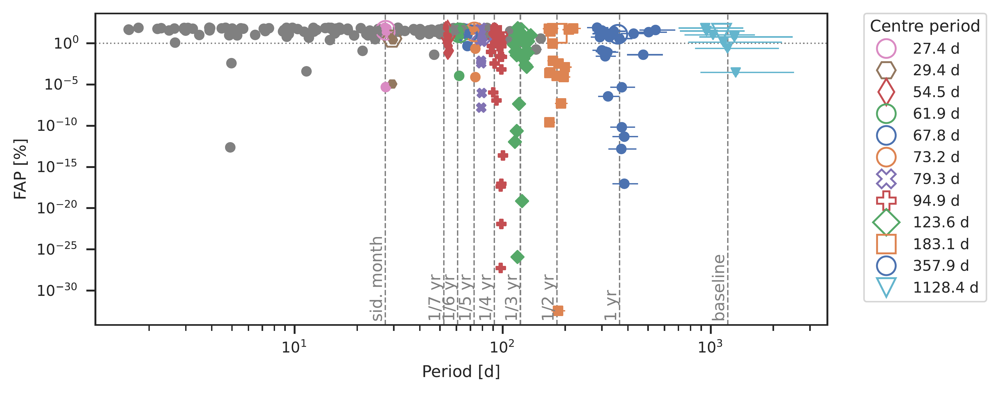
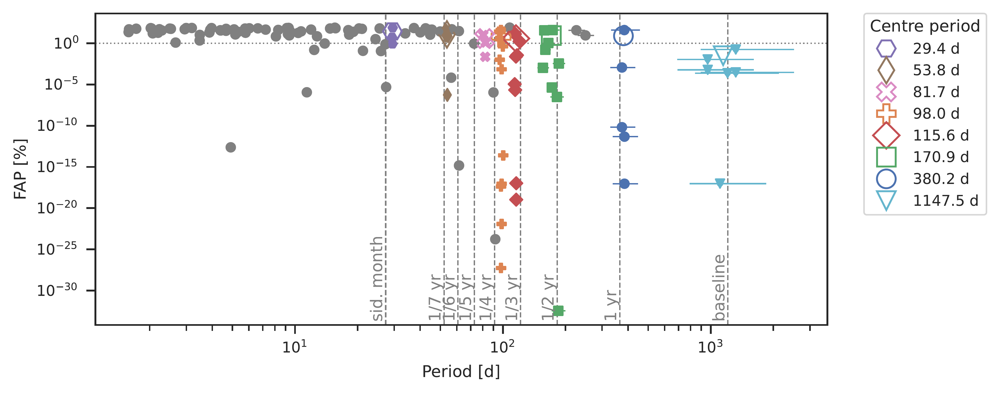
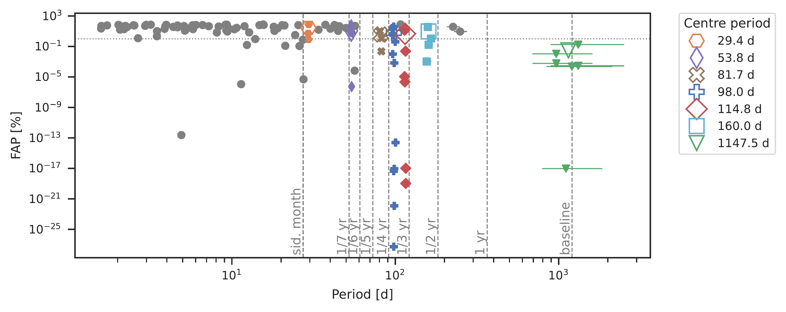
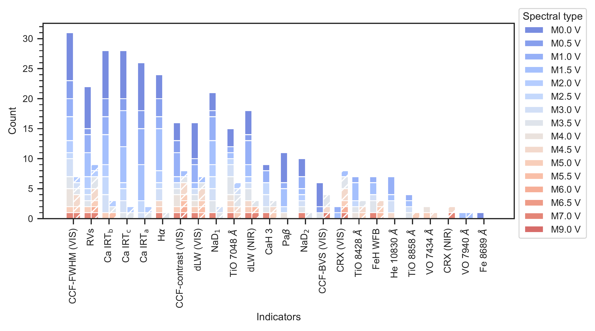
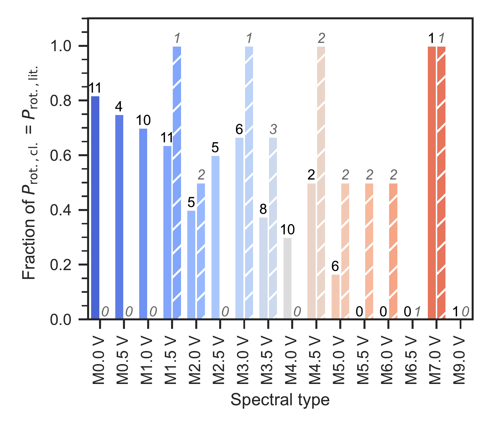
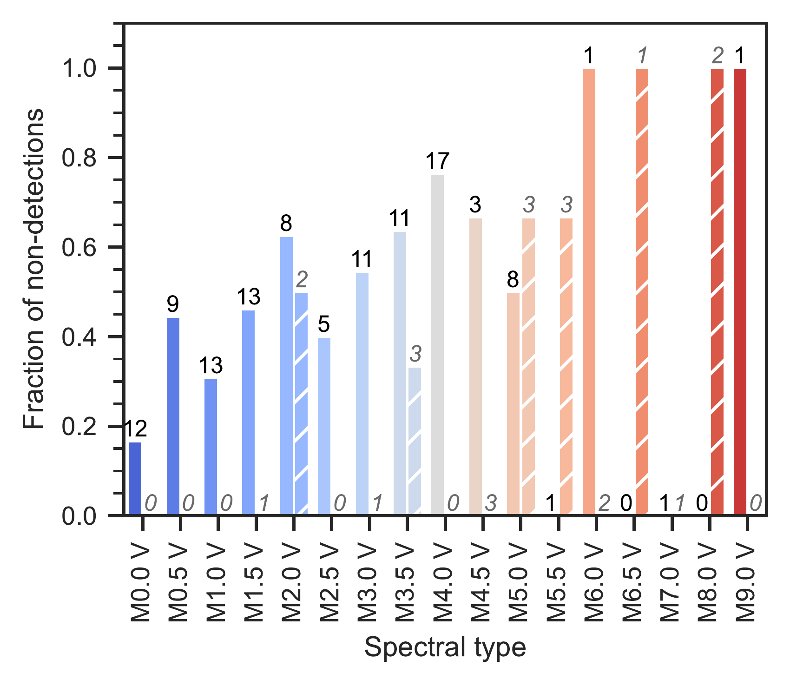

$\newcommand{\ensuremath}{}$
$\newcommand{\xspace}{}$
$\newcommand{\object}[1]{\texttt{#1}}$
$\newcommand{\farcs}{{.}''}$
$\newcommand{\farcm}{{.}'}$
$\newcommand{\arcsec}{''}$
$\newcommand{\arcmin}{'}$
$\newcommand{\ion}[2]{#1#2}$
$\newcommand{\textsc}[1]{\textrm{#1}}$
$\newcommand{\hl}[1]{\textrm{#1}}$
$\newcommand{\footnote}[1]{}$
$\newcommand{\TODO}[1]{\textcolor{magenta}{\textsc{todo:} \textit{#1}}}$
$\newcommand{\TODOall}[1]{\textcolor{red}{\textsc{Task/Question to all:} \textit{#1}}}$
$\newcommand{\prelim}[1]{\textcolor{magenta}{\textit{#1}}}$
$\newcommand{\CRX}{CRX}$
$\newcommand{\dLW}{dLW}$
$\newcommand{\CONTRAST}{CCF-contrast}$
$\newcommand{\FWHM}{CCF-FWHM}$
$\newcommand{\BISECTOR}{CCF-BIS}$
$\newcommand{\CaHtwo}{CaH~2}$
$\newcommand{\CaHthree}{CaH~3}$
$\newcommand{\CaIRT}{Ca {\sc ii}~IRT}$
$\newcommand{\CaIRTa}{Ca~IRT_\text{a}}$
$\newcommand{\CaIRTb}{Ca~IRT_\text{b}}$
$\newcommand{\CaIRTc}{Ca~IRT_\text{c}}$
$\newcommand{\Fe}{Fe~\lambda\SI{8689}{\angstrom}}$
$\newcommand{\Halpha}{H\alpha}$
$\newcommand{\He}{He~{\sc i} \lambda\SI{10830}{\angstrom}}$
$\newcommand{\HeDthree}{He {\sc i}~D_3}$
$\newcommand{\NaDdoublet}{Na {\sc i} doublet}$
$\newcommand{\NaDone}{Na~D_1}$
$\newcommand{\NaDtwo}{Na~D_2}$
$\newcommand{\Pabeta}{Pa\beta}$
$\newcommand{\TiOsevenzero}{TiO~\lambda\SI{7048}{\angstrom}}$
$\newcommand{\TiOeightfour}{TiO~\lambda\SI{8428}{\angstrom}}$
$\newcommand{\TiOeighteight}{TiO~\lambda\SI{8858}{\angstrom}}$
$\newcommand{\VOsevenfour}{VO~\lambda\SI{7434}{\angstrom}}$
$\newcommand{\VOsevenine}{VO~\lambda\SI{7940}{\angstrom}}$
$\newcommand{\WFB}{FeH WFB}$
$\newcommand{\autoref}$
$\newcommand{\inst}[1]{\unskip^{\instrefs{#1}}}$
$\newcommand{\equationautorefname}{Eq.}$
$\newcommand{\figureautorefname}{Fig.}$
$\newcommand{\sectionautorefname}{Sect.}$
$\newcommand{\subsectionautorefname}{Sect.}$
$\newcommand{\subsubsectionautorefname}{Sect.}$
$\newcommand{\scsep}{\newcommand\scsep{,}}$
$\newcommand\scsep{,}$

# The CARMENES search for exoplanets around M dwarfs: Cluster analysis of signals from spectral activity indicators to search for shared periods

<mark>Appeared on: 2025-04-14</mark> -  _33 pages (16 pages main text), 14 figures, accepted for publication in Astronomy & Astrophysics_

J. Kemmer, et al. -- incl., <mark>T. Henning</mark>

**Abstract:** A multitude of spectral activity indicators are  routinely computed nowadays from the spectra generated as part of planet-hunting radial velocity surveys. Searching for shared periods among them can help to robustly identify astrophysical quantities of interest, such as the stellar rotation period. However, this identification can be complicated due to the fact that many different peaks occurring in the periodograms. This is especially true in the presence of aliasing and spurious signals caused by environmental influences affecting the instrument. Our goal is to test a clustering algorithm to find signals with the same periodicity, (i.e. with the stellar rotation period) in the periodograms of a large number of activity indicators. On this basis, we have looked to evaluate the correlations between activity indicators and fundamental stellar parameters. We used generalised Lomb-Scargle periodograms to find periodic signals in 24 activity indicators, spanning the VIS and NIR channels of the CARMENES spectrograph.Common periods were subsequently determined by a machine learning algorithm for density-based spatial clustering of applications with noise ( ${\tt DBSCAN}$ ). The clustering analysis of the signals apparent in the spectral activity indicators is a powerful tool for the detection of stellar rotation periods.It is straightforward to implement and can be easily automated, so that large data sets can be analysed. For a sample of 136 stars, we were able to recover the stellar rotation period in a total of 59 cases, including 3 with a previously unknown rotation period. In addition, we analysed spurious signals frequently occurring at the period of one year and its integer fractions,  concluding that they are likely aliases of one underlying signal. Furthermore, we reproduced the results of several previous studies on the relationships between activity indicators and the stellar characteristics.

**Figure 10. -** Results of the clustering algorithm for Teegarden's Star. _Top_: Using the naive approach. _Middle_: Using the pre-whitening approach. _Bottom_: Using pre-whitening and excluding periods close to the harmonics of one year. The coloured filled symbols show the individual data points of the detected clusters, with the error bars corresponding to the peak width in the GLS, and the open symbols yield the mean values of the clusters. Grey dots denote data points that were identified as noise by the clustering algorithm.
  The colour mapping changes between the plots to emphasise that although there is some overlap, the clusters (and thus technically also the mean periods) that appear  change between the different methods. Clusters that are consistent between all plots within the GLS resolution are always denoted by the same non-circular markers. The FAP of \SI{1}{\percent} is marked by the grey horizontal dotted line and the grey vertical dashed lines show different periods of interest. The baseline indicates the timespan of the observations. (*fig:clustering_teegarden*)

**Figure 12. -** Histogram showing how often  individual indicators were part of  clusters that matched  stellar rotation periods from the literature (either directly or in a harmonic or alias relation). The different colours show the total counts in each bar, differentiated by stellar spectral type. We distinguish between inactive and active (pEW($\Halpha$) $<\SI{-0.5}{\angstrom}$) stars by using solid and hatched bars respectively. (*fig:period_matches_per_indicator*)

**Figure 11. -** Recovery rate and fraction of non-detections of stellar rotation period as a function of stellar spectral type. _Left_: Fraction of stars for which the literature periods were recovered (either directly or in a harmonic or alias relation). _Right_: Fraction of stars that show no significant clusters (including stars without a literature rotation period). In the plots we distinguish between inactive and active (pEW($\Halpha$) $<\SI{-0.5}{\angstrom}$) stars by using solid and hatched bars, respectively. In the left panel, the number on top of each bar denotes the number of stars with a known rotation period for each category. In the right panel, it yields the overall number of stars in the selected sample.
    For better readability, we chose normal black font for the inactive sample and italic grey font for the active sample. (*fig:comparison_spt*)

