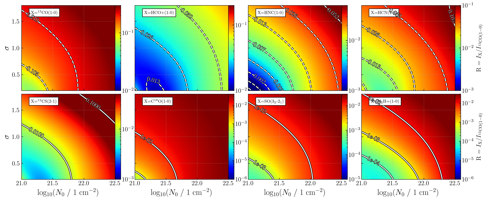
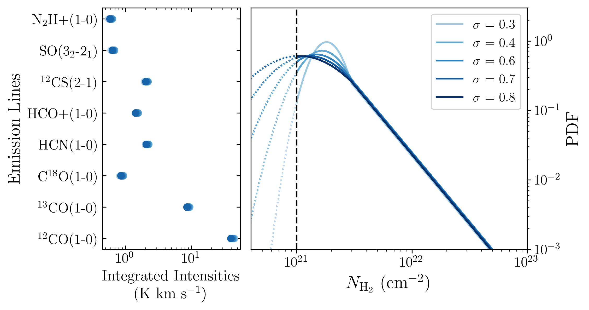

$\newcommand{\ensuremath}{}$
$\newcommand{\xspace}{}$
$\newcommand{\object}[1]{\texttt{#1}}$
$\newcommand{\farcs}{{.}''}$
$\newcommand{\farcm}{{.}'}$
$\newcommand{\arcsec}{''}$
$\newcommand{\arcmin}{'}$
$\newcommand{\ion}[2]{#1#2}$
$\newcommand{\textsc}[1]{\textrm{#1}}$
$\newcommand{\hl}[1]{\textrm{#1}}$
$\newcommand{\footnote}[1]{}$
$\newcommand{\tweco}{^{12}CO(J=1\rightarrow0)}$
$\newcommand{\thico}{^{13}CO(J=1\rightarrow0)}$
$\newcommand{\eigco}{C^{18}O(J=1\rightarrow0)}$
$\newcommand{\hcn}{HCN(J=1\rightarrow0)}$
$\newcommand{\hnc}{HNC(J=1\rightarrow0)}$
$\newcommand{\so}{SO(J_K=3_2\rightarrow2_1)}$
$\newcommand{\cs}{^{12}CS(J=2\rightarrow1)}$
$\newcommand{\hcop}{HCO^+(J=1\rightarrow0)}$
$\newcommand{\nhp}{N_2H^+(J=1\rightarrow0)}$
$\newcommand{\N}{N_0}$
$\newcommand{\NH}{N_{\rm{H_2}}}$
$\newcommand{\addref}{\textcolor{red}{ref}}$
$\newcommand{\rthres}{r_{\rm{thresh}}}$
$\newcommand{\rthresh}{r_{\rm{thresh}}}$
$\newcommand{\todo}[1]{\textbf{\textcolor{red}{TODO:}} \textcolor{red}{#1}}$
$\newcommand{\modifi}[1]{\textcolor{black}{#1}}$
$\newcommand{\modifj}[1]{\textcolor{black}{#1}}$
$\newcommand{\VertCaption}[2]{$
$  \rotatebox{90}{\parbox{#1}{$
$      \centering  \textbf{#2}}}}$
$\newcommand{\HoriCaption}[2]{$
$  \parbox{#1}{\centering  \textbf{#2}}}$
$\newcommand{\FigEmissionFunction}{$
$    \begin{figure}$
$        \centering$
$        \includegraphics[width = 1\linewidth]{figures/NH2_Int_pl.jpg}$
$    \caption{Binned trends of line integrated intensity as a function of column density. The data is binned in 30 equally sized bins of column density. Black circles correspond to the bin average, while the grey shading indicates the standard deviation in each bin. The black solid line is a smoothly varying double PL fit to the trends, specific to each emission line. The red dashed line shows for comparison the empirical fit to nearby clouds by [Tafalla, Usero and Hacar (2023)](), assuming a kinetic temperature of 11 K. Each panel shows a different emission line: \tweco , \thico  and \hcop  (left to right, top row);  \eigco , \hcn  and \cs  (middle); \hnc  \so  and \nhp  (bottom). The standard Milky Way CO-to-H_2 conversion factor and its typical uncertainty  ([Bolatto, Wolfire and Leroy 2013]())  is indicated in the top left panel. An \hcn  dense gas conversion factor of 60 M_\odot (K km s^{-1})^{-1} is indicated in the central panel. }$
$    \label{fig:emission-function}$
$    \end{figure}$
$}$
$\newcommand{\PostPDFExampleCorr}{$
$    \begin{figure}$
$        \centering$
$        \includegraphics[width = 1\linewidth]{figures/beetroots_test_orionb_post_pdf.jpg}$
$    \caption{Two-dimensional projections of the posterior PDF in the form of a scatter plot matrix. The matrix's diagonal shows the posterior PDF of each estimated parameter. The MAP estimation is represented as a vertical cyan line on the histograms and as a cyan square in the scatter plot. The true N-PDF parameters obtained by fitting the dust derived Orion B N-PDF is shown are shown as red crosses. The black dashed line show the range in PL index \alpha of the N-PDF expected for gravitational collapse. The estimations closely match the reference values, although clear degeneracies are present in the posterior PDF. }$
$    \label{fig:orionb-post-pdf-corr}$
$    \end{figure}$
$}$
$\newcommand{\PostPDFExample}{$
$    \begin{figure}$
$        \centering$
$        \includegraphics[width = 0.8\linewidth]{figures/beetroots_test_OrionB.jpg}$
$    \caption{A comparison of the reference and estimated$
$     N-PDFs when inverting the N-PDF on the spatially and spectrally$
$     averaged ORION-B data. The thick red line indicates the N-PDF as a histogram constructed directly from the dust-derived Orion B column densities, and the green line represents a \chi^2 fit to the red histogram. The estimated N-PDFs from the 10 000 MCMC iterations to sample the Bayesian posterior are shown with blue$
$     circles. The dashed orange line is the MAP estimation for the N-PDF. The vertical dotted black line indicates the limit below which the line intensities$
$     predicted by the emission function fall below the typical noise level$
$     of the data, that is 0.1 K km s^{-1}.}$
$    \label{fig:otrionb-post-pdf}$
$    \end{figure}$
$}$
$\newcommand{\ParamsMap}{$
$    \begin{figure}$
$        \centering$
$        \includegraphics[width = 1\linewidth]{figures/map_params_arrow.png}$
$    \caption{MAP estimations of the sub-beam N-PDF parameters across our M51 test region. Clockwise from top left, the panels show the mean column density of the LN part of N-PDF (N_0), the width of the log-normal (\sigma), the power-law index (\alpha), and the column density of transition between the log-normal and power-law parts of the N-PDF (\rthres). Red contours in each panel indicate \thico  integrated intensities of 4~and 12~K km s^{-1} (dashed and solid contours, respectively). The white arrow indicates the direction to the galactic centre. To first order, the gas is denser and more gravitationally unstable inside the spiral arm$
$     than outside the arm.$
$  }$
$  \label{fig:m51:param-map}$
$    \end{figure}$
$}$
$\newcommand{\MdenseMap}{$
$    \begin{figure}$
$        \centering$
$        \includegraphics[width = 1\linewidth]{figures/map_Mdense.jpg}$
$    \caption{The spatial distribution of$
$     the mass of dense gas (left), the gas mass in the power-law$
$     part of the N-PDF (middle), and the 24 \mum surface brightness in our M51 target region. We use the 24 \mum emission as a proxy for star formation. The masses are derived from the MAP estimate of the N-PDF, using equations$
$     \ref{eq:sigma_dense} and \ref{eq:sigma_pl}. The red contours are the samed as in Figure~\ref{fig:m51:param-map}. The masses of dense and PL gas appear highly correlated, with a similar spatial distribution as the 24\mum emission. }$
$    \label{fig:m51:Mdense-map}$
$    \end{figure}$
$}$
$\newcommand{\MdenseSFR}{$
$    \begin{figure}$
$        \centering$
$        \includegraphics[width = 1\linewidth]{figures/mdense_mpl_I24.jpg} \     \caption{Correlation between the 24\mum integrated intensity and the mass of dense gas (\textit{left}) and mass of gas in the power-law part of the N-PDF (\textit{right}) for pixels within our M51 test region. Each data point corresponds to a pixel within our field. The symbol size and grey shading represent f_{\rm PL}, the mass fraction of the gas in the power-law part of the N-PDF. Symbols with a red outline identify pixels where f_\text{PL} \geq 25\% and the slope of the power-law \alpha \in [2.5,5]. The dotted line is a linear fit to the pixels where f_\text{PL} < 5\%. The thick red line is a fit to the points where f_\text{PL} \geq 25\% and \alpha \in [2.5,5]. The latter fit has a correlation coefficient r = 0.85 and slope s = 1.0.}$
$    \label{fig:m51:mdense-sfr-corr}$
$    \end{figure}$
$}$
$\newcommand{\FigRatiosNSig}{$
$    \begin{figure*}[h]$
$        \centering$
$        \includegraphics[width = 0.9\linewidth]{figures/N0_sigv_emission_model.jpg}$
$    \caption{Model predicted line integrated intensities ratios over \tweco  as a function \sigma and N_0 for a purely LN N-PDF. Top row shows the ratios of \thico , \hcop , \hnc  and \hcn  over \tweco , from left to right. In this top row dashed lines show ratio isocontours increasing by factors of two. Bottom row shows the ratios of \cs , \eigco , \so  and \nhp  over \tweco , from left to right. In the bottom row isocontours represent factors of tens.}$
$    \label{fig:emission-function:N0-sig0}$
$    \end{figure*}$
$}$
$\newcommand{\FigRatiosAlphaN}{$
$    \begin{figure*}[h]$
$        \centering$
$        \includegraphics[width = 0.9\linewidth]{figures/ralpha_N0_emission_model.jpg}$
$    \caption{Same as Figure~\ref{fig:emission-function:N0-sig0}, except that the N-PDF is composed of a LN and a PL, with varying N_0 and \alpha while r_{\rm{thres}} and \sigma  are fixed to r_{\rm{thres}} = 3 and \sigma=0.8}$
$    \label{fig:emission-function:N0-alpha}$
$    \end{figure*}$
$}$
$\newcommand{\FigRatiosAlphaSig}{$
$    \begin{figure*}[h]$
$        \centering$
$        \includegraphics[width = 0.9\linewidth]{figures/ralpha_sigv_emission_model.jpg}$
$    \caption{Same as Figure~\ref{fig:emission-function:N0-sig0}, except that the N-PDF is composed of a LN and a PL, with varying \sigma and \alpha while r_{\rm{thres}} and N_0 are fixed to N_0 = 5\times10^{22} cm^{-2} and r_{\rm{thres}}=5.}$
$    \label{fig:emission-function:alpha-sig0}$
$    \end{figure*}$
$}$
$\newcommand{\FigRatiosRthresSig}{$
$    \begin{figure*}[h]$
$        \centering$
$        \includegraphics[width = 0.9\linewidth]{figures/rthres_sigv_emission_model.jpg}$
$    \caption{Same as Figure~\ref{fig:emission-function:N0-sig0}, except that the N-PDF is composed of a LN and a PL, with varying r_{\rm{thres}} and \sigma while \alpha and N_0 are fixed to N_0 = 5\times10^{22} cm^{-2} and \alpha=2.}$
$    \label{fig:emission-function:rthres-sig0}$
$    \end{figure*}$
$}$
$\newcommand{\FigRatiosRthresAlpha}{$
$    \begin{figure*}[h]$
$        \centering$
$        \includegraphics[width = 0.9\linewidth]{figures/rthres_ralpha_emission_model.jpg}$
$    \caption{Same as Figure~\ref{fig:emission-function:N0-sig0}, except that the N-PDF is composed of a LN and a PL, with varying r_{\rm{thres}} and \alpha while \sigma and N_0 are fixed to N_0 = 5\times10^{22} cm^{-2} and \sigma=0.6.}$
$    \label{fig:emission-function:rthres-alpha}$
$    \end{figure*}$
$}$

# Estimating the dense gas mass of molecular clouds using spatially unresolved 3 mm line observations

<mark>Appeared on: 2025-04-15</mark> -  _18 pages, 16 figures, submitted to A&A_

A. Zakardjian, et al. -- incl., <mark>A. Hughes</mark>

**Abstract:** Emission lines such as $\hcn$ are commonly used by extragalactic studies to trace high density molecular gas (n ${_{\rm{H_2}}}> \sim10^{4}$ cm $^{-3}$ ). Recent Milky Way studies have challenged their utility as unambiguous dense gas tracers, suggesting that a large fraction of their emission in nearby clouds is excited in low density gas. We aim to develop a new method to infer the sub-beam probability density function (PDF) of $H_2$ column densities and the dense gas mass within molecular clouds using spatially unresolved observations of molecular emission lines in the 3 mm band. We model spatially unresolved line integrated intensity measurements as the average of an emission function weighted by the sub-beam column density PDF. The emission function, which expresses the line integrated intensity as a function of the gas column density, is an empirical fit to high resolution ( $<0.05$ pc) multi-line observations of the Orion B molecular cloud. The column density PDF is assumed to be parametric, composed of a lognormal distribution at moderate column densities and a power law distribution at higher column densities. To estimate the sub-beam column density PDF, the emission model is combined with a Bayesian inversion algorithm (implemented in the Beetroots code), which takes account of thermal noise and calibration errors. $\modifi{We validate our method by demonstrating that it recovers the true column density PDF of the Orion B cloud, reproducing the observed emission line integrated intensities within noise and calibration uncertainties.    We apply the method to \tweco , \thico , \eigco , \hcn, \hcop  and \nhp  observations of a $700\times700$ pc$^2$ field of view (FoV) in the nearby galaxy M51. On average, the model reproduces the observed intensities within 30\%.    The column density PDFs obtained for the spiral arm region within our test FoV are dominated by a power-law tail at high column densities, with slopes that are consistent with gravitational collapse. Outside the spiral arm, the column density PDFs are predominantly lognormal, consistent with supersonic isothermal turbulence setting the dynamical state of the molecular gas.    We calculate the mass associated with the power-law tail of the column density PDFs and observe a strong, linear correlation between this mass and the 24$\mu$m surface brightness.}$ $\modifi{Our method is a promising approach to infer the physical conditions within extragalactic molecular clouds using spectral line observations that are feasible with current millimetre facilities. Future work will extend the method to include additional physical parameters that are relevant for the dynamical state and star formation activity of molecular clouds.}$

**Figure 12. -** Model predicted line integrated intensities ratios over $\tweco$  as a function $\sigma$ and $N_0$ for a purely LN $N$-PDF. Top row shows the ratios of $\thico$ , $\hcop$ , $\hnc$  and $\hcn$  over $\tweco$ , from left to right. In this top row dashed lines show ratio isocontours increasing by factors of two. Bottom row shows the ratios of $\cs$ , $\eigco$ , $\so$  and $\nhp$  over $\tweco$ , from left to right. In the bottom row isocontours represent factors of tens. (*fig:emission-function:N0-sig0*)

**Figure 7. -** _Left:_ Model predicted integrated intensities for a piecewise LN and PL $N$-PDF, with $N_0 = 2\times 10^{21}$ cm$^{-2}$, $r_{\rm{thres}}$=1.5, $\alpha=3$ and $\sigma$ increasing from 0.3 to 0.8. All predicted integrated intensities vary by 10\% at most, which illustrates the degeneracy on the parameter $\sigma$ in the particular case of low $N_0$ and strong PL component. The right panels displays the corresponding $N$-PDF with varying $\sigma$. The dashed vertical line shows the column density limit below which the emission of all lines is less than 0.1 K km s$^{-1}$. (*fig:degeneracies:sigma*)

**Figure 8. -** Same as Figure \ref{fig:degeneracies:sigma}, except two specific $N$-PDF are illustrated: the first has a narrow LN width but a strong PL, while the other has a large LN width but a smaller PL. This illustrates how two $N$-PDF with notably different parameters can appear alike and give comparable average integrated intensities. (*fig:degeneracies:sigma-rthres*)

