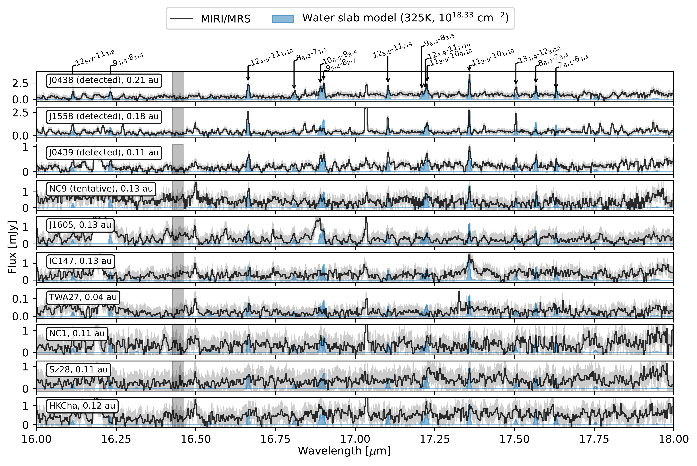
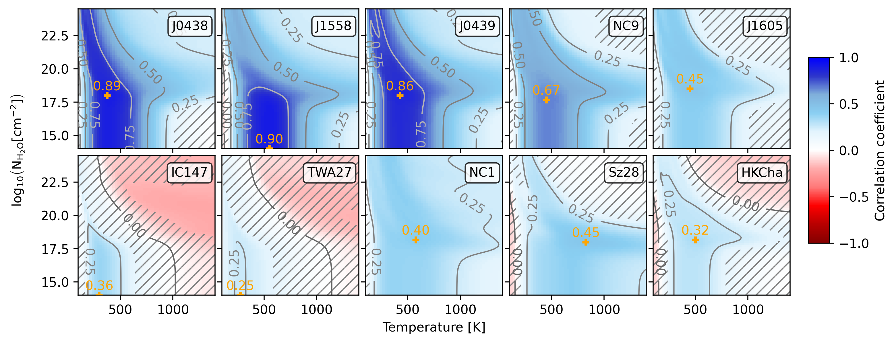
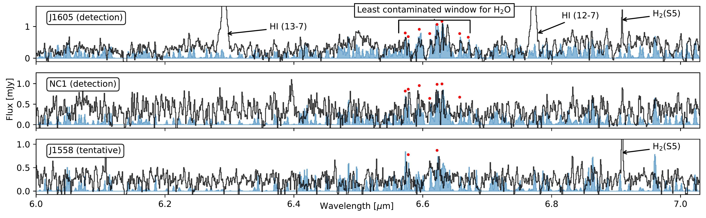

$\newcommand{\ensuremath}{}$
$\newcommand{\xspace}{}$
$\newcommand{\object}[1]{\texttt{#1}}$
$\newcommand{\farcs}{{.}''}$
$\newcommand{\farcm}{{.}'}$
$\newcommand{\arcsec}{''}$
$\newcommand{\arcmin}{'}$
$\newcommand{\ion}[2]{#1#2}$
$\newcommand{\textsc}[1]{\textrm{#1}}$
$\newcommand{\hl}[1]{\textrm{#1}}$
$\newcommand{\footnote}[1]{}$
$\newcommand{\vdag}{(v)^\dagger}$
$\newcommand$
$\newcommand$
$\newcommand{\ch}[1]{{\rm #1}}$
$\newcommand{\ama}[1]{\textcolor{red}{\rm #1^{(\rm AMA)}}}$
$\newcommand{\ik}[1]{\textcolor{purple}{\rm #1^{(\rm IK)}}}$
$\newcommand{\ikc}[1]{\textcolor{purple}{IK: \rm #1}}$
$\newcommand{\hl}[1]{{#1}}$
$\newcommand{\hll}[1]{{#1}}$
$\newcommand{\mybox}[2][1.1ex]{\raisebox{#1}{\myboxi{#2}}}$
$\newcommand{\myboxx}[2][1.1ex]{\raisebox{#1}{\myboxxi{#2}}}$
$\newcommand{\myboxxx}[2][1.1ex]{\raisebox{#1}{\myboxxxi{#2}}}$

# MINDS: The very low-mass star and brown dwarf sample \ Hidden water in carbon-dominated protoplanetary disks

<mark>Appeared on: 2025-04-16</mark> -  _Accepted for publication in Astrophysical Journal Letters, 21 pages, 24 figures_

A. M. Arabhavi, et al. -- incl., <mark>T. Henning</mark>, <mark>G. Perotti</mark>, <mark>K. Schwarz</mark>

**Abstract:** Infrared observations of the inner disks around very low-mass stars (VLMS, $<$ 0.3 $ M_{\odot}$ ) have revealed a carbon-rich gas composition in the terrestrial planet-forming regions. Contrary to the typically water-rich T Tauri disk spectra, only two disks around VLMS have been observed to be water-rich among more than ten VLMS disks observed so far with JWST/MIRI. In this letter, we systematically search for the presence of water and other oxygen-bearing molecules in the JWST/MIRI spectra of ten VLMS disks from the MIRI mid-INfrared Disk Survey (MINDS). In addition to the two previously reported detections of water emission in this VLMS sample, we detect water emission in the spectra of three other sources and tentatively in one source, and we provide strong evidence for water emission in the remaining disks in the MINDS sample, most of which have bright emission from carbon-bearing molecules. We show that the $\ch{C_2H_2}$ emission is much stronger than that of water for sources with low luminosities, and the hydrocarbons outshine the water emission in such conditions. $\hl{We propose that the appearance of}$ water-rich vs. hydrocarbon-rich spectra is related to the location of the water reservoir in the disk relative to the main hydrocarbon reservoir. Our findings indicate that the terrestrial planet forming regions in VLMS disks $\hl{have high carbon-to-oxygen ratios}$ (C/O $>$ 1), but can still harbor ample water similar to those in the T Tauri disks.

**Figure 22. -** Detections and non-detections of pure rotational line emission of water. The continuum subtracted spectra are shown in black and the water slab models in blue. The slab model parameters are arbitrarily chosen for a visual match with the observed spectra. The temperature and column densities of the models are the same across all the panels, while the emitting area is scaled to match the flux level. The vertical gray area in each panel shows the wavelength region used to calculate the noise level. The light gray shaded region across the spectra shows the $\pm$3$\sigma$ noise level obtained in this way. The identified water line transitions are indicated at the top of the figure as $J_{K_a K_c}-J'_{K_{a}' K_{c}'}$, where $J$, $K_a$, $K_c$ are the total angular momentum quantum number, and the projections of the angular momentum on the principal axes. (*fig:hiddenwater*)

**Figure 24. -** Cross-correlations of observed VLMS spectra with water slab models between 16.65 and 17.65 $\mu$m for different column densities ($N$) and temperatures ($T$). The correlation coefficient varies from -1 (anti-correlation, in red) to +1 (correlation, in blue). The contours of correlation coefficients at 0.25, 0.5, and 0.75 are shown with dark gray lines. The parameter space where the statistical significance is low (i.e., the p-value is larger than 0.03) is hatched. The orange cross indicates the best correlation coefficient for each source. (*fig:water_corr*)

**Figure 21. -** Detections of ro-vibrational bands of water emission in J1605 (top), NC1 (middle), and J1558 (bottom). The continuum subtracted spectra are shown in black and the LTE water slab models are shown in blue. The slab model parameters (temperature, column density, and emitting radius) are chosen to roughly match the observed spectra and are not obtained from fits: 525 K, 10$^{20}$ cm$^{-2}$, 0.02 au for J1605; 525 K, 10$^{19}$ cm$^{-2}$, 0.02 au for NC1; 525 K, 10$^{18.33}$ cm$^{-2}$, 0.03 au for J1558. $\hl${The red dots show the detected water lines in the least contaminated window.} (*fig:hiddenwater_rovib*)

