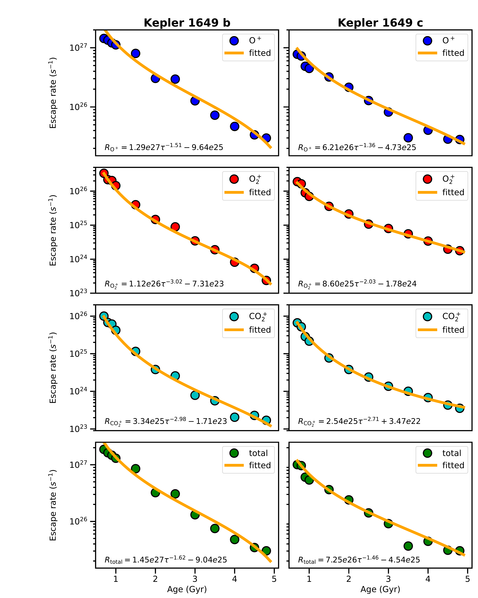

$\newcommand{\ensuremath}{}$
$\newcommand{\xspace}{}$
$\newcommand{\object}[1]{\texttt{#1}}$
$\newcommand{\farcs}{{.}''}$
$\newcommand{\farcm}{{.}'}$
$\newcommand{\arcsec}{''}$
$\newcommand{\arcmin}{'}$
$\newcommand{\ion}[2]{#1#2}$
$\newcommand{\textsc}[1]{\textrm{#1}}$
$\newcommand{\hl}[1]{\textrm{#1}}$
$\newcommand{\footnote}[1]{}$
$\newcommand{\vdag}{(v)^\dagger}$
$\newcommand$
$\newcommand$

# Evolving Atmospheric Ion Escape from Kepler-1649 b and c: Power-Law Trends in Atmospheric Loss

<mark>Appeared on: 2025-04-18</mark> -  _19 pages, 6 figures, 3 tables. Submitted to ApJL_

H. Li, et al. -- incl., <mark>L. Xie</mark>, <mark>D. Christie</mark>

**Abstract:** Rocky planets orbiting M-dwarf stars are prime targets for characterizing terrestrial atmospheres, yet their long-term evolution under intense stellar winds and high-energy radiation remains poorly understood. The Kepler-1649 system, which hosts two terrestrial exoplanets orbiting an M5V star, presents a valuable opportunity to explore atmospheric evolution in the extreme environments characteristic of M-dwarf stellar systems. In this Letter we show that both planets could have retained atmospheres over gigayear timescales. Using a multi-species magnetohydrodynamic model, we simulate atmospheric ion escape driven by stellar winds and extreme ultraviolet radiation from 0.7 to 4.8 Gyrs. The results show that total ion escape rates follow a power-law decline ( $\propto \tau^{-1.6}$ for Kepler-1649 b, $\propto \tau^{-1.5}$ for Kepler-1649 c $ $ ), with $\ce{O+}$ dominating atmospheric loss (76.8 \% –98.7 \% ). The escape rates at 4.8 Gyrs are two orders of magnitude lower than those during the early epochs ( $1.9\times10^{27}$ s $^{-1}$ at 0.7 Gyr vs. $3.0\times10^{25}$ s $^{-1}$ at 4.8 Gyrs for planet b $ $ ), while planet b consistently exhibits 1.1–1.9 $\times$ higher $\ce{O+}$ escape rates than planet c due to its closer orbit (0.051 AU vs. 0.088 AU). Despite substantial early atmospheric erosion, both planets may still retain significant atmospheres, suggesting the potential for long-term habitability. These findings offer predictive insight into atmospheric retention in M-dwarf systems and inform future JWST observations aimed at refining habitability assessments.

**Figure 1. -** Evolution of ion escape rates for Kepler-1649 b (left panels) and c (right panels) across stellar ages (0.7--4.8 Gyrs).
Top to bottom: \ce{O+}, \ce{O2+}, \ce{CO2+}, and total ion escape rates (s$^{-1}$). Data points are fitted with power-law functions (solid lines).
	 (*fig1*)

**Figure 2. -** Logarithmic ion number density (cm$^{-3}$) distributions in the X-Z plane for Kepler-1649 b at different stellar ages (0.7--4.8 Gyrs; top to bottom). Columns show \ce{O+}, \ce{O2+}, and \ce{CO2+}(left to right). Coordinates are normalized to planetary radius $R_{\rm P}$.
         (*Fig:2D_distribution_Kb*)

**Figure 3. -** Logarithmic ion number density (cm$^{-3}$) distributions in the X-Z plane for Kepler-1649 c at different stellar ages (0.7--4.8 Gyrs; top to bottom). Columns show \ce{O+}, \ce{O2+}, and \ce{CO2+}(left to right). Coordinates are normalized to planetary radius $R_{\rm P}$.
         (*Fig:2D_distribution_Kc*)

