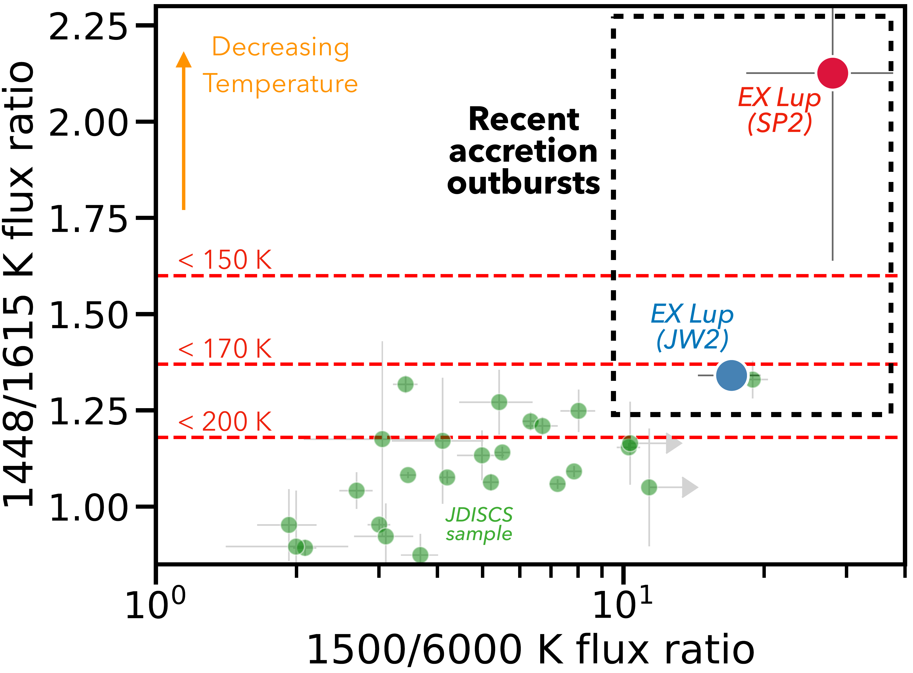
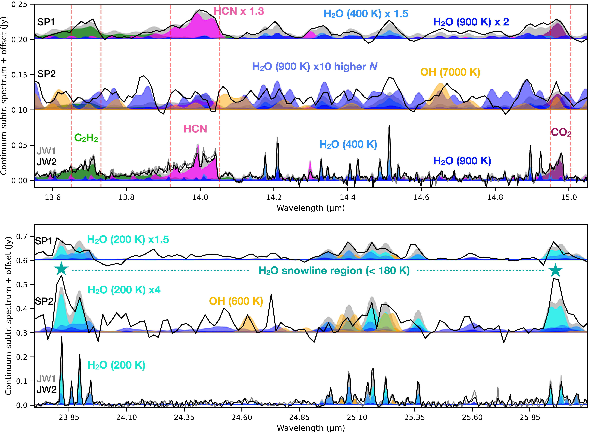
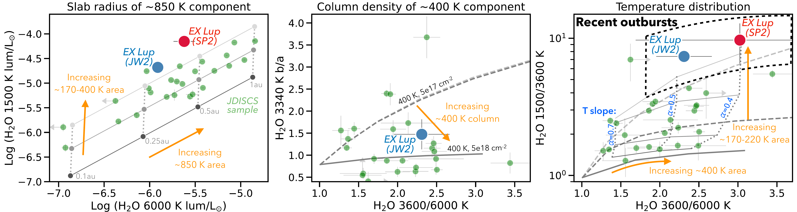

$\newcommand{\ensuremath}{}$
$\newcommand{\xspace}{}$
$\newcommand{\object}[1]{\texttt{#1}}$
$\newcommand{\farcs}{{.}''}$
$\newcommand{\farcm}{{.}'}$
$\newcommand{\arcsec}{''}$
$\newcommand{\arcmin}{'}$
$\newcommand{\ion}[2]{#1#2}$
$\newcommand{\textsc}[1]{\textrm{#1}}$
$\newcommand{\hl}[1]{\textrm{#1}}$
$\newcommand{\footnote}[1]{}$
$\newcommand{\tblspc}{-0.1cm}$
$\newcommand{\rev}[1]{\textcolor{black}{#1}}$
$\newcommand$
$\newcommand$
$\newcommand$
$\newcommand$
$\newcommand{\farcs}{\hbox{.\!\!^{\prime\prime}}}$

# JWST's sharper view of EX Lup: cold water from ice sublimation during accretion outbursts

<mark>Appeared on: 2025-04-21</mark> -  _Accepted for publication in ApJ Letters_

S. A. Smith, et al. -- incl., <mark>J. Bouwman</mark>

**Abstract:** The unstable accretion phases during pre-main-sequence evolution of T Tauri stars produce variable irradiation and heating of planet-forming regions. A strong accretion outburst was observed with Spitzer-IRS in 2008 in EX Lup, the prototype of EXor variables, and found to increase the mid-infrared water and OH emission and decrease organic emission, suggesting large chemical changes. We present here two JWST-MIRI epochs of quiescent EX Lup in 2022 and 2023 obtained over a decade after the 2008 outburst and several months after a moderate burst in 2022. With JWST's sharper spectral view, we can now analyze water emission as a function of temperature in the two MIRI epochs and, approximately, also in the previous Spitzer epochs. This new analysis shows a strong cold water vapor "burst" in low-energy lines during the 2008 outburst, which we consider clear evidence for enhanced ice sublimation due to a recession of the snowline, as found in protostellar envelopes. JWST shows that EX Lup still has an unusually strong emission from cold water in comparison to other T Tauri disks, $\rev{suggesting $> 10$-yr-long freeze-out timescales in the inner disk surface}$ . EX Lup demonstrates that outbursts can significantly change the observed organic-to-water ratios and increase the cold water reservoir, providing chemical signatures to study the recent accretion history of disks. This study provides an unprecedented demonstration of the chemical evolution triggered by accretion outbursts in the Class II phase and of the high potential of time-domain experiments to reveal processes that may have fundamental implications on planet-forming bodies near the snowline.

**Figure 1. -** Coldest water detected in EX Lup, in comparison to the JDISCS sample from \citet{banzatti24}. The 23 $\mu$m line flux asymmetry diagnostic (the 1448/1615 K flux ratio) shows one of the largest values ever measured before, consistent with ice sublimation in the inner disk \citep[$\rev${the temperatures associated to specific 1448/1615 K values assume a column density of $N = 10^{17}$ cm$^{-2}$, see}][]{banzatti24}. The other object near EX Lup (JW2) is the young disk of IRAS 04385-2550. (*fig: 23umlines_ratios*)

**Figure 7. -** Mid-infrared spectral line variability observed with Spitzer-IRS \citep{banz12} and JWST-MIRI (this work) in the T Tauri disk of EX Lup over $\sim 20$ years (from 2005 with the SP1 epoch, to 2023 with the JW2 epoch). The two MIRI epochs are plotted in grey (JW1) and black (JW2) without offset, to demonstrate their similarity. The individual molecular models obtained for the JW2 epoch (Table \ref{tab: slab results}) are shown in different colors, their sum in grey. The same models are shown as downgraded to the resolving power of Spitzer-IRS for comparison to the SP1 and SP2 data, $\rev${with multiplication factors as labeled for each molecule;} additional models for water and OH are shown on top of the SP2 epoch to explain the more complex structure observed (see text for details). The vertical dashed lines show the range where the line flux of organic molecules is measured for Figure \ref{fig: IRS_correl}. $\rev${The lowest-energy lines covered by MIRI ($E_u$ = 878--1448 K), which are more sensitive to the snowline region at T $< 180 K$, are marked with a star (see also Figure \ref{fig: 23umlines_ratios}).} (*fig: all_spectra*)

**Figure 8. -** Water diagnostic diagrams from \citet{banzatti24}, with the JDISCS sample from that work shown for reference in light green. The position of the JW2 spectrum of EX Lup (large blue datapoint) in these diagrams shows: 1) a moderate slab radius ($\approx 0.3$ au) for the hot water component (left plot), 2) optically thick emission ($N \approx 10^{18}$ cm$^{-2}$) in the warm water component (middle plot), and 3) a temperature gradient with negative slope $\approx 0.45$--0.55 and with strong cold water enrichment (right plot, see also Figure \ref{fig: 23umlines_ratios}). These estimates are confirmed by the slab fit results both with discrete components and with the radial gradient (Sections \ref{sec: slab_model} and \ref{sec: cooler}). $\rev${The line ratios from the outburst SP2 spectrum are more uncertain due to line blending (see Appendix \ref{app: deblending}), but indicate a larger and colder water reservoir (see also Figure \ref{fig: 23umlines_ratios}).} (*fig: diagnostic_diagram*)

