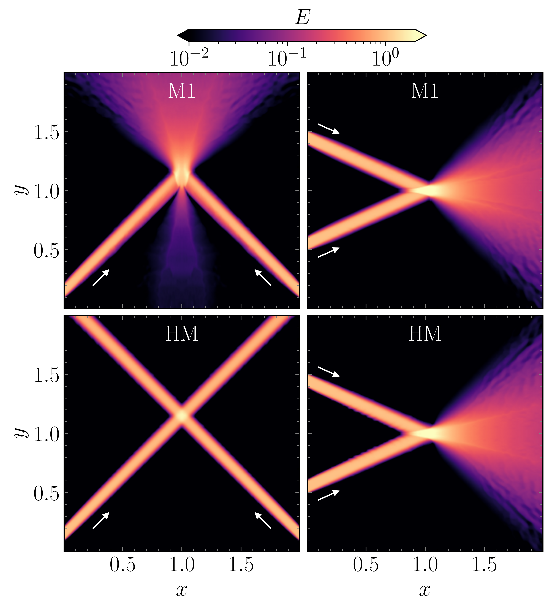
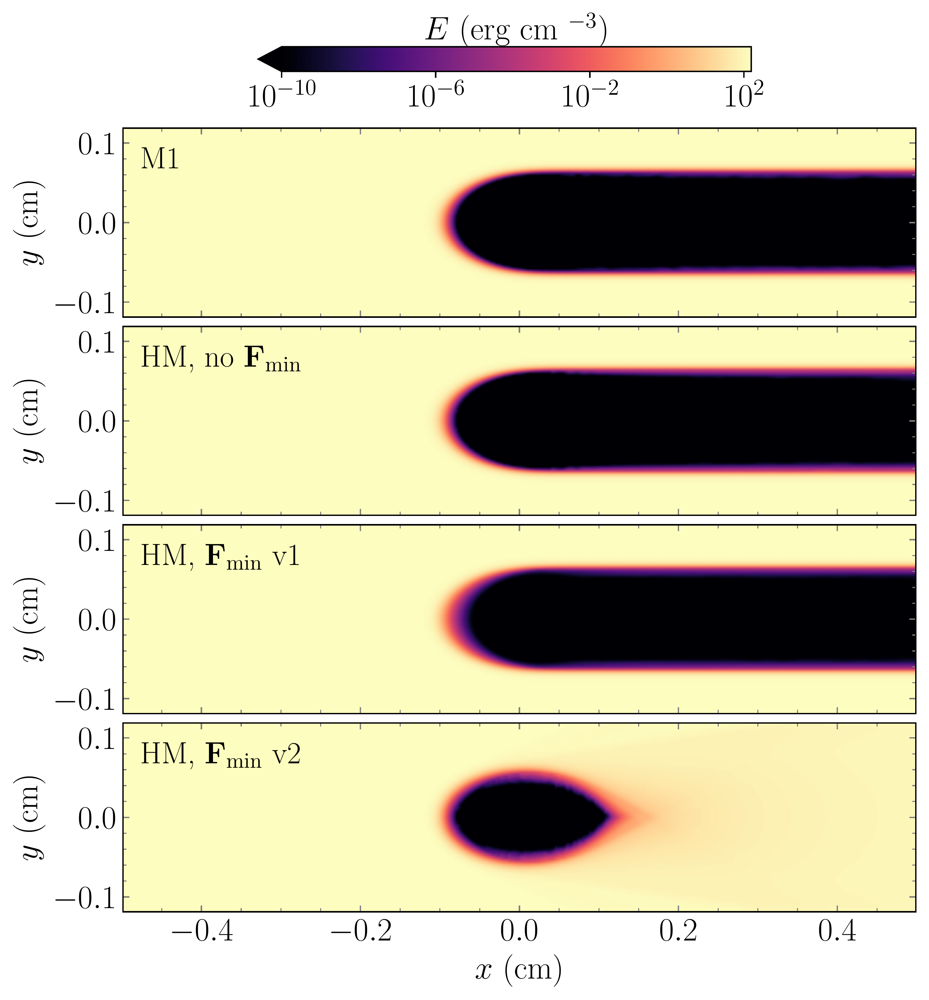
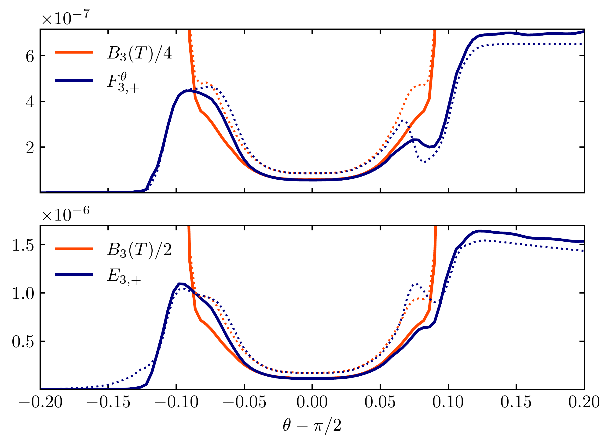

$\newcommand{\ensuremath}{}$
$\newcommand{\xspace}{}$
$\newcommand{\object}[1]{\texttt{#1}}$
$\newcommand{\farcs}{{.}''}$
$\newcommand{\farcm}{{.}'}$
$\newcommand{\arcsec}{''}$
$\newcommand{\arcmin}{'}$
$\newcommand{\ion}[2]{#1#2}$
$\newcommand{\textsc}[1]{\textrm{#1}}$
$\newcommand{\hl}[1]{\textrm{#1}}$
$\newcommand{\footnote}[1]{}$
$\newcommand{\sftw}[1]{\texttt{#1}}$
$\newcommand{\RED}{\color{red}}$
$\newcommand{\BLACK}{\color{black}}$
$\newcommand{\BLUE}{\color{blue}}$
$\newcommand{\GREEN}{\color{green1}}$
$\newcommand{\DS}{\displaystyle}$
$\newcommand{\cF}{{\cal F}}$
$\newcommand{\cG}{{\cal G}}$
$\newcommand{\cR}{{\cal R}}$
$\newcommand{\cS}{{\cal S}}$
$\newcommand{\cU}{{\cal U}}$
$\newcommand{\cV}{{\cal V}}$
$\newcommand{\norm}[1]{ {\left|\left|{#1}\right|\right|}}$
$\newcommand{\dmnote}[1]{{\bf \color{blue}[D.M.: #1]}}$
$\newcommand\blue{#1}$
$\newcommand\green{#1}$
$\newcommand\red{#1}$

# Multidimensional half-moment multigroup radiative transfer: Improving moment-based thermal models of circumstellar disks

<mark>Appeared on: 2025-04-22</mark> -  _Submitted to Astronomy & Astrophysics, comments welcome_

<mark>D. M. Fuksman</mark>, <mark>M. Flock</mark>, <mark>H. Klahr</mark>, <mark>G. Mattia</mark>, <mark>D. Muley</mark>

**Abstract:** Common radiative transfer methods, such as flux-limited diffusion (FLD) and the M1 closure, suffer from artificial interactions between crossing beams. In protoplanetary disks, this leads to an overestimation of the midplane temperature due to the merging of vertical inward and outward fluxes. Methods that avoid these artifacts typically require angular discretization, which can be computationally expensive. In the spirit of the two-stream approximation, we aim to remove the interaction between beams in a fixed spatial direction by introducing a half-moment (HM) closure, which integrates the radiative intensity over hemispheres. We derived a multidimensional HM closure via entropy maximization and replaced this closure with an approximate expression that closely matches it, coinciding in the diffusion and free-streaming regimes while remaining expressible through simple operations.We implementedthe HM and M1 closures via implicit-explicit (IMEX) schemes,  including multiple frequency groups.We testedthese methods in numerical benchmarks, including computing the temperature in an irradiateddisk around a T Tauri star, comparing the results with Monte Carlo (MC) radiative transfer simulations. The resulting HM closure tends to the correct limit in the diffusion regime and prevents interactions between crossing fluxes in a chosen spatial direction.In disk simulations with 22 frequency groups, the M1 closure disagrees with the MC midplane temperature by up to $21\%$ , while HM reduces this discrepancy to $6\%$ . Even with just 3 frequency groups, HM significantly outperforms M1, with maximum departures of $8\%$ compared to M1's $23\%$ .

**Figure 2. -** Crossing beams advected with the M1 and HM closures. This test highlights how the HM closure removes the artificial interaction between crossing fluxes in selected directions. In the HM case, $\hat{\mathbf{d}}=\hat{\mathbf{x}}$ has been chosen as the splitting direction. Arrows indicate the directions of the injected beams.
 (*fig:crossing_beams*)

**Figure 6. -** Total energy density in the horizontal shadow test obtained with the M1 and HM closures. For the HM closure, distributions are shown for the cases where Eq. \eqref{Eq:physlimit2} is not enforced, enforced via Eq. \eqref{Eq:Fminv1}, and enforced via Eq. \eqref{Eq:Fminv2}, in the second, third, and fourth panels from the top, respectively.
 (*fig:shadow*)

**Figure 12. -** 
Half-moment ($+$) flux and energy density at $r=1$ au for the highest-energy group in the disk tests with $N_g=3$, given in erg cm$^{-3}$. Solid and dotted lines correspond to solutions obtained with and without enforcing Eq. \eqref{Eq:Fminv2}, respectively.
 (*fig:DiskFpEp*)

