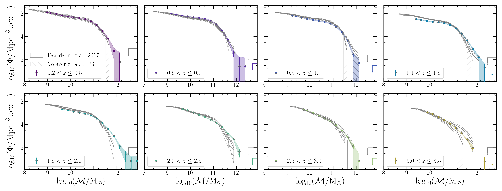
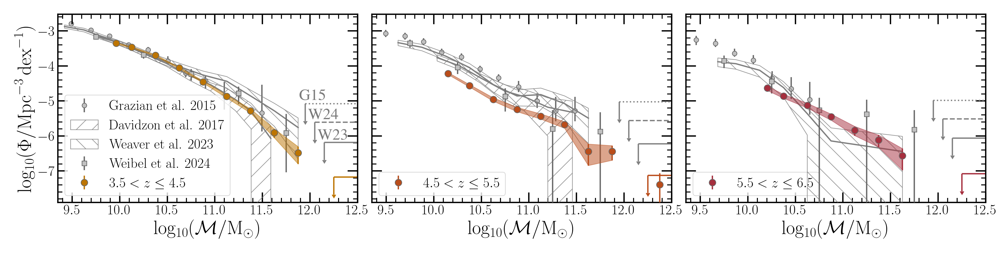
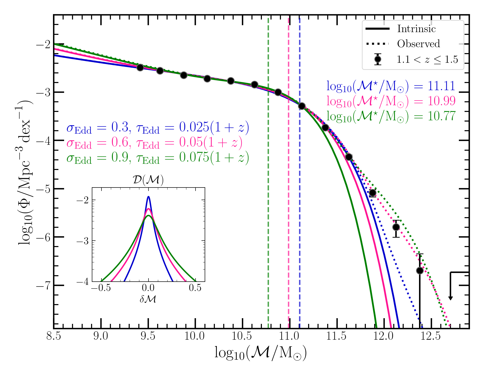

$\newcommand{\ensuremath}{}$
$\newcommand{\xspace}{}$
$\newcommand{\object}[1]{\texttt{#1}}$
$\newcommand{\farcs}{{.}''}$
$\newcommand{\farcm}{{.}'}$
$\newcommand{\arcsec}{''}$
$\newcommand{\arcmin}{'}$
$\newcommand{\ion}[2]{#1#2}$
$\newcommand{\textsc}[1]{\textrm{#1}}$
$\newcommand{\hl}[1]{\textrm{#1}}$
$\newcommand{\footnote}[1]{}$
$\newcommand{\orcid}[1]$
$\newcommand{\arraystretch}{1.4}$
$\newcommand{\photoz}{photo-\textit{z}}$
$\newcommand{\specz}{spec-\textit{z}}$
$\newcommand{\Msol}{{\rm M}_\odot}$
$\newcommand{\classic}{\textsc{Classic}}$
$\newcommand{\lephare}{\texttt{LePHARE}}$
$\newcommand{\eazy}{\texttt{EAZY}}$
$\newcommand{\tractor}{\texttt{The Tractor}}$
$\newcommand{\farmer}{\texttt{The Farmer}}$
$\newcommand{\sigmaz}{\sigma_{\Delta z / (1+z_{\rm s})}}$
$\newcommand{\zmin}{z_{\rm phot}^{\rm min}}$
$\newcommand{\zmax}{z_{\rm phot}^{\rm max}}$
$\newcommand{\SEP}{\texttt{SEP}}$
$\newcommand{\chOne}{[3.6\mum]}$
$\newcommand{\chTwo}{[4.5\mum]}$
$\newcommand{\hscpipe}{\texttt{hscpipe}}$
$\newcommand{\Ms}{\mathcal{M}\xspace}$

# $\Euclid$\/ preparation. Cosmic Dawn Survey:\\evolution of the galaxy stellar mass function across $0.2 < z \leq 6.5$ measured over 10 square degrees

<mark>Appeared on: 2025-04-28</mark> -  _- Submitted to A&A - Catalogues available here: this https URL_

E. Collaboration, et al. -- incl., <mark>K. Jahnke</mark>

**Abstract:** The Cosmic Dawn Survey Pre-launch (PL) catalogues cover an effective 10.13 deg $^{2}$ area with uniform deep _Spitzer_ /IRAC data ( $m\sim25$ mag, 5 $\sigma$ ), the largest area covered to these depths at infrared wavelengths. These data are used to gain new insight into the growth of stellar mass across cosmic history by characterising the evolution of the galaxy stellar mass function through $0.2 < z \leq 6.5$ . The total volume (0.62 Gpc $^{3}$ ) represents an order of magnitude increase compared to previous works that have explored $z > 3$ and significantly reduces cosmic variance, thus yielding strong constraints on the abundance of galaxies above the characteristic stellar mass ( $\Ms$ $^{\star}$ ) across this ten billion year time period. The evolution of the galaxy stellar mass function is generally consistent with results from the literature but now provide firm estimates of number density where  only upper limits were previously available.Contrasting the galaxy stellar mass function with the dark matter halo mass function suggests that massive galaxies ( $\mathcal{M} \gtrsim10^{11}$ M $_{\odot}$ ) at $z > 3.5$ required integrated star-formation efficiencies of $\mathcal{M}/(\mathcal{M}_{\rm h}f_{\rm b}) \gtrsim$ 0.25--0.5, in excess of the commonly-held view of $\enquote{universal peak efficiency}$ from studies on the stellar-to-halo mass relation. Such increased efficiencies imply an evolving peak in the stellar-to-halo mass relation at $z > 3.5$ which can be maintained if feedback mechanisms from active galactic nuclei and stellar processes are ineffective at early times. In addition, a significant fraction of the most massive quiescent galaxies are observed to be in place already by $z\sim 2.5$ --3. The apparent lack in change of their number density by $z\sim 0.2$ is consistent with relatively little mass growth from mergers. Utilising the unique volume, evidence for an environmental dependence of the galaxy stellar mass function is found all the way through $z\sim 3.5$ for the first time, though a more careful characterisation of the density field is ultimately required for confirmation.

**Figure 11. -** The observed total galaxy stellar mass function of DAWN PL (coloured points) and uncertainties (1$\sigma$, shaded) compared with two measurements from COSMOS, \citetalias{Davidzon2017} and \citetalias{Weaver2023SMF}, through to $3 < z \leq 3.5$. $\Ms$  bins below the stellar mass limit (Eq. \ref{eq:tot_mcomp}) are not shown. The volume limit according to the $N=0$ Poisson uncertainty is shown by the downward pointing coloured arrow for DAWN PL and in grey for \citetalias{Weaver2023SMF}. (*fig:smf_litcomp*)

**Figure 12. -** Same as Fig. \ref{fig:smf_litcomp}, but at $z > 3.5$ and also showing measurements from \citetalias{Grazian2015} with HST (grey circles) and \citetalias{Weibel2024} with JWST (grey squares).  (*fig:smf_litcomp2*)

**Figure 1. -** Variation in the best-fit double Schechter function resulting from three different parameterisations of the uncertainty in $\Ms$  used for the Eddington bias kernel (Eq. \ref{eq:kernel}) at $1.1 < z \leq 1.5$. The shape of the kernel according to each parameterisation is shown in the inset plot, with the corresponding parameter values annotated above in matching colours. The resulting intrinsic (solid) and observed (dotted) galaxy stellar mass function is shown for each case, with the value of the best-fit characteristic mass ($\Ms$$^{\star}$) annotated and given by the vertical dashed lines. The treatment of the Eddington bias significantly affects the inferred intrinsic galaxy stellar mass function. (*fig:tot_mcmc_examp*)

