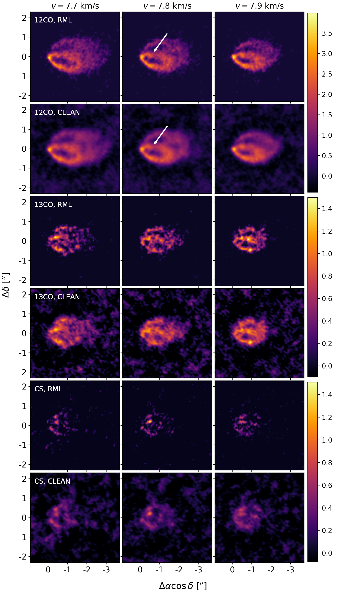
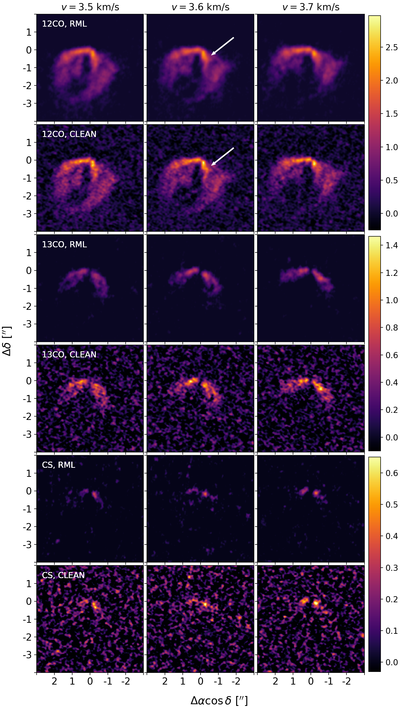
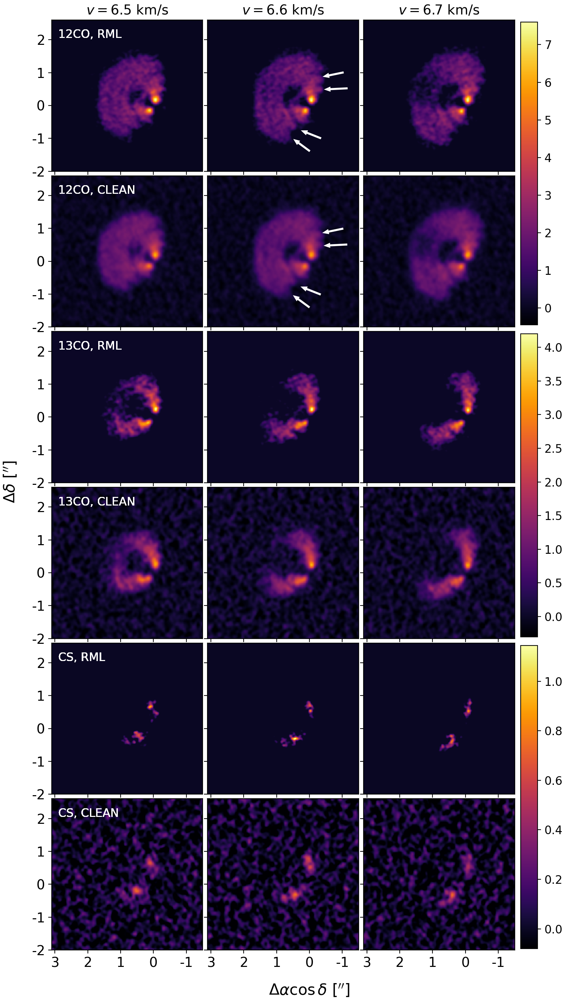

$\newcommand{\ensuremath}{}$
$\newcommand{\xspace}{}$
$\newcommand{\object}[1]{\texttt{#1}}$
$\newcommand{\farcs}{{.}''}$
$\newcommand{\farcm}{{.}'}$
$\newcommand{\arcsec}{''}$
$\newcommand{\arcmin}{'}$
$\newcommand{\ion}[2]{#1#2}$
$\newcommand{\textsc}[1]{\textrm{#1}}$
$\newcommand{\hl}[1]{\textrm{#1}}$
$\newcommand{\footnote}[1]{}$
$\newcommand{\vdag}{(v)^\dagger}$
$\newcommand$
$\newcommand$
$\newcommand{\bz}[1]{\textbf{#1}}$
$\newcommand{\disksurf}{\texttt{disksurf}}$

# exoALMA IX: Regularized Maximum Likelihood Imaging of Non-Keplerian Features

<mark>Appeared on: 2025-04-29</mark> -  _19 pages, 13 figures. This paper is part of the exoALMA Focus Issue of The Astrophysical Journal Letters_

B. Zawadzki, et al. -- incl., <mark>M. Benisty</mark>, <mark>D. Fasano</mark>, <mark>M. Flock</mark>

**Abstract:** The planet-hunting ALMA large program exoALMA observed 15 protoplanetary disks at $\sim0\farcs15$ angular resolution and $\sim100$ m/s spectral resolution, characterizing disk structures and kinematics in enough detail to detect non-Keplerian features (NKFs) in the gas emission. As these features are often small and low-contrast, robust imaging procedures are critical for identifying and characterizing NKFs, including determining which features may be signatures of young planets. The exoALMA collaboration employed two different imaging procedures to ensure the consistent detection of NKFs: CLEAN, the standard iterative deconvolution algorithm, and regularized maximum likelihood (RML) imaging. This paper presents the exoALMA RML images, obtained by maximizing the likelihood of the visibility data given a model image and subject to regularizer penalties. Crucially, in the context of exoALMA, RML images serve as an independent verification of marginal features seen in the fiducial CLEAN images. However, best practices for synthesizing RML images of multi-channeled (i.e. velocity-resolved) data remain undefined, as prior work on RML imaging for protoplanetary disk data has primarily addressed single-image cases. We used the open source Python package \texttt{MPoL} to explore RML image validation methods for multi-channeled data and synthesize RML images from the exoALMA observations of 7 protoplanetary disks with apparent NKFs in the $^{12}$ CO J=3-2 CLEAN images. We find that RML imaging methods independently reproduce the NKFs seen in the CLEAN images of these sources, suggesting that the NKFs are robust features rather than artifacts from a specific imaging procedure.

**Figure 1. -** RML and CLEAN comparison for continuum-subtracted observations of AA Tau in $^{12}$CO J=3-2, $^{13}$CO J=3-2, and CS J=7-6. Shown are three adjacent channels, centered at $v=7.8$ km/s where the $^{12}$CO J=3-2 non-Keplerian feature appears most prominently. All 6 panels for each molecular line (the three RML panels and three CLEAN panels) are plotted on the same color scale, and the color bars for each molecule are in units of Jy/arcsec$^{2}$. The white arrows indicate the NKF which can be seen in the $^{12}$CO J=3-2 emission; while the feature is present in all three channels shown, we only place the arrows in one RML image and one CLEAN image to highlight the location of the feature. (*fig:aatau*)

**Figure 7. -** Same as Figure \ref{fig:aatau}, but for SY Cha. Shown are three adjacent channels, centered at $v=3.6$ km/s where the $^{12}$CO J=3-2 non-Keplerian feature appears most prominently. (*fig:sycha*)

**Figure 2. -** Same as Figure \ref{fig:aatau}, but for HD 135344B. As HD 135344B displays large NKFs that persist throughout the cube, we show three adjacent and representative channels centered at $v=6.6$ km/s.  (*fig:hd135344b*)

