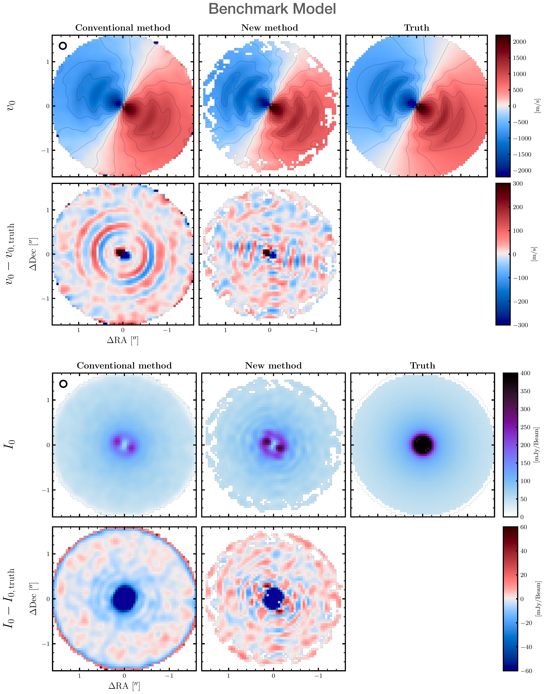
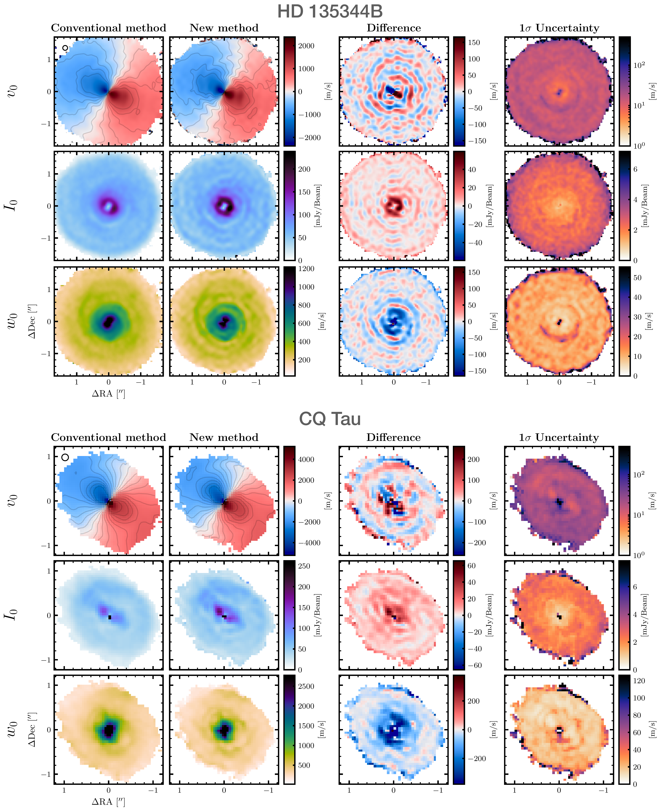

$\newcommand{\ensuremath}{}$
$\newcommand{\xspace}{}$
$\newcommand{\object}[1]{\texttt{#1}}$
$\newcommand{\farcs}{{.}''}$
$\newcommand{\farcm}{{.}'}$
$\newcommand{\arcsec}{''}$
$\newcommand{\arcmin}{'}$
$\newcommand{\ion}[2]{#1#2}$
$\newcommand{\textsc}[1]{\textrm{#1}}$
$\newcommand{\hl}[1]{\textrm{#1}}$
$\newcommand{\footnote}[1]{}$
$\newcommand{\vdag}{(v)^\dagger}$
$\newcommand$
$\newcommand$
$\newcommand{\tom}[1]{\textcolor{red}{\textbf{TH:} #1}}$
$\newcommand{\cp}[1]{\textcolor{blue}{\textbf{CP:} #1}}$
$\newcommand{\codesnip}[1]{\texttt{#1}}$
$\newcommand{\citeexoalma}[1]{\textbf{#1's paper}}$

# exoALMA. VIII. Probabilistic Moment Maps and Data Products using Non-parametric Linear Models

<mark>Appeared on: 2025-04-29</mark> -  _24 pages, 10 figures_

T. Hilder, et al. -- incl., <mark>M. Benisty</mark>, <mark>D. Fasano</mark>, <mark>M. Flock</mark>, <mark>I. Hammond</mark>

**Abstract:** Extracting robust inferences on physical quantities from disk kinematics measured from Doppler-shifted molecular line emission is challenging due to the data's size and complexity.In this paper we develop a flexible linear model of the intensity distribution in each frequency channel, accounting for spatial correlations from the point spread function.The analytic form of the model's posterior enables probabilistic data products through sampling.Our method debiases peak intensity, peak velocity, and line width maps, particularly in disk substructures that are only partially resolved.These are needed in order to measure disk mass, turbulence, pressure gradients, and to detect embedded planets.We analyse HD 135344B, MWC 758, and CQ Tau, finding velocity substructures 50--200 ${\rm m s^{-1}}$ greater than with conventional methods.Additionally, we combine our approach with discminer in a case study of J1842.We find that uncertainties in stellar mass and inclination increase by an order of magnitude due to the more realistic noise model.More broadly, our method can be applied to any problem requiring a probabilistic model of an intensity distribution conditioned on a point spread function.

**Figure 3. -** Top: Peak velocity maps $v_0$ extracted from the _benchmark model_ synthetic data, using both the conventional method (left; see Section \ref{sec:methods_moments}) and our method (right). Right-most panel shows the true _benchmark model_ line-of-sight velocities $v_{0,   {\rm truth}}$. $v_0$ maps show also iso-velocity contours spaced by $200   {\rm m s^{-1}}$, and the beam is shown in the top-left panel. Second row shows the difference between the recovered $v_0$ maps and the truth. Our method debiases the $v_0$ map and recovers the full amplitude of the substructures. Bottom: Same as above except showing recovered peak intensity maps $I_0$. (*fig:vI_hd135_model*)

**Figure 6. -** Peak velocity, peak intensity, and line width maps for HD 135344B (top) and CQ Tau (bottom). Left column shows the results using the conventional method. Second column shows the results using our new method. Third column shows the difference of these. Fourth column shows the $1\sigma$ uncertainty on the results from the new method. As in the benchmark, the new method better resolves the velocity perturbations associated with substructures. (*fig:moments_hd135_cqtau*)

**Figure 1. -** Schematic overview of the methodology for generating probabilistic data products using the non-parametric cube model. The cube graphic represents data cubes, with the orange and blue cubes illustrating posterior model cube samples before and after beam convolution, respectively. The ${\rm P}_i$ values indicate sample data products (DPs) calculated from the corresponding cube samples, colour-coded accordingly. The numbered steps in the bottom-left correspond directly to those in Section \ref{sec:overview}. (*fig:overview*)

