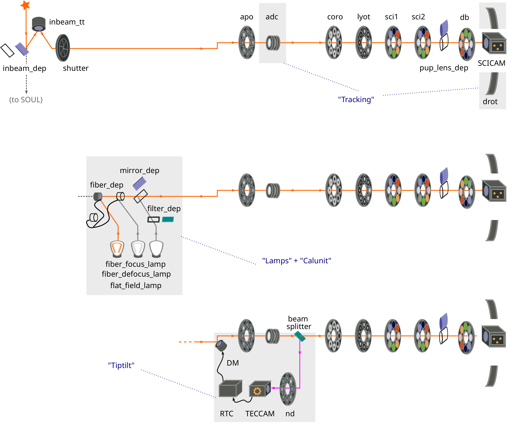
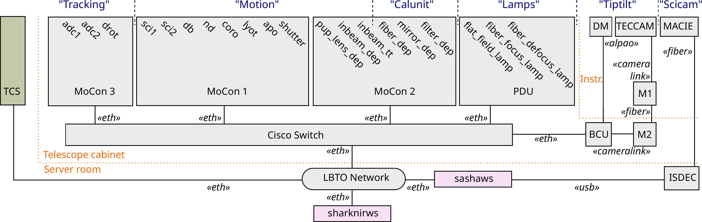

$\newcommand{\ensuremath}{}$
$\newcommand{\xspace}{}$
$\newcommand{\object}[1]{\texttt{#1}}$
$\newcommand{\farcs}{{.}''}$
$\newcommand{\farcm}{{.}'}$
$\newcommand{\arcsec}{''}$
$\newcommand{\arcmin}{'}$
$\newcommand{\ion}[2]{#1#2}$
$\newcommand{\textsc}[1]{\textrm{#1}}$
$\newcommand{\hl}[1]{\textrm{#1}}$
$\newcommand{\footnote}[1]{}$
$\newcommand{\flechas}{\textsc{flechas}\xspace}$
$\newcommand{\hl}$
$\newcommand{\thefootnote}{\alph{footnote}}$

# SHINS, the SHARK-NIR Instrument Control Software

<mark>Appeared on: 2025-04-29</mark> -  _26 pages, 20 figures. Accepted for publication in JATIS_

Davide~Ricci, et al.

**Abstract:** SHARK-NIR is a new compact instrument for coronagraphic imaging,  direct imaging, and coronagraphic spectroscopy in the near-infrared  wavelengths ( $0.96$ -- $1.7\um$ ) mounted at the left bent Gregorian  focus of the Large Binocular Telescope (LBT).  Taking advantage of the telescope's adaptive optics  system 2016SPIE.9909E..3VP , it provides high contrast imaging  with coronagraphic and spectroscopic capabilities and is focused on  the direct imaging of exoplanets and circumstellar discs.  We present SHINS, the SHARK-NIR instrument control software, mainly  realized with the TwiceAsNice framework from MPIA - Heidelberg and  the Internet Communications Engine (ICE) framework using the \texttt{C++} programming language.  We describe how we implemented  the software components controlling several instrument subsystems,  through the adaptation of already tested libraries from other  instruments at LBT, such as LINC-NIRVANA.  The scientific detector comes with its own readout electronic and  control software interfaced with our software through  Instrument-Neutral Distributed Interface (INDI) $\footnote{\hl{Downey,    E. C., "INDI: Instrument-Neutral Distributed Interface.," (2007)}    \url{http://www.clearskyinstitute.com/INDI/INDI.pdf}}$ .  We describe the \texttt{C++} core software Observation Control  Software, responsible for dispatching commands to the subsystems,  also implementing a software solution to avoid a potential collision  between motorized components, fully transparent to final users. It  exposes an ICE interface and can be controlled by clients developed  in different languages.  Observation, calibration, and maintenance procedures are implemented  by means of template scripts, written in \texttt{python} language,  controlling Observation Control Software through its ICE  interface. These templates and their parameters are configured using  "ESO-style", \texttt{XML} Observation Blocks (OBs) prepared by  observers, or in general SHARK-NIR users.  The high-level control is carried out by REST HTTP APIs implemented  in a \texttt{python} back-end, also acting as a web server for the  several browser-based front-end Graphical User Interfaces, that  allow the OBs to edit and sequence, as well as individual device  movement and monitoring.  Finally, we present the first scientific results obtained by  SHARK-NIR using coronagraphic mode.

**Figure 1. -**  Schematic view of SHARK-NIR,
    $\hl${replicated three times following the three principal "light
      paths".
      The top part shows the path of the light from a
      celestial source through until the science detector, and highlights
      the tracking devices.
      The middle part shows the the path from an internal calibration
      lamp through a fiber deployer, which are two of the components
      of the calibration unit.
      The bottom part is focused on the internal adaptive optics loop
      system of the instrument.
    }
    See Sect. \ref{sec:introduction} for details.  (*fig:shark-opto*)

**Figure 2. -**  How the SHARK-NIR devices $\hl${(gray
    boxes), workstations (pink boxes), and TCS (olive green box),
    described} in Sect. \ref{sec:introduction}, are controlled by
    Control Electronics and interfaced in the Control Network to the
    Instrument workstation. The location of the hardware is also
    specified in clear between dotted lines. See
    Sect. \ref{sec:control-electronics}-\ref{sec:control-network} for
    details.  (*fig:shark-network*)

**Figure 5. -**  Devices and Synoptic panel overview. See
    "A" (Fig. \ref{fig:devices}) and
    "B" (Fig. \ref{fig:synoptic})
    for details.  RTC Engineering panel overview. See
    "A" (Fig. \ref{fig:rtc-cred}),
    "B" (Fig. \ref{fig:rtc-dm}),
    "C" (Fig. \ref{fig:rtc-cloud}), and
    "D" (Fig. \ref{fig:rtc-control})
    for details.   Observation panel overview. Details in
    "A" (Fig. \ref{fig:dm}),
    "B" (Fig. \ref{fig:pdu}),
    "C" (Fig. \ref{fig:scicam}),
    "D" (Fig. \ref{fig:preset}),
    "E" (Fig. \ref{fig:operations}).
   (*fig:dev*)

