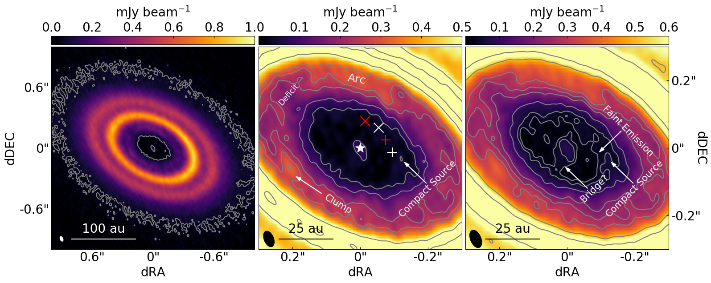
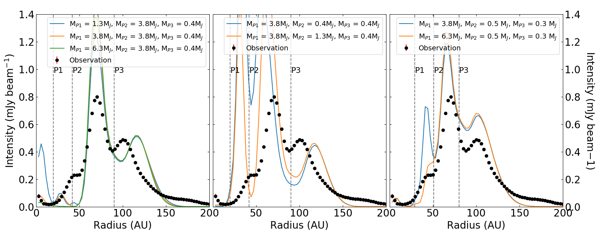
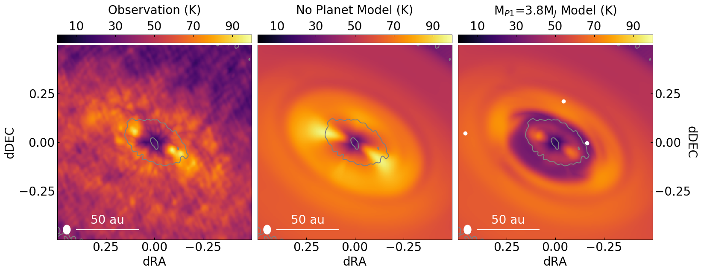

$\newcommand{\ensuremath}{}$
$\newcommand{\xspace}{}$
$\newcommand{\object}[1]{\texttt{#1}}$
$\newcommand{\farcs}{{.}''}$
$\newcommand{\farcm}{{.}'}$
$\newcommand{\arcsec}{''}$
$\newcommand{\arcmin}{'}$
$\newcommand{\ion}[2]{#1#2}$
$\newcommand{\textsc}[1]{\textrm{#1}}$
$\newcommand{\hl}[1]{\textrm{#1}}$
$\newcommand{\footnote}[1]{}$
$\newcommand{\vdag}{(v)^\dagger}$
$\newcommand$
$\newcommand$
$\newcommand{\ai}[1]{\textcolor{red}{#1}}$

# exoALMA XI: ALMA Observations and Hydrodynamic Models of LkCa 15: Implications for Planetary Mass Companions in the Dust Continuum Cavity    

<mark>Appeared on: 2025-04-29</mark> -  _23 pages, 12 Figures. This letter was accepted for publication in The Astrophysical Journal Letters. This paper is part of the exoALMA Focus Issue of The Astrophysical Journal Letters_

C. H. Gardner, et al. -- incl., <mark>M. Benisty</mark>, <mark>D. Fasano</mark>, <mark>M. Flock</mark>

**Abstract:** In the past decade, the Atacama Large Millimeter/submillimeter Array (ALMA) has revealed a plethora of substructures in the disks surrounding young stars.These substructures have several proposed formation mechanisms, with one leading theory being the interaction between the disk and newly formed planets.In this Letter, we present high angular resolution ALMA observations of LkCa 15's disk that reveal a striking difference in dust and CO emission morphology.The dust continuum emission shows a ring-like structure characterized by a dust-depleted inner region of $\sim$ 40 au in radius.Conversely, the CO emission is radially smoother and shows no sign of gas depletion within the dust cavity.We compare the observations with models for the disk-planet interaction, including radiative transfer calculation in the dust and CO emission.This source is particularly interesting as the presence of massive planets within the dust cavity has been suggested based on previous NIR observations.We find that the level of CO emission observed within the dust cavity is inconsistent with the presence of planets more massive than Jupiter orbiting between 10-40 au.Instead, we argue that the LkCa 15 innermost dust cavity might be created either by a chain of low-mass planets, or by other processes that do not require the presence of planets.

**Figure 3. -** Left: The 0.87 mm continuum image of LkCa 15's disk obtained with _robust_$=0.7$ corresponding to a beam FWHM of $0.049$\arcsec$\times0.028$\arcsec$$. The disk exhibits a three-ringed morphology with a faint inner ring, a bright middle ring, and an intermediate brightness outer ring. A continuum contour at 5 times the rms noise of 11 $\mu$Jy beam$^{-1}$ shows the size of the dust cavity and extent of the disk at this wavelength.  The synthesized beam of the continuum image is shown in the bottom left corner. Center: A zoom-in on the same continuum image with contours of 5, 10, 20, 25, 30, 50, and 75 times the rms noise. Key features are labeled, including the proposed co-rotational material from [Long, Andrews and Zhang (2022)]() and some emission identified within the cavity and described more fully in the text. Additionally, the locations of the proposed LkCa 15 b and c  ([Sallum, Follette and Eisner 2015]())  are marked with a white $+$ and white $\times$, respectively. The red $+$ and red $\times$ denote instead where the planets would be 5 years later ($\sim$ the difference in time between [Sallum, Follette and Eisner (2015)]() and ALMA epochs), assuming Keplerian rotation and circular orbits. The central source is marked with a white star. Right: The same as the middle panel but using the _robust_=0.9 image and its rms noise (10.4 $\mu$Jy beam$^{-1}$). Contours are 3, 5, 10, 20, 25, 30, 50, and 75 times the rms noise. The beam size of 0.055$\arcsec$$\times$0.031$\arcsec$ is shown in the bottom corner. More faint emissions can be seen in the cavity in this image due to the higher sensitivity provided by the weighting scheme. A bridge of emission connecting the central source to the disk is also revealed. (*fig:cont*)

**Figure 5. -** Comparing the azimuthally averaged radial intensity profiles from our models to the observations. In all panels the filled circles show the radial profile of the dust continuum emission while colored lines show profiles from the models. Vertical dashed lines show the orbital radii of the three planets in the model. Left: continuum models with the lowest $\chi^{2}$ values from our model grid characterized by fixed planets' orbital radii. Middle: reducing the mass of Planet 2 results in too much dust emission within 70 au. Right: relaxing the assumption of fixed radii allows for the planets to be placed at locations that better reproduce the observations. (*fig:mod_cont_rad*)

**Figure 7. -** Left: The peak intensity map of CO emission recorded toward LkCa15 converted to brightness temperature. This is the same image shown in Figure \ref{fig:moment}. Center: CO peak intensity map of the disk with no planets included. The resemblance between this image and the observations indicates that a disk with no planets can approximate the observed CO emission. Right: CO peak intensity map of the reference model discussed in Section \ref{subsec:model:cont} with a 3.8 M$_\mathrm{J}$ inner planet. We mark the locations of the planets in this model with white dots as in Figure \ref{fig:mod_cont_im}. In this model, the effect of the massive planet is clearly visible in the CO emission and shows that a massive planet is not consistent with the observations. The corresponding surface density maps are shown in Figure \ref{fig:sigma_gas}. (*fig:mod_temp_im*)

