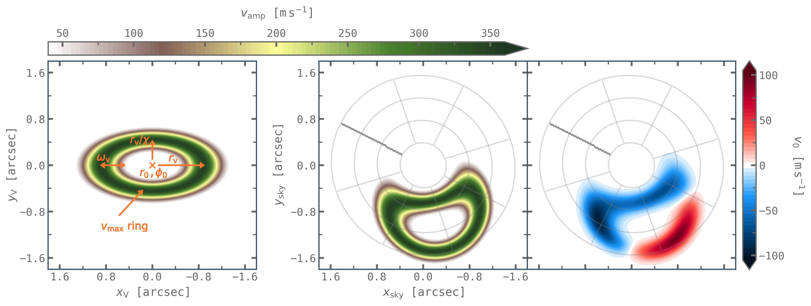
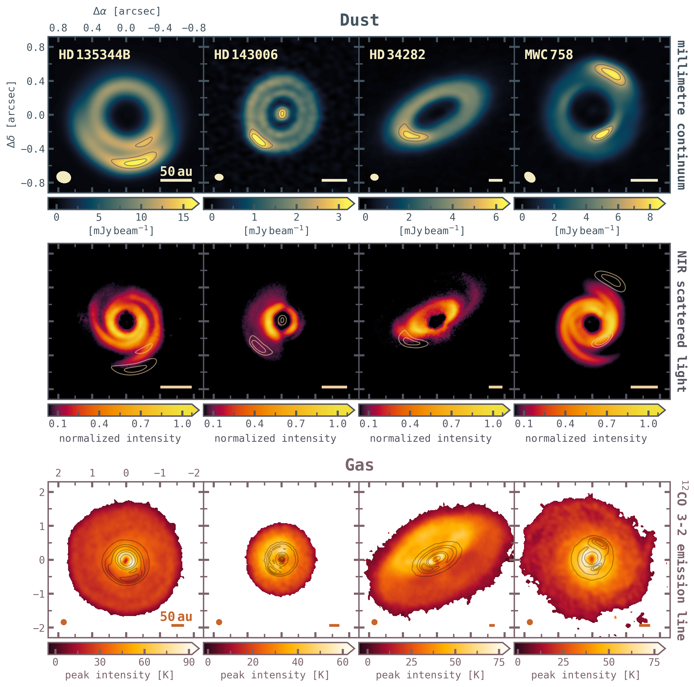
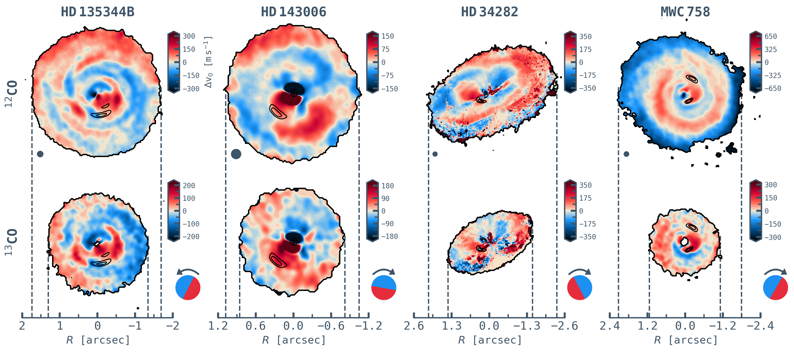

$\newcommand{\ensuremath}{}$
$\newcommand{\xspace}{}$
$\newcommand{\object}[1]{\texttt{#1}}$
$\newcommand{\farcs}{{.}''}$
$\newcommand{\farcm}{{.}'}$
$\newcommand{\arcsec}{''}$
$\newcommand{\arcmin}{'}$
$\newcommand{\ion}[2]{#1#2}$
$\newcommand{\textsc}[1]{\textrm{#1}}$
$\newcommand{\hl}[1]{\textrm{#1}}$
$\newcommand{\footnote}[1]{}$
$\newcommand{\farcsec}{\mbox{\ensuremath{\hspace{1pt}.\!\!^{\prime\prime}}}}$
$\newcommand{\vdag}{(v)^\dagger}$

# exoALMA XVII. Characterizing the Gas Dynamics around Dust Asymmetries

<mark>Appeared on: 2025-04-29</mark> -  _19 pages, 8 figures, 1 table, This paper is part of the exoALMA Focus Issue of The Astrophysical Journal Letters_

L. Wölfer, et al. -- incl., <mark>M. Benisty</mark>, <mark>D. Fasano</mark>, <mark>M. Flock</mark>

**Abstract:** $\noindent$ The key planet-formation processes in protoplanetary disks remain an active matter of research. One promising mechanism to radially and azimuthally trap millimeter-emitting dust grains, enabling them to concentrate and grow into planetesimals, is anticyclonic vortices. While dust observations have revealed crescent structures in several disks, observations of their kinematic signatures are still lacking. Studying the gas dynamics is, however, essential to confirm the presence of a vortex and understand its dust trapping properties. In this work, we make use of the high-resolution and sensitivity observations conducted by the exoALMA large program to search for such signatures in the $^{12}$ CO and $^{13}$ CO  molecular line emission of four disks with azimuthal dust asymmetries: HD 135344B, HD 143006, HD 34282, and MWC 758. To assess the vortex features, we constructed an analytical vortex model and performed hydrodynamical simulations. For the latter, we assumed two scenarios: a vortex triggered at the edge of a dead zone and of a gap created by a massive embedded planet. These models reveal a complex kinematical morphology of the vortex. When compared to the data, we find that none of the sources show a distinctive vortex signature around the dust crescents in the kinematics.HD 135344B exhibits a prominent feature similar to the predictions from the simulations, thus making this the most promising target for sensitive follow-up studies at higher resolution and in particular with less abundant molecules at higher resolution and sensitivity, to trace closer to the disk midplane.

**Figure 3. -** Analytical model of a vortex, described as elliptic streamlines of constant velocity with a Gaussian velocity profile. The first two panels show the absolute velocity of the vortex in both the vortex frame and sky frame. The last panel depicts the velocity projected along the line-of-sight, showing a complex morphology purely resulting from the projection. In the last two panels, the underlying disk geometry is overlaid as grey contours, corresponding to a position angle of $243 ◦ee$ and inclination of $16 ◦ee$(same as for HD 135344B). (*fig:vortexAnalytical*)

**Figure 1. -** Overview of the four sources studied in this work, shown on the same spatial scale for the dust (top two rows) and gas (bottom row). Top: Millimetre dust continuum as observed within the exoALMA program \citep{Curone_exoALMA}. Middle: Micron-sized dust observed through near-infrared scattered light with SPHERE \citep{Stolker2017,Boer2021,Ren2023}. The SPHERE images are normalized to the peak value and shown with a logarithmic normalization of the color map to emphasize the structures in the outer disk. To highlight the location of the crescents, two continuum contours around the peak of the dust asymmetries are overlaid on the dust images. Bottom: Peak intensity of the $^{12}$CO $J=3-2$ emission line with overlaid continuum emission (five contour levels equally placed between 3$\sigma$ and the peak flux). Note the larger spatial scale of the gas versus dust images. (*fig:dust_gas*)

**Figure 2. -** Velocity residuals $\Delta v_0$ after subtraction of the Keplerian model from the data, shown for $^{12}$CO and $^{13}$CO $J=3-2$ and all four targets. For HD 34282, only emission from the top side of the disk was considered when making the $v_0$ map, following the procedure described in \cite{Izquierdo_exoALMA}. The beam is shown in the bottom left corner of the top row. The red-blue circle and arrow indicate the underlying rotation pattern of each disk. To highlight the location of the crescents, two continuum contours around the dust asymmetries are overlaid on the images. (*fig:VelRes*)

